# Tài liệu giải pháp — Lập kế hoạch nhu cầu và quản trị bổ sung hàng Hachi

# Mục lục

> Tài liệu gồm 20 chặng xử lý, chia thành 6 pha lớn theo đúng sơ đồ hành trình tổng thể ở Phần 2.

### Nhóm theo pha

**PHA 1 · Làm sạch dữ liệu và tạo sức mua cơ bản**

- [Chặng 1 — Xác định khoảng lịch sử của lần lập kế hoạch](#chang-1-xac-dinh-khoang-lich-su-cua-lan-lap-ke-hoach)
- [Chặng 2 — Xác định ngày bị thiếu hàng](#chang-2-xac-dinh-ngay-bi-thieu-hang)
- [Chặng 3 — Ước lượng mức bán tự nhiên cho ngày thiếu hàng không có khuyến mãi](#chang-3-uoc-luong-muc-ban-tu-nhien-cho-ngay-thieu-hang-khong-co-khuyen-mai)
- [Chặng 4 — Đưa ngày khuyến mãi về mức bán tự nhiên](#chang-4-dua-ngay-khuyen-mai-ve-muc-ban-tu-nhien)
- [Chặng 5 — Xử lý các ngày còn thiếu mức bán nền](#chang-5-xu-ly-cac-ngay-con-thieu-muc-ban-nen)
- [Chặng 6 — Gom dữ liệu ngày thành chu kỳ 15 ngày và kiểm tra độ đầy đủ](#chang-6-gom-du-lieu-ngay-thanh-chu-ky-15-ngay-va-kiem-tra-do-day-du)

**PHA 2 · Xếp nhóm và gán chính sách**

- [Chặng 7 — Xếp nhóm A/B/C theo giá trị tiêu thụ](#chang-7-phan-loai-abc-theo-gia-tri-tieu-thu)
- [Chặng 8 — Xếp nhóm đều, dao động, bán thưa hoặc chưa đủ dữ liệu](#chang-8-phan-loai-xyzd-theo-do-deu-va-do-thua)
- [Chặng 9 — Gán chính sách vận hành theo hai nhóm trên](#chang-9-gan-chinh-sach-van-hanh-bang-ma-tran-abc-xyz)

**PHA 3 · Nhận diện quy luật bán, dự báo và tính tác động khuyến mãi**

- [Chặng 10 — Kiểm tra mùa vụ cho nhóm Y](#chang-10-chi-nhom-y-kiem-tra-mua-vu)
- [Chặng 11 — Kiểm tra xu hướng cho nhóm Y](#chang-11-kiem-tra-xu-huong-cho-nhom-y)
- [Chặng 12 — Chọn cách dự báo phù hợp cho từng nhóm](#chang-12-chon-cach-du-bao-phu-hop-cho-tung-nhom)
- [Chặng 13 — Xác định mức tác động của khuyến mãi trong quá khứ](#chang-13-xac-dinh-muc-tac-dong-cua-khuyen-mai-trong-qua-khu)
- [Chặng 14 — Áp kế hoạch khuyến mãi tương lai vào dự báo](#chang-14-ap-ke-hoach-khuyen-mai-tuong-lai-vao-du-bao)

**PHA 4 · Xác định lượng hàng có thể sử dụng**

- [Chặng 15 — Xác định lượng hàng thật sự có thể sử dụng](#chang-15-xac-dinh-luong-hang-that-su-co-the-su-dung)

**PHA 5 · Tính lượng dự trữ và số cần mua**

- [Chặng 16 — Tính lượng dự trữ an toàn](#chang-16-tinh-luong-du-tru-an-toan)
- [Chặng 17 — Tính số cần mua trước khi xét ngân sách](#chang-17-tinh-so-can-mua-truoc-khi-xet-ngan-sach)

**PHA 6 · Phân bổ ngân sách, chốt mua và học lại**

- [Chặng 18 — Phân bổ ngân sách khi tiền mua hàng không đủ](#chang-18-phan-bo-ngan-sach-khi-tien-mua-hang-khong-du)
- [Chặng 19 — Chốt số lượng mua và phát hành](#chang-19-chot-so-luong-mua-va-phat-hanh)
- [Chặng 20 — Đánh giá kết quả và đề xuất cho kỳ sau](#chang-20-danh-gia-ket-qua-va-de-xuat-cho-ky-sau)

### Các phần khác

- [0. Cách dữ liệu đi qua toàn bộ quy trình](#0-cach-du-lieu-di-qua-toan-bo-quy-trinh)
- [1. Tóm tắt bản chất vấn đề](#1-tom-tat-ban-chat-van-de)
- [2. Hành trình tổng thể](#2-hanh-trinh-tong-the)
- [3. Các chặng xử lý](#3-cac-chang-xu-ly)
- [4. Kết quả bàn giao giữa các chặng](#4-ket-qua-ban-giao-giua-cac-chang)
- [5. Các rủi ro còn lại sau khi hoàn thành hành trình](#5-cac-rui-ro-con-lai-sau-khi-hoan-thanh-hanh-trinh)
- [6. Cơ chế giám sát và kiểm chứng kết quả](#6-co-che-giam-sat-va-kiem-chung-ket-qua)
- [7. Phụ lục — Danh sách thông tin bắt buộc lưu lâu dài](#7-phu-luc-danh-sach-thong-tin-bat-buoc-luu-lau-dai)

---

---

---


# 0. Cách dữ liệu đi qua toàn bộ quy trình

## 0.1. Phần việc của hệ thống bán hàng và phần việc của quy trình lập kế hoạch

Hệ thống bán hàng và quản lý nội bộ chỉ cung cấp những ngày có phát sinh thật, như bán hàng, trả hàng, nhập hàng hoặc xuất hàng. Dữ liệu nguồn có thể không có một dòng cho mỗi mã hàng trong mỗi ngày.

Quy trình lập kế hoạch nhu cầu thực hiện các việc sau:

- tạo lịch ngày liên tục trong khoảng thời gian được phép dùng;
- ghép dữ liệu bán và tồn vào đúng ngày;
- phân biệt ngày bán bằng 0 thật với ngày thiếu dữ liệu;
- mang tồn cuối ngày trước sang làm tồn đầu ngày sau khi không có phát sinh;
- xử lý thiếu hàng, khuyến mãi và ngày thiếu dữ liệu;
- cộng thành chu kỳ 15 ngày;
- xếp nhóm, dự báo và tính số cần mua.

Ba trạng thái phải luôn được phân biệt:

| Trạng thái | Cách hiểu |
| --- | --- |
| Bằng 0 | Có dữ liệu và xác nhận không bán được sản phẩm |
| Chưa có giá trị | Chưa đủ dữ liệu để kết luận |
| Không áp dụng | Mã hàng chưa bán, đã ngừng bán hoặc ngày đó không thuộc phạm vi kinh doanh |

## 0.2. Tồn đầu và tồn cuối ngày

Hệ thống hiện không có sẵn một bảng tồn đầy đủ cho từng ngày. Tồn ngày được tính từ các giao dịch thật:

$$
\text{Tồn đầu ngày }d=\text{Tồn cuối ngày }d-1
$$

$$
\text{Tồn cuối ngày}
=\text{Tồn đầu ngày}+\text{Nhập}+\text{Trả}-\text{Xuất}-\text{Bán}
$$

Tồn âm vẫn được giữ để kiểm tra nguyên nhân. Không tự đổi tồn âm thành 0.

## 0.3. Phạm vi kiểm tra hiện tại

Lần đánh giá hiện tại dùng dữ liệu lịch sử để kiểm tra toàn bộ cách làm sạch và dự báo. Chưa có kế hoạch khuyến mãi tương lai đã được xác nhận. Vì vậy, bước áp khuyến mãi tương lai chỉ giữ nguyên dự báo nền cho đến khi có kế hoạch thật.

Các bước liên quan đến nguồn hàng, số lượng mua tối thiểu, thời gian hàng về và ngân sách chỉ được đánh giá đầy đủ khi có dữ liệu tương ứng.

## 0.4. Cách ghi tình trạng của từng chặng

Dùng năm cách diễn đạt thống nhất:

- **Đã chốt:** kết quả đủ căn cứ để dùng.
- **Đã chốt nhưng cần theo dõi:** kết quả được dùng nhưng còn giới hạn đã ghi rõ.
- **Cần xem xét:** chưa nên tự động dùng cho quyết định.
- **Chưa thể tiếp tục:** thiếu dữ liệu hoặc vi phạm điều kiện bắt buộc.
- **Không áp dụng:** chặng đó không phù hợp với trường hợp đang xét.
- **Chưa đánh giá:** chưa có đủ dữ liệu để kiểm tra.

## 0.5. Quy tắc trình bày

Tài liệu dùng ngôn ngữ nghiệp vụ. Mỗi chặng trả lời sáu câu hỏi:

1. Đang giải quyết vấn đề gì?
2. Vì sao vấn đề xảy ra?
3. Cần dữ liệu nào?
4. Thực hiện theo thứ tự nào?
5. Khi nào được tiếp tục và khi nào phải dừng?
6. Kết quả được chuyển cho chặng nào?

Tên các phương pháp dự báo như SES, Holt, Holt-Winters (dự báo có xu hướng và mùa vụ) và Croston (dự báo cho mã hàng bán thưa) được giữ lại vì đây là tên riêng. Mỗi tên đều phải đi kèm giải thích bằng tiếng Việt khi xuất hiện lần đầu.

---

# 1. Tóm tắt bản chất vấn đề

Trong vận hành bán lẻ, con số bán ra không luôn phản ánh đúng sức mua thật của khách. Một mã hàng có thể bán ít vì khách không cần mua, nhưng cũng có thể bán ít vì cửa hàng hết hàng. Ngược lại, một mã hàng có thể bán cao trong ngày có chương trình khuyến mãi, nhưng mức bán cao đó không nên được hiểu là sức mua cơ bản lặp lại mỗi ngày.

Với Hachi, vấn đề này đặc biệt quan trọng vì hàng nhập khẩu có thời gian từ đặt hàng đến hàng về kho thường kéo dài **3–6 tháng**. Nếu chuỗi dữ liệu lịch sử bị kéo thấp bởi thiếu hàng hoặc bị kéo cao bởi khuyến mãi, các chặng sau sẽ dự báo sai, tính tồn kho an toàn sai, đặt hàng sai, phân bổ ngân sách sai và cuối cùng tạo ra thiếu hàng hoặc dư tồn.

Câu hỏi trung tâm của toàn bộ hành trình là:

> **Làm thế nào biến số bán đã phát sinh trong hệ thống bán hàng và quản lý nội bộ thành một chuỗi sức mua cơ bản đủ sạch để dùng cho dự báo và đặt hàng nhập khẩu, đồng thời vẫn giữ riêng các yếu tố vận hành như khuyến mãi, tồn kho, nguồn hàng, ngân sách và kết quả học lại?**

Mục tiêu của phần clean data không phải là phục hồi toàn bộ doanh số có thể xảy ra trong ngày khuyến mãi. Mục tiêu là tạo chuỗi **sức mua cơ bản** sạch hơn, không bị kéo thấp bởi thiếu hàng và không bị kéo cao bởi khuyến mãi.

Dữ liệu bán lẻ đầu vào của quy trình dự báo nền không bắt buộc tách số bán áp dụng KM và không áp dụng KM. Trường bán hàng chính được dùng xuyên suốt là **số bán ghi nhận trong ngày** tại cấp mã hàng — nơi bán — ngày. Nếu ngày đó thuộc vùng khuyến mãi, hệ thống không dùng số bán ghi nhận này làm nền tự nhiên, mà đưa ngày khuyến mãi về **mức bán tự nhiên** bằng ngày tham chiếu sạch ở Chặng 4. Chặng 13 chỉ học **hệ số khuyến mãi** từ khuyến mãi lịch sử để Chặng 14 áp vào dự báo tương lai khi có **kế hoạch khuyến mãi đã xác nhận**.

Dữ liệu đã được hệ thống quản lý lấy về từ POS được xem là dữ liệu xử lý của phiên. Trong phần clean data, cách diễn đạt được dùng xuyên suốt là: **lấy dữ liệu về và dùng cho phiên xử lý**.

---

# 2. Hành trình tổng thể

Quy trình gồm 20 chặng. Mỗi chặng chỉ giải quyết một vấn đề chính và bàn giao kết quả rõ ràng cho chặng sau.

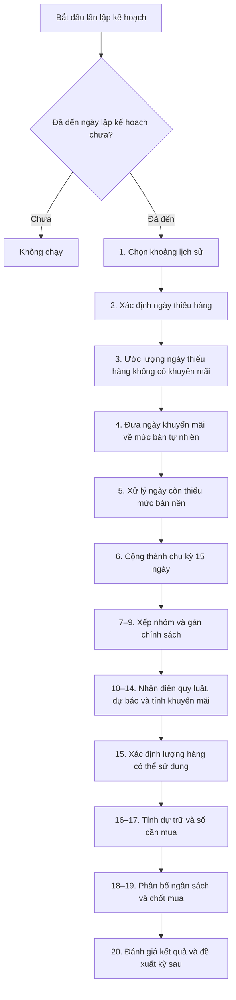

## Cách hiểu sáu pha

| Pha | Câu hỏi chính |
| --- | --- |
| Làm sạch dữ liệu | Số bán nào phản ánh đúng nhu cầu tự nhiên? |
| Xếp nhóm | Mã hàng quan trọng đến đâu và bán đều hay bán thưa? |
| Dự báo | Quy luật bán trong tương lai là gì và khuyến mãi làm thay đổi bao nhiêu? |
| Nguồn hàng | Bao nhiêu hàng thật sự có thể dùng và khi nào dùng được? |
| Dự trữ và mua hàng | Cần bảo vệ bao nhiêu hàng và cần mua thêm bao nhiêu? |
| Ngân sách và học lại | Tiền được phân bổ thế nào, số mua nào được chốt và kỳ sau cần điều chỉnh gì? |

---

# 3. Các chặng xử lý

---


## Chặng 1 — Xác định khoảng lịch sử của lần lập kế hoạch

> **QUY TẮC BỔ SUNG BẢN 26 — có hiệu lực cao hơn nội dung cũ nếu mâu thuẫn**
>
> - phần lấy dữ liệu không tạo lịch và không dời ngày đầu chỉ để đủ số chu kỳ.
> - Phần xử lý tạo lịch liên tục và chu kỳ 15 ngày theo ngày lịch.
> - Dòng trước ngày đầu xử lý có thể được đọc làm tham chiếu và mang `chỉ dùng để tham khảo`.
> - Ngày được bổ sung vào lịch có `chưa có bản ghi nguồn`, `Sales=chưa có giá trị`; không được xem là ngày bán 0 sạch.
> - Phạm vi tập mã hàng phải được ghi `Toàn bộ danh mục` hoặc `Nhóm mã hàng được chọn để kiểm tra`.


> **PHA 1 · Làm sạch dữ liệu và tạo sức mua cơ bản**

### 🎯 1. Vấn đề chặng này phải giải quyết

Dữ liệu bán và tồn của sản phẩm được hệ thống quản lý lấy về trước khi Pha 1 bắt đầu. Chặng 1 không đi tìm ngày bắt đầu bán của từng mã hàng, không dừng tại ngày đầu tiên không có bản ghi và không đếm bản ghi để tạo chu kỳ.

Chặng 1 chỉ trả lời một câu hỏi:

> **Phiên lập kế hoạch này được phép dùng dữ liệu lịch sử trong khoảng ngày nào?**

Khoảng lịch sử phải đủ rộng để các chặng sau có cơ hội nhận diện **xu hướng**, **mùa vụ**, **độ đều**, **độ thưa** và các dấu hiệu bất thường. Tuy nhiên, Chặng 1 chỉ thiết lập **khung lịch ngày cố định của phiên**, chưa kết luận mã hàng nào đủ điều kiện học mùa vụ.

Điểm cần chốt: **mốc 3 năm là chuẩn lịch sử khuyến nghị để xử lý mùa vụ ổn định và tốt nhất**, không phải điều kiện bắt buộc để mọi mã hàng được đưa vào xử lý. mã hàng có ít hơn 3 năm dữ liệu vẫn được đưa vào quy trình nếu có dữ liệu thật trong khoảng lịch sử, nhưng mức độ tin cậy mùa vụ sẽ được đánh giá ở Chặng 10.

Ví dụ đời thường: muốn đánh giá sức mua bánh kẹo theo mùa Tết thì có đủ 3 mùa Tết gần nhất sẽ đáng tin hơn. Nhưng nếu chỉ có 1–2 mùa Tết, hệ thống vẫn có thể ghi nhận tín hiệu, chỉ không nên xem tín hiệu đó ổn định như dữ liệu đủ 3 năm.

### 🎯 2. Vì sao vấn đề phát sinh

Hệ thống cần một **khung thời gian giới hạn** ngay tại bước kiểm tra nạp dữ liệu nhằm giải quyết các vấn đề sau:

| Vấn đề                                     | Cách Chặng 1 xử lý                                                                           |
| ----------------------------------------------- | -------------------------------------------------------------------------------------------------- |
| mã hàng lâu năm có lịch sử 10–15 năm       | Chỉ đọc trong khung lịch sử được phép dùng của phiên.                                |
| mã hàng mới chưa có đủ dữ liệu nhiều năm | Vẫn dùng phần dữ liệu thật đang có trong khung lịch sử.                                |
| Mùa vụ cần nhìn theo năm lịch           | Lấy khung lịch sử từ đầu năm của năm gốc, không chỉ lùi theo số ngày gần đúng. |
| Chu kỳ kế hoạch dùng nhịp 15 ngày       | Sau khi có khung ngày, hệ thống mới chia thành chu kỳ lịch cố định 15 ngày.          |
| Dữ liệu thiếu trong một chu kỳ           | Chặng 5 quyết định có cần bổ sung ngày thiếu hay không.                                                 |
| Chu kỳ trống hoàn toàn                    | Không tạo lịch sử giả, không lấp toàn bộ chu kỳ.                                       |

Khung lịch sử của Chặng 1 giống như việc lấy hồ sơ bán hàng trong một tủ hồ sơ đã chốt phạm vi. Tủ hồ sơ được mở đủ rộng để nhìn được nhiều mùa bán hàng, nhưng từng hồ sơ bên trong có dùng được hay không phải do các chặng sau kiểm tra tiếp.

### 🚦 3. Điều kiện để bắt đầu

| Điều kiện                                                | Tiêu chí                                                                                                                                                     |
| ------------------------------------------------------------- | ---------------------------------------------------------------------------------------------------------------------------------------------------------------- |
| Đến ngày chạy kế hoạch                                | Ngày hiện tại trùng ngày chạy kế hoạch theo thiết lập hệ thống.                                                                                     |
| Có số năm lịch sử chuẩn để xét mùa vụ ổn định | Giá trị khởi điểm đề xuất là 3 năm. Đây là mốc để có tín hiệu mùa vụ ổn định hơn, không phải điều kiện bắt buộc của mọi mã hàng. |
| Có độ dài chu kỳ kế hoạch                            | Mặc định 15 ngày theo lịch vận hành Hachi.                                                                                                              |
| Có dữ liệu bán đã được hệ thống bán hàng và quản lý nội bộ chốt               | Gồm số bán ghi nhận trong ngày, mã hoặc khoảng thời gian khuyến mãi nếu có, theo mã hàng — nơi bán — ngày.                                                                  |
| Có dữ liệu tồn đã được hệ thống bán hàng và quản lý nội bộ chốt               | Gồm tồn đầu ngày, tồn cuối ngày và phiếu nhập để bán đầu tiên nếu có.                                                                       |

Trong thiết kế đích, dữ liệu bán và tồn là dữ liệu vận hành trọng yếu. Nếu có sự cố POS trong ngày, số liệu phải được nhập lại sau khi hệ thống phục hồi trước khi dùng cho phiên lập kế hoạch. Vì vậy quy trình xử lý chính không tạo hướng xử lý “dữ liệu chưa được chốt” cho ngày POS/tồn bị rỗng. Giá trị bằng 0 là dữ liệu thật. Ngày không có bản ghi trong khoảng lịch sử không được tự hiểu thành bán = 0 hoặc tồn = 0.

### 4. Hành động xử lý

Chặng 1 xác định khoảng lịch sử theo **năm lập kế hoạch**.

Nếu phiên chạy nằm trong năm nào, hệ thống lấy từ ngày **01/01 của năm cách năm lập kế hoạch một số năm thiết lập** đến ngày ngay trước ngày chạy kế hoạch.

#### 🧮 4.1. Công thức xác định năm lập kế hoạch

$$
\text{Năm lập kế hoạch} = \operatorname{YEAR}(\text{Ngày chạy kế hoạch})

$$

#### 🧮 4.2. Công thức xác định ngày đầu khoảng lịch sử

$$
\text{Ngày đầu khoảng lịch sử}
= \text{01/01 của năm}\left(\text{Năm lập kế hoạch} - \text{Số năm lịch sử chuẩn}\right)

$$

#### 🧮 4.3. Công thức xác định ngày cuối khoảng lịch sử

$$
\text{Ngày cuối khoảng lịch sử} = \text{Ngày chạy kế hoạch} - 1\ \text{ngày}

$$

#### 🧮 4.4. Công thức tính số ngày lịch sử được phép đọc

$$
\text{Số ngày lịch sử được phép đọc}
= \text{Ngày cuối khoảng lịch sử} - \text{Ngày đầu khoảng lịch sử} + 1

$$

#### 🧮 4.5. Công thức chia chu kỳ 15 ngày

Sau khi có khoảng lịch sử, hệ thống mới chia lịch ngày thành các chu kỳ cố định.

$$
\text{Số chu kỳ 15 ngày đầy đủ}
= \left\lfloor\frac{\text{Số ngày lịch sử được phép đọc}}{\text{Độ dài chu kỳ kế hoạch}}\right\rfloor

$$

$$
\text{Số ngày dư}
= \text{Số ngày lịch sử được phép đọc}
- \text{Số chu kỳ 15 ngày đầy đủ}\times\text{Độ dài chu kỳ kế hoạch}

$$

Ngày dư ở biên được giữ ở dữ liệu ngày để đối chiếu, nhưng không tự tạo thành một chu kỳ học riêng.

### 📊 5. Bảng biến chuẩn

| Biến                                                   | Ý nghĩa                                                                                          | Đơn vị | Nguồn                  |
| --------------------------------------------------------- | ---------------------------------------------------------------------------------------------------- | ----------: | ------------------------- |
| Ngày chạy kế hoạch                                  | Ngày bắt đầu phiên lập kế hoạch theo thiết lập hệ thống                                 |     Ngày | Lịch chạy kế hoạch  |
| Năm lập kế hoạch                                    | Năm của ngày chạy kế hoạch                                                                   |      Năm | Chặng 1 tính          |
| Số năm lịch sử chuẩn để xét mùa vụ ổn định | Số năm dùng làm mốc khuyến nghị để mùa vụ đủ ổn định; giá trị khởi điểm là 3 |      Năm | Chính sách thiết lập |
| Độ dài chu kỳ kế hoạch                            | Độ dài một chu kỳ gom dữ liệu                                                               |     Ngày | Thiết lập lịch Hachi  |
| Ngày đầu khoảng lịch sử                           | Ngày đầu tiên của khoảng lịch sử phiên này                                               |     Ngày | Chặng 1 tính          |
| Ngày cuối khoảng lịch sử                           | Ngày cuối cùng của dữ liệu quá khứ dùng trong phiên                                      |     Ngày | Chặng 1 tính          |
| Số ngày lịch sử được phép đọc                 | Tổng số ngày lịch sử trong khung phiên                                                       |     Ngày | Chặng 1 tính          |
| Số chu kỳ 15 ngày đầy đủ                         | Số chu kỳ đủ ngày để Chặng 6 xem xét gom nền                                             |   Chu kỳ | Chặng 1 tính          |
| Số ngày dư                                           | Số ngày không đủ tạo một chu kỳ 15 ngày đầy đủ                                        |     Ngày | Chặng 1 tính          |

### 💡 6. Ví dụ vận hành

#### 💡 6.1. Ví dụ 1 — Ngày chạy kế hoạch 01/06/2026

| Biến                                                   |  Giá trị |
| --------------------------------------------------------- | -----------: |
| Ngày chạy kế hoạch                                  | 01/06/2026 |
| Năm lập kế hoạch                                    |       2026 |
| Số năm lịch sử chuẩn để xét mùa vụ ổn định |     3 năm |
| Độ dài chu kỳ kế hoạch                            |   15 ngày |

Tính ngày đầu khoảng lịch sử:

$$
\text{Ngày đầu khoảng lịch sử} = \text{01/01}/(2026-3) = \text{01/01/2023}

$$

Tính ngày cuối khoảng lịch sử:

$$
\text{Ngày cuối khoảng lịch sử} = \text{01/06/2026} - 1\ \text{ngày} = \text{31/05/2026}

$$

Kết quả:

$$
\text{Khoảng lịch sử} = [\text{01/01/2023},\ \text{31/05/2026}]

$$

Cách hiểu theo năm:

| Phần thời gian         | Vai trò                                        |
| -------------------------- | ------------------------------------------------- |
| 01/01/2023 → 31/12/2023 | Năm lịch đầy đủ thứ 1                    |
| 01/01/2024 → 31/12/2024 | Năm lịch đầy đủ thứ 2                    |
| 01/01/2025 → 31/12/2025 | Năm lịch đầy đủ thứ 3                    |
| 01/01/2026 → 31/05/2026 | Phần đã phát sinh của năm lập kế hoạch |

Khung này giúp hệ thống có đủ ba năm lịch hoàn chỉnh gần nhất để Chặng 10 kiểm tra mùa vụ ổn định, đồng thời vẫn giữ phần đã phát sinh của năm 2026 để phản ánh diễn biến hiện tại.

Tính số ngày:

| Phần thời gian         |      Số ngày |
| -------------------------- | ---------------: |
| Năm 2023                |            365 |
| Năm 2024                |            366 |
| Năm 2025                |            365 |
| 01/01/2026 → 31/05/2026 |            151 |
| **Tổng**                | **1247 ngày** |

Tính chu kỳ:

$$
\text{Số chu kỳ đầy đủ} = \left\lfloor\frac{1247}{15}\right\rfloor = 83

$$

$$
\text{Số ngày dư} = 1247 - 83\times15 = 2

$$

#### 💡 6.2. Ví dụ 2 — Ngày chạy kế hoạch 01/01/2027

| Biến                                                   |  Giá trị |
| --------------------------------------------------------- | -----------: |
| Ngày chạy kế hoạch                                  | 01/01/2027 |
| Năm lập kế hoạch                                    |       2027 |
| Số năm lịch sử chuẩn để xét mùa vụ ổn định |     3 năm |
| Độ dài chu kỳ kế hoạch                            |   15 ngày |

Tính ngày đầu khoảng lịch sử:

$$
\text{Ngày đầu khoảng lịch sử} = \text{01/01}/(2027-3) = \text{01/01/2024}

$$

Tính ngày cuối khoảng lịch sử:

$$
\text{Ngày cuối khoảng lịch sử} = \text{01/01/2027} - 1\ \text{ngày} = \text{31/12/2026}

$$

Kết quả:

$$
\text{Khoảng lịch sử} = [\text{01/01/2024},\ \text{31/12/2026}]

$$

Cách hiểu theo năm:

| Năm | Vai trò                     |
| ------ | ------------------------------ |
| 2024 | Năm lịch đầy đủ thứ 1 |
| 2025 | Năm lịch đầy đủ thứ 2 |
| 2026 | Năm lịch đầy đủ thứ 3 |

Tính số ngày:

| Năm      |      Số ngày |
| ----------- | ---------------: |
| 2024      |            366 |
| 2025      |            365 |
| 2026      |            365 |
| **Tổng** | **1096 ngày** |

Tính chu kỳ:

$$
\text{Số chu kỳ đầy đủ} = \left\lfloor\frac{1096}{15}\right\rfloor = 73

$$

$$
\text{Số ngày dư} = 1096 - 73\times15 = 1

$$

#### 💡 6.3. Ví dụ 3 — Ngày chạy kế hoạch 15/06/2026

| Biến                                                   |  Giá trị |
| --------------------------------------------------------- | -----------: |
| Ngày chạy kế hoạch                                  | 15/06/2026 |
| Năm lập kế hoạch                                    |       2026 |
| Số năm lịch sử chuẩn để xét mùa vụ ổn định |     3 năm |
| Độ dài chu kỳ kế hoạch                            |   15 ngày |

Tính ngày đầu khoảng lịch sử:

$$
\text{Ngày đầu khoảng lịch sử} = \text{01/01}/(2026-3) = \text{01/01/2023}

$$

Tính ngày cuối khoảng lịch sử:

$$
\text{Ngày cuối khoảng lịch sử} = \text{15/06/2026} - 1\ \text{ngày} = \text{14/06/2026}

$$

Kết quả:

$$
\text{Khoảng lịch sử} = [\text{01/01/2023},\ \text{14/06/2026}]

$$

Cách hiểu theo năm:

| Phần thời gian         | Vai trò                                        |
| -------------------------- | ------------------------------------------------- |
| 2023                     | Năm lịch đầy đủ thứ 1                    |
| 2024                     | Năm lịch đầy đủ thứ 2                    |
| 2025                     | Năm lịch đầy đủ thứ 3                    |
| 01/01/2026 → 14/06/2026 | Phần đã phát sinh của năm lập kế hoạch |

### 📐 7. Quy tắc chọn dữ liệu ngày trong khoảng lịch sử

Sau khi có khoảng lịch sử, hệ thống lấy các bản ghi bán và tồn đã được chốt nằm trong khoảng đó.

| Trường hợp                                               | Cách xử lý                                                                                                                                                                    |
| ------------------------------------------------------------- | ---------------------------------------------------------------------------------------------------------------------------------------------------------------------------------- |
| mã hàng có dữ liệu lâu hơn ngày đầu khoảng lịch sử   | Chỉ dùng phần từ ngày đầu khoảng lịch sử đến ngày cuối khoảng lịch sử. Dữ liệu cũ hơn vẫn được lưu trong nguồn nhưng không dùng trong phiên này. |
| mã hàng chỉ có dữ liệu một phần trong khoảng lịch sử   | Dùng đúng phần dữ liệu đang có trong khoảng lịch sử. Không ép mã hàng phải có đủ 3 năm dữ liệu.                                                                  |
| mã hàng có đủ 3 năm lịch sử sạch sau xử lý             | Chặng 10 có thể xem là nhóm dữ liệu tốt nhất để kiểm tra mùa vụ ổn định.                                                                                         |
| mã hàng có dưới 3 năm lịch sử sạch sau xử lý           | Vẫn được xử lý; Chặng 10 đánh giá mùa vụ với mức tin cậy thấp hơn hoặc chỉ ghi nhận tín hiệu mùa vụ.                                                      |
| Một chu kỳ của mã hàng có 1–14 ngày có dữ liệu         | Chặng 1 chỉ ghi nhận. Chặng 5 sẽ xem xét bổ sung cho các ngày thật sự còn thiếu dữ liệu.                                                                           |
| Một chu kỳ của mã hàng không có ngày nào có dữ liệu   | Không lấp nền toàn bộ 15 ngày. Chu kỳ này không tạo thông tin học cho phiên lập kế hoạch.                                                                        |
| Ngày không có bản ghi bán/tồn trong khoảng lịch sử | Không tự hiểu là bán = 0, tồn = 0 hoặc thiếu hàng.                                                                                                                          |

Ví dụ: ngày chạy kế hoạch là 15/06/2026, khoảng lịch sử là 01/01/2023 → 14/06/2026. mã hàng A có dữ liệu đủ từ 01/01/2023 thì hệ thống dùng toàn bộ phần đó. mã hàng B chỉ có dữ liệu từ 01/05/2026 thì hệ thống chỉ dùng dữ liệu từ 01/05/2026 → 14/06/2026. Hệ thống không bù toàn bộ khoảng 01/01/2023 → 30/04/2026 vì các chu kỳ trống hoàn toàn không tạo tín hiệu học hữu ích.

### 📐 8. Quy tắc hiểu mốc 3 năm trong xử lý mùa vụ

Mốc 3 năm có vai trò **chuẩn ổn định**, không phải **bước kiểm tra chặn xử lý**.

| Mức dữ liệu sạch sau xử lý           | Cách hiểu                                              | Hành động ở Chặng 10                                                                             |
| -------------------------------------------- | ---------------------------------------------------------- | ------------------------------------------------------------------------------------------------------ |
| Dưới 1 năm lịch đầy đủ             | Chưa đủ vòng lặp năm để học mùa vụ            | Không mở học mùa vụ tự động.                                                                 |
| Từ 1 đến dưới 2 năm lịch đầy đủ | Có thể có tín hiệu ban đầu                        | Chỉ ghi nhận tín hiệu, không xem là mùa vụ ổn định.                                       |
| Từ 2 đến dưới 3 năm lịch đầy đủ | Có tín hiệu lặp lại nhưng độ tin cậy chưa cao  | Có thể đánh dấu mùa vụ cần theo dõi hoặc yêu cầu kiểm chứng.                           |
| Từ 3 năm lịch đầy đủ trở lên      | Dữ liệu đủ tốt để đánh giá mùa vụ ổn định | Cho phép Chặng 10 kiểm tra mùa vụ ổn định nếu các điều kiện dữ liệu sạch cũng đạt. |

Điểm quan trọng: **3 năm lịch sử không tự động mở mùa vụ**. Dữ liệu vẫn phải qua xử lý thiếu hàng, khuyến mãi, ngày thiếu và chu kỳ không đủ căn cứ. Chặng 10 mới là nơi kết luận mùa vụ có đủ tin cậy để dùng cho cách dự báo dự báo hay không.

### 9. Vì sao cách xử lý có hiệu quả

Cách xử lý này ngăn hệ thống nhầm giữa ba khái niệm:

| Khái niệm                    | Ý nghĩa                                                        |
| -------------------------------- | ------------------------------------------------------------------ |
| Khung lịch sử của phiên    | Khoảng ngày hệ thống được phép đọc.                    |
| Dữ liệu thật của từng mã hàng | Phần dữ liệu thực tế mã hàng có trong khung lịch sử.         |
| Độ tin cậy mùa vụ         | Mức đủ tốt để Chặng 10 cho phép học mùa vụ ổn định. |

Nhờ vậy, các chặng sau không bị dịch nhịp chu kỳ theo số bản ghi đếm được. Một chu kỳ lịch 15 ngày vẫn là 15 ngày lịch. Nếu mã hàng có dữ liệu trong 12 ngày của chu kỳ đó, Chặng 6 biết chu kỳ này có 12 ngày dữ liệu và thiếu 3 ngày cần xem xét lấp nền. Nếu mã hàng không có dữ liệu cả 15 ngày của chu kỳ, Chặng 6 bỏ qua chu kỳ đó trong phiên này.

Cách này cũng phù hợp với vận hành Hachi vì hàng nhập khẩu có thời gian từ đặt hàng đến hàng về thường kéo dài 3–6 tháng. Nếu mùa vụ được học từ dữ liệu quá ngắn hoặc quá bẩn, hệ thống có thể đặt thiếu trước mùa cao điểm hoặc đặt dư sau khi mùa đã qua.

### 🚦 10. Điều kiện rẽ hướng xử lý

| Điều kiện                                     | Hướng xử lý xử lý                                                                                                |
| -------------------------------------------------- | --------------------------------------------------------------------------------------------------------------- |
| Chưa đến ngày chạy kế hoạch               | Không chạy phiên.                                                                                          |
| Đến ngày chạy kế hoạch                     | Xác định năm lập kế hoạch và khoảng lịch sử theo năm lịch.                                       |
| Bản ghi bán/tồn nằm trong khoảng lịch sử  | Đưa vào dữ liệu ngày của phiên.                                                                       |
| Bản ghi bán/tồn nằm ngoài khoảng lịch sử | Không dùng trong phiên này, nhưng không xóa khỏi nguồn.                                              |
| mã hàng có dữ liệu dưới 3 năm                  | Vẫn xử lý theo phần dữ liệu thật đang có; Chặng 10 đánh giá độ tin cậy mùa vụ thấp hơn.    |
| mã hàng có dữ liệu đủ 3 năm hoặc hơn         | Chặng 10 có đủ khung để kiểm tra mùa vụ ổn định, nếu dữ liệu sạch sau xử lý đạt yêu cầu. |
| Chu kỳ có một phần ngày dữ liệu           | Bàn giao cho Chặng 5 để xem xét ngày thiếu.                                                               |
| Chu kỳ không có ngày dữ liệu nào          | Bàn giao là chu kỳ trống; Chặng 5 không bổ sung toàn bộ chu kỳ đó.                                    |
| Có ngày dư không đủ tạo chu kỳ 15 ngày  | Giữ ở dữ liệu ngày để đối chiếu; không tự tạo chu kỳ học riêng.                                |

### 🔀 11. Sơ đồ các bước

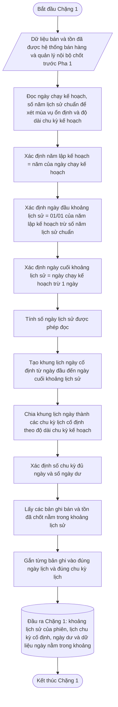

### 📦 12. Đầu ra bàn giao

| Đầu ra                                                    | Chặng sau dùng                                                                                  |
| ------------------------------------------------------------- | --------------------------------------------------------------------------------------------------- |
| Năm lập kế hoạch                                        | Chặng 10, Chặng 20                                                                               |
| Ngày đầu khoảng lịch sử                               | Chặng 7, 10, 18                                                                                   |
| Ngày cuối khoảng lịch sử                               | Chặng 2–6, 9, 17                                                                                |
| Số ngày lịch sử được phép đọc                     | Chặng 7, 10, 20                                                                                   |
| Lịch ngày cố định trong khoảng lịch sử              | Chặng 6                                                                                          |
| Lịch chu kỳ cố định theo độ dài chu kỳ kế hoạch  | Chặng 7–11                                                                                      |
| Số chu kỳ đủ ngày                                      | Chặng 7–11                                                                                      |
| Số ngày dư                                               | Chặng 7, 20                                                                                      |
| Dữ liệu bán/tồn đã chốt nằm trong khoảng lịch sử | Chặng 2–4                                                                                       |
| Danh sách chu kỳ có một phần dữ liệu                 | Chặng 6                                                                                          |
| Danh sách chu kỳ trống hoàn toàn                       | Chặng 7, 18                                                                                      |
| Gợi ý độ rộng lịch sử mùa vụ                       | Chặng 10 dùng để đánh giá mức tin cậy mùa vụ, không dùng làm bước kiểm tra chặn ở Chặng 1 |

Chặng 1 đã giải quyết xong việc xác định phạm vi lịch sử của phiên. Chặng 1 chưa đánh dấu thiếu hàng, chưa bù thiếu hàng, chưa lấp nền và chưa kết luận mã hàng có đủ điều kiện học mùa vụ hay không.

---


## Chặng 2 — Xác định ngày bị thiếu hàng

> **QUY TẮC BỔ SUNG BẢN 26**
>
> - Tồn đầu/cuối là dữ liệu tính từ phát sinh thật.
> - Ngày được bổ sung vào lịch không được dùng hướng xử lý “bán bằng 0 thật” để kết luận thiếu hàng.
> - Tồn âm hoặc thiếu mốc neo phải có trạng thái chất lượng; không tự sửa về 0.
> - Chỉ đánh dấu tự động khi dữ liệu tồn và giờ nhập đủ căn cứ.


> **PHA 1 · Làm sạch dữ liệu và tạo sức mua cơ bản**

### 🎯 1. Mục tiêu của Chặng 2

Chặng 2 dùng để xác định ngày bán có bị xem là **thiếu hàng** hay không.

Chặng này chỉ nhìn vào tình trạng hàng trong ngày bán. Chặng này không tính phần bù, không ước lượng sức mua bị mất và không chia nhỏ nhiều loại thiếu hàng.

Cách hiểu đơn giản: nếu đầu ngày không có hàng, khách không thể mua bình thường. Nếu hàng có lại quá trễ hoặc cả ngày vẫn không có hàng, ngày đó được xem là có thiếu hàng ảnh hưởng đến số bán.

### 2. Dữ liệu cần dùng

| Dữ liệu                                   | Cách hiểu                                                                                                  |
| --------------------------------------------- | -------------------------------------------------------------------------------------------------------------- |
| Tồn đầu ngày                            | Số lượng hàng có sẵn để bán khi bắt đầu ngày làm việc.                                        |
| Tồn cuối ngày                            | Số lượng hàng còn lại khi kết thúc ngày làm việc.                                                 |
| Số bán trong ngày                        | Số lượng bán ghi nhận trong ngày.                                                                      |
| Giờ nhập đầu tiên                      | Thời điểm nhập lại sớm nhất trong ngày, lấy từ trường giờ nhập trên phiếu nhập đầu tiên. |
| Giờ quy định trong thời gian làm việc | Mốc giờ được xem là còn đủ sớm để bán trong ngày.                                              |

### 📐 3. Quy tắc đánh dấu thiếu hàng

Chặng 2 chỉ đánh dấu thiếu hàng trong hai trường hợp sau:

| Điều kiện                                                                                                             | Kết luận            |
| -------------------------------------------------------------------------------------------------------------------------- | ----------------------- |
| Tồn đầu ngày = 0, tồn cuối ngày > 0 và giờ nhập đầu tiên vượt giờ quy định trong thời gian làm việc | Đánh dấu thiếu hàng. |
| Tồn đầu ngày = 0, tồn cuối ngày = 0 và số bán trong ngày = 0                                                  | Đánh dấu thiếu hàng. |

Các trường hợp không thuộc hai điều kiện trên thì Chặng 2 không đánh dấu thiếu hàng.

### 4. Cách hiểu theo vận hành cửa hàng

#### 4.1. Tồn đầu ngày = 0, tồn cuối ngày > 0 và hàng nhập lại trễ

Trường hợp này nghĩa là đầu ngày cửa hàng chưa có hàng để bán. Trong ngày có hàng nhập lại, nhưng giờ nhập đầu tiên đã vượt quá giờ quy định.

Kết luận: **đánh dấu thiếu hàng**.

Ví dụ: cửa hàng quy định hàng phải có lại trước **10:00** thì mới được xem là còn đủ sớm để bán trong ngày. Nếu đầu ngày tồn bằng 0, cuối ngày tồn lớn hơn 0, nhưng hàng nhập thực tế lúc **13:00**, ngày đó được xem là thiếu hàng.

#### 4.2. Tồn đầu ngày = 0, tồn cuối ngày = 0 và số bán = 0

Trường hợp này nghĩa là cả ngày không có hàng để bán và cũng không phát sinh bán.

Kết luận: **đánh dấu thiếu hàng**.

Ví dụ đời thường: khách đến cửa hàng nhưng kệ không có hàng từ đầu ngày đến cuối ngày. Do không có hàng nên không có số bán. Đây là ngày thiếu hàng rõ ràng.

### 🔀 5. Sơ đồ các bước

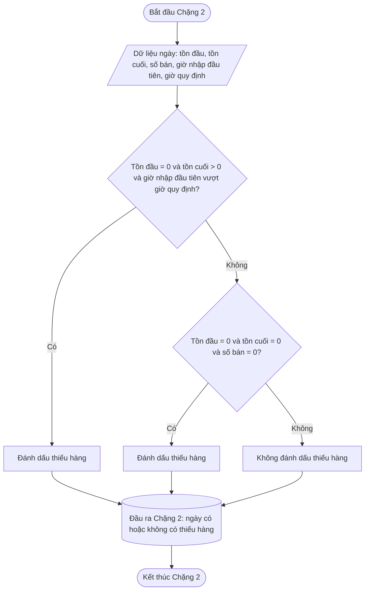

### 📦 6. Đầu ra bàn giao

| Đầu ra                                    | Ý nghĩa                                                                                                    | Chặng sau dùng    |
| --------------------------------------------- | -------------------------------------------------------------------------------------------------------------- | --------------------- |
| Trạng thái thiếu hàng                       | Cho biết ngày bán có bị đánh dấu thiếu hàng hay không.                                                | Chặng 3            |
| Lý do đánh dấu thiếu hàng                 | Ghi rõ ngày bị thiếu hàng do hàng nhập lại trễ hoặc do cả ngày không có hàng và không có bán. | Chặng 3, Chặng 20 |
| Tồn đầu ngày                            | Căn cứ kiểm tra đầu ngày có hàng hay không.                                                         | Đối chiếu         |
| Tồn cuối ngày                            | Căn cứ kiểm tra cuối ngày còn hàng hay không.                                                        | Đối chiếu         |
| Số bán trong ngày                        | Căn cứ xác định ngày không có hàng và không có bán.                                             | Đối chiếu         |
| Giờ nhập đầu tiên nếu có             | Căn cứ kiểm tra hàng có lại trễ hay không.                                                           | Đối chiếu         |
| Giờ quy định trong thời gian làm việc | Mốc so sánh với giờ nhập đầu tiên.                                                                   | Đối chiếu         |

Chặng 2 chỉ đánh dấu thiếu hàng. Chặng 2 không tính sức mua cơ bản, không bù số bán và không gom chu kỳ.

---


## Chặng 3 — Ước lượng mức bán tự nhiên cho ngày thiếu hàng không có khuyến mãi

> **QUY TẮC BỔ SUNG BẢN 26**
>
> Nếu không cân bằng được hai phía nhưng có từ 3 ngày sạch ở một phía, hệ thống vẫn tính trung vị và gắn **không cân bằng nhưng có thể dùng**. Nếu nguồn cùng mã hàng/cửa hàng không đủ, hệ thống đi theo thứ tự: cùng bối cảnh thời gian → cửa hàng tương đồng đã duyệt → cùng vị trí năm trước → mã hàng tương tự đã duyệt → nền bộ phận ngành hàng → `Chưa xác định được mức bán nền`.


> **PHA 1 · Làm sạch dữ liệu và tạo sức mua cơ bản**

### 🎯 1. Vấn đề chặng này phải giải quyết

Chặng 3 dùng để xử lý các ngày **không thuộc khuyến mãi** nhưng bị **thiếu hàng** làm số bán ghi nhận thấp hơn sức mua tự nhiên.

Chặng này chỉ dùng một trạng thái duy nhất từ Chặng 2:

| Trạng thái từ Chặng 2 | Cách Chặng 3 dùng                                                                  |
| --------------------------- | --------------------------------------------------------------------------------------- |
| Có thiếu hàng              | Cần tìm mức nền tham chiếu để xem có nên nâng sức mua cơ bản hay không. |
| Không thiếu hàng           | Dùng số bán ghi nhận trong ngày làm sức mua cơ bản.                          |

Chặng 3 không còn chia thiếu hàng thành nhiều loại nhỏ. Việc ngày bị thiếu hàng là đủ để hệ thống biết rằng số bán của ngày đó có thể bị thấp giả.

Ví dụ đời thường: nếu đầu ngày quầy không có hàng, khách muốn mua cũng không mua được. Khi nhìn lại số bán ngày đó, hệ thống không nên kết luận ngay là khách không có nhu cầu. Cần nhìn các ngày bán sạch xung quanh để ước lượng mức bán tự nhiên hợp lý hơn.

### 🎯 2. Mục tiêu

Chặng 3 trả lời một câu hỏi:

> **Với ngày không khuyến mãi, nếu có thiếu hàng thì mức bán tự nhiên hợp lý để thay cho ngày đó là bao nhiêu?**

Chặng này không xử lý ngày khuyến mãi. Nếu một ngày vừa thuộc khuyến mãi vừa có thiếu hàng, ngày đó được đưa sang Chặng 4 để đưa về **mức bán tự nhiên của khuyến mãi**. Không xử lý thiếu hàng riêng cho ngày khuyến mãi tại Chặng 3.

### 🚦 3. Điều kiện để bắt đầu

| Điều kiện                                       | Nguồn                                           | Cách dùng                                                    |
| ---------------------------------------------------- | -------------------------------------------------- | ---------------------------------------------------------------- |
| Dữ liệu ngày nằm trong khoảng lịch sử       | Chặng 1                                         | Chỉ xử lý ngày thuộc phiên hiện tại.                   |
| Trạng thái có thiếu hàng hoặc không thiếu hàng    | Chặng 2                                         | Quyết định ngày có cần tìm nền tham chiếu hay không. |
| Số bán ghi nhận trong ngày                     | hệ thống bán hàng và quản lý nội bộ                                          | Dữ liệu gốc của ngày bán.                                |
| Trạng thái khuyến mãi của ngày                       | hệ thống bán hàng và quản lý nội bộ/Marketing                                | Nếu ngày thuộc khuyến mãi thì không xử lý tại Chặng 3.      |
| Sức mua cơ bản của các ngày sạch xung quanh | Chặng 3 và dữ liệu đã xử lý trước đó | Dùng làm nguồn tham chiếu nếu đạt điều kiện sạch.   |

### 🔒 4. Nguyên tắc loại ngày khuyến mãi khỏi Chặng 3

Ngày thuộc khuyến mãi không đi theo hướng xử lý bù thiếu hàng của Chặng 3.

| Tình huống                       | Cách xử lý                                                                                                      |
| ------------------------------------ | -------------------------------------------------------------------------------------------------------------------- |
| Ngày không khuyến mãi, không thiếu hàng | Dùng số bán ghi nhận trong ngày.                                                                              |
| Ngày không khuyến mãi, có thiếu hàng    | Tìm mức nền tham chiếu theo quy tắc của Chặng 3.                                                            |
| Ngày khuyến mãi, không thiếu hàng        | Chuyển sang Chặng 4 để đưa về mức bán tự nhiên.                                                         |
| Ngày khuyến mãi, có thiếu hàng           | Chuyển sang Chặng 4 để đưa về mức bán tự nhiên của khuyến mãi. Không xử lý thiếu hàng riêng tại Chặng 3. |

Lý do: ngày khuyến mãi đã bị khuyến mãi làm thay đổi hành vi mua. Nếu vừa dùng logic thiếu hàng vừa dùng logic khuyến mãi, hệ thống dễ xử lý trùng một ngày. Với ngày khuyến mãi, chỉ cần đưa số bán khuyến mãi về mức nền tự nhiên là đủ.

### 5. Ngày tham chiếu sạch cho ngày thiếu hàng không khuyến mãi

Một ngày chỉ được dùng làm nguồn tham chiếu khi thỏa tất cả điều kiện sau:

| Điều kiện                            | Lý do                                                                          |
| ----------------------------------------- | --------------------------------------------------------------------------------- |
| Cùng mã hàng                               | Không trộn sức mua của mã hàng khác.                                     |
| Cùng nơi bán                         | Không trộn sức bán của cửa hàng khác.                                   |
| Không thuộc khuyến mãi                      | Không bị khuyến mãi làm méo số bán.                                     |
| Không có thiếu hàng                     | Không bị thiếu hàng kéo thấp số bán.                                    |
| Không phải ngày bổ sung ngày thiếu | Không dùng dữ liệu do hệ thống tự tạo để làm nguồn cho ngày khác. |
| Có sức mua cơ bản hợp lệ          | Có giá trị đủ sạch để làm tham chiếu.                                 |

### 6. Cách tìm mức nền tham chiếu

Khi một ngày **không khuyến mãi** bị thiếu hàng, hệ thống tìm ngày tham chiếu sạch quanh ngày đó.

#### 🔒 6.1. Nguyên tắc tìm quanh ngày bị thiếu hàng

| Lớp tìm kiếm            | Phạm vi                                                        | Mục tiêu                                                                     |
| ---------------------------- | ----------------------------------------------------------------- | -------------------------------------------------------------------------------- |
| Lớp 1 — vùng gần nhất | 7 ngày trước và 7 ngày sau ngày thiếu hàng                  | Tìm nguồn gần nhất với bối cảnh bán hiện tại.                        |
| Lớp 2 — vùng mở rộng  | Mở rộng dần nhưng không quá 24 ngày quanh ngày thiếu hàng | Dùng khi vùng gần nhất chưa đủ ngày sạch hoặc quá lệch một phía. |

Trong toàn bộ quá trình tìm kiếm, hệ thống lấy tối đa **14 ngày tham chiếu sạch**. Không lấy quá nhiều ngày vì dữ liệu quá xa có thể không còn giống bối cảnh bán của ngày thiếu hàng.

#### 6.2. Vùng đệm tham chiếu ngoài khung lịch ngày cố định của phiên

Khung lịch ngày cố định của phiên là phạm vi ngày được xử lý, gom chu kỳ và bàn giao kết quả cho phiên lập kế hoạch. Tuy nhiên, khi tìm mức nền cho một ngày thiếu hàng nằm **bên trong** khung lịch ngày cố định của phiên, hệ thống được phép đọc thêm ngày sạch ở vùng đệm ngay ngoài khung phiên để làm tham chiếu.

Quy tắc này chỉ dùng để tìm nền, không dùng để mở rộng chu kỳ lịch:

| Tình huống                                                           | Cách xử lý                                                                                                                                  |
| ------------------------------------------------------------------------ | ------------------------------------------------------------------------------------------------------------------------------------------------ |
| Ngày cần bù nằm trong khung lịch ngày cố định của phiên     | Được phép tìm ngày sạch ở vùng đệm trước hoặc sau khung phiên nếu giúp nền cân bằng hơn.                                  |
| Ngày sạch nằm ngoài khung phiên nhưng trong giới hạn tìm nền | Được dùng làm tham chiếu nền nếu cùng mã hàng, cùng nơi bán, không khuyến mãi, không thiếu hàng và không phải ngày bổ sung ngày thiếu. |
| Ngày ngoài khung phiên được dùng làm tham chiếu               | Không được đưa vào chu kỳ, không được tạo thêm ngày xử lý, không làm thay đổi số chu kỳ hợp lệ của phiên.           |
| Ngày cần bù nằm ngoài khung lịch ngày cố định của phiên    | Không xử lý trong phiên hiện tại.                                                                                                        |

Mục tiêu của vùng đệm là tránh trường hợp ngày cần bù nằm gần cận trên hoặc cận dưới của khung phiên nên hệ thống chỉ nhìn được một phía, làm nền bị đánh dấu chưa cân bằng dù dữ liệu sạch sát bên ngoài khung vẫn có thể dùng để cân bằng.

#### 6.3. Ưu tiên mức nền cân bằng trước và sau

Hệ thống ưu tiên nguồn tham chiếu cân bằng quanh ngày thiếu hàng. Nguyên tắc chốt: **cân bằng nghĩa là số ngày sạch phía trước bằng số ngày sạch phía sau**. Không giới hạn cân bằng chỉ ở 2 ngày trước và 2 ngày sau; nếu có 3 ngày trước và 3 ngày sau thì vẫn là cân bằng. Nếu có 4 ngày trước và 2 ngày sau, dù tổng nguồn nhiều hơn 3 ngày, vẫn là nền chưa cân bằng.

| Mức ưu tiên       | Điều kiện                                                                                             | Cách hiểu                                                                 |
| ---------------------- | ---------------------------------------------------------------------------------------------------------- | ----------------------------------------------------------------------------- |
| Tốt nhất           | Số ngày sạch trước = số ngày sạch sau, ví dụ 2 ngày trước + 2 ngày sau gần ngày thiếu hàng | Nền cân bằng tốt.                                                       |
| Chấp nhận được  | Có từ 3 ngày sạch trở lên nhưng số ngày sạch trước ≠ số ngày sạch sau                    | Vẫn tính nền, nhưng ghi nhận chưa cân bằng và cần kiểm tra lại. |
| Không đủ căn cứ | Có dưới 3 ngày sạch sau khi mở rộng                                                               | Không tự nâng nền.                                                      |

Cách hiểu đơn giản: muốn đánh giá một ngày bán bị méo thì tốt nhất nên nhìn cả trước và sau ngày đó. Nền chỉ được xem là cân bằng khi số ngày sạch phía trước và phía sau bằng nhau. Nếu có nhiều hơn 3 ngày sạch nhưng lệch phía, ví dụ 4 ngày trước và 2 ngày sau, hệ thống vẫn dùng tạm nhưng phải đánh dấu kiểm tra lại khi có thêm dữ liệu.

#### 6.4. Cách chọn tập ngày sạch khi hai phía không bằng nhau

Hệ thống không được mặc định lấy tất cả ngày sạch tìm được rồi kết luận nền chưa cân bằng. Trước khi đánh dấu chưa cân bằng, hệ thống phải thử đưa tập nền về trạng thái cân bằng bằng cách chọn các ngày sạch gần nhất theo cặp trước/sau.

Quy tắc chọn:

| Trường hợp                                                              | Cách chọn đúng                                                                                                                       |
| ---------------------------------------------------------------------------- | ------------------------------------------------------------------------------------------------------------------------------------------ |
| Có đủ ít nhất 2 ngày sạch phía trước và 2 ngày sạch phía sau | Chọn số ngày bằng nhau lớn nhất có thể trong giới hạn tìm nền, rồi lấy các ngày gần ngày cần bù nhất ở mỗi phía. |
| Một phía có nhiều ngày sạch hơn phía còn lại                     | Cắt bớt phía dư, không lấy toàn bộ phía dư nếu làm nền mất cân bằng.                                                     |
| Có 6 ngày sạch trước và 4 ngày sạch sau                            | Chọn 4 ngày sạch gần nhất phía trước + 4 ngày sạch gần nhất phía sau, không lấy cả 10 ngày.                             |
| Có thể đạt nền cân bằng với dưới 14 ngày sạch                  | Dừng ở tập cân bằng gần bối cảnh nhất; không bắt buộc phải tìm đủ 14 ngày.                                              |
| Không thể tạo tập cân bằng tối thiểu 2 trước + 2 sau             | Mới dùng nền tạm nếu có từ 3 ngày sạch trở lên và đánh dấu chưa cân bằng.                                              |

Cách tính chọn nhanh:

$$
k = \min(\text{số ngày sạch trước},\ \text{số ngày sạch sau},\ 7)

$$

Nếu `k >= 2`, hệ thống chọn `k` ngày sạch gần nhất phía trước và `k` ngày sạch gần nhất phía sau. Nếu `k < 2`, hệ thống chưa có tập cân bằng đủ tốt và mới chuyển sang xét nền tạm chưa cân bằng.

### 7. Cách tính mức nền tham chiếu

Sau khi có danh sách ngày tham chiếu sạch, hệ thống tính mức nền như sau:

|                                                 Số ngày tham chiếu sạch | Cách tính       | Trạng thái                                            |
| ----------------------------------------------------------------------------: | ------------------- | --------------------------------------------------------- |
|     Từ 4 ngày trở lên và số ngày sạch trước = số ngày sạch sau | Lấy trung vị    | Nền cân bằng tốt.                                   |
| Từ 3 ngày trở lên nhưng số ngày sạch trước ≠ số ngày sạch sau | Lấy trung vị    | Nền tạm dùng, cần kiểm tra lại ở lần chạy sau. |
|                                                              Dưới 3 ngày | Không tính nền | Không đủ căn cứ nâng nền.                        |

$$
\text{Mức nền tham chiếu}
= \operatorname{Median}\left(\text{Sức mua cơ bản của các ngày tham chiếu sạch}\right)

$$

Sau đó:

$$
\text{Sức mua cơ bản ngày thiếu hàng}
= \max\left(\text{Số bán ghi nhận trong ngày},\ \text{Mức nền tham chiếu}\right)

$$

Viết ngắn:

$$
\text{Sức mua cơ bản ngày thiếu hàng}
= \max\left(\text{Số bán ghi nhận trong ngày},\ \text{Mức nền tham chiếu}\right)

$$

Nếu mức nền tham chiếu thấp hơn số bán ghi nhận, hệ thống giữ số bán ghi nhận. Chặng 3 không làm giảm số bán thật.

### 📐 8. Quy tắc kiểm tra lại nền chưa cân bằng

Nếu mức nền được tính từ nguồn có số ngày sạch trước và sau không bằng nhau, hệ thống vẫn dùng mức nền đó cho phiên hiện tại nhưng phải đánh dấu để kiểm tra lại ở lần chạy kế hoạch tiếp theo. Quy tắc này áp dụng cho mọi trường hợp có từ 3 ngày sạch trở lên, không chỉ trường hợp vừa đủ 3 ngày sạch.

| Tình huống                                                                                            | Cách xử lý                                              |
| --------------------------------------------------------------------------------------------------------- | ------------------------------------------------------------ |
| Số ngày sạch trước = số ngày sạch sau                                                           | Chốt nền cân bằng tốt.                                |
| Có từ 3 ngày sạch trở lên nhưng số ngày sạch trước ≠ số ngày sạch sau                   | Tính nền tạm dùng và đánh dấu cần kiểm tra lại. |
| Lần chạy sau có thêm ngày sạch hoặc vùng đệm ngoài khung phiên giúp nguồn cân bằng hơn | Tính lại nền cho chuỗi học từ kỳ sau.               |
| Lần chạy sau vẫn chưa cân bằng                                                                    | Tiếp tục giữ trạng thái cần kiểm tra lại.          |
| Đã đạt nguồn cân bằng                                                                            | Dừng kiểm tra lại cho ngày đó.                       |

Khi kiểm tra lại, hệ thống không được chỉ lặp lại đúng tập ngày cũ. Hệ thống phải chạy lại bước chọn tập nền theo thứ tự:

1. Tìm thêm ngày sạch gần ngày cần bù nhất, bao gồm vùng đệm ngoài khung phiên nếu ngày cần bù nằm trong khung phiên.
2. Thử tạo tập cân bằng bằng cách chọn cùng số ngày trước và sau.
3. Nếu một phía dư ngày, cắt bớt phía dư và giữ các ngày gần ngày cần bù nhất.
4. Chỉ giữ trạng thái chưa cân bằng khi không thể tạo tập cân bằng tối thiểu.

Không phải mọi nền chưa cân bằng đều cần kiểm tra lại mãi. Hệ thống phải phân biệt hai loại:

| Loại nền chưa cân bằng    | Khi nào dùng                                                                                                                                                         | Có kiểm tra lại ở lần chạy sau không?                                                                       |
| -------------------------------- | ------------------------------------------------------------------------------------------------------------------------------------------------------------------------ | -------------------------------------------------------------------------------------------------------------------- |
| `TẠM · KIỂM TRA`            | Ngày cần bù nằm gần cận trên của khung phiên hoặc gần ngày hiện tại, nên tương lai có thể phát sinh thêm ngày sạch.                             | Có. Lần chạy sau có thêm dữ liệu thì thử cân bằng lại.                                                 |
| `KHÔNG CÂN BẰNG CỐ ĐỊNH` | Ngày cần bù nằm gần cận dưới của khung lịch sử, hệ thống đã kiểm tra vùng đệm ngoài khung phiên nhưng bản chất chỉ có một phía đủ dùng. | Không. Đây là giới hạn lịch sử đã đóng, không nên bắt hệ thống kiểm tra lại lặp đi lặp lại. |
| `KHÔNG CÂN BẰNG CỐ ĐỊNH` | Ngày cần bù bị chặn bởi khuyến mãi/vùng méo liền kề đã xảy ra trong quá khứ, nên không thể tạo nguồn trước/sau cân bằng hợp lệ.                    | Không. Giữ bản ghi giải thích lý do chặn và không đưa vào danh sách kiểm tra lại định kỳ.                          |

Việc kiểm tra lại chỉ làm sạch hơn chuỗi nền dùng cho các lần lập kế hoạch sau. Các quyết định đặt hàng đã phát hành trước đó không bị sửa ngược.

### 💡 9. Ví dụ vận hành

#### 9.1. Trường hợp nền cân bằng tốt

Ngày thiếu hàng: **10/06/2026**
Không thuộc khuyến mãi.
Số bán ghi nhận trong ngày: **8**

Ngày tham chiếu sạch tìm được:

| Phía trước/sau |      Ngày | Sức mua cơ bản |
| ------------------- | -----------: | ------------------: |
| Trước           | 08/06/2026 |                18 |
| Trước           | 09/06/2026 |                20 |
| Sau               | 11/06/2026 |                21 |
| Sau               | 12/06/2026 |                19 |

Mảng tham chiếu:

> **18, 20, 21, 19**

Sắp xếp:

> **18, 19, 20, 21**

Trung vị:

$$
\frac{19+20}{2}=19{,}5

$$

Kết quả:

$$
\text{Sức mua cơ bản ngày 10/06/2026}=\max(8,19{,}5)=19{,}5

$$

Trạng thái:

> **Nền cân bằng tốt**

#### 9.2. Trường hợp nền chưa cân bằng nhưng vẫn đủ dùng tạm

Ngày thiếu hàng: **10/06/2026**
Không thuộc khuyến mãi.
Số bán ghi nhận trong ngày: **8**

Ngày tham chiếu sạch tìm được:

| Phía trước/sau |      Ngày | Sức mua cơ bản |
| ------------------- | -----------: | ------------------: |
| Trước           | 07/06/2026 |                17 |
| Trước           | 08/06/2026 |                18 |
| Trước           | 09/06/2026 |                20 |

Chưa có ngày sạch phía sau vì các ngày sau đang thuộc khuyến mãi dài hạn hoặc chưa đủ dữ liệu sạch.

Mảng tham chiếu:

> **17, 18, 20**

Trung vị:

> **18**

Kết quả:

$$
\text{Sức mua cơ bản ngày 10/06/2026}=\max(8,18)=18

$$

Trạng thái:

> **Nền tạm dùng, cần kiểm tra lại ở lần chạy kế hoạch tiếp theo**

Ở lần chạy sau, nếu đã có thêm ngày sạch phía sau, hệ thống kiểm tra lại. Nếu tìm được nguồn có số ngày sạch trước và sau bằng nhau, mức nền sẽ được tính lại cho chuỗi học từ kỳ sau.

### 📊 10. Bảng quyết định sức mua cơ bản cấp ngày ở Chặng 3

| Tình huống ngày xử lý                                  | Hành động                                                 | Sức mua cơ bản cấp ngày                                                               |
| ------------------------------------------------------------- | -------------------------------------------------------------- | -------------------------------------------------------------------------------------------- |
| Không khuyến mãi, không thiếu hàng                                | Dùng số bán ghi nhận trong ngày.                        | Bằng số bán ghi nhận trong ngày.                                                      |
| Không khuyến mãi, có thiếu hàng, có nền cân bằng tốt         | Dùng mức nền tham chiếu để so với số bán ghi nhận. | max(Số bán ghi nhận trong ngày, Mức nền tham chiếu).                                |
| Không khuyến mãi, có thiếu hàng, có nền tạm dùng              | Dùng mức nền tham chiếu và đánh dấu kiểm tra lại.  | max(Số bán ghi nhận trong ngày, Mức nền tham chiếu).                                |
| Không khuyến mãi, có thiếu hàng, dưới 3 ngày tham chiếu sạch | Không tự bịa nền.                                        | Giữ số bán ghi nhận trong ngày để đối chiếu; ghi không đủ căn cứ nâng nền. |
| Có khuyến mãi, dù có hoặc không có thiếu hàng                 | Không xử lý tại Chặng 3.                                | Bàn giao sang Chặng 4.                                                                   |

### 🔀 11. Sơ đồ các bước

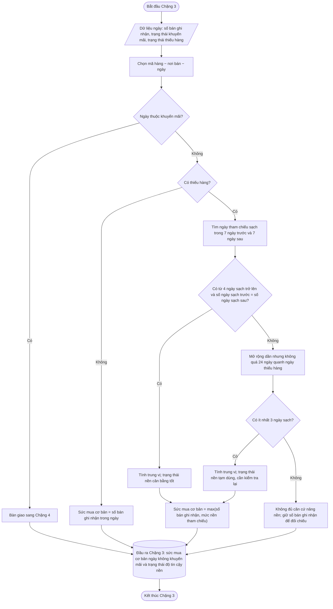

### 📦 12. Đầu ra bàn giao

| Trường                                           | Ý nghĩa                                                                         | Chặng sau dùng               |
| ---------------------------------------------------- | ----------------------------------------------------------------------------------- | -------------------------------- |
| Sức mua cơ bản cấp ngày cho ngày không khuyến mãi | Giá trị nền cuối cùng của ngày không khuyến mãi.                                | Chặng 5 và Chặng 6          |
| Trạng thái thiếu hàng                              | Chỉ gồm có thiếu hàng hoặc không thiếu hàng.                                     | Chặng 5, Chặng 6, Chặng 20            |
| Mức nền tham chiếu đã dùng                   | Căn cứ đối chiếu khi nâng nền.                                              | Chặng 5, Chặng 6, Chặng 20            |
| Danh sách ngày tham chiếu sạch                 | Các ngày thật được dùng để tính nền.                                   | Chặng 20                      |
| Trạng thái độ tin cậy nền                    | Nền cân bằng tốt, nền tạm dùng, hoặc không đủ căn cứ.                | Chặng 5, Chặng 6, Chặng 20            |
| Dấu hiệu cần kiểm tra lại                     | Cho biết nền chưa cân bằng trước/sau và cần xét lại ở lần chạy sau. | Chặng 20                      |
| Số bán ghi nhận trong ngày                     | Dữ liệu gốc để đối chiếu.                                                  | Chặng 4, Chặng 13, Chặng 20 |
| Danh sách ngày khuyến mãi chờ xử lý                 | Ngày khuyến mãi có hoặc không có thiếu hàng.                                         | Chặng 4                       |

Chặng 3 chỉ xử lý ngày không khuyến mãi. Từ điểm này trở đi, ngày khuyến mãi có thiếu hàng không được bù riêng theo thiếu hàng mà phải được Chặng 4 đưa về mức bán tự nhiên của khuyến mãi.

---


## Chặng 4 — Đưa ngày khuyến mãi về mức bán tự nhiên

> **QUY TẮC BỔ SUNG BẢN 26**
>
> - Phân loại khuyến mãi trước khi chuẩn hóa: chiến dịch, giá thường trực, thanh lý, bundle, chưa rõ.
> - phần lấy dữ liệu không tự loại mã. Danh sách giá thường trực phải được phê duyệt.
> - khuyến mãi gần như liên tục nhưng không có ngày đối chứng không được tự quy nền về 0; chuyển `Không đủ căn cứ xác định mức bán nền` và tạo task tìm nguồn đối chứng/nền bộ phận ngành hàng.
> - khuyến mãi lịch sử được cấp bằng khoảng ngày để ngày không có bán vẫn được nhận diện.


> **PHA 1 · Làm sạch dữ liệu và tạo sức mua cơ bản**

### 🎯 1. Vấn đề chặng này phải giải quyết

Ngày khuyến mãi không phản ánh đúng mức bán tự nhiên. Trong ngày khuyến mãi, khách có thể mua nhiều hơn vì ưu đãi, mua gom cho nhiều ngày sau, hoặc chuyển từ mua bình thường sang mua theo chương trình.

Vì vậy, ngày khuyến mãi không được đưa thẳng vào chuỗi sức mua cơ bản bằng số bán ghi nhận trong ngày.

Chặng 4 có nhiệm vụ đưa ngày khuyến mãi về **mức bán tự nhiên** trước khi Chặng 6 cộng thành chu kỳ 15 ngày.

Điểm chốt: nếu ngày khuyến mãi cũng bị thiếu hàng, Chặng 4 vẫn xử lý theo hướng **đưa ngày khuyến mãi về mức bán tự nhiên**. Không xử lý riêng thiếu hàng trong khuyến mãi ở Chặng 3.

Cách hiểu đơn giản: ngày thiếu hàng làm số bán thấp giả, ngày khuyến mãi làm số bán cao giả hoặc méo hành vi mua. Với ngày khuyến mãi, hệ thống không hỏi “bị thiếu hàng bao nhiêu”, mà hỏi “nếu không có khuyến mãi thì ngày này nên có mức bán tự nhiên khoảng bao nhiêu”.

### 🎯 2. Mục tiêu

Chặng 4 trả lời một câu hỏi:

> **Với ngày thuộc khuyến mãi, mức bán tự nhiên hợp lý để đưa vào chu kỳ 15 ngày là bao nhiêu?**

Chặng này không tính hệ số khuyến mãi, không dự báo tương lai và không quyết định đặt hàng.

Chặng này chỉ tạo **sức mua cơ bản cấp ngày cho ngày khuyến mãi**.

Phần tăng thêm do khuyến mãi vẫn được giữ riêng để Chặng 13 học hệ số khuyến mãi nếu đủ căn cứ.

### 🚦 3. Điều kiện để bắt đầu

| Điều kiện                                   | Nguồn                         | Cách dùng                                                                                     |
| ------------------------------------------------ | -------------------------------- | ------------------------------------------------------------------------------------------------- |
| Danh sách ngày thuộc khuyến mãi                   | hệ thống bán hàng và quản lý nội bộ/Marketing và Chặng 3 | Xác định ngày cần đưa về mức bán tự nhiên.                                          |
| Số bán ghi nhận trong ngày khuyến mãi            | hệ thống bán hàng và quản lý nội bộ                        | Giữ để đối chiếu và học hệ số khuyến mãi, không dùng trực tiếp làm nền.                  |
| Mã/vùng khuyến mãi                                 | hệ thống bán hàng và quản lý nội bộ/Marketing              | Xác định phạm vi chương trình.                                                           |
| Trạng thái thiếu hàng                          | Chặng 2                       | Chỉ dùng để ghi nhận ngày khuyến mãi có bị thiếu hàng; không xử lý riêng tại Chặng 3. |
| Sức mua cơ bản của ngày sạch không khuyến mãi | Chặng 3                       | Dùng làm nguồn tham chiếu nếu đạt điều kiện sạch.                                    |
| Lịch khuyến mãi lịch sử                           | Marketing/hệ thống bán hàng và quản lý nội bộ              | Biết ngày bắt đầu, ngày kết thúc và phạm vi áp dụng.                                |

### 🔒 4. Nguyên tắc tìm nền của Chặng 4

Chặng 4 dùng cùng tinh thần tìm nền như Chặng 3:

| Nguyên tắc                                       | Cách hiểu trong Chặng 4                                                                                                                       |
| ---------------------------------------------------- | -------------------------------------------------------------------------------------------------------------------------------------------------- |
| Xem ngày khuyến mãi là ngày bán bị méo             | Không dùng số bán khuyến mãi làm nền tự nhiên.                                                                                                 |
| Tìm ngày sạch xung quanh vùng bị méo         | Ưu tiên ngày sạch trước và sau vùng khuyến mãi.                                                                                                |
| Ưu tiên nền cân bằng trước/sau              | Chỉ xem là cân bằng khi số ngày sạch trước = số ngày sạch sau; ví dụ 2 ngày trước + 2 ngày sau.                                |
| Tối thiểu 3 ngày sạch                          | Nếu dưới 3 ngày sạch thì không tự tạo nền.                                                                                             |
| Tối đa 14 ngày sạch                            | Không lấy quá nhiều ngày vì có thể làm loãng bối cảnh bán.                                                                          |
| Mở rộng tìm kiếm có giới hạn                | Bắt đầu từ 7 ngày trước/sau, nếu chưa đủ thì mở rộng dần nhưng không quá 24 ngày mỗi phía.                                  |
| Nền chưa cân bằng vẫn có thể dùng tạm     | Nếu có từ 3 ngày sạch trở lên nhưng số ngày sạch trước ≠ số ngày sạch sau, vẫn tính nền và đánh dấu cần kiểm tra lại. |
| Không tìm xuyên qua khuyến mãi liền kề              | Với khuyến mãi, vùng khuyến mãi trước hoặc sau là ranh giới bối cảnh. Không được nhảy qua một khuyến mãi khác để lấy ngày sạch xa hơn.       |
| Không sửa ngược quyết định đã phát hành | Nếu lần chạy sau tính lại nền tốt hơn, chỉ dùng cho chuỗi học và phiên kế hoạch sau.                                             |

Điểm cần chốt: **Chặng 4 không tìm nền theo từng loại thiếu hàng**. Chặng 4 chỉ quan tâm ngày đó có thuộc khuyến mãi hay không. Nếu thuộc khuyến mãi, ngày đó được đưa về mức bán tự nhiên bằng ngày tham chiếu sạch.

### 5. Ngày tham chiếu sạch cho khuyến mãi

Một ngày được dùng làm nguồn tham chiếu cho khuyến mãi khi thỏa tất cả điều kiện sau:

| Điều kiện                                                          | Lý do                                                                                   |
| ----------------------------------------------------------------------- | ------------------------------------------------------------------------------------------ |
| Cùng mã hàng                                                             | Không trộn sức mua của mã hàng khác.                                              |
| Cùng nơi bán                                                       | Không trộn sức bán của cửa hàng khác.                                            |
| Không thuộc khuyến mãi                                                    | Không bị khuyến mãi làm méo số bán.                                              |
| Không có thiếu hàng                                                   | Không bị thiếu hàng kéo thấp số bán.                                             |
| Không phải ngày bổ sung ngày thiếu                               | Không dùng dữ liệu tự tạo làm nguồn cho ngày khác.                             |
| Có sức mua cơ bản hợp lệ                                        | Có giá trị đủ sạch để làm tham chiếu.                                          |
| Không nằm bên kia một khuyến mãi khác so với vùng khuyến mãi đang xử lý | Tránh lấy nền sau một chương trình khác vì bối cảnh bán có thể đã đổi. |

Ngày khuyến mãi đã được đưa về nền vẫn **không được dùng làm nguồn tham chiếu** cho ngày khác, vì đó là giá trị đã được ước tính, không phải ngày bán sạch quan sát trực tiếp.

### 6. Cách xác định vùng khuyến mãi cần đưa về nền

khuyến mãi có thể ngắn vài ngày hoặc kéo dài nhiều tháng. Dù dài hay ngắn, Chặng 4 vẫn xử lý theo một cách hiểu chung: **xác định vùng bán bị khuyến mãi làm méo, sau đó tìm ngày sạch trước và sau vùng đó**.

| Loại khuyến mãi                                 | Cách xác định vùng bị méo                                                   | Cách tìm nền                                                                                               |
| -------------------------------------------- | ------------------------------------------------------------------------------------ | --------------------------------------------------------------------------------------------------------------- |
| khuyến mãi ngắn                                 | Toàn bộ ngày từ ngày bắt đầu đến ngày kết thúc khuyến mãi                   | Tìm ngày sạch ngay trước và ngay sau vùng khuyến mãi.                                                        |
| khuyến mãi dài nhiều tháng                    | Toàn bộ giai đoạn khuyến mãi dài được xem là một vùng bán bị méo kéo dài | Tìm ngày sạch trước ngày bắt đầu khuyến mãi và sau ngày kết thúc khuyến mãi.                                 |
| khuyến mãi đang chạy, chưa có ngày sau khuyến mãi | Chỉ mới có nguồn sạch phía trước                                           | Có thể tính tạm nếu đủ tối thiểu 3 ngày sạch, nhưng bắt buộc đánh dấu nền chưa cân bằng. |

Không lấy các ngày nằm bên trong khuyến mãi làm nguồn tham chiếu cho chính khuyến mãi đó.

Với khuyến mãi, các khuyến mãi liền kề là **ranh giới chặn tìm nền**:

| Phía tìm                                      | Ranh giới chặn                                                                                                                |
| ------------------------------------------------- | --------------------------------------------------------------------------------------------------------------------------------- |
| Tìm ngày sạch trước khuyến mãi hiện tại        | Không được đi xuyên qua khuyến mãi trước đó để lấy ngày sạch xa hơn.                                                  |
| Tìm ngày sạch sau khuyến mãi hiện tại            | Không được đi xuyên qua khuyến mãi kế tiếp để lấy ngày sạch xa hơn.                                                     |
| Có ngày sạch sau khuyến mãi kế tiếp              | Không dùng cho khuyến mãi hiện tại, dù ngày đó sạch theo nghĩa không khuyến mãi và không thiếu hàng.                             |
| Không đủ nguồn vì bị khuyến mãi liền kề chặn | Không phá ranh giới; dùng tập cân bằng nhỏ hơn nếu có, hoặc đánh dấu nền chưa cân bằng/không đủ căn cứ. |

Lý do: khuyến mãi có thể làm thay đổi mức nền sau đó do khách mua dồn, mua bù, thay đổi nhịp bán hoặc do kế hoạch trưng bày khác. Vì vậy, nền của khuyến mãi hiện tại phải lấy từ bối cảnh sát khuyến mãi đó, không lấy sau một khuyến mãi khác.

#### 6.1. khuyến mãi sát nhau và cụm khuyến mãi

Nếu hai hoặc nhiều khuyến mãi chạy sát nhau đến mức không có đủ ngày sạch nằm giữa chúng, hệ thống phải xem đây là **cụm khuyến mãi** khi tìm nền. Cụm khuyến mãi là một vùng bán bị méo liên tục hoặc gần liên tục, trong đó việc tách từng khuyến mãi để tìm nền riêng có thể làm hệ thống lấy nhầm bối cảnh.

Khi đã xác định là cụm, hệ thống coi toàn bộ cụm như **một khuyến mãi kéo dài** và bù nền theo cùng một quy tắc của Chặng 4. Hệ thống không bù từng khuyến mãi nhỏ bằng các tập ngày sạch khác nhau nếu các khuyến mãi đó không có đủ ngày sạch nằm giữa.

Quy tắc xử lý cụm khuyến mãi:

| Tình huống                                                                                                                         | Cách xử lý                                                                                                                                                                                                    |
| -------------------------------------------------------------------------------------------------------------------------------------- | ------------------------------------------------------------------------------------------------------------------------------------------------------------------------------------------------------------------ |
| khuyến mãi đầu cụm nằm sát cận dưới của khung lịch sử Chặng 1                                                                  | Được kiểm tra vùng đệm ngoài khung phiên ở phía trước cụm.                                                                                                                                         |
| Phía trước cụm có đủ 14 ngày sạch hợp lệ                                                                                  | Dùng 14 ngày sạch phía trước để tính nền cho các khuyến mãi trong cụm nếu không có nguồn cân bằng hai phía. Đánh dấu`KHÔNG CÂN BẰNG CỐ ĐỊNH`, không đưa vào danh sách kiểm tra lại. |
| Phía trước cụm không đủ 14 ngày sạch, nhưng phía sau cụm có đủ ngày sạch theo ngưỡng một phía của chính sách | Dùng cùng một tập ngày sạch phía sau cụm cho các khuyến mãi trong cụm. Đánh dấu`KHÔNG CÂN BẰNG CỐ ĐỊNH`, không thử điều chỉnh lại cho cân bằng ở các lần chạy sau.                      |
| Cả trước cụm và sau cụm đều không đủ căn cứ                                                                             | Không tự tạo nền; ghi`THIẾU CĂN CỨ`.                                                                                                                                                                      |
| Cụm khuyến mãi nằm gần cận trên của khung phiên hoặc gần ngày hiện tại                                                         | Nếu chưa đủ ngày sạch phía sau, đánh dấu`TẠM · KIỂM TRA` để lần chạy sau có thêm dữ liệu thì tính lại.                                                                                   |

Điểm chốt: với cụm khuyến mãi sát cận dưới lịch sử, nếu hệ thống đã kiểm tra vùng đệm ngoài khung phiên mà vẫn chỉ có thể dùng một phía, trạng thái chưa cân bằng này là **cố định theo lịch sử**, không phải lỗi cần kiểm tra lại mãi.

Ví dụ khuyến mãi chạy từ **01/10/2023 đến 28/02/2024** thì nguồn tham chiếu phải tìm ở:

| Phía tìm   | Khoảng tìm ưu tiên     | Khoảng mở rộng tối đa           |
| -------------- | ---------------------------- | -------------------------------------- |
| Trước khuyến mãi | 7 ngày trước 01/10/2023 | Tối đa 24 ngày trước 01/10/2023 |
| Sau khuyến mãi     | 7 ngày sau 28/02/2024     | Tối đa 24 ngày sau 28/02/2024     |

### 7. Cách tìm mức bán tự nhiên cho khuyến mãi

Quy trình tìm nền:

| Bước | Hành động                                                                                                                                                                                 |
| -------: | ---------------------------------------------------------------------------------------------------------------------------------------------------------------------------------------------- |
|      1 | Chọn vùng khuyến mãi của đúng mã hàng và đúng nơi bán.                                                                                                                                       |
|      2 | Tìm ngày sạch trong 7 ngày trước ngày bắt đầu khuyến mãi; có thể lấy ngày sạch ngoài**khung lịch ngày cố định của phiên** nếu vùng khuyến mãi cần bù nằm trong khung phiên. |
|      3 | Tìm ngày sạch trong 7 ngày sau ngày kết thúc khuyến mãi; có thể lấy ngày sạch ngoài**khung lịch ngày cố định của phiên** với cùng điều kiện trên.                        |
|      4 | Dừng tìm ở ranh giới khuyến mãi liền kề; không được nhảy qua khuyến mãi trước/sau để lấy ngày sạch xa hơn.                                                                            |
|      5 | Nếu chưa đủ hoặc quá lệch một phía, mở rộng dần nhưng không quá 24 ngày mỗi phía và vẫn không vượt ranh giới khuyến mãi liền kề.                                         |
|      6 | Chọn tập nền cân bằng lớn nhất có thể trong vùng bối cảnh: số ngày sạch trước = số ngày sạch sau, ưu tiên các ngày gần vùng khuyến mãi nhất.                            |
|      7 | Nếu một phía có nhiều ngày hơn phía còn lại, cắt bớt phía dư; không lấy toàn bộ ngày sạch nếu làm nền mất cân bằng.                                                |
|      8 | Không bắt buộc lấy đủ 14 ngày; 14 ngày chỉ là trần tối đa, không phải mục tiêu bắt buộc.                                                                                  |
|      9 | Nếu không thể tạo tập cân bằng tối thiểu 2 ngày trước + 2 ngày sau, mới dùng nền tạm nếu có từ 3 ngày sạch trở lên và đánh dấu cần kiểm tra lại.              |
|     10 | Nếu dưới 3 ngày sạch, không tự tạo nền khuyến mãi.                                                                                                                                        |

Cách tính:

|                                                Số ngày sạch tìm được | Cách xử lý                                                         |
| ----------------------------------------------------------------------------: | ----------------------------------------------------------------------- |
|     Từ 4 ngày trở lên và số ngày sạch trước = số ngày sạch sau | Lấy trung vị; trạng thái**nền cân bằng tốt**.                 |
| Từ 3 ngày trở lên nhưng số ngày sạch trước ≠ số ngày sạch sau | Lấy trung vị; trạng thái**nền tạm dùng, cần kiểm tra lại**. |
|                                                              Dưới 3 ngày | Không tự tạo nền khuyến mãi.                                            |

Nếu có thể tạo tập cân bằng bằng cách bỏ bớt ngày ở phía dư, hệ thống phải làm điều đó trước khi xếp nền vào trạng thái tạm dùng. Công thức chọn nhanh:

$$
k = \min(\text{số ngày sạch trước},\ \text{số ngày sạch sau},\ 7)

$$

Nếu `k >= 2`, hệ thống chọn `k` ngày sạch gần nhất trước khuyến mãi và `k` ngày sạch gần nhất sau khuyến mãi. Ví dụ có 6 ngày sạch trước khuyến mãi và 4 ngày sạch sau khuyến mãi thì `k = 4`, nên chọn 4 ngày trước gần khuyến mãi nhất + 4 ngày sau gần khuyến mãi nhất. Không lấy cả 10 ngày rồi đánh dấu chưa cân bằng.

$$
\text{Mức bán tự nhiên khuyến mãi}
= \operatorname{Median}\left(\text{Sức mua cơ bản của các ngày tham chiếu sạch}\right)

$$

Sau đó:

$$
\text{Sức mua cơ bản ngày khuyến mãi}=\text{Mức bán tự nhiên khuyến mãi}

$$

Không dùng công thức:

$$
\text{Sức mua cơ bản ngày khuyến mãi}
\ne \max\left(\text{Số bán ghi nhận trong ngày},\ \text{Mức nền tham chiếu}\right)

$$

Lý do: số bán ghi nhận trong ngày khuyến mãi đã bị chương trình làm méo, nên không phải mốc để so sánh. Nếu dùng `max`, hệ thống có thể giữ lại số bán cao giả do khuyến mãi và làm hỏng nền chu kỳ.

### 📐 8. Quy tắc đánh dấu nền chưa cân bằng

Chặng 4 phải đánh dấu lại các điểm được đưa về nền nhưng nguồn tham chiếu chưa cân bằng trước/sau.

Nguyên tắc chốt: **chỉ khi số ngày sạch phía trước bằng số ngày sạch phía sau thì nền mới được xem là cân bằng**. Nếu tổng nguồn lớn hơn 3 ngày nhưng lệch trước/sau, hệ thống vẫn tính nền tạm dùng và vẫn phải đánh dấu kiểm tra lại.

| Tình huống                                                                          | Cách xử lý                                                                   |
| --------------------------------------------------------------------------------------- | --------------------------------------------------------------------------------- |
| Số ngày sạch trước = số ngày sạch sau                                         | Chốt nền cân bằng tốt.                                                     |
| Có từ 3 ngày sạch trở lên nhưng số ngày sạch trước ≠ số ngày sạch sau | Tính nền tạm dùng và đánh dấu nền chưa cân bằng.                    |
| Chỉ có ngày sạch phía trước                                                    | Tính tạm nếu có ít nhất 3 ngày sạch; đánh dấu nền chưa cân bằng. |
| Chỉ có ngày sạch phía sau                                                        | Tính tạm nếu có ít nhất 3 ngày sạch; đánh dấu nền chưa cân bằng. |
| Dưới 3 ngày sạch                                                                  | Không tự tạo nền; ghi không đủ căn cứ.                                 |

Các điểm bị đánh dấu nền chưa cân bằng phải được đưa vào danh sách kiểm tra lại ở lần chạy kế hoạch sau.

| Trạng thái kiểm tra lại           | Ý nghĩa                                                                                             |
| --------------------------------------- | ------------------------------------------------------------------------------------------------------- |
| Chưa cân bằng, cần kiểm tra lại | Nền đã dùng tạm nhưng nguồn lệch trước/sau.                                                 |
| Đã có thêm nguồn sạch           | Lần chạy sau có thêm ngày sạch hoặc vùng đệm ngoài khung phiên giúp kiểm tra lại nền. |
| Đã cân bằng                       | Số ngày sạch trước và sau đã bằng nhau; dừng kiểm tra lại.                                |
| Vẫn chưa cân bằng                 | Tiếp tục giữ trạng thái cần kiểm tra lại.                                                     |

Khi kiểm tra lại nền khuyến mãi chưa cân bằng, hệ thống vẫn phải tuân thủ ranh giới khuyến mãi liền kề. Không được sửa trạng thái chưa cân bằng bằng cách nhảy qua khuyến mãi kế tiếp hoặc khuyến mãi trước đó để lấy ngày sạch xa hơn.

Chặng 4 phải tách rõ hai ghi chú chưa cân bằng:

| Ghi chú                          | Khi nào dùng                                                                                                                                | Có kiểm tra lại ở lần chạy sau không? |
| -------------------------------- | ----------------------------------------------------------------------------------------------------------------------------------------------- | ---------------------------------------------- |
| `TẠM · KIỂM TRA`            | khuyến mãi nằm gần cận trên của khung phiên hoặc gần ngày hiện tại, nên sau này có thể phát sinh thêm ngày sạch để cân bằng. | Có.                                         |
| `KHÔNG CÂN BẰNG CỐ ĐỊNH` | khuyến mãi hoặc cụm khuyến mãi nằm sát cận dưới lịch sử, đã kiểm tra vùng đệm ngoài khung phiên nhưng chỉ có một phía đủ dùng.   | Không.                                      |
| `KHÔNG CÂN BẰNG CỐ ĐỊNH` | Hai khuyến mãi sát nhau làm không thể có nguồn sạch giữa chúng, và nguồn hợp lệ chỉ có thể lấy chung từ một phía của cả cụm. | Không.                                      |
| `THIẾU CĂN CỨ`              | Không đạt tối thiểu ngày sạch theo quy tắc cụm hoặc quy tắc vùng khuyến mãi.                                                            | Không tính nền tự động.                |

Việc kiểm tra lại chỉ làm sạch hơn chuỗi nền dùng cho các lần lập kế hoạch sau. Các đơn hàng hoặc quyết định đã phát hành không bị sửa ngược.

### 📊 9. Bảng quyết định sức mua cơ bản cho ngày khuyến mãi

| Tình huống ngày khuyến mãi                          | Hành động                                                                       | Sức mua cơ bản cấp ngày                                                    |
| -------------------------------------------------- | ------------------------------------------------------------------------------------ | --------------------------------------------------------------------------------- |
| khuyến mãi có nguồn nền cân bằng tốt             | Lấy trung vị ngày sạch trước/sau vùng khuyến mãi.                                 | Bằng mức bán tự nhiên khuyến mãi.                                                |
| khuyến mãi có nguồn nền tạm dùng                  | Lấy trung vị ngày sạch và đánh dấu cần kiểm tra lại.                    | Bằng mức bán tự nhiên khuyến mãi tạm dùng.                                     |
| khuyến mãi đang chạy, chưa có ngày sạch sau khuyến mãi | Có thể dùng nguồn trước khuyến mãi nếu đủ tối thiểu 3 ngày sạch.            | Bằng mức bán tự nhiên tạm dùng; bắt buộc đánh dấu chưa cân bằng. |
| khuyến mãi có thiếu hàng                                | Không xử lý thiếu hàng riêng; vẫn đưa về mức bán tự nhiên theo Chặng 4. | Bằng mức bán tự nhiên khuyến mãi nếu đủ căn cứ.                             |
| khuyến mãi dưới 3 ngày sạch sau khi tìm mở rộng | Không tự tạo nền.                                                              | Không đủ căn cứ; bàn giao Chặng 5 hoặc Chặng 19 để xem xét.    |

### 💡 10. Ví dụ vận hành

#### 10.1. khuyến mãi ngắn, nền cân bằng tốt

khuyến mãi diễn ra từ **28/06/2026 đến 30/06/2026**.

Ngày sạch quanh vùng khuyến mãi:

| Phía trước/sau |      Ngày | Sức mua cơ bản |
| ------------------- | -----------: | ------------------: |
| Trước           | 25/06/2026 |                20 |
| Trước           | 26/06/2026 |                22 |
| Sau               | 01/07/2026 |                21 |
| Sau               | 02/07/2026 |                23 |

Mảng tham chiếu:

> **20, 22, 21, 23**

Sắp xếp:

> **20, 21, 22, 23**

Trung vị:

$$
\frac{21+22}{2}=21{,}5

$$

Kết quả:

| Ngày khuyến mãi | Số bán ghi nhận | Sức mua cơ bản đưa vào chu kỳ | Trạng thái nền    |
| ------------ | -------------------: | -------------------------------------: | ---------------------- |
| 28/06/2026 |                 43 |                                 21,5 | Nền cân bằng tốt |
| 29/06/2026 |                 47 |                                 21,5 | Nền cân bằng tốt |
| 30/06/2026 |                 45 |                                 21,5 | Nền cân bằng tốt |

#### 10.2. khuyến mãi dài nhiều tháng, có đủ nguồn trước và sau

khuyến mãi diễn ra từ **01/10/2023 đến 28/02/2024**.

Ngày sạch tìm được quanh vùng khuyến mãi:

| Phía trước/sau |      Ngày | Sức mua cơ bản |
| ------------------- | -----------: | ------------------: |
| Trước           | 27/09/2023 |                18 |
| Trước           | 29/09/2023 |                20 |
| Sau               | 01/03/2024 |                21 |
| Sau               | 03/03/2024 |                19 |

Mảng tham chiếu:

> **18, 20, 21, 19**

Sắp xếp:

> **18, 19, 20, 21**

Trung vị:

$$
\frac{19+20}{2}=19{,}5

$$

Kết quả:

$$
\text{Sức mua cơ bản cho ngày khuyến mãi trong vùng này}=19{,}5

$$

Trạng thái:

> **Nền cân bằng tốt**

#### 10.3. khuyến mãi đang chạy, chưa có nguồn sau khuyến mãi

khuyến mãi diễn ra từ **01/10/2023 đến 28/02/2024**.

Phiên lập kế hoạch đang chạy ngày **15/12/2023**, nên chưa có ngày sạch sau khi khuyến mãi kết thúc.

Ngày sạch phía trước khuyến mãi tìm được:

| Phía trước/sau |      Ngày | Sức mua cơ bản |
| ------------------- | -----------: | ------------------: |
| Trước           | 25/09/2023 |                17 |
| Trước           | 27/09/2023 |                18 |
| Trước           | 29/09/2023 |                20 |

Mảng tham chiếu:

> **17, 18, 20**

Trung vị:

> **18**

Kết quả:

$$
\text{Sức mua cơ bản khuyến mãi tạm dùng}=18

$$

Trạng thái:

> **Nền chưa cân bằng, cần kiểm tra lại ở lần chạy kế hoạch sau**

Khi khuyến mãi kết thúc và có thêm ngày sạch sau khuyến mãi, hệ thống kiểm tra lại. Nếu số ngày sạch trước và sau đã bằng nhau, nền được đánh dấu là đã cân bằng cho các lần lập kế hoạch sau.

#### 10.4. Hai khuyến mãi gần nhau: không tìm nền xuyên qua khuyến mãi kế tiếp

mã hàng có hai khuyến mãi gần nhau:

| Ngày      | Tồn đầu | Tồn cuối | Số bán ghi nhận | Giờ nhập | Mã khuyến mãi | Mức nền mong muốn |
| ------------ | -----------: | -----------: | -------------------: | ------------ | ---------- | ---------------------: |
| 27/09/2023 |         20 |         15 |                  5 | —         | —       |                    5 |
| 28/09/2023 |         15 |         51 |                  6 | 08:00      | —       |                    6 |
| 29/09/2023 |         51 |         46 |                  5 | —         | —       |                    5 |
| 30/09/2023 |         46 |         41 |                  5 | —         | —       |                    5 |
| 01/10/2023 |         41 |         34 |                  7 | —         | —       |                    7 |
| 02/10/2023 |         34 |         28 |                  6 | —         | —       |                    6 |
| 03/10/2023 |         28 |         20 |                  8 | —         | FLASH20  |                  5,5 |
| 04/10/2023 |         20 |         12 |                  8 | —         | FLASH20  |                  5,5 |
| 05/10/2023 |         12 |         54 |                  7 | 11:00      | FLASH20  |                  5,5 |
| 06/10/2023 |         54 |         48 |                  6 | —         | —       |                    6 |
| 07/10/2023 |         48 |         42 |                  6 | —         | —       |                    6 |
| 08/10/2023 |         42 |         37 |                  5 | —         | —       |                    5 |
| 09/10/2023 |         37 |         32 |                  5 | —         | —       |                    5 |
| 10/10/2023 |         32 |         24 |                  8 | —         | BEAUTY   |                    6 |
| 11/10/2023 |         24 |         16 |                  8 | —         | BEAUTY   |                    6 |
| 12/10/2023 |         16 |         40 |                  9 | 08:00      | BEAUTY   |                    6 |
| 13/10/2023 |         40 |         32 |                  8 | —         | BEAUTY   |                    6 |

Khi tính nền cho `FLASH20`, khuyến mãi `BEAUTY` là ranh giới chặn phía sau. Hệ thống **không được** lấy các ngày sau `BEAUTY` để bù nền cho `FLASH20`, dù các ngày đó về sau có thể sạch.

Nguồn sạch quanh `FLASH20`:

| Phía               | Ngày sạch có thể xét                | Sức mua cơ bản | Có được dùng cho FLASH20 không?                                             |
| --------------------- | ------------------------------------------ | ------------------- | ----------------------------------------------------------------------------------- |
| Trước             | 27/09, 28/09, 29/09, 30/09, 01/10, 02/10 | 5, 6, 5, 5, 7, 6  | Có, nhưng chỉ lấy 4 ngày gần FLASH20 nhất nếu phía sau chỉ có 4 ngày. |
| Sau, trước BEAUTY | 06/10, 07/10, 08/10, 09/10               | 6, 6, 5, 5        | Có.                                                                              |
| Sau BEAUTY          | Từ sau 13/10 trở đi                   | Tùy dữ liệu    | Không dùng cho FLASH20 vì đã vượt qua khuyến mãi kế tiếp.                      |

Cách chọn đúng:

| Bước | Cách làm                                                                              |
| -------- | ----------------------------------------------------------------------------------------- |
| 1      | Phía trước có 6 ngày sạch, phía sau trước`BEAUTY` có 4 ngày sạch.           |
| 2      | Không lấy cả 10 ngày vì sẽ thành 6 trước + 4 sau, nền chưa cân bằng.       |
| 3      | Chọn 4 ngày trước gần`FLASH20` nhất: 29/09, 30/09, 01/10, 02/10.                  |
| 4      | Chọn 4 ngày sau gần`FLASH20` nhất và trước `BEAUTY`: 06/10, 07/10, 08/10, 09/10. |
| 5      | Tính trung vị trên 8 ngày cân bằng.                                               |

Mảng nền dùng cho `FLASH20`:

$$
5,\ 5,\ 7,\ 6,\ 6,\ 6,\ 5,\ 5

$$

Sắp xếp:

$$
5,\ 5,\ 5,\ 5,\ 6,\ 6,\ 6,\ 7

$$

Trung vị:

$$
\frac{5 + 6}{2} = 5{,}5

$$

Kết luận:

| khuyến mãi    | Nền được chọn | Trạng thái                                        |
| --------- | -------------------: | ----------------------------------------------------- |
| FLASH20 |                5,5 | Nền cân bằng tốt: 4 ngày trước + 4 ngày sau |

Điểm cần chốt: nếu có thể tạo nền cân bằng bằng cách lấy ít ngày hơn, hệ thống phải chọn nền cân bằng gần bối cảnh nhất. Không bắt buộc lấy đủ 14 ngày và không lấy ngày sau một khuyến mãi khác để làm đẹp số lượng ngày tham chiếu.

#### 10.5. Cụm khuyến mãi sát cận dưới lịch sử: dùng nền một phía cố định

Trường hợp sau có hai khuyến mãi chạy sát nhau ngay gần cận dưới của khung lịch sử được Chặng 1 xác định. Bảng dưới mô tả trạng thái đang bị gán sai trước khi áp quy tắc cụm khuyến mãi:

| Ngày      | Tồn đầu | Tồn cuối | Số bán ghi nhận | Giờ nhập | Mã khuyến mãi | Nền | Trạng thái đang bị gán sai |
| ------------ | -----------: | -----------: | -------------------: | ------------ | ---------- | -----: | --------------------------------- |
| 03/01/2023 |         50 |         41 |                  9 | —         | FLASH20  |   — | THIẾU CĂN CỨ                 |
| 04/01/2023 |         41 |         33 |                  8 | —         | FLASH20  |   — | THIẾU CĂN CỨ                 |
| 05/01/2023 |         33 |         25 |                  8 | —         | FLASH20  |   — | THIẾU CĂN CỨ                 |
| 06/01/2023 |         25 |         17 |                  8 | —         | TETAM    |  5,5 | TẠM · KIỂM TRA               |
| 07/01/2023 |         17 |         10 |                  7 | —         | TETAM    |  5,5 | TẠM · KIỂM TRA               |
| 08/01/2023 |         10 |         32 |                  9 | 11:00      | TETAM    |  5,5 | TẠM · KIỂM TRA               |
| 09/01/2023 |         32 |         23 |                  9 | —         | TETAM    |  5,5 | TẠM · KIỂM TRA               |
| 10/01/2023 |         23 |         15 |                  8 | —         | TETAM    |  5,5 | TẠM · KIỂM TRA               |

Trong trường hợp này, `FLASH20` và `TETAM` phải được xem là **một cụm khuyến mãi sát nhau** từ 03/01/2023 đến 10/01/2023. Hệ thống không nên xử lý `FLASH20` riêng rồi kết luận thiếu căn cứ trong khi `TETAM` lại dùng một nguồn nền khác.

Quy tắc xử lý:

| Bước | Cách làm                                                                                                                                                                                 |
| -------- | -------------------------------------------------------------------------------------------------------------------------------------------------------------------------------------------- |
| 1      | Xác định cụm khuyến mãi liên tục hoặc sát nhau:`FLASH20` + `TETAM`.                                                                                                                      |
| 2      | Vì cụm nằm sát cận dưới khung lịch sử, kiểm tra vùng đệm ngoài khung phiên ở phía trước ngày 03/01/2023.                                                               |
| 3      | Nếu phía trước cụm có đủ 14 ngày sạch hợp lệ, dùng 14 ngày này để tính nền cho toàn bộ cụm.                                                                          |
| 4      | Nếu phía trước cụm không đủ 14 ngày sạch, kiểm tra phía sau ngày 10/01/2023.                                                                                                  |
| 5      | Nếu phía sau cụm có đủ ngày sạch theo ngưỡng một phía của chính sách, dùng cùng một tập ngày sạch phía sau để tính nền cho cả`FLASH20` và `TETAM`.             |
| 6      | Đánh dấu`KHÔNG CÂN BẰNG CỐ ĐỊNH`, không đưa vào danh sách kiểm tra lại định kỳ, vì đây là giới hạn lịch sử đã đóng hoặc giới hạn do cụm khuyến mãi sát nhau. |

Hai kết quả đúng có thể xảy ra:

| Điều kiện tìm nền                                                                                                     | Cách tính nền                                                       | Trạng thái                   |
| ---------------------------------------------------------------------------------------------------------------------------- | ------------------------------------------------------------------------ | -------------------------------- |
| Có đủ 14 ngày sạch trước cụm, kể cả ngoài khung lịch sử phiên                                                | Dùng 14 ngày sạch trước cụm cho toàn bộ`FLASH20` và `TETAM`.  | `KHÔNG CÂN BẰNG CỐ ĐỊNH` |
| Không đủ 14 ngày sạch trước cụm, nhưng có đủ ngày sạch sau`TETAM` theo ngưỡng một phía của chính sách | Dùng cùng tập ngày sạch sau`TETAM` cho cả `FLASH20` và `TETAM`. | `KHÔNG CÂN BẰNG CỐ ĐỊNH` |
| Không đủ nguồn trước và sau cụm                                                                                    | Không tự tạo nền.                                                  | `THIẾU CĂN CỨ`              |

Điểm cần chốt: nếu đây là cận dưới lịch sử đã đóng, trạng thái chưa cân bằng không phải là `TẠM · KIỂM TRA`. Hệ thống đã biết sẽ không có thêm dữ liệu quá khứ mới để làm cân bằng hai phía, nên phải ghi là `KHÔNG CÂN BẰNG CỐ ĐỊNH`.

Ngược lại, nếu khuyến mãi hoặc thiếu hàng nằm gần cận trên của khung phiên, gần ngày hiện tại hoặc gần các ngày tương lai chưa phát sinh bán, thì phải đánh dấu `TẠM · KIỂM TRA`. Lần chạy sau có thêm ngày bán mới, hệ thống sẽ thử tính lại nền.

### 🔀 11. Sơ đồ các bước

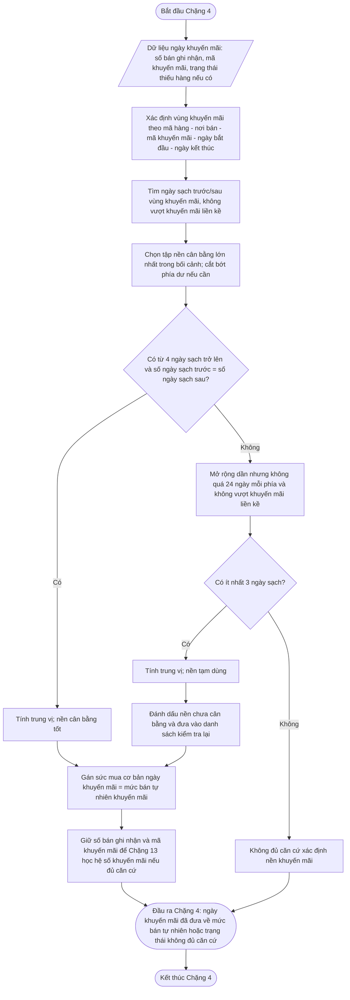

### 📐 12. Quy tắc đối chiếu bản ghi giải thích

bản ghi giải thích Chặng 4 phải giúp người vận hành biết hệ thống lấy nền khuyến mãi từ đâu và nền đó đã cân bằng hay chưa.

| Trường bản ghi giải thích                                    | Ý nghĩa                                                                                             |
| ------------------------------------------------- | ------------------------------------------------------------------------------------------------------- |
| mã hàng                                             | Mã hàng đang xử lý.                                                                              |
| Nơi bán                                       | Cửa hàng/kênh đang xử lý.                                                                       |
| Mã khuyến mãi                                        | Chương trình làm phát sinh vùng khuyến mãi.                                                           |
| Mã cụm khuyến mãi nếu có                          | Dùng khi nhiều khuyến mãi sát nhau phải xử lý chung một vùng nền.                                  |
| Ngày bắt đầu khuyến mãi                           | Mốc bắt đầu vùng khuyến mãi.                                                                           |
| Ngày kết thúc khuyến mãi                           | Mốc kết thúc vùng khuyến mãi.                                                                           |
| Ngày bắt đầu cụm khuyến mãi nếu có             | Mốc bắt đầu vùng méo khi nhiều khuyến mãi sát nhau.                                                 |
| Ngày kết thúc cụm khuyến mãi nếu có             | Mốc kết thúc vùng méo khi nhiều khuyến mãi sát nhau.                                                 |
| Ngày khuyến mãi được đưa về nền               | Ngày đã được gán mức bán tự nhiên.                                                         |
| Danh sách ngày tham chiếu sạch trước khuyến mãi | Các ngày thật phía trước được dùng tính trung vị.                                         |
| Danh sách ngày tham chiếu sạch sau khuyến mãi     | Các ngày thật phía sau được dùng tính trung vị.                                             |
| Số ngày sạch phía trước                   | Dùng để kiểm tra mức cân bằng.                                                                 |
| Số ngày sạch phía sau                       | Dùng để kiểm tra mức cân bằng.                                                                 |
| khuyến mãi liền kề phía trước nếu có           | Ranh giới không được vượt khi tìm nguồn trước khuyến mãi.                                        |
| khuyến mãi liền kề phía sau nếu có               | Ranh giới không được vượt khi tìm nguồn sau khuyến mãi.                                            |
| Có dùng ngày ngoài khung phiên không      | Cho biết nguồn tham chiếu có lấy từ vùng đệm ngoài khung lịch ngày cố định hay không. |
| Lý do chọn số ngày trước/sau              | Ví dụ: chọn 4 trước + 4 sau vì phía sau chỉ có 4 ngày trước khuyến mãi kế tiếp.               |
| Loại chưa cân bằng                          | `TẠM · KIỂM TRA` hoặc `KHÔNG CÂN BẰNG CỐ ĐỊNH`.                                             |
| Lý do không kiểm tra lại nếu có           | Ví dụ: cận dưới lịch sử đã đóng, cụm khuyến mãi sát nhau, chỉ có nguồn một phía hợp lệ. |
| Danh sách ngày bị loại                      | Ngày khuyến mãi, thiếu hàng, lấp nền hoặc thiếu dữ liệu.                                               |
| Lý do loại                                    | Giải thích vì sao ngày đó không được làm tham chiếu.                                      |
| Mức bán tự nhiên khuyến mãi                       | Kết quả trung vị.                                                                                  |
| Trạng thái độ tin cậy nền                 | Nền cân bằng tốt, nền tạm dùng hoặc không đủ căn cứ.                                     |
| Dấu hiệu cần kiểm tra lại                  | Có hoặc không.                                                                                     |

### 📦 13. Đầu ra bàn giao

| Đầu ra                                                | Ý nghĩa                                                             | Chặng sau dùng               |
| --------------------------------------------------------- | ----------------------------------------------------------------------- | -------------------------------- |
| Sức mua cơ bản cấp ngày cho ngày khuyến mãi             | Mức bán tự nhiên đã ước tính.                                | Chặng 5 và Chặng 6          |
| Trạng thái khuyến mãi đã xử lý                          | Cho biết ngày khuyến mãi đã được đưa về nền hay chưa.           | Chặng 6, Chặng 13, Chặng 20 |
| Mức bán tự nhiên khuyến mãi                               | Giá trị nền dùng thay cho số bán khuyến mãi thô.                     | Chặng 5, Chặng 6, Chặng 20            |
| Danh sách ngày tham chiếu sạch                      | Căn cứ tính nền khuyến mãi.                                             | Chặng 20                      |
| Trạng thái độ tin cậy nền                         | Nền cân bằng tốt, nền tạm dùng hoặc không đủ căn cứ.     | Chặng 5, Chặng 6, Chặng 20            |
| Danh sách điểm được bù nền chưa cân bằng     | Các ngày/vùng khuyến mãi đã dùng nền tạm và cần kiểm tra lại.   | Chặng 20                      |
| Dấu hiệu cần kiểm tra lại                          | Cho biết nền chưa cân bằng và cần xét lại ở lần chạy sau. | Chặng 20                      |
| Trạng thái không đủ căn cứ xác định nền khuyến mãi | Không đủ tối thiểu 3 ngày sạch.                                | Chặng 6, Chặng 19, Chặng 20 |
| Số bán ghi nhận trong ngày khuyến mãi                     | Dữ liệu gốc để đối chiếu khuyến mãi.                                 | Chặng 13, Chặng 20           |
| Mã/vùng khuyến mãi nếu có                                 | Dữ liệu gốc để nhóm và tính hệ số khuyến mãi.                       | Chặng 13                      |

Sau Chặng 4, mọi ngày khuyến mãi có đủ căn cứ sẽ có **sức mua cơ bản cấp ngày**. Chặng 6 chỉ được gom chu kỳ bằng cột sức mua cơ bản này, không được cộng trực tiếp số bán khuyến mãi thô vào chuỗi nền.

---


## Chặng 5 — Xử lý các ngày còn thiếu mức bán nền

> **Mục đích của chặng này:** xử lý riêng những ngày chưa có mức bán nền đủ dùng. Chặng này không cộng chu kỳ và không xếp nhóm mã hàng.

> **PHA 1 · Làm sạch dữ liệu và tạo sức mua cơ bản**

### 1. Vấn đề cần giải quyết

Sau khi xử lý thiếu hàng và khuyến mãi, một số ngày vẫn chưa có mức bán nền. Nguyên nhân có thể là dữ liệu thật sự bị thiếu, ngày thiếu hàng chưa đủ căn cứ để ước lượng, hoặc ngày khuyến mãi chưa tìm được mức bán tự nhiên phù hợp.

Chặng này phải phân biệt rõ hai tình huống:

| Tình huống | Cách hiểu | Có bổ sung giá trị không? |
| --- | --- | ---: |
| Có hàng, cửa hàng hoạt động nhưng không bán được sản phẩm | Đây là ngày bán bằng 0 thật | Không |
| Dữ liệu bán hoặc dữ liệu tồn thật sự bị thiếu | Chưa biết mức bán thật của ngày đó | Có thể xem xét |

Điểm quan trọng: **không bán được sản phẩm không đồng nghĩa với thiếu dữ liệu**. Ngày bán bằng 0 thật phải được giữ nguyên bằng 0.

### 2. Mục tiêu

Chặng 5 trả lời ba câu hỏi:

1. Ngày nào thật sự còn thiếu mức bán nền?
2. Có đủ ngày bình thường để ước lượng cho ngày thiếu hay không?
3. Sau khi xử lý, ngày đó được dùng, cần theo dõi thêm hay vẫn chưa đủ căn cứ?

### 3. Điều kiện để bắt đầu

Chặng 5 chỉ bắt đầu khi đã có:

- lịch ngày liên tục của từng mã hàng và nơi bán;
- số bán ghi nhận trong ngày;
- kết quả xác định thiếu hàng từ Chặng 2 và Chặng 3;
- kết quả xử lý khuyến mãi từ Chặng 4;
- thông tin cho biết dữ liệu của ngày đó đã được lấy đầy đủ hay chưa.

### 4. Những ngày được xem xét bổ sung

| Loại ngày | Cách xử lý |
| --- | --- |
| Ngày thật sự thiếu dữ liệu bán hoặc tồn | Được xem xét bổ sung nếu chu kỳ vẫn còn một phần dữ liệu thật |
| Ngày thiếu hàng chưa tìm được mức bán nền | Được xem xét bổ sung nếu có đủ ngày bình thường để tham khảo |
| Ngày khuyến mãi chưa tìm được mức bán tự nhiên | Được xem xét bổ sung nếu có đủ ngày bình thường để tham khảo |
| Ngày bán bằng 0 thật | Giữ nguyên 0, không bổ sung |
| Ngày nằm ngoài thời gian kinh doanh của mã hàng | Không bổ sung |
| Chu kỳ không có ngày dữ liệu nào | Không bổ sung toàn bộ 15 ngày |
| Ngày tồn kho bất thường chưa được giải thích | Không tự động bổ sung |

### 5. Ngày nào được dùng để tham khảo

Một ngày chỉ được dùng làm ngày tham khảo khi đồng thời đáp ứng các điều kiện sau:

- cùng mã hàng;
- cùng nơi bán;
- không thuộc khuyến mãi;
- không thiếu hàng;
- dữ liệu đã được lấy đầy đủ;
- không phải ngày đã được ước lượng ở Chặng 3, Chặng 4 hoặc Chặng 5;
- có mức bán nền hợp lệ và không âm.

Ngày đã được ước lượng chỉ dùng cho chính ngày đó. Không dùng một giá trị ước lượng để tiếp tục tạo ra giá trị ước lượng cho ngày khác.

### 6. Cách tìm ngày tham khảo

Chặng 5 tìm theo thứ tự:

1. Tìm trong 7 ngày trước và 7 ngày sau ngày thiếu.
2. Nếu chưa đủ, mở rộng dần nhưng không quá 24 ngày mỗi phía.
3. Ưu tiên số ngày trước và sau bằng nhau.
4. Lấy tối đa 14 ngày tham khảo gần nhất.
5. Cần ít nhất 3 ngày bình thường mới được tính.

Nếu có đủ ngày ở hai phía, chọn số ngày bằng nhau lớn nhất và ưu tiên các ngày gần nhất. Ví dụ, nếu có 5 ngày trước và 3 ngày sau, chỉ lấy 3 ngày trước gần nhất và 3 ngày sau.

### 7. Cách tính giá trị bổ sung

Mức bán dùng để bổ sung là trung vị của các ngày tham khảo.

$$
\text{Mức bán bổ sung}
= \operatorname{Median}(\text{mức bán nền của các ngày tham khảo})
$$

Nếu ngày đó đã có số bán ghi nhận nhưng thấp vì thiếu hàng, mức bán nền không được thấp hơn số bán đã ghi nhận:

$$
\text{Mức bán nền sau xử lý}
= \max(\text{số bán ghi nhận},\ \text{mức bán bổ sung})
$$

### 8. Mức tin cậy

| Kết quả | Cách hiểu |
| --- | --- |
| Đủ ngày trước và sau, số lượng hai phía bằng nhau | Tin cậy tốt |
| Có ít nhất 3 ngày nhưng lệch một phía | Có thể dùng, cần ghi rõ giới hạn |
| Có dưới 3 ngày bình thường | Chưa đủ căn cứ |
| Phần lớn giá trị tham khảo cũng là giá trị đã ước lượng | Không được dùng |

### 9. Quy tắc không được vi phạm

- Không biến ngày bán bằng 0 thật thành ngày có số bán dương.
- Không bổ sung toàn bộ một chu kỳ trống 15 ngày.
- Không dùng ngày khuyến mãi, ngày thiếu hàng hoặc ngày đã được ước lượng làm ngày bình thường để tham khảo.
- Không xóa số bán gốc. Luôn giữ riêng số bán ghi nhận và mức bán nền sau xử lý.
- Không làm lại phần xử lý thiếu hàng hoặc khuyến mãi đã hoàn thành ở Chặng 3 và Chặng 4.

### 10. Ví dụ

Một chu kỳ có 12 ngày đã có mức bán nền và 3 ngày thật sự thiếu dữ liệu. Chặng 5 tìm được 4 ngày bình thường trước và 4 ngày bình thường sau. Mức bán của 8 ngày này là:

> 5, 6, 6, 7, 5, 6, 7, 8

Trung vị bằng 6. Ba ngày thiếu được bổ sung bằng 6, nhưng vẫn được ghi rõ là giá trị ước lượng. Ba ngày này không được dùng để ước lượng cho ngày khác.

### 11. Kết quả bàn giao

Chặng 5 bàn giao:

- mức bán nền của từng ngày sau khi xử lý;
- ngày nào là số bán thật;
- ngày nào được điều chỉnh vì thiếu hàng;
- ngày nào được đưa về mức bán tự nhiên do khuyến mãi;
- ngày nào được bổ sung vì thiếu dữ liệu;
- ngày nào vẫn chưa đủ căn cứ;
- mức tin cậy và các ngày đã dùng để tham khảo.

Chặng 5 chỉ hoàn thiện dữ liệu ở cấp ngày. Việc cộng thành chu kỳ 15 ngày thuộc Chặng 6.

---

## Chặng 6 — Gom dữ liệu ngày thành chu kỳ 15 ngày và kiểm tra độ đầy đủ

> **Mục đích của chặng này:** cộng các ngày đã xử lý thành chu kỳ 15 ngày. Chặng này không tạo thêm giá trị cho ngày thiếu.

> **PHA 1 · Làm sạch dữ liệu và tạo sức mua cơ bản**

### 1. Vấn đề cần giải quyết

Các bước trước xử lý dữ liệu ở cấp ngày. Các bước phân loại và dự báo cần một chuỗi theo chu kỳ 15 ngày. Vì vậy, Chặng 6 phải cộng đúng 15 ngày lịch vào một chu kỳ và giữ nguyên nguồn gốc của từng ngày.

Chặng 6 không được bỏ một chu kỳ chưa đủ rồi nối hai chu kỳ còn lại với nhau. Làm như vậy sẽ làm sai thứ tự thời gian, mùa vụ và khoảng cách giữa các lần phát sinh nhu cầu.

### 2. Điều kiện để một chu kỳ được sử dụng

Một chu kỳ chỉ được xem là đầy đủ khi:

- có đúng 15 ngày lịch;
- cả 15 ngày đều có mức bán nền đã xác định;
- không còn ngày chưa đủ căn cứ;
- không có giá trị âm;
- các ngày bán bằng 0 đã được xác nhận là số 0 thật;
- ngày được bổ sung vì thiếu dữ liệu đã ghi rõ nguồn và mức tin cậy.

### 3. Cách cộng chu kỳ

$$
\text{Sức mua cơ bản của chu kỳ}
= \sum_{d=1}^{15}\text{mức bán nền của ngày }d
$$

Chỉ cộng cột mức bán nền sau xử lý. Không cộng trực tiếp số bán khuyến mãi ban đầu và không cộng lại lượng bán gốc nếu ngày đó đã được điều chỉnh.

### 4. Thông tin phải giữ lại trong mỗi chu kỳ

Ngoài tổng sức mua cơ bản, mỗi chu kỳ phải ghi:

- số ngày bán bình thường;
- số ngày bán bằng 0 thật;
- số ngày được điều chỉnh do thiếu hàng;
- số ngày khuyến mãi đã được đưa về mức bán tự nhiên;
- số ngày được bổ sung vì thiếu dữ liệu;
- số ngày có mức tin cậy thấp;
- số ngày vẫn chưa đủ căn cứ;
- tổng số bán ghi nhận ban đầu để đối chiếu;
- danh sách khuyến mãi đã xuất hiện trong chu kỳ.

### 5. Cách xử lý từng loại chu kỳ

| Tình trạng chu kỳ | Cách xử lý |
| --- | --- |
| Đủ 15 ngày và không còn ngày chưa rõ | Được dùng bình thường |
| Đủ 15 ngày nhưng có nhiều ngày ước lượng | Được dùng nhưng phải cảnh báo mức tin cậy |
| Còn ít nhất 1 ngày chưa đủ căn cứ | Chưa được dùng để học tự động |
| Không có ngày dữ liệu nào | Giữ là chu kỳ trống, không tạo nhu cầu giả |
| Có ngày âm hoặc tồn kho bất thường chưa giải thích | Chuyển sang xem xét |

### 6. Điều kiện sử dụng theo từng mục đích

Không phải mọi mục đích đều cần cùng một mức chất lượng.

| Mục đích | Điều kiện tối thiểu |
| --- | --- |
| Xếp nhóm giá trị A/B/C | Chu kỳ đủ ngày và tổng giá trị tiêu thụ đáng tin cậy |
| Xếp nhóm đều, dao động hoặc bán thưa | Giữ nguyên các chu kỳ bằng 0 thật và không bỏ khoảng trống thời gian |
| Dự báo | Chuỗi phải đủ dài, không còn ngày chưa rõ và tỷ lệ ngày ước lượng nằm trong giới hạn cho phép |
| Học tác động khuyến mãi | Phải biết rõ ngày nào có khuyến mãi và mức bán tự nhiên của ngày đó đủ tin cậy |

### 7. Ví dụ

Một chu kỳ gồm:

- 8 ngày bán bình thường;
- 2 ngày được điều chỉnh do thiếu hàng;
- 2 ngày khuyến mãi đã đưa về mức bán tự nhiên;
- 2 ngày bán bằng 0 thật;
- 1 ngày được bổ sung vì thiếu dữ liệu.

Chu kỳ có đủ 15 ngày nên được cộng. Tuy nhiên, kết quả phải ghi rõ có 1 ngày được bổ sung. Nếu tỷ lệ ngày ước lượng vượt giới hạn của doanh nghiệp, chu kỳ chỉ được dùng khi có người xem xét.

### 8. Kết quả bàn giao

Chặng 6 bàn giao:

- sức mua cơ bản của từng chu kỳ 15 ngày;
- số ngày thuộc từng loại trong chu kỳ;
- mức tin cậy của chu kỳ;
- chu kỳ được dùng cho xếp nhóm A/B/C;
- chu kỳ được dùng cho xếp nhóm đều, dao động hoặc bán thưa;
- chu kỳ được dùng cho dự báo;
- danh sách chu kỳ chưa đủ căn cứ.

Từ Chặng 6 trở đi, các bước sau chỉ dùng chuỗi sức mua cơ bản theo chu kỳ đã được chốt. Số bán gốc vẫn được giữ riêng để đối chiếu và đánh giá tác động khuyến mãi.


## Chặng 7 — Xếp nhóm A/B/C theo giá trị tiêu thụ

> **QUY TẮC BỔ SUNG BẢN 26**
>
> ABC chính thức chỉ được chốt khi chạy toàn danh mục hoặc dùng bộ dữ liệu được dùng tại thời điểm đó ABC đã duyệt. Dữ liệu ABC phải là một đoạn chu kỳ chốt liên tiếp; không được đếm các chu kỳ rải rác ở hai phía của khoảng chưa xử lý xong rồi năm hóa như một chuỗi đầy đủ.


> **PHA 2 · Phân loại và gán chính sách**

### 🎯 1. Mục tiêu của Chặng 7

Chặng 7 dùng để phân loại mã hàng theo **mức độ quan trọng về tài chính**.

Sau Chặng 6, hệ thống đã có **sức mua cơ bản theo chu kỳ 15 ngày**. Chặng 7 dùng chuỗi sức mua cơ bản này để xác định mã hàng nào tạo ra phần giá trị lớn nhất, từ đó chia danh mục thành nhóm **A/B/C**.

Chặng này chưa quyết định đặt bao nhiêu hàng, chưa tính tồn kho an toàn và chưa phân bổ ngân sách. Chặng này chỉ tạo **lớp ưu tiên tài chính** để các chặng sau quản trị khác nhau theo mức độ quan trọng của từng mã hàng.

### 2. Tiêu chí tài chính có thể dùng

Có nhiều cách phân loại ABC theo góc nhìn tài chính:

| Tiêu chí                 | Cách hiểu                                                                                                   | Khi nào phù hợp                                                                          |
| ---------------------------- | --------------------------------------------------------------------------------------------------------------- | --------------------------------------------------------------------------------------------- |
| Giá trị tiêu thụ       | Đánh giá theo tổng giá trị bán/tiêu thụ mà mã hàng tạo ra trong kỳ.                             | Phù hợp để bắt đầu vì dễ hiểu, dễ kiểm tra và phản ánh quy mô bán hàng.   |
| Biên lợi nhuận gộp     | Đánh giá theo tổng lợi nhuận thực tế mã hàng mang lại.                                             | Phù hợp khi Hachi muốn ưu tiên mã hàng tạo lợi nhuận tốt, không chỉ doanh thu. |
| Giá trị vốn lưu động | Đánh giá theo lượng vốn bị giữ trong tồn kho, thường tính từ tồn kho bình quân và giá vốn. | Phù hợp khi mục tiêu chính là kiểm soát vốn tồn và chi phí lưu kho.            |

Để Chặng 7 vận hành đúng mục tiêu quản trị tài chính, hệ thống yêu cầu một **tiêu chí tài chính chính thức** được thiết lập và có phiên bản chính sách. Trong phạm vi thiết kế chuẩn của tài liệu này, tiêu chí tài chính dùng để xếp ABC là:

> **Giá trị tiêu thụ**

Các tiêu chí còn lại chỉ được dùng khi doanh nghiệp phát hành phiên bản chính sách mới và xác định rõ công thức, nguồn dữ liệu, phạm vi áp dụng và thời điểm hiệu lực. Không được thay đổi tiêu chí ABC âm thầm trong cùng một phiên lập kế hoạch.

### 3. Cách tính giá trị tiêu thụ

Giá trị tiêu thụ của một mã hàng được hiểu là tổng giá trị mà mã hàng đó tạo ra trong kỳ đánh giá sau khi đã đưa các mã hàng đủ điều kiện về cùng thang đo năm.

$$
\text{Giá trị tiêu thụ năm hóa}
= \text{Sản lượng tiêu thụ năm hóa}\times\text{Giá trị đơn vị}

$$

Trong đó:

| Thành phần                      | Cách hiểu                                                                                                                                                                                                     |
| ----------------------------------- | ----------------------------------------------------------------------------------------------------------------------------------------------------------------------------------------------------------------- |
| Sản lượng tiêu thụ trong kỳ | Tổng sức mua cơ bản của mã hàng trong các chu kỳ đã chốt, lấy từ Chặng 6.                                                                                                                        |
| Sản lượng tiêu thụ năm hóa | Sản lượng sau khi chuẩn hóa về 24 chu kỳ nếu mã hàng có từ 6 đến dưới 24 chu kỳ đã chốt.                                                                                                    |
| Giá trị đơn vị               | Đơn giá chuẩn dùng để quy đổi sản lượng thành tiền. Nếu giá thay đổi theo thời gian thì dùng đơn giá phù hợp với kỳ đánh giá; không dùng giá khuyến mãi để xếp ABC nền. |
| Giá trị tiêu thụ năm hóa    | Giá trị dùng để xếp hạng ABC.                                                                                                                                                                            |

Điểm cần chốt:

- Chặng 7 dùng **sức mua cơ bản sau làm sạch**, không dùng trực tiếp số bán thô trong ngày khuyến mãi, ngày thiếu hàng hoặc ngày chưa đủ căn cứ.
- Đơn giá dùng trong ABC là **đơn giá chuẩn của kỳ đánh giá**, không phải giá khuyến mãi. Nếu một mã hàng có nhiều mức giá theo thời gian, Hachi cần thiết lập cách chọn giá: giá tại thời điểm đánh giá, giá bình quân chuẩn theo kỳ hoặc giá chuẩn đã được phê duyệt.
- Không sắp xếp phá vỡ bảng dữ liệu gốc nếu bảng gốc đã có số thứ tự hoặc cần giữ lịch sử đối chiếu. Khi cần sắp xếp giảm dần theo giá trị, nên tạo bảng ABC riêng hoặc thêm cột thứ tự xếp hạng.

### 4. Kỳ dữ liệu dùng để phân loại

Vì ABC trong chặng này đang dùng tiêu chí **giá trị tiêu thụ hàng năm**, kỳ đánh giá mặc định là:

> **24 chu kỳ 15 ngày gần nhất**, tương đương khoảng **360 ngày**.

| Trường hợp dữ liệu                      | Cách xử lý                                                                                                                                                  |
| ---------------------------------------------- | ---------------------------------------------------------------------------------------------------------------------------------------------------------------- |
| Có đủ 24 chu kỳ chốt **liên tiếp** | Dùng tổng sức mua cơ bản của đúng 24 vị trí chu kỳ. |
| Có từ 6 đến dưới 24 chu kỳ chốt **liên tiếp** | Chuẩn hóa lên thang 24 chu kỳ và ghi trạng thái lịch sử ngắn. |
| Có đủ số chu kỳ chốt nhưng nằm rải rác | Không năm hóa; `Chưa đủ dữ liệu để xếp A/B/C` vì khoảng thời gian bị mất có thể làm thấp sai giá trị. |
| Dưới 6 chu kỳ chốt liên tiếp | Không xếp ABC tự động; xử lý nguyên nhân dữ liệu hoặc chính sách mã hàng mới tùy bằng chứng. |

Mốc 6 chu kỳ là ngưỡng tối thiểu để có tín hiệu ban đầu. Ngưỡng này có thể được Hachi điều chỉnh theo thực tế vận hành.

#### 📐 4.1. Quy tắc chuẩn hóa về năm khi chưa đủ 24 chu kỳ

Mục tiêu của chuẩn hóa năm là bảo đảm các mã hàng được so sánh trên cùng một thang đo **24 chu kỳ 15 ngày**. Có thể hiểu đơn giản như sau: nếu một nhân viên mới chỉ làm 4 tháng thì không lấy lương 4 tháng đó so trực tiếp với người đã làm đủ 12 tháng. Cần quy đổi phần đã có lên cùng một thang năm trước khi so sánh.

Trong Chặng 7, "năm hóa" không có nghĩa là dự báo chắc chắn mã hàng sẽ bán đúng như vậy trong tương lai. Đây chỉ là phép **quy đổi công bằng để xếp ABC**.

Với mỗi mã hàng đủ điều kiện xếp ABC tự động, hệ thống xác định:

$$
N=\text{Số chu kỳ đã chốt trong cửa sổ đánh giá}

$$

Điểm cần hiểu rõ:

- $N$ là **số chu kỳ đã chốt liên tiếp được đưa vào ABC**, không phải số ngày bán. chu kỳ rải rác không được cộng vào $N$.
- $N$ cũng không phải số chu kỳ có bán lớn hơn 0. Một chu kỳ đã chốt có sức mua bằng 0 vẫn là một chu kỳ hợp lệ nếu dữ liệu đã đủ căn cứ.
- Tổng sức mua cơ bản của $N$ chu kỳ là tổng sức mua đã làm sạch từ các chặng trước.

$$
\text{Hệ số quy đổi về 24 chu kỳ}=
\begin{cases}
1, & N \ge 24 \\
\frac{24}{N}, & 6 \le N < 24 \\
\text{Không xếp tự động}, & N < 6
\end{cases}

$$

$$
\text{Sản lượng tiêu thụ năm hóa}
=\text{Tổng sức mua cơ bản của }N\text{ chu kỳ đã chốt}
\times\text{Hệ số quy đổi về 24 chu kỳ}

$$

$$
\text{Giá trị tiêu thụ năm hóa}
=\text{Sản lượng tiêu thụ năm hóa}\times\text{Đơn giá chuẩn}

$$

| Trường hợp    | $N$ | Tổng sức mua cơ bản trong $N$ chu kỳ | Hệ số quy đổi | Sản lượng tiêu thụ năm hóa | Trạng thái dữ liệu ABC                  |
| ------------------ | -----: | -----------------------------------------------: | ----------------: | --------------------------------: | --------------------------------------------- |
| Đủ 24 chu kỳ  |    24 |                                          1.200 |                 1 |                             1.200 | Đủ năm                                   |
| Có 12 chu kỳ   |    12 |                                            600 |           24 / 12 |                             1.200 | Tạm xếp hạng, chưa đủ năm đầy đủ |
| Có 8 chu kỳ    |     8 |                                            320 |             24 / 8 |                               960 | Tạm xếp hạng, chưa đủ năm đầy đủ |
| Dưới 6 chu kỳ |     5 |                                            250 | Không áp dụng | Không xếp tự động            | Không xếp tự động                      |

Cách đọc ví dụ:

- Mã có 12 chu kỳ và tổng sức mua 600 nghĩa là bình quân 50 sản phẩm/chu kỳ. Khi đưa về 24 chu kỳ: 50 x 24 = 1.200.
- Mã có 8 chu kỳ và tổng sức mua 320 nghĩa là bình quân 40 sản phẩm/chu kỳ. Khi đưa về 24 chu kỳ: 40 x 24 = 960.
- Vì vậy công thức triển khai có thể viết ngắn hơn là:

$$
\text{Sản lượng tiêu thụ năm hóa}
=\frac{\text{Tổng sức mua cơ bản của }N\text{ chu kỳ}}{N}\times 24

$$

Công thức này tương đương với:

$$
\text{Tổng sức mua cơ bản của }N\text{ chu kỳ}\times\frac{24}{N}

$$

Điểm cần chốt:

- ABC dùng **giá trị tiêu thụ năm hóa** để xếp hạng, không dùng tổng bán thô của số chu kỳ đang có.
- mã hàng có từ 6 đến dưới 24 chu kỳ được xếp ABC tạm thời để phục vụ vận hành, nhưng phải mang ghi chú **chưa đủ năm đầy đủ**.
- Chuẩn hóa năm không có nghĩa là dự báo chính thức. Đây chỉ là bước đưa các mã hàng về cùng thang đo tài chính để phân loại ABC.
- Nếu mã hàng có tính mùa vụ mạnh nhưng chưa đủ một vòng năm, kết quả ABC tạm thời cần được Chặng 9 hoặc bước duyệt ngoại lệ xem lại trước khi chốt chính sách quan trọng.

### 5. Mục đích sử dụng kết quả ABC

Kết quả ABC giúp Hachi phân bổ mức độ kiểm soát theo tầm quan trọng của mã hàng.

| Mục đích                                         | Cách hiểu                                                                                                                                  |
| ----------------------------------------------------- | ---------------------------------------------------------------------------------------------------------------------------------------------- |
| Tập trung nguồn lực vào nhóm quan trọng nhất | Nhóm A cần được kiểm soát chặt hơn vì tạo phần lớn giá trị tiêu thụ.                                                        |
| Cải thiện quản lý tồn kho                      | Tránh chia đều nguồn lực cho mọi mã hàng, giúp giảm thiếu hàng ở nhóm quan trọng và giảm tồn dư ở nhóm ít quan trọng. |
| Hỗ trợ quyết định mua hàng                    | ABC là một lớp đầu vào để các chặng sau gán chính sách, tính tồn an toàn, ưu tiên ngân sách và duyệt ngoại lệ.       |
| Hỗ trợ dịch vụ khách hàng                     | Mã hàng quan trọng có thể cần mức sẵn hàng cao hơn nếu phù hợp với chính sách vận hành.                                    |

### 📐 6. Quy trình phân tích ABC 8 bước

Quy trình ABC trong Chặng 7 được chuẩn hóa theo hướng: **tính giá trị trước, sắp xếp theo giá trị, tính lũy kế, sau đó chọn điểm cắt theo thứ tự A → C → B**.

| Bước | Hành động                                                         | Ghi chú thực hiện                                                                                                                                             |
| -------: | ---------------------------------------------------------------------- | ------------------------------------------------------------------------------------------------------------------------------------------------------------------ |
|      1 | Liệt kê danh sách mã hàng cần xếp ABC.                        | Danh sách lấy từ các mã hàng đủ điều kiện sau Chặng 6. Mã dưới 6 chu kỳ đã chốt không xếp ABC tự động.                                   |
|      2 | Chuẩn bị cột số chu kỳ đã chốt, sản lượng và đơn giá. | Sản lượng là tổng sức mua cơ bản trong kỳ đánh giá. Đơn giá là giá chuẩn theo kỳ, không dùng giá khuyến mãi.                             |
|      3 | Chuẩn hóa sản lượng về năm và tính thành tiền.            | Nếu có 6-23 chu kỳ đã chốt thì sản lượng năm hóa = tổng sức mua x 24 / số chu kỳ đã chốt. Thành tiền = sản lượng năm hóa x đơn giá. |
|      4 | Tính tỷ trọng giá trị của từng mã hàng.                     | % Giá trị = Thành tiền năm hóa / Tổng thành tiền năm hóa. Khi làm Excel phải cố định ô tổng tiền bằng tham chiếu tuyệt đối.              |
|      5 | Sắp xếp dữ liệu theo giá trị giảm dần.                       | Sắp xếp theo % giá trị hoặc thành tiền từ lớn đến nhỏ. Nên làm trên bảng ABC riêng để không làm xáo trộn dữ liệu gốc.                  |
|      6 | Tính % giá trị lũy kế.                                          | Dòng đầu bằng % giá trị của chính nó; các dòng sau bằng % lũy kế dòng trước + % giá trị dòng hiện tại.                                     |
|      7 | Xác định nhóm A, C, B theo điểm cắt.                          | Chọn A trước, chọn C tiếp theo, phần còn lại là B. Không ép cứng theo tỷ lệ số lượng mã.                                                       |
|      8 | Kiểm tra logic và bàn giao kết quả.                             | Kiểm tra tổng số mã, tỷ trọng giá trị A > B > C và số lượng mã A < B < C nếu dữ liệu cho phép.                                                  |

### 7. Cách xác định điểm cắt ABC

Các ngưỡng 70-80%, 90-100%, 10-20% số lượng hoặc 60-80% số lượng là **khung kiểm tra tham khảo**. Hệ thống không được hiểu các tỷ lệ số lượng là điều kiện cứng, vì dữ liệu thực tế có thể lệch theo đặc thù danh mục, quy mô mã hàng, mùa vụ, giá bán và chiến lược hàng hóa.

Điểm cắt được xác định theo thứ tự ưu tiên sau:

#### 7.1. Bước 1 - Xác định điểm cắt nhóm A

Nhóm A là nhóm mã hàng quan trọng nhất, tạo phần lớn giá trị tiêu thụ.

| Tiêu chí                                      | Cách xử lý                                                                                                                  |
| ------------------------------------------------- | -------------------------------------------------------------------------------------------------------------------------------- |
| Mốc giá trị cần đạt                       | Chọn điểm cắt sao cho % giá trị lũy kế của nhóm A nằm quanh**70% - 80%** tổng giá trị.                           |
| Kiểm tra tỷ lệ số lượng                   | Sau khi chọn điểm cắt A, kiểm tra số lượng mã nhóm A có nằm quanh**10% - 20%** tổng số mã hay không.           |
| Nếu chưa đạt 70% giá trị                  | Có thể kéo điểm cắt A xuống thêm vài dòng, nhưng phải kiểm tra lại tỷ lệ số lượng và logic tổng thể.     |
| Nếu vượt 80% giá trị do một mã hàng quá lớn | Không tự ép giảm nếu việc tách mã hàng đó làm mất ý nghĩa tài chính. Ghi nhận ngoại lệ danh mục tập trung cao. |

Điểm cần chốt: nhóm A được xác định **theo giá trị lũy kế trước**, tỷ lệ số lượng chỉ dùng để kiểm tra tính hợp lý.

#### 7.2. Bước 2 - Xác định điểm cắt nhóm C

Sau khi có nhóm A, cần xác định nhóm C trước nhóm B.

Lý do: nếu gán B ngay sau A theo một mốc cứng, phần còn lại có thể làm tổng tỷ lệ và logic A/B/C bị lệch. Chọn C trước giúp bảo đảm nhóm C đúng là phần giá trị thấp nhất của danh mục.

| Tiêu chí                        | Cách xử lý                                                                                                                     |
| ----------------------------------- | ----------------------------------------------------------------------------------------------------------------------------------- |
| Mốc giá trị nhóm C            | Nhóm C thường chiếm khoảng**5% - 10%** giá trị tiền thấp nhất.                                                          |
| Cách tìm trên cột lũy kế    | Tìm vùng mà % giá trị lũy kế**đạt từ 90% trở lên**. Các mã từ điểm cắt này đến cuối danh sách là nhóm C. |
| Kiểm tra tỷ lệ số lượng     | Nhóm C thường chiếm tỷ lệ số lượng lớn nhất, có thể quanh**60% - 80%** tổng số mã tùy danh mục.                 |
| Nếu C quá ít hoặc quá nhiều | Dịch điểm cắt C lên hoặc xuống vài dòng, nhưng không làm mất logic giá trị thấp nhất.                            |

#### 7.3. Bước 3 - Xác định nhóm B

Nhóm B là toàn bộ các mã hàng còn lại nằm giữa nhóm A và nhóm C.

| Tiêu chí         | Cách xử lý                                                                                  |
| -------------------- | ------------------------------------------------------------------------------------------------ |
| Vị trí           | Sau điểm cắt A và trước điểm cắt C.                                                   |
| Vai trò           | Nhóm trung gian, không quan trọng bằng A nhưng không thấp như C.                       |
| Tỷ lệ tham khảo | Thường khoảng**15% - 25%** về số lượng hoặc giá trị, nhưng không bắt buộc cứng. |
| Kiểm tra logic    | Sau khi xác định B, kiểm tra lại A/B/C bằng các điều kiện ở mục 8.                 |

### 🚦 8. Điều kiện kiểm tra sau khi phân nhóm

Sau khi gán A/B/C, hệ thống phải kiểm tra logic trước khi bàn giao ghi chú ABC cho các chặng sau.

| Nhóm kiểm tra      | Điều kiện cần kiểm tra                                                                               | Cách xử lý nếu không đạt                                                                                                                                   |
| ---------------------- | ----------------------------------------------------------------------------------------------------------- | ------------------------------------------------------------------------------------------------------------------------------------------------------------------- |
| Tổng số mã        | Số mã A + số mã B + số mã C phải bằng tổng số mã ban đầu được đưa vào phân tích ABC. | Nếu lệch, kiểm tra lại điểm cắt hoặc dòng bị lọc/sắp xếp sai.                                                                                        |
| Tỷ trọng giá trị | Tổng % giá trị năm hóa của nhóm A > nhóm B > nhóm C.                                             | Nếu không đạt, điểm cắt chưa hợp lý hoặc dữ liệu có ngoại lệ cần ghi chú.                                                                       |
| Tỷ lệ số lượng  | Về logic thường kỳ vọng số lượng mã A < B < C.                                                   | Nếu không đạt, dịch điểm cắt lên/xuống vài dòng nếu hợp lý; nếu danh mục quá ít mã hàng hoặc quá tập trung giá trị thì ghi nhận ngoại lệ. |
| Ngưỡng nhóm A     | Nhóm A nên nằm quanh 70% - 80% giá trị và khoảng 10% - 20% số lượng mã.                        | Nếu không đạt, ưu tiên giữ logic giá trị; tỷ lệ số lượng là tham khảo.                                                                            |
| Ngưỡng nhóm C     | Nhóm C nên là phần giá trị thấp nhất, khoảng 5% - 10% giá trị còn lại.                       | Nếu không đạt, điều chỉnh điểm cắt C trước khi xác định B.                                                                                         |

Điểm cần phân biệt:

| Loại tỷ lệ                                                    | Vai trò đúng trong Chặng 7                                                                         |
| ------------------------------------------------------------------ | -------------------------------------------------------------------------------------------------------- |
| Tỷ trọng giá trị năm hóa và tỷ trọng giá trị lũy kế | Là căn cứ chính để xếp ABC.                                                                     |
| Tỷ lệ số lượng mã hàng                                    | Là điều kiện kiểm tra và giải thích kết quả, không phải điều kiện cứng để ép nhóm. |
| Tỷ lệ 20%/30%/50%                                              | Chỉ là mô tả Pareto tham khảo; không dùng để bắt hệ thống chia đúng số lượng mã.     |

Nếu dữ liệu thực tế không thể thỏa đồng thời tất cả ngưỡng tham khảo, Chặng 7 ưu tiên thứ tự:

1. Không làm sai tổng số mã.
2. Giữ đúng thứ tự giá trị A > B > C.
3. Giữ đúng bản chất A là nhóm giá trị cao nhất, C là nhóm giá trị thấp nhất.
4. Sau cùng mới kiểm tra tỷ lệ số lượng A < B < C và các khoảng 10-20%, 15-25%, 60-80%.

### 💡 9. Ví dụ minh họa

Giả sử có 5 mã hàng:

| Mã hàng | Số chu kỳ đã chốt | Tổng sản lượng trong kỳ | Sản lượng năm hóa | Giá trị đơn vị | Giá trị tiêu thụ năm hóa |
| ----------- | -----------------------: | -----------------------------: | -----------------------: | --------------------: | -------------------------------: |
| A001      |                     24 |                          100 |                    100 |              50.000 |                      5.000.000 |
| B001      |                     24 |                           30 |                     30 |             200.000 |                      6.000.000 |
| C001      |                     12 |                           35 |                     70 |              20.000 |                      1.400.000 |
| D001      |                      8 |                           16 |                     48 |              25.000 |                      1.200.000 |
| E001      |                     24 |                           40 |                     40 |              10.000 |                        400.000 |

Trong ví dụ này, C001 và D001 chưa đủ 24 chu kỳ nên phải chuẩn hóa về năm trước khi tính giá trị. Sau khi tính giá trị tiêu thụ năm hóa, hệ thống sắp xếp giảm dần:

| Thứ tự | Mã hàng | Giá trị tiêu thụ năm hóa | Tỷ trọng giá trị | Tỷ trọng lũy kế | Nhóm |
| ---------: | ----------- | -------------------------------: | ---------------------: | --------------------: | ------- |
|        1 | B001      |                      6.000.000 |               42,86% |              42,86% | A     |
|        2 | A001      |                      5.000.000 |               35,71% |              78,57% | A     |
|        3 | C001      |                      1.400.000 |               10,00% |              88,57% | B     |
|        4 | D001      |                      1.200.000 |                8,57% |              97,14% | C     |
|        5 | E001      |                        400.000 |                2,86% |             100,00% | C     |

Cách hiểu:

| Nhóm | Mã hàng  | Ý nghĩa                                                         |
| ------- | ------------ | ------------------------------------------------------------------- |
| A     | B001, A001 | Tạo phần lớn giá trị tiêu thụ, cần ưu tiên kiểm soát. |
| B     | C001       | Nhóm trung gian.                                                 |
| C     | D001, E001 | Nhóm giá trị thấp hơn.                                       |

### 10. Chính sách vận hành sau khi có ABC

Chặng 7 không tự đặt chính sách tồn kho, nhưng kết quả ABC là căn cứ để Chặng 9 và các chặng sau dùng.

| Nhóm | Hướng quản trị                                                                                                          |
| ------- | ----------------------------------------------------------------------------------------------------------------------------- |
| A     | Theo dõi sát hơn, ưu tiên kiểm soát thiếu hàng, ưu tiên ngân sách khi có giới hạn, rà ngoại lệ kỹ hơn. |
| B     | Quản trị theo chính sách chuẩn, theo dõi định kỳ.                                                                  |
| C     | Kiểm soát vốn, tồn dư, số lượng mua tối thiểu và tránh đặt hàng quá mức.                                   |

Chính sách cụ thể không chốt tại Chặng 7. Chặng 9 sẽ kết hợp ABC với XYZ/D và vai trò danh mục để gán chính sách vận hành cuối cùng.

### 🔀 11. Sơ đồ các bước

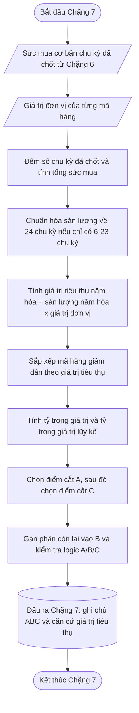

### 📦 12. Đầu ra bàn giao

| Đầu ra                                  | Ý nghĩa                                                                                             | Chặng sau dùng         |
| ------------------------------------------- | ------------------------------------------------------------------------------------------------------- | -------------------------- |
| Nhóm ABC của mã hàng                  | Ghi chú A, B hoặc C theo giá trị tiêu thụ năm hóa.                                               | Chặng 10, 12, 16, 18, 20 |
| Số chu kỳ đã chốt dùng cho ABC      | Cho biết mã hàng được tính từ đủ 24 chu kỳ hay được năm hóa từ lịch sử ngắn hơn. | Chặng 10, 20             |
| Tổng sức mua cơ bản trong kỳ         | Tổng sản lượng trước khi chuẩn hóa năm.                                                      | Chặng 20                |
| Hệ số chuẩn hóa năm / hệ số quy đổi về 24 chu kỳ | Bằng 1 nếu đủ 24 chu kỳ; bằng 24 / N nếu có 6-23 chu kỳ.                                     | Chặng 20                |
| Sản lượng tiêu thụ năm hóa         | Sản lượng đã đưa về thang 24 chu kỳ để so sánh công bằng.                               | Chặng 10, 18, 20         |
| Giá trị tiêu thụ năm hóa            | Căn cứ tài chính dùng để xếp hạng.                                                           | Chặng 10, 18, 20         |
| Tỷ trọng giá trị                      | Tỷ lệ đóng góp của từng mã hàng trong tổng giá trị tiêu thụ năm hóa.                  | Chặng 20                |
| Tỷ trọng giá trị lũy kế             | Căn cứ gán nhóm A/B/C.                                                                            | Chặng 20                |
| Tỷ lệ số lượng mặt hàng theo nhóm | Dùng để kiểm tra tính hợp lý của điểm cắt; không phải điều kiện cứng để ép nhóm. | Chặng 20                |
| Trạng thái dữ liệu ABC                | Cho biết mã hàng đủ dữ liệu năm, tạm xếp hạng hay không xếp tự động.                  | Chặng 10, 20             |

Chặng 7 chỉ phân loại ABC theo giá trị tiêu thụ. Chặng này không dự báo, không tính tồn kho an toàn, không tính số đặt hàng và không tự thay đổi chính sách mua hàng.

---


## Chặng 8 — Xếp nhóm theo mức độ bán đều, dao động, bán thưa hoặc chưa đủ dữ liệu

> **QUY TẮC BỔ SUNG BẢN 26**
>
> Chặng 8 chỉ tính X/Y/Z trên cửa sổ chu kỳ liên tục và hợp lệ. mã hàng lâu năm có chu kỳ chưa xử lý xong, dữ liệu bị cắt hoặc khoảng trống trong cửa sổ phải có **chưa xếp được nhóm nhu cầu** và `Chưa thể xếp nhóm`, không gán D. D chỉ dành cho mã hàng mới hoặc lịch sử thật sự ngắn đã được xác minh. Kế hoạch bộ phận ngành hàng và mã hàng tương tự là chiến lược dự báo tương lai, không phải lý do phân loại D.


> **PHA 2 · Phân loại và gán chính sách**

### 🎯 1. Ngữ cảnh

Sau Chặng 7, hệ thống đã biết mã hàng nào tạo giá trị cao. Nhưng giá trị cao không có nghĩa là nhu cầu dễ dự báo.

Hai mã hàng có cùng mức bán bình quân 10 sản phẩm mỗi chu kỳ có thể có bản chất rất khác nhau:

| Chuỗi sức mua cơ bản theo chu kỳ | Mức bình quân | Cách hiểu                                                               |
| --------------------------------------- | -----------------: | --------------------------------------------------------------------------- |
| 9, 10, 11, 10, 9, 11                  |               10 | Chu kỳ nào cũng có nhu cầu, lượng bán gần nhau.                  |
| 0, 0, 30, 0, 0, 30                    |               10 | Lâu lâu mới phát sinh nhu cầu, mỗi lần phát sinh lại mua nhiều. |

Nếu chỉ nhìn mức bình quân, hai mã hàng này giống nhau. Nếu đặt hàng nhập khẩu theo cùng một cách, mã hàng bán thưa có thể bị hiểu sai thành bán đều mỗi kỳ và tạo dư tồn.

Chặng 8 dùng sức mua cơ bản theo chu kỳ đã chốt từ Chặng 6 để phân biệt **bán đều**, **bán ghi nhận xuyên nhưng dao động**, **bán thưa** và **chưa đủ căn cứ phân loại**.

### 🎯 2. Mục tiêu

Chặng 8 biến dữ liệu từ:

> Sức mua cơ bản theo **mã hàng — chu kỳ 15 ngày**

thành:

> Ghi chú **X/Y/Z/D** theo độ đều, độ dao động và mức đầy đủ của lịch sử nhu cầu.

Cách hiểu vận hành:

| Ghi chú | Điều kiện                        | Cách hiểu vận hành                                                    | Hướng dùng ở chặng sau                                                             |
| ------- | ------------------------------------- | --------------------------------------------------------------------------- | ----------------------------------------------------------------------------------------- |
| X     | ADI ≤ 1,32 và CV² ≤ 0,49        | Nhu cầu xuất hiện thường xuyên, mức bán tương đối ổn định  | Có thể dùng phương pháp dự báo nền ổn định hơn.                            |
| Y     | ADI ≤ 1,32 và CV² > 0,49         | Nhu cầu xuất hiện thường xuyên nhưng lượng bán thay đổi mạnh | Cần kiểm tra xu hướng, mùa vụ, khuyến mãi hoặc kế hoạch kinh doanh.          |
| Z     | ADI > 1,32                          | Nhu cầu bán thưa; chuỗi có nhiều chu kỳ bằng 0                    | Cần kiểm soát rủi ro đặt đều và dư tồn.                                      |
| D | mã hàng mới hoặc lịch sử thật sự ngắn, lần lấy dữ liệu đầy đủ và các chu kỳ hoạt động đều hợp lệ | Chưa đủ thời gian thực tế để phân loại X/Y/Z | Dùng kế hoạch bộ phận ngành hàng tương lai hoặc mã hàng tương tự đã duyệt. |
| Không phân loại | Chuỗi có chu kỳ chưa xử lý xong, đứt đoạn hoặc dữ liệu bị cắt | Chất lượng dữ liệu chưa đủ để tính ADI/CV² | **chưa xếp được nhóm nhu cầu**; quay lại xử lý Chặng 3–6 hoặc chuyển ngoại lệ. |

Điểm cần phân biệt:

- **Z** là mã hàng đã có đủ lịch sử và hệ thống nhìn thấy rằng nhu cầu bán thưa.
- **D** là mã hàng mới hoặc có lịch sử thật sự ngắn, không phải mã hàng cũ bị thiếu nền.
- Chuỗi bị đứt do khuyến mãi, thiếu hàng, lỗi lần lấy dữ liệu hoặc chu kỳ chưa xử lý xong không được gán D.
- Kế hoạch bộ phận ngành hàng/mã hàng tương tự là cách dự báo tạm sau khi D hoặc ngoại lệ được duyệt, không phải ghi chú chất lượng dữ liệu.

### 3. Tổng quan

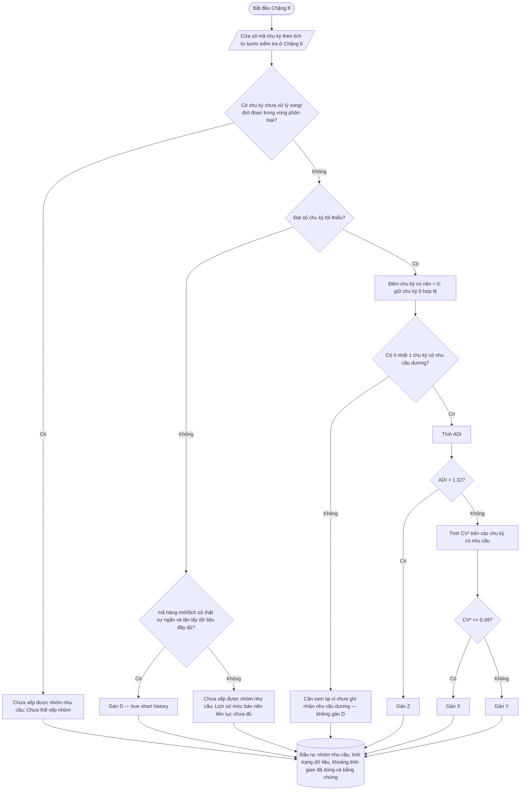

### 4. Nguyên lý hoạt động chi tiết

#### 🎯 4.1. Vấn đề cần giải quyết

Mã hàng nhập khẩu có thời gian bổ sung hàng dài. Nếu hệ thống hiểu sai nhịp nhu cầu, số đặt có thể sai trong nhiều chu kỳ liên tiếp.

Nguyên nhân trực tiếp là chuỗi nhu cầu không chỉ khác nhau ở tổng bán. Nó còn khác ở:

- **độ thưa**: chu kỳ nào cũng có bán hay lâu lâu mới phát sinh;
- **mức dao động**: khi có bán thì lượng bán gần nhau hay nhảy rất mạnh;
- **mức đầy đủ của lịch sử**: đã đủ chu kỳ để kết luận hay chưa.

Nguyên nhân gốc rễ là phương pháp dự báo, tồn kho an toàn và ngân sách phải đi theo hình dạng nhu cầu. Không thể dùng một cách xử lý cho mọi mã hàng.

#### 🚦 4.2. Điều kiện về số chu kỳ dùng để phân loại XYZ/D

Chặng 8 dùng cùng nền chu kỳ từ Chặng 6, nhưng mục tiêu khác Chặng 7. Chặng 8 không đo giá trị, mà đo **nhịp phát sinh nhu cầu** và **mức dao động khi có nhu cầu**.

| Nội dung                                      | Giá trị khởi điểm | Cách hiểu                                                                                                      |
| ------------------------------------------------ | -----------------------: | ------------------------------------------------------------------------------------------------------------------ |
| Cửa sổ chuẩn để phân loại XYZ/D | 24 vị trí chu kỳ gần nhất | Các `mã chu kỳ` phải liên tục; không lọc rồi nén. |
| Số chu kỳ tối thiểu để phân loại X/Y/Z | 6 chu kỳ chốt liên tiếp | Nếu ít hơn, chỉ gán D khi mã hàng thật sự mới/lịch sử ngắn và mọi chu kỳ hoạt động đều hợp lệ. |
| Có chu kỳ chưa xử lý xong trong cửa sổ | Không phân loại | **chưa xếp được nhóm nhu cầu**, `Chưa thể xếp nhóm`. |

Chặng 8 không tạo thêm dữ liệu và không bỏ chu kỳ lỗi để đủ mẫu. Thiếu chu kỳ do mã hàng mới thật sự có thể là D; thiếu do nền chưa xử lý xong hoặc chuỗi đứt phải bị chặn, không ép vào D, X, Y hoặc Z.

#### 4.3. Thứ tự quyết định phân loại

Chặng 8 đi theo thứ tự sau:

| Bước | Hệ thống làm gì                                                     | Vì sao làm ở bước này                                                                  |
| -------- | ------------------------------------------------------------------------- | ---------------------------------------------------------------------------------------------- |
| 1 | Kiểm tra cửa sổ `mã chu kỳ` có liên tục và mọi chu kỳ có hợp lệ hay không | Nếu bị đứt, ADI/CV² mất ý nghĩa thời gian. |
| 2 | Nếu cửa sổ bị đứt, chặn phân loại | Không dùng D để che lỗi dữ liệu. |
| 3 | Nếu lịch sử ngắn, xác minh mã hàng mới/lần lấy dữ liệu đầy đủ | Chỉ khi đúng mới gán D. |
| 4 | Đếm số chu kỳ có sức mua cơ bản lớn hơn 0                     | Xác định nhu cầu có xuất hiện hay không.                                             |
| 5 | Tính ADI                                                               | Đo độ thưa của nhu cầu.                                                                |
| 6 | Nếu ADI > 1,32, gán Z                                                 | Mã hàng bán thưa; vấn đề chính là không phát sinh thường xuyên.                |
| 7 | Nếu ADI ≤ 1,32, tính TB có nhu cầu, độ lệch chuẩn, CV và CV² | Mã hàng có nhu cầu thường xuyên nên cần đo lượng bán ổn định hay dao động. |
| 8 | CV² ≤ 0,49 thì gán X                                                | Nhu cầu thường xuyên và ổn định.                                                     |
| 9 | CV² > 0,49 thì gán Y                                                 | Nhu cầu thường xuyên nhưng lượng bán thay đổi mạnh.                               |

Lý do đo **ADI** trước **CV²**: nếu mã hàng bán thưa, vấn đề lớn nhất là không phát sinh thường xuyên. Khi đó không nên cố đánh giá lượng bán ổn định hay không ổn định như một mã hàng chu kỳ nào cũng có nhu cầu.

#### 🧮 4.4. Công thức phân loại XYZ/D 

Trong tài liệu giải pháp, công thức Chặng 8 cần trình bày bằng ngôn ngữ toán học chuẩn nhưng vẫn dùng **tên biến dễ hiểu**. Chặng 8 phân loại theo **độ thưa** và **mức dao động khi có nhu cầu**; thứ tự xử lý là kiểm tra số chu kỳ đã chốt, đếm chu kỳ có nhu cầu, tính khoảng cách phát sinh bình quân, rồi mới tính mức dao động để tách X/Y.

##### 4.4.1. Dữ liệu đầu vào của Chặng 8

Gọi chuỗi sức mua cơ bản theo chu kỳ của một mã hàng là:

$$
x_1, x_2, x_3, \ldots, x_n

$$

Trong đó:

| Biến | Ý nghĩa                                             |
| ------- | ------------------------------------------------------- |
| $x_i$ | Sức mua cơ bản của chu kỳ thứ $i$                |
| $n$   | Số chu kỳ đã chốt được dùng để phân loại |
| $i$   | Thứ tự chu kỳ, chạy từ 1 đến $n$                |

Ví dụ:

$$
10,\ 9,\ 11,\ 10,\ 8,\ 12

$$

nghĩa là mã hàng có 6 chu kỳ đã chốt, nên:

$$
n = 6

$$

##### 4.4.2. Số chu kỳ có nhu cầu

Một chu kỳ được xem là **có nhu cầu** khi sức mua cơ bản của chu kỳ đó lớn hơn 0.

$$
m = \sum_{i=1}^{n} I(x_i > 0)

$$

Trong đó:

| Biến            | Ý nghĩa                      |
| ------------------ | -------------------------------- |
| $m$              | Số chu kỳ có nhu cầu       |
| $I(x_i > 0)$     | Hàm kiểm tra điều kiện    |
| $I(x_i > 0) = 1$ | Chu kỳ $i$ có nhu cầu        |
| $I(x_i > 0) = 0$ | Chu kỳ $i$ không có nhu cầu |

Cách hiểu đơn giản: đi qua từng chu kỳ, chu kỳ nào bán lớn hơn 0 thì đếm 1, chu kỳ nào bằng 0 thì đếm 0.

Ví dụ:

$$
0,\ 0,\ 30,\ 0,\ 0,\ 25

$$

Có 6 chu kỳ đã chốt, nhưng chỉ có 2 chu kỳ có nhu cầu:
* Số chu kỳ đã chốt = 6
* Số chu kỳ có nhu cầu = 2

Việc quản trị hàng tồn kho đòi hỏi chúng ta phải hiểu rõ nhịp độ xuất hiện nhu cầu của từng loại mặt hàng. Để làm được điều này, chúng ta sử dụng chỉ số **Khoảng cách phát sinh bình quân (ADI)**, một công cụ đo lường tần suất xuất hiện nhu cầu.

### 4.4.3. Khoảng cách phát sinh bình quân (ADI)

Chỉ số ADI giúp trả lời câu hỏi: **Trung bình cần bao nhiêu chu kỳ thì một đơn hàng thực sự phát sinh?**

Công thức tính như sau:

$$ADI = \frac{\text{Tổng số chu kỳ quan sát}}{\text{Số chu kỳ có phát sinh nhu cầu}}$$

Hãy tưởng tượng bạn đang theo dõi việc bán hàng của một cửa hàng trong vòng 12 ngày. Nếu trong 12 ngày đó, chỉ có 4 ngày là có khách mua hàng, thì $ADI = 12 / 4 = 3$. Điều này có nghĩa là trung bình cứ sau 3 ngày, cửa hàng mới bán được sản phẩm một lần.

* Khi ADI cao, chúng ta gọi đây là **hàng bán thưa** (nhu cầu không đều đặn).
* Khi ADI thấp (tiến gần về 1), nhu cầu xuất hiện liên tục và đều đặn theo thời gian.

### 4.4.4. Xác định nhóm Z trong phân loại hàng hóa

Trong hệ thống quản trị kho, việc phân loại hàng hóa giúp ưu tiên nguồn lực. **Nhóm Z** được dành riêng cho những mặt hàng có đặc điểm "bán thưa" rất rõ rệt.

Ngưỡng xác định nhóm Z được thiết lập là **1,32**. Điều kiện gán nhóm được cụ thể hóa như sau:

* **Nếu ADI > 1,32:** Mã hàng đó chính thức thuộc **Nhóm Z**.
* **Ý nghĩa:** Tại thời điểm này, nhu cầu đối với mặt hàng đã trở nên quá rời rạc và không thường xuyên.

Việc tách biệt nhóm Z ra khỏi các nhóm khác (như X hay Y) là vô cùng quan trọng. Đối với nhóm Z, tính chất nhu cầu là không ổn định, nên chúng ta không cần tốn thời gian tính toán các chỉ số dao động phức tạp (như hệ số biến thiên) vì bản thân nó đã không đủ điều kiện để áp dụng các cách dự báo dự báo nhu cầu thông thường. Việc nhận diện sớm nhóm Z giúp bạn tránh lãng phí công sức vào việc dự báo sai lệch và thay vào đó, hãy chuyển sang các chiến lược quản lý tồn kho an toàn cho hàng bán chậm.

##### 4.4.5. Lọc các chu kỳ có nhu cầu

Để tính mức dao động, Chặng 8 **không dùng toàn bộ chuỗi** nếu trong chuỗi có nhiều chu kỳ bằng 0. Hệ thống chỉ lấy các chu kỳ có nhu cầu, tức là các chu kỳ có:

$$
x_i > 0

$$

Sau khi lọc, gọi các giá trị có nhu cầu là:

$$
x_1, x_2, x_3, \ldots, y_m

$$

Trong đó:

| Biến | Ý nghĩa                                                                                   |
| ------- | --------------------------------------------------------------------------------------------- |
| $x_i$ | Sức mua cơ bản của chu kỳ thứ $i$ trong toàn bộ chuỗi hợp lệ.                     |
| $x_j$ | Sức mua cơ bản của chu kỳ có nhu cầu thứ $j$ sau khi đã lọc các chu kỳ bằng 0. |
| $m$   | Số chu kỳ có nhu cầu.                                                                   |
| $i$   | Thứ tự của chu kỳ có nhu cầu, chạy từ 1 đến $m$.                                   |

Ví dụ chuỗi gốc là:

$$
0,\ 0,\ 30,\ 0,\ 0,\ 25

$$

Sau khi lọc chu kỳ có nhu cầu, chuỗi dùng để tính mức dao động là:

$$
x_1 = 30,\quad y_2 = 25

$$

$$
m = 2

$$

##### 4.4.6. Mức bán bình quân khi có nhu cầu

Mức bán bình quân khi có nhu cầu là giá trị trung bình của các chu kỳ thực sự phát sinh sức mua. 

$$\mu = \frac{1}{m} \sum_{i=1}^{m} x_i$$

**Trong đó:**

| Biến số | Ý nghĩa thực tế |
| --- | --- |
| $\mu$ | **Mức bán bình quân khi có nhu cầu:** Trung bình lượng hàng bán ra chỉ tính trên những giai đoạn thực sự có khách mua. |
| $x_i$ | **Sức mua cơ bản tại chu kỳ thứ $j$:** Lượng cầu thực tế phát sinh trong chu kỳ có nhu cầu thứ $i$ (với $i = 1, 2, ..., m$). |
| $m$ | **Số chu kỳ có nhu cầu:** Tổng số giai đoạn (ngày, tuần, tháng...) mà mức cầu lớn hơn $0$. |


### Ví dụ thực tế và Ý nghĩa sâu xa

Hãy tưởng tượng bạn mở một quán cà phê trong **$7$ ngày**, nhưng chỉ có **$2$ ngày** cuối tuần là có khách đến mua (các ngày trong tuần quán vắng bóng, mức bán bằng $0$).

* Ngày có nhu cầu thứ nhất ($i=1$): Bán được $x_1 = 30$ ly.
* Ngày có nhu cầu thứ hai ($i=2$): Bán được $x_2 = 25$ ly.
* Tổng số chu kỳ thực sự có nhu cầu: $m = 2$.

**Áp dụng vào công thức:**

$$\mu = \frac{1}{2} \sum_{i=1}^{2} x_i = \frac{30 + 25}{2} = 27{,}5 \text{ (ly)}$$


##### 4.4.7. Độ lệch chuẩn khi có nhu cầu

Độ lệch chuẩn cho biết các lần phát sinh nhu cầu đang lệch khỏi mức bình quân bao xa.

$$\sigma = \sqrt{\frac{1}{n} \sum_{i=1}^{n} (x_i - \mu)^2}$$

**Trong đó:**

* $x_i$: Doanh số (sales) tại kỳ thứ $i$
* $\mu$: Giá trị trung bình (demand)
* $n$: Số kỳ hợp lệ
* $\sigma$: Độ lệch chuẩn của demand

---

### Ý nghĩa thực tế của $x_i - \mu$

* **Ý nghĩa:** Đo lường điểm lệch khỏi mức bình thường bao xa.
* **Ví dụ:** Nếu trung bình $\mu = 10$, một ngày bán được $25$:

$$25 - 10 = 15$$


$\rightarrow$ **Nghĩa là:** Ngày đó có hành vi bán vượt xa mức bình thường.

---

### Vì sao phải bình phương?

**1. Nếu không bình phương:**
Các độ lệch âm và dương sẽ tự triệt tiêu lẫn nhau khi cộng lại.

* $x_1 - \mu = 10 - 25 = -15$
* $x_2 - \mu = 40 - 25 = 15$
* **Tổng độ lệch:** $-15 + 15 = 0$ $\rightarrow$ Hệ thống cho kết quả bằng $0$, nhưng **thực chất là có dao động**.

**2. Mục đích của bình phương:**

* Để **xóa dấu âm**, giúp đo lường đúng tổng độ lớn của dao động.
* **Ví dụ:** $(-15)^2 = 225$

##### 4.4.8. Hệ số biến thiên và bình phương hệ số biến thiên

Độ lệch chuẩn mới cho biết mức lệch tuyệt đối. Để biết mức lệch đó lớn hay nhỏ so với quy mô bán, Chặng 8 tính hệ số biến thiên.

$$
\operatorname{CV}
=
\frac{\sigma}{\mu}

$$

Trong đó:

| Biến   | Ý nghĩa                                         |
| --------- | --------------------------------------------------- |
| $CV$    | Hệ số biến thiên.                             |
| $\sigma$ | Độ lệch chuẩn của các chu kỳ có nhu cầu. |
| $\mu$    | Mức bán bình quân khi có nhu cầu.           |

Sau đó tính bình phương hệ số biến thiên:

$$
\operatorname{CV}^{2}
=
\left(\frac{\sigma}{\mu}\right)^2

$$

Ví dụ:

$$
\sigma = 2{,}5,\quad \mu = 27{,}5

$$

$$
\operatorname{CV}
=
\frac{2{,}5}{27{,}5}
\approx
0{,}091

$$

$$
\operatorname{CV}^{2}
=
(0{,}091)^2
\approx
0{,}0083

$$

Cách hiểu vận hành: hệ số biến thiên giống như nhìn độ rung của xe so với tốc độ đang chạy. Cùng lệch 2 sản phẩm, nếu mức bán bình quân là 5 thì dao động lớn; nếu mức bán bình quân là 100 thì dao động nhỏ. Vì vậy Chặng 8 không chỉ nhìn độ lệch chuẩn, mà dùng `CV²` để so sánh mức dao động tương đối giữa các mã hàng.

##### 4.4.9. Điều kiện gán nhóm X/Y/Z/D

Trường hợp chuỗi bị đứt hoặc còn chu kỳ chưa giải quyết:

$$
\exists i:\; x_i = \text{chưa có giá trị}
\Rightarrow
\text{Chưa xếp được nhóm nhu cầu}
$$

Không được xóa vị trí $i$ rồi đánh lại chỉ số cho các chu kỳ còn lại.

Trường hợp lịch sử thật sự ngắn:

$$
n < n_{\min}
\;\land\;
\text{Lịch sử thật còn ngắn}
\Rightarrow
\text{Nhóm D}
$$

Trong đó **lịch sử thật còn ngắn** đòi hỏi mã hàng mới/lịch sử hoạt động ngắn, lần lấy dữ liệu đầy đủ và các chu kỳ đã hoạt động đều hợp lệ. Giá trị khởi điểm của $n_{\min}$ là 6 chu kỳ liên tiếp.

Trường hợp mọi chu kỳ hợp lệ đều bằng 0:

$$
m=0
\Rightarrow
\text{NO\_POSbộ phận hỗ trợ hệ thốngIVE\_DEMAND\_REVIEW}
$$

Không gán D và không thực hiện phép chia ADI cho 0.

Trường hợp bán thưa:

$$
\operatorname{ADI} > 1{,}32
\Rightarrow
\text{Nhóm Z}

$$

Trường hợp bán thường xuyên và ổn định:

$$
\operatorname{ADI} \le 1{,}32
\quad \text{và} \quad
\operatorname{CV}^{2} \le 0{,}49
\Rightarrow
\text{Nhóm X}

$$

Trường hợp bán thường xuyên nhưng dao động mạnh:

$$
\operatorname{ADI} \le 1{,}32
\quad \text{và} \quad
\operatorname{CV}^{2} > 0{,}49
\Rightarrow
\text{Nhóm Y}

$$

#### 4.8. Ngưỡng phân loại và trạng thái chính sách

| Điều kiện                        | Nhóm | Cách hiểu vận hành                                                                                           |
| ------------------------------------- | ------- | ------------------------------------------------------------------------------------------------------------------ |
| ADI ≤ 1,32 và CV² ≤ 0,49        | X     | Nhu cầu xuất hiện thường xuyên, mức bán tương đối ổn định.                                        |
| ADI ≤ 1,32 và CV² > 0,49         | Y     | Nhu cầu xuất hiện thường xuyên nhưng lượng bán thay đổi mạnh.                                       |
| ADI > 1,32                          | Z     | Nhu cầu bán thưa; chuỗi có nhiều chu kỳ bằng 0.                                                          |
| Chưa đạt số chu kỳ tối thiểu | D     | Chưa phân loại X/Y/Z. Dùng mã hàng tương đồng nội bộ, chính sách ra mắt hoặc kế hoạch của bộ phận ngành hàng. |

| Ngưỡng hoặc quy tắc          | Trạng thái                                                                                                         |
| ---------------------------------- | ---------------------------------------------------------------------------------------------------------------------- |
| Cửa sổ chuẩn 24 chu kỳ       | Giá trị điều chỉnh chính sách của phân loại XYZ/D; phải có phiên bản phê duyệt trước khi vận hành chính thức. |
| Tối thiểu 6 chu kỳ đã chốt | Giá trị điều chỉnh chính sách của phân loại XYZ/D; phải có phiên bản phê duyệt trước khi vận hành chính thức. |
| ADI 1,32                         | Giá trị điều chỉnh chính sách của phân loại XYZ/D; phải có phiên bản phê duyệt trước khi vận hành chính thức. |
| CV² 0,49                        | Giá trị điều chỉnh chính sách của phân loại XYZ/D; phải có phiên bản phê duyệt trước khi vận hành chính thức. |

Các ngưỡng này được hậu kiểm ở Chặng 20 bằng sai số dự báo, thiếu hàng, dư tồn, số lần duyệt ngoại lệ và mức độ phù hợp của nhóm X/Y/Z/D với hành vi thực tế.

### 🛠️ 5. Hướng dẫn sử dụng và khắc phục sự cố

| Tình huống                                         | Nguyên nhân thường gặp                                               | Cách xử lý đúng                                                                                                             |
| ------------------------------------------------------ | --------------------------------------------------------------------------- | ---------------------------------------------------------------------------------------------------------------------------------- |
| Mã hàng giá trị A nhưng bị xếp Z              | Giá trị cao nhưng nhu cầu bán thưa                                  | Không sửa Chặng 8; Chặng 9 quyết định chính sách bảo vệ theo ABC kết hợp XYZ/D.                                     |
| Mã hàng mới bị xếp D                            | Chưa đạt số chu kỳ đã chốt tối thiểu                            | Dùng mã hàng tương đồng nội bộ, chính sách ra mắt hoặc kế hoạch của bộ phận ngành hàng.                                          |
| Mã hàng có nhiều chu kỳ 0 nên bị xếp Z       | Sau Chặng 6, các chu kỳ 0 là bằng chứng về độ thưa              | Không xóa chu kỳ 0; kiểm tra ở Chặng 9 và 11 cách dự báo phù hợp.                                                    |
| Mã hàng thường xuyên có bán nhưng bị xếp Y | Lượng bán khi có nhu cầu thay đổi mạnh                            | Kiểm tra mùa vụ, khuyến mãi, xu hướng hoặc kế hoạch kinh doanh.                                                        |
| Quá nhiều mã hàng rơi vào Z/D                  | Ngưỡng quá nhạy hoặc danh mục có nhiều mã hàng bán thưa thật | Đưa vào Chặng 20 để hậu kiểm ngưỡng bằng sai số, thiếu hàng và dư tồn.                                          |
| Chỉ có một chu kỳ có nhu cầu                   | Không đủ căn cứ để đo ổn định                                  | Nếu chưa đủ số chu kỳ tối thiểu thì gán D; nếu đủ lịch sử nhưng chỉ phát sinh rất thưa thì gán Z theo ADI. |

### 📦 6. Kết quả đã chốt và nguyên tắc không hồi tố

| Đầu ra                              | Chặng sau được dùng    | Không được làm ở chặng sau                          |
| --------------------------------------- | ----------------------------- | ------------------------------------------------------------ |
| Ghi chú X/Y/Z/D                         | Chặng 10, 10, 14, 16, 17, 18 | Không đổi ghi chú bằng cảm tính.                       |
| Số chu kỳ đã chốt đã dùng     | Chặng 10, 17, 18            | Không bổ sung chu kỳ chưa được Chặng 6 chốt.      |
| Số chu kỳ có nhu cầu              | Chặng 13, 18               | Không tính lại từ dữ liệu thô.                      |
| ADI                                   | Chặng 13, 18               | Không xóa chu kỳ 0 đã chốt.                          |
| TB có nhu cầu                       | Chặng 13, 18               | Không tính lại trên dữ liệu chưa được chốt.     |
| Độ lệch chuẩn có nhu cầu        | Chặng 13, 18               | Không thay đổi công thức theo từng kỳ.              |
| CV                                    | Chặng 13, 18               | Không tính lại nếu chưa mở chính sách mới.        |
| CV²                                  | Chặng 13, 18               | Không tính lại nếu chưa mở chính sách mới.        |
| Trạng thái đủ/chưa đủ căn cứ | Chặng 10, 10, 17             | Không ép mã hàng D thành X/Y/Z.                       |
| Phiên bản chính sách XYZ/D        | Đối chiếu và truy vết   | Không dùng ngưỡng không có phiên bản chính sách. |

Chặng 8 đã giải quyết xong câu hỏi **nhu cầu đều, dao động hay thưa**. Chặng 9 dùng ABC, XYZ/D và vai trò danh mục để biến phân loại thành chính sách vận hành.

---

### 🗂️ Rà soát dữ liệu lưu lâu dài và trạng thái chính sách

| Tên thông tin cần lưu lâu dài   | Lưu để làm gì                                                                |
| --------------------------------------- | ----------------------------------------------------------------------------------- |
| Ghi chú X/Y/Z/D                         | Cho biết mã hàng bán đều, dao động, bán thưa hoặc chưa đủ căn cứ. |
| Số chu kỳ đã chốt đã dùng     | Giải thích độ dài lịch sử dùng cho phân loại.                           |
| Số chu kỳ có nhu cầu              | Giải thích vì sao mã hàng bị xem là thường xuyên hoặc thưa.           |
| ADI                                   | Căn cứ chính để phân biệt X/Y với Z.                                      |
| TB có nhu cầu                       | Căn cứ để tính CV và CV².                                                  |
| Độ lệch chuẩn có nhu cầu        | Căn cứ để tính CV và CV².                                                  |
| CV                                    | Hệ số biến thiên, giúp đọc mức dao động tương đối.                  |
| CV²                                  | Căn cứ chính để phân biệt X với Y.                                        |
| Trạng thái đủ/chưa đủ căn cứ | Tránh ép phân loại khi lịch sử quá ngắn.                                  |
| Phiên bản chính sách XYZ/D        | Truy vết số chu kỳ tối thiểu và ngưỡng đã dùng.                        |

| Ngưỡng hoặc quy tắc          | Trạng thái                                                                                                         |
| ---------------------------------- | ---------------------------------------------------------------------------------------------------------------------- |
| Cửa sổ chuẩn 24 chu kỳ       | Giá trị điều chỉnh chính sách của phân loại XYZ/D; phải có phiên bản phê duyệt trước khi vận hành chính thức. |
| Tối thiểu 6 chu kỳ đã chốt | Giá trị điều chỉnh chính sách của phân loại XYZ/D; phải có phiên bản phê duyệt trước khi vận hành chính thức. |
| ADI 1,32                         | Giá trị điều chỉnh chính sách của phân loại XYZ/D; phải có phiên bản phê duyệt trước khi vận hành chính thức. |
| CV² 0,49                        | Giá trị điều chỉnh chính sách của phân loại XYZ/D; phải có phiên bản phê duyệt trước khi vận hành chính thức. |

---


## Chặng 9 — Gán chính sách vận hành theo hai nhóm trên

> **QUY TẮC BỔ SUNG BẢN 26**
>
> Ma trận và override phải có trạng thái đề xuất/phê duyệt/hiệu lực, version và không hồi tố. Thiếu mức phục vụ level dùng `chưa có giá trị` + `Chính sách chưa được chốt`, không dùng 0%.


> **PHA 2 · Phân loại và gán chính sách**

### 🎯 1. Vấn đề chặng này phải giải quyết

Chặng 7 đã cho biết mã hàng **quan trọng về giá trị tiêu thụ** đến đâu:

| Nhóm ABC | Cách hiểu ngắn                                                |
| ----------- | ------------------------------------------------------------------ |
| A         | Mã hàng đóng góp giá trị cao, cần kiểm soát chặt.     |
| B         | Mã hàng đóng góp trung bình, quản lý cân bằng.         |
| C         | Mã hàng đóng góp thấp, không nên chốt quá nhiều vốn. |

Chặng 8 đã cho biết mã hàng **dễ hay khó dự báo**:

| Nhóm XYZ | Cách hiểu ngắn                                                      |
| ----------- | ------------------------------------------------------------------------ |
| X         | Nhu cầu đều, dễ dự báo hơn.                                     |
| Y         | Nhu cầu có dao động, cần theo dõi kỹ hơn.                      |
| Z         | Nhu cầu thưa hoặc không đều, dễ dư tồn nếu đặt quá mạnh. |

Chặng 9 chỉ làm một việc chính:

> **Ghép ABC và XYZ thành ma trận 9 ô để chọn cách quản lý tồn kho, mức ưu tiên vốn và mức phục vụ đề xuất.**

Ma trận này không phức tạp. Cách đọc rất đơn giản:

> **ABC trả lời: mã hàng này đáng ưu tiên đến mức nào?**
> **XYZ trả lời: nhu cầu của mã hàng này có dễ tin để đặt hàng tự động không?**

---

### 🎯 2. Mục tiêu

Chặng 9 tạo ra **chính sách vận hành** cho từng mã hàng.

Chính sách này giúp các chặng sau biết:

| Câu hỏi                                                              | Chặng 9 trả lời                                                   |
| ------------------------------------------------------------------------ | ---------------------------------------------------------------------- |
| Mã hàng cần ưu tiên cao hay thấp?                                | Dựa vào nhóm ABC.                                                 |
| Mã hàng có thể đặt theo dự báo mạnh hay phải thận trọng?   | Dựa vào nhóm XYZ.                                                 |
| Khi ngân sách thiếu, mã hàng nào được ưu tiên vốn trước? | Dựa vào ô ABC × XYZ.                                             |
| Mức phục vụ mục tiêu nên cao hay thấp?                          | Dựa vào ô ABC × XYZ, sau đó Hachi kiểm chứng bằng kiểm tra lại bằng dữ liệu quá khứ. |
| Mã hàng nào cần duyệt ngoại lệ?                                 | Các ô rủi ro cao hoặc nhóm D.                                   |

Chặng 9 không dự báo, không tính tồn kho an toàn và không tính số đặt.
Chặng 9 chỉ gán **quy tắc quản lý** để Chặng 17, 17, 18 và 18 dùng tiếp.

---

### 3. Dữ liệu cần dùng

| Dữ liệu                   | Nguồn                        | Cách dùng                                                                          |
| ----------------------------- | ------------------------------- | -------------------------------------------------------------------------------------- |
| Nhóm ABC                   | Chặng 7                      | Xác định mức quan trọng theo giá trị tiêu thụ.                              |
| Nhóm XYZ/D                 | Chặng 8                      | Xác định độ đều, độ dao động hoặc tình trạng chưa đủ dữ liệu.     |
| Vai trò danh mục nếu có | Ngành hàng/bộ phận ngành hàng               | Dùng để điều chỉnh chính sách trong trường hợp cần ưu tiên kinh doanh. |
| Thời gian cung ứng        | Nguồn hàng                  | Dùng để kiểm tra rủi ro thiếu hàng trong thời gian chờ nhập.               |
| Business rule Hachi         | Ban vận hành/bộ phận ngành hàng/tài chính | Chốt ngưỡng SL, ưu tiên vốn và điều kiện ngoại lệ.                       |

---

### 4. Ma trận 9 ô ABC × XYZ

Ma trận chính gồm **9 ô**:

|                                | **X — Nhu cầu đều** | **Y — Nhu cầu dao động** | **Z — Nhu cầu thưa/khó đều** |
| -------------------------------- | ------------------------- | ------------------------------ | ------------------------------------ |
| **A — Giá trị cao**         | **AX**                  | **AY**                       | **AZ**                             |
| **B — Giá trị trung bình** | **BX**                  | **BY**                       | **BZ**                             |
| **C — Giá trị thấp**       | **CX**                  | **CY**                       | **CZ**                             |

Cách hiểu:

| Ô     | Ý nghĩa vận hành                                                                                                                  |
| -------- | --------------------------------------------------------------------------------------------------------------------------------------- |
| **AX** | Mã hàng quan trọng và nhu cầu đều. Đây là nhóm tốt nhất để bảo vệ tồn kho.                                          |
| **AY** | Mã hàng quan trọng nhưng nhu cầu dao động. Vẫn cần ưu tiên, nhưng phải kiểm soát rủi ro dư tồn.                     |
| **AZ** | Mã hàng quan trọng nhưng bán thưa/không đều. Không được bỏ qua, nhưng không đặt quá mạnh theo dự báo máy móc. |
| **BX** | Mã hàng trung bình và nhu cầu đều. Có thể vận hành theo chính sách chuẩn.                                               |
| **BY** | Mã hàng trung bình nhưng dao động. Giữ mức phục vụ vừa phải.                                                              |
| **BZ** | Mã hàng trung bình nhưng bán thưa. Đặt thận trọng.                                                                          |
| **CX** | Mã hàng giá trị thấp nhưng nhu cầu đều. Bổ sung gọn, không cần bảo vệ quá cao.                                        |
| **CY** | Mã hàng giá trị thấp và dao động. Hạn chế tồn dư.                                                                         |
| **CZ** | Mã hàng giá trị thấp và bán thưa. Chỉ bổ sung khi có tín hiệu rõ hoặc có quyết định ngành hàng.                  |

---

### 5. Chính sách đề xuất cho từng ô

Bảng dưới là **khung giá trị điều chỉnh chính sách cần được phê duyệt** trước khi vận hành chính thức. Mỗi mức phục vụ mục tiêu phải có phiên bản chính sách, phạm vi áp dụng và thời điểm hiệu lực.

| Ô     | Mức ưu tiên vốn | Mức phục vụ mục tiêu | Cách quản lý                                                  |
| -------- | --------------------: | --------------------------: | ------------------------------------------------------------------ |
| **AX** |            Rất cao |                       97% | Bảo vệ tồn kho tốt nhất, hạn chế hết hàng.              |
| **AY** |            Rất cao |                       95% | Ưu tiên cao, nhưng theo dõi dao động để tránh dư tồn. |
| **AZ** |                 Cao |                       92% | Giữ hàng có chọn lọc, không đẩy tồn quá mạnh.         |
| **BX** |                 Cao |                       95% | Vận hành ổn định theo dự báo.                             |
| **BY** |         Trung bình |                       92% | Cân bằng giữa thiếu hàng và dư tồn.                      |
| **BZ** |   Trung bình thấp |                       88% | Đặt thận trọng, tránh tồn chậm.                           |
| **CX** |   Trung bình thấp |                       90% | Bổ sung gọn, không cần mức bảo vệ cao.                    |
| **CY** |               Thấp |                       85% | Hạn chế tồn, theo dõi nếu có dấu hiệu tăng cầu.        |
| **CZ** |          Rất thấp |                       80% | Không ưu tiên vốn; chỉ mua khi có căn cứ rõ.            |

Mức phục vụ mục tiêu là giá trị điều chỉnh chính sách. Nếu cần thay đổi sau hậu kiểm, hệ thống phải phát hành phiên bản chính sách mới và chỉ áp dụng từ phiên hiệu lực tiếp theo.

---

### 6. Nhóm D xử lý riêng, không đưa vào ma trận 9 ô

Nhóm D là nhóm **chưa đủ căn cứ học tự động**. Vì vậy nhóm D không nằm trong ma trận 9 ô.

| Tình huống nhóm D                                   | Cách xử lý                                                |
| -------------------------------------------------------- | -------------------------------------------------------------- |
| mã hàng mới                                               | Dùng kế hoạch bộ phận ngành hàng hoặc hàng tương tự để tham khảo. |
| mã hàng thiếu lịch sử bán                              | Không tự động gán chính sách mạnh.                   |
| mã hàng vừa mở bán lại sau thời gian dài không bán | Theo dõi thêm trước khi đưa vào ma trận.             |
| mã hàng có dữ liệu quá nhiễu                          | Chuyển duyệt ngoại lệ hoặc chờ thêm dữ liệu sạch.  |

Nguyên tắc:

> **D không có nghĩa là không mua.**
> **D có nghĩa là không đủ dữ liệu để hệ thống tự tin tự động quyết định như X, Y, Z.**

---

### 7. Vai trò danh mục chỉ dùng để điều chỉnh sau ma trận

Vai trò danh mục không làm thay đổi cách đọc ma trận. Ma trận ABC × XYZ vẫn là nền chính.

Sau khi mã hàng đã được xếp vào một ô, vai trò danh mục có thể điều chỉnh nhẹ chính sách nếu có lý do kinh doanh rõ ràng.

| Vai trò danh mục              | Cách điều chỉnh                                                                   |
| --------------------------------- | --------------------------------------------------------------------------------------- |
| Hàng lõi                      | Có thể tăng ưu tiên hoặc tăng mức phục vụ trong giới hạn cho phép.       |
| Hàng kéo khách               | Có thể tăng ưu tiên nếu thiếu hàng làm ảnh hưởng hình ảnh ngành hàng. |
| Hàng xu hướng                | Có thể ưu tiên tạm thời nhưng cần theo dõi vòng đời ngắn.                |
| Hàng biên lợi nhuận tốt    | Có thể ưu tiên nếu không làm tăng tồn chậm.                                 |
| Không có vai trò đặc biệt | Giữ đúng chính sách theo ma trận.                                               |

Điểm cần chốt: vai trò danh mục không được dùng để nâng chính sách tùy ý. Mọi điều chỉnh phải có lý do và được ghi lại để Chặng 20 kiểm tra hiệu quả.

---

### 📐 8. Quy trình gán chính sách

| Bước | Hành động                                                                     |
| -------: | ---------------------------------------------------------------------------------- |
|      1 | Lấy nhóm ABC từ Chặng 7.                                                     |
|      2 | Lấy nhóm XYZ/D từ Chặng 8.                                                   |
|      3 | Nếu là X, Y hoặc Z thì ghép vào ma trận 9 ô.                             |
|      4 | Nếu là D thì chuyển sang chính sách riêng cho nhóm chưa đủ dữ liệu. |
|      5 | Gán mức ưu tiên vốn và mức phục vụ mục tiêu theo ô.                  |
|      6 | Xem vai trò danh mục nếu có để điều chỉnh trong giới hạn.             |
|      7 | Ghi chính sách vận hành cuối cùng cho từng mã hàng.                           |
|      8 | Bàn giao cho Chặng 17, 17, 18 và 18.                                          |

---

### 💡 9. Ví dụ vận hành

| mã hàng   | ABC | XYZ/D | Ô chính sách | Cách hiểu                       | Chính sách                                          |
| ------- | ----- | ------- | ----------------- | ----------------------------------- | ------------------------------------------------------- |
| mã hàng A | A   | X     | AX              | Giá trị cao, nhu cầu đều     | Ưu tiên vốn rất cao, bảo vệ tồn kho tốt.      |
| mã hàng B | A   | Z     | AZ              | Giá trị cao nhưng bán thưa   | Vẫn ưu tiên, nhưng đặt thận trọng.            |
| mã hàng C | C   | X     | CX              | Giá trị thấp nhưng bán đều | Có thể bổ sung, nhưng không cần tồn cao.       |
| mã hàng D | C   | Z     | CZ              | Giá trị thấp, bán thưa       | Không ưu tiên vốn; chỉ mua khi có căn cứ rõ. |
| mã hàng E | B   | D     | Ngoài ma trận | Chưa đủ dữ liệu              | Chuyển chính sách nhóm D hoặc duyệt ngoại lệ. |

---

### 🔀 10. Sơ đồ các bước

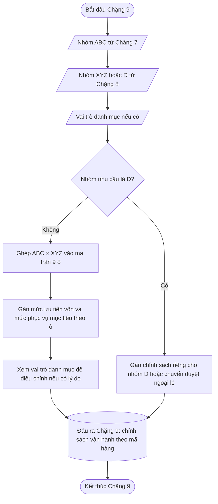

---

### 📦 11. Đầu ra bàn giao

| Đầu ra                              | Ý nghĩa                                                               | Chặng sau dùng  |
| --------------------------------------- | ------------------------------------------------------------------------- | ------------------- |
| Ô chính sách ABC × XYZ            | AX, AY, AZ, BX, BY, BZ, CX, CY hoặc CZ.                                | Chặng 17, 17, 18 |
| Chính sách nhóm D nếu có         | Cách xử lý mã hàng chưa đủ dữ liệu.                                 | Chặng 13, 17, 19 |
| Mức phục vụ mục tiêu             | Giá trị điều chỉnh chính sách đã có phiên bản hiệu lực.                  | Chặng 16         |
| Mức ưu tiên vốn                   | Thứ tự ưu tiên khi ngân sách không đủ.                         | Chặng 18         |
| Điều chỉnh theo vai trò danh mục | Ghi nhận nếu có thay đổi so với ma trận.                         | Chặng 19, 19, 20 |
| Lý do điều chỉnh                  | Căn cứ đối chiếu.                                                   | Chặng 20         |
| Phiên bản chính sách              | Biết chính sách nào đã được dùng tại phiên lập kế hoạch. | Chặng 20         |

---

### 🔒 12. Nguyên tắc chốt

| Nguyên tắc                                                 | Ý nghĩa                                                                           |
| -------------------------------------------------------------- | ------------------------------------------------------------------------------------- |
| Ma trận 9 ô là nền chính                                | Không tạo thêm nhiều lớp phức tạp nếu chưa cần.                           |
| ABC quyết định mức quan trọng                           | A ưu tiên hơn B, B ưu tiên hơn C.                                             |
| XYZ quyết định độ thận trọng                          | X dễ vận hành hơn Y, Y dễ vận hành hơn Z.                                   |
| D xử lý riêng                                             | Không ép mã hàng thiếu dữ liệu vào ma trận.                                      |
| Mức phục vụ mục tiêu phải có phiên bản chính sách | Không thay đổi mức phục vụ âm thầm trong cùng một phiên lập kế hoạch. |
| Chính sách đã phát hành không sửa ngược            | Nếu đổi business rule, chỉ áp dụng từ phiên sau.                            |

Sau Chặng 9, mỗi mã hàng có một chính sách vận hành rõ ràng. Chặng 16 dùng mức phục vụ để tính tồn kho an toàn. Chặng 18 dùng mức ưu tiên vốn để phân bổ ngân sách. Chặng 19 dùng điều kiện ngoại lệ để quyết định mã hàng nào cần người phụ trách duyệt lại.

---

## Chặng 10 — Kiểm tra mùa vụ cho nhóm Y

> **PHA 3 · Nhận diện cấu trúc nhu cầu, dự báo nền và áp hệ số khuyến mãi**

### 🎯 1. Mục tiêu

Chặng 10 trả lời một câu hỏi duy nhất:

> **mã hàng nhóm Y có dao động lặp lại theo cùng vị trí mùa vụ hay không?**

Chặng 10 không dự báo. Chặng 10 chỉ xác định mã hàng nhóm Y có được mở quyền cho Chặng 12 thử cách dự báo Holt-Winters hay không. Cách dự báo cuối cùng vẫn phải được Chặng 12 kiểm tra ngược trước khi chốt.

Cách hiểu nghiệp vụ:

- Nếu cứ đến cùng một vị trí trong năm mà sức mua cơ bản thường cao hơn mặt bằng vòng, mã hàng có tín hiệu mùa vụ cao.
- Nếu cứ đến cùng một vị trí trong năm mà sức mua cơ bản thường thấp hơn mặt bằng vòng, mã hàng có tín hiệu mùa vụ thấp.
- Nếu cao thấp không lặp theo cùng vị trí, mã hàng không có mùa vụ rõ.

Ví dụ: muốn biết một nhóm sản phẩm có tăng vào giai đoạn Tết hay không, hệ thống không nhìn một ngày riêng lẻ. Hệ thống so cùng giai đoạn Tết qua nhiều vòng năm. Nếu giai đoạn đó lặp lại mức cao so với mặt bằng từng năm, đó mới là mùa vụ.

### 🔒 2. Nguyên tắc không hồi tố

Dữ liệu đã đi qua Chặng 1–6 là dữ liệu đã chốt. Chặng 10 không được nghi ngờ lại, sửa lại hoặc xử lý ngược các kết quả đó.

| Chặng trước | Kết quả đã chốt                                     | Chặng 10 có xử lý lại không? |
| ---------------- | ---------------------------------------------------------- | ----------------------------------: |
| Chặng 2       | Ngày được đánh dấu thiếu hàng hoặc không thiếu hàng |                            Không |
| Chặng 3       | Sức mua cơ bản của ngày không khuyến mãi                 |                            Không |
| Chặng 4       | Sức mua cơ bản của ngày khuyến mãi                        |                            Không |
| Chặng 6       | Sức mua cơ bản theo chu kỳ 15 ngày                  |                            Không |

Trong Chặng 10, cụm **đủ cấu trúc mùa vụ** không có nghĩa là dữ liệu sạch hay không sạch. Dữ liệu đã được các chặng trước xử lý và chốt. Cụm này chỉ có nghĩa là chuỗi đã chốt có đủ thông tin thời gian để so cùng vị trí mùa vụ qua các vòng.

Điều kiện tiên quyết bắt buộc để Chặng 10 chạy đúng:

| Thông tin bắt buộc                | Ý nghĩa                                                                        |
| -------------------------------------- | ---------------------------------------------------------------------------------- |
| Sức mua cơ bản chu kỳ đã chốt | Giá trị được Chặng 6 bàn giao.                                            |
| Vòng mùa vụ                       | Cho biết chu kỳ thuộc vòng so sánh nào, ví dụ vòng 1, vòng 2, vòng 3. |
| Vị trí mùa vụ                    | Cho biết chu kỳ là vị trí số mấy trong vòng, ví dụ 1 đến 24.         |

Nếu thiếu một trong ba thông tin trên, hệ thống không được suy đoán thay. Đây là khoảng trống dữ liệu cấu trúc cần bổ sung trước khi vận hành nhận diện mùa vụ.

### 3. Phạm vi xử lý

Chặng 10 chỉ xử lý mã hàng nhóm Y sau Chặng 8.

| Nhóm sau Chặng 8 | Chặng 10 có xử lý không? | Lý do                                                                                                          |
| -------------------- | -----------------------------: | ----------------------------------------------------------------------------------------------------------------- |
| X                  |                       Không | Nhu cầu thường xuyên và ổn định, không cần kiểm tra mùa vụ ở chặng này.                         |
| Y                  |                          Có | Nhu cầu thường xuyên nhưng dao động mạnh, cần kiểm tra dao động đó có lặp theo mùa hay không. |
| Z                  |                       Không | Nhu cầu thưa, đi theo hướng xử lý bán thưa ở Chặng 12.                                                        |
| D                  |                       Không | Không học cách dự báo tự động, xử lý theo hướng xử lý D ở Chặng 12.                                           |

Chặng 9 không thay đổi công thức mùa vụ. Chặng 9 chỉ cung cấp mức kiểm soát vận hành khi kết quả Chặng 10 nằm sát ngưỡng.

### 4. Dữ liệu đầu vào

Chặng 10 làm việc ở cấp:

> **mã hàng — nơi bán — chu kỳ 15 ngày**

| Cột dữ liệu             | Nguồn                | Vai trò trong Chặng 10                                          |
| ---------------------------- | ----------------------- | ------------------------------------------------------------------ |
| Mã mã hàng                    | Sản phẩm / Chặng 6 | Xác định mã hàng cần kiểm tra.                                  |
| Nơi bán                  | hệ thống bán hàng và quản lý nội bộ / Chặng 6    | Kiểm tra mùa vụ theo đúng nơi bán.                        |
| Nhóm XYZ/D                | Chặng 8              | Chỉ lấy mã hàng nhóm Y.                                           |
| Ô chính sách ABC × XYZ | Chặng 9              | Gắn mức kiểm soát khi kết quả sát ngưỡng.               |
| Mã chu kỳ                | Chặng 1 và Chặng 6 | Xác định thứ tự chu kỳ.                                    |
| Vòng mùa vụ             | Chặng 1 và Chặng 6 | Xác định vòng so sánh, ví dụ vòng 1, vòng 2, vòng 3.   |
| Vị trí mùa vụ          | Chặng 1 và Chặng 6 | Ví dụ 1 đến 24 nếu một vòng năm có 24 chu kỳ 15 ngày. |
| Sức mua cơ bản chu kỳ  | Chặng 6              | Chuỗi chính để nhận diện mùa vụ.                         |

Không dùng số bán ngày thô, không dùng số bán khuyến mãi thô và không dùng lại chi tiết thiếu hàng trong Chặng 10.

### 5. Các bước thực thi chuẩn

Chặng 10 phải tạo được bảng đối chiếu để người vận hành đối chiếu hệ thống đang học mùa vụ như thế nào.

| Bước | Hệ thống làm gì                                            | Kết quả cần hiển thị hoặc lưu                                 |
| -------: | ---------------------------------------------------------------- | ---------------------------------------------------------------------- |
|      1 | Kiểm tra mã hàng có thuộc nhóm Y hay không.                   | Chỉ mã hàng nhóm Y đi tiếp.                                          |
|      2 | Lấy chuỗi sức mua cơ bản chu kỳ đã chốt từ Chặng 6. | Chuỗi theo cấp mã hàng — nơi bán — chu kỳ 15 ngày.               |
|      3 | Gắn từng chu kỳ vào vòng mùa vụ và vị trí mùa vụ.  | Ví dụ vòng 1, vòng 2, vòng 3; vị trí 1 đến 24.              |
|      4 | Đối chiếu cùng vị trí qua từng vòng.                   | Bảng đối chiếu dạng`Sức mua / Tỷ lệ so với TB vòng`.        |
|      5 | Chọn hệ số mùa vụ của từng vị trí.                    | Lấy tỷ lệ của vòng mùa vụ gần nhất đủ căn cứ, không lấy trung bình hoặc trung vị các vòng. |
|      6 | Tính tỷ lệ lặp tín hiệu.                                 | Tỷ lệ số vòng cùng cho tín hiệu cao, thấp hoặc trung tính. |
|      7 | Kết luận từng vị trí mùa vụ.                            | `LẶP CAO`, `LẶP THẤP` hoặc `CHƯA RÕ`.                          |
|      8 | Kết luận cấp mã hàng.                                           | Có mùa vụ đủ căn cứ hoặc không có mùa vụ rõ.            |

Điểm cần chốt: Chặng 10 không chỉ trả ra một ghi chú cuối cùng. Chặng 10 phải trả ra được bảng đối chiếu theo vị trí mùa vụ để người vận hành thấy vì sao hệ thống nói mã hàng có hoặc không có mùa vụ.

### 🧮 6. Công thức thực thi

Gọi:

| Biến         | Ý nghĩa                                                                                          |
| --------------- | ---------------------------------------------------------------------------------------------------- |
| $r$           | Vòng mùa vụ, ví dụ vòng 1, vòng 2, vòng 3.                                                 |
| $p$           | Vị trí mùa vụ trong vòng, ví dụ 1 đến 24.                                                 |
| $m$           | Số vị trí mùa vụ trong một vòng. Với chu kỳ 15 ngày, giá trị khởi điểm là $m = 24$. |
| $q$           | Số vòng mùa vụ có trong chuỗi đã chốt.                                                    |
| $x_{r,p}$     | Sức mua cơ bản đã chốt của vòng $r$ tại vị trí $p$.                                      |
| $\bar{x}_{r}$ | Trung bình sức mua cơ bản của toàn vòng $r$.                                                 |
| $R_{r,p}$     | Tỷ lệ của vị trí $p$ so với mặt bằng vòng $r$.                                             |
| $S_p$         | Hệ số mùa vụ được áp dụng cho vị trí $p$.                                                     |
| $r^*$         | Vòng mùa vụ gần nhất có tỷ lệ hợp lệ tại vị trí $p$.                                          |
| $\delta$      | Ngưỡng lệch tối thiểu để xem là cao hoặc thấp, ví dụ $15\%$.                            |

Trung bình sức mua của từng vòng:

$$
\bar{x}_{r}
=
\frac{\sum_{p=1}^{m} x_{r,p}}{m}

$$

Tỷ lệ của từng vị trí so với trung bình vòng:

$$
R_{r,p}
=
\frac{x_{r,p}}{\bar{x}_{r}}

$$

Hệ số mùa vụ được áp dụng cho từng vị trí:

$$
r^*
=
\max\{r \mid R_{r,p}\ \text{hợp lệ}\}

$$

$$
S_p = R_{r^*,p}

$$

Nhiều vòng mùa vụ được dùng để kiểm tra tín hiệu có lặp lại hay không. Nhưng khi cần một hệ số để áp dụng cho dự báo, hệ thống quản lý dùng **hệ số gần nhất đủ căn cứ** của cùng vị trí mùa vụ. hệ thống quản lý không lấy trung bình và không lấy trung vị các hệ số mùa vụ lịch sử.

Điều kiện ghi chú tạm của từng vòng:

| Điều kiện                        | Ghi chú tạm của vòng |
| ------------------------------------- | ----------------------- |
| $R_{r,p} \ge 1 + \delta$            | Cao                   |
| $R_{r,p} \le 1 - \delta$            | Thấp                 |
| $1 - \delta < R_{r,p} < 1 + \delta$ | Trung tính           |

Với $\delta = 15\%$, ngưỡng được hiểu là:

| Ghi chú       | Điều kiện                |
| ------------- | ----------------------------- |
| Cao         | $R_{r,p} \ge 1{,}15$        |
| Thấp       | $R_{r,p} \le 0{,}85$        |
| Trung tính | $0{,}85 < R_{r,p} < 1{,}15$ |

### 📊 7. Cách đọc bảng đối chiếu

Bảng đối chiếu của Chặng 10 phải có dạng:

| Vị trí            |    Vòng 1 |    Vòng 2 |    Vòng 3 | Hệ số mùa vụ áp dụng | Tỷ lệ lặp tín hiệu | Kết luận |
| --------------------- | -----------: | -----------: | -----------: | -------------------------------: | ------------------------: | ------------ |
| 01 · Nửa đầu T1 |  43 / 0.27 |  47 / 0.29 |  55 / 0.33 |                           0.33 |                    100% | LẶP THẤP |
| 05 · Nửa đầu T3 | 175 / 1.09 | 179 / 1.09 | 192 / 1.15 |                           1.15 |                     67% | CHƯA RÕ  |
| 07 · Nửa đầu T4 | 486 / 3.03 | 511 / 3.12 | 571 / 3.42 |                           3.42 |                    100% | LẶP CAO   |
| 11 · Nửa đầu T6 | 182 / 1.13 | 179 / 1.09 | 184 / 1.10 |                           1.10 |                    100% | CHƯA RÕ  |

#### 7.1. Ô dạng `43 / 0.27`

Một ô vòng hiển thị:

```text
Sức mua cơ bản / Tỷ lệ so với TB vòng
```

Ví dụ:

```text
43 / 0.27
```

được đọc là:

| Thành phần | Ý nghĩa                                                                  |
| -------------- | ---------------------------------------------------------------------------- |
| `43`         | Sức mua cơ bản đã chốt của vị trí đó trong vòng đang xét.    |
| `0.27`       | Tỷ lệ giữa sức mua`43` và trung bình sức mua của toàn vòng đó. |

Công thức:

$$
R_{r,p}
=
\frac{x_{r,p}}{\bar{x}_{r}}

$$

Nếu ô là `43 / 0.27`, trung bình của vòng đó xấp xỉ:

$$
\bar{x}_{r}
=
\frac{43}{0.27}
\approx
159

$$

Cách đọc nhanh:

|         Tỷ lệ | Cách hiểu                                   |
| ----------------: | ----------------------------------------------- |
|          `1.00` | Bằng trung bình vòng.                      |
| Lớn hơn`1.00` | Cao hơn trung bình vòng.                   |
| Nhỏ hơn`1.00` | Thấp hơn trung bình vòng.                 |
|          `0.27` | Chỉ bằng khoảng 27% trung bình vòng.     |
|          `3.03` | Cao gấp khoảng 3,03 lần trung bình vòng. |

#### 7.2. Cột `Hệ số mùa vụ áp dụng`

Cột này là tỷ lệ của **vòng mùa vụ gần nhất đủ căn cứ** tại cùng vị trí mùa vụ.

Ví dụ vị trí 01 có ba tỷ lệ:

```text
0.27, 0.29, 0.33
```

Vòng gần nhất là vòng 3, nên hệ số mùa vụ áp dụng cho vị trí 01 là:

$$
S_1
=
0.33

$$

Hai vòng trước vẫn được lưu để kiểm tra tín hiệu có lặp hay không, nhưng không được lấy trung bình hoặc trung vị để tạo hệ số áp dụng.

Cách hiểu:

| Hệ số mùa vụ áp dụng | Ý nghĩa                                     |
| -----------------: | ----------------------------------------------- |
|       Gần`1.00` | Vị trí này gần mặt bằng bình thường. |
|  Lớn hơn`1.00` | Vị trí này thường cao hơn mặt bằng.   |
|  Nhỏ hơn`1.00` | Vị trí này thường thấp hơn mặt bằng. |

#### 7.3. Cột `Tỷ lệ lặp tín hiệu`

Cột này cho biết trong các vòng đã so sánh, có bao nhiêu vòng cho cùng một kiểu tín hiệu.

Ví dụ vị trí 01:

| Vòng | Tỷ lệ | Ghi chú tạm |
| ------: | --------: | ------------ |
|     1 |    0.27 | Thấp      |
|     2 |    0.29 | Thấp      |
|     3 |    0.33 | Thấp      |

Cả ba vòng đều thấp:

$$
\frac{3}{3}
=
100\%

$$

Ví dụ vị trí 05:

| Vòng | Tỷ lệ | Ghi chú tạm  |
| ------: | --------: | ------------- |
|     1 |    1.09 | Trung tính |
|     2 |    1.09 | Trung tính |
|     3 |    1.15 | Cao         |

Hai trong ba vòng cùng là trung tính:

$$
\frac{2}{3}
\approx
67\%

$$

Điểm cần chốt: **Tỷ lệ lặp tín hiệu 100% không tự động có nghĩa là có mùa vụ cao hoặc thấp**. Nếu cả ba vòng đều trung tính, kết luận vẫn là `CHƯA RÕ`.

Ví dụ vị trí 11:

| Vòng | Tỷ lệ | Ghi chú tạm  |
| ------: | --------: | ------------- |
|     1 |    1.13 | Trung tính |
|     2 |    1.09 | Trung tính |
|     3 |    1.10 | Trung tính |

Ba vòng đều trung tính nên tỷ lệ lặp tín hiệu là 100%, nhưng không có tín hiệu cao hoặc thấp đủ ngưỡng. Kết luận là `CHƯA RÕ`.

### 📐 8. Quy tắc kết luận từng vị trí

Với mỗi vị trí mùa vụ, hệ thống kết luận theo bảng sau:

| Điều kiện                                                                             | Kết luận   |
| ------------------------------------------------------------------------------------------ | -------------- |
| $S_p \ge 1 + \delta$ và tỷ lệ vòng có ghi chú `Cao` đạt ngưỡng lặp tối thiểu   | `LẶP CAO`   |
| $S_p \le 1 - \delta$ và tỷ lệ vòng có ghi chú `Thấp` đạt ngưỡng lặp tối thiểu | `LẶP THẤP` |
| Các trường hợp còn lại                                                             | `CHƯA RÕ`  |

Ngưỡng khởi điểm:

| Giá trị điều chỉnh                                  | Giá trị khởi điểm | Ý nghĩa                                                         |
| ------------------------------------------- | -----------------------: | ------------------------------------------------------------------- |
| Số vị trí mùa vụ trong một vòng    |                     24 | Một năm có khoảng 24 chu kỳ 15 ngày.                        |
| Số vòng tối thiểu để kiểm tra lặp |                      2 | Cần ít nhất 2 vòng để biết tín hiệu có lặp hay không. |
| Ngưỡng lệch tối thiểu $\delta$        |                    15% | Cao khi từ 1,15 trở lên; thấp khi từ 0,85 trở xuống.       |
| Tỷ lệ lặp tín hiệu tối thiểu       |                    67% | Khoảng 2/3 số vòng phải cùng chiều cao hoặc thấp.         |

### 📐 9. Quy tắc kết luận cấp mã hàng

Sau khi kết luận từng vị trí, hệ thống kết luận cấp mã hàng.

| Điều kiện cấp mã hàng                                             | Trạng thái mùa vụ          | Hành động sau Chặng 10               |
| ------------------------------------------------------------------- | -------------------------------- | ----------------------------------------- |
| mã hàng không thuộc nhóm Y                                         | Không xử lý Chặng 10        | Chuyển Chặng 12 theo nhóm X/Z/D.     |
| Chuỗi đã chốt chưa đủ cấu trúc vòng mùa vụ bắt buộc | Chưa đủ cấu trúc mùa vụ | Không mở Holt-Winters.                |
| Có vị trí`LẶP CAO` hoặc `LẶP THẤP` đạt điều kiện lặp | Có mùa vụ đủ căn cứ     | Cho phép Chặng 12 thử Holt-Winters.  |
| Không có vị trí nào đạt điều kiện lặp                  | Không có mùa vụ rõ        | Chuyển Chặng 11 kiểm tra xu hướng. |

Điểm cần chốt: Chặng 10 chỉ mở quyền thử Holt-Winters. Chặng 10 không tự chọn cách dự báo cuối cùng, không tạo dự báo cuối cùng và không sửa lại sức mua cơ bản đã chốt.

### 💡 10. Ví dụ thực thi từng bước

Giả sử có mã hàng: **Sữa rửa mặt A**.

Sau Chặng 8, mã hàng này thuộc nhóm Y vì nhu cầu xuất hiện thường xuyên nhưng lượng bán dao động mạnh. Chặng 10 cần kiểm tra dao động đó có lặp theo mùa hay không.

#### Bước 1 — Xác định phạm vi

| mã hàng              | Nhóm sau Chặng 8 | Chặng 10 xử lý không? |
| ------------------ | -------------------- | -------------------------: |
| Sữa rửa mặt A | Y                  |                      Có |
| mã hàng nhóm X      | X                  |                   Không |
| mã hàng nhóm Z      | Z                  |                   Không |
| mã hàng nhóm D      | D                  |                   Không |

#### 🔒 Bước 2 — Lấy chuỗi sức mua cơ bản đã chốt

| Vòng mùa vụ | Vị trí mùa vụ | Tên dễ hiểu | Sức mua cơ bản chu kỳ |
| ---------------: | ------------------: | ---------------- | --------------------------: |
|              1 |                 3 | Nửa đầu T2  |                       145 |
|              2 |                 3 | Nửa đầu T2  |                       150 |
|              3 |                 3 | Nửa đầu T2  |                       140 |

Vị trí mùa vụ 3 không phải cấp dữ liệu mới. Nó chỉ là ghi chú cho biết chu kỳ đó nằm ở vị trí số 3 trong vòng năm.

#### Bước 3 — Tính mặt bằng từng vòng

Giả sử trung bình sức mua của từng vòng là:

| Vòng mùa vụ | Trung bình sức mua của vòng |
| ---------------: | --------------------------------: |
|              1 |                             100 |
|              2 |                             100 |
|              3 |                             100 |

#### Bước 4 — Đối chiếu cùng vị trí qua từng vòng

| Vị trí            |    Vòng 1 |    Vòng 2 |    Vòng 3 |
| --------------------- | -----------: | -----------: | -----------: |
| 03 · Nửa đầu T2 | 145 / 1.45 | 150 / 1.50 | 140 / 1.40 |

Ba tỷ lệ đều lớn hơn 1,15. Vị trí này cao lặp lại qua ba vòng.

#### Bước 5 — Chọn hệ số mùa vụ áp dụng

$$
S_3
=
1.40
=
R_{3,3}

$$

Hệ số mùa vụ áp dụng là `1.40` vì vòng 3 là vòng gần nhất đủ căn cứ tại vị trí mùa vụ 3. Hai tỷ lệ `1.45` và `1.50` của các vòng trước chỉ dùng để kiểm tra tín hiệu cao có lặp lại hay không.

#### Bước 6 — Tính tỷ lệ lặp tín hiệu

Ba trong ba vòng đều có ghi chú `Cao`:

$$
\frac{3}{3}
=
100\%

$$

#### Bước 7 — Kết luận vị trí

| Vị trí            | Hệ số mùa vụ áp dụng | Tỷ lệ lặp tín hiệu | Kết luận |
| --------------------- | -----------------: | ------------------------: | ------------ |
| 03 · Nửa đầu T2 |             1.40 |                    100% | LẶP CAO   |

#### Bước 8 — Kết luận mã hàng

| Nội dung                        | Kết quả                             |
| ---------------------------------- | --------------------------------------- |
| mã hàng                              | Sữa rửa mặt A                      |
| Nhóm nhu cầu                   | Y                                     |
| Vị trí mùa vụ đáng chú ý | 03 · Nửa đầu T2                   |
| Kết luận Chặng 10              | Có mùa vụ đủ căn cứ            |
| Chặng sau                       | Cho phép Chặng 12 thử Holt-Winters |

### 📦 11. Đầu ra bàn giao

| Đầu ra                                 | Ý nghĩa                                                                               | Chặng sau dùng                |
| ------------------------------------------ | ----------------------------------------------------------------------------------------- | --------------------------------- |
| mã hàng nhóm Y đã kiểm tra               | Xác nhận mã hàng đi đúng phạm vi xử lý.                                             | Chặng 11, Chặng 12            |
| Số vòng mùa vụ đã dùng            | Cho biết có bao nhiêu vòng được dùng để so lặp.                              | Chặng 11, Chặng 12, Chặng 20 |
| Bảng đối chiếu theo vị trí mùa vụ | Cho biết từng vị trí cao, thấp hay chưa rõ qua các vòng.                       | Chặng 12, Chặng 20            |
| Hệ số mùa vụ theo từng vị trí     | Tỷ lệ của vòng mùa vụ gần nhất đủ căn cứ tại từng vị trí mùa vụ; không dùng trung bình hoặc trung vị. | Chặng 12                       |
| Tỷ lệ lặp tín hiệu                  | Mức ổn định của tín hiệu cao/thấp/trung tính.                                  | Chặng 12, Chặng 20            |
| Trạng thái mùa vụ                    | Có mùa vụ đủ căn cứ / không có mùa vụ rõ / chưa đủ cấu trúc mùa vụ.  | Chặng 11, Chặng 12            |
| Dấu hiệu được thử Holt-Winters            | Cho biết Chặng 12 có được thử Holt-Winters hay không.                           | Chặng 12                       |
| Lý do không mở mùa vụ               | Không thuộc nhóm Y, chưa đủ cấu trúc mùa vụ hoặc không có tín hiệu lặp. | Chặng 11, Chặng 20            |

### 🔀 12. Sơ đồ các bước

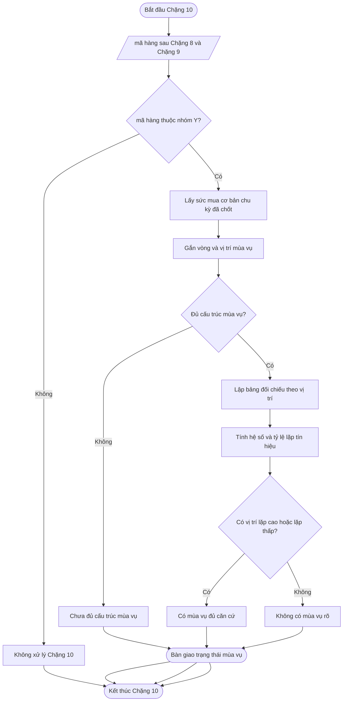

---

## Chặng 11 — Kiểm tra xu hướng cho nhóm Y

> **PHA 3 · Nhận diện cấu trúc nhu cầu, dự báo nền và áp hệ số khuyến mãi**

### 🎯 1. Vấn đề chặng này phải giải quyết

Chặng 11 cũng **chỉ dành cho nhóm Y**.

Sau Chặng 10, nhóm Y có thể rơi vào ba tình huống:

| Kết quả Chặng 10            | Việc Chặng 11 cần làm                                                                                              |
| ------------------------------- | ------------------------------------------------------------------------------------------------------------------------ |
| Có mùa vụ đủ căn cứ    | Chốt hướng xử lý được phép thử Holt-Winters ở Chặng 12.                                                             |
| Không có mùa vụ rõ       | Kiểm tra xem chuỗi có xu hướng tăng/giảm không.                                                                |
| Chưa đủ dữ liệu mùa vụ | Nếu vẫn đủ chu kỳ gần đây, kiểm tra xu hướng; nếu không đủ thì chuyển về cách dự báo nền đơn giản. |

Chặng 11 không xử lý nhóm X, Z, D. Nếu mã hàng nhóm X cần xem có được mở Holt hay không, việc kiểm tra xu hướng được thực hiện tại cửa **kiểm tra xu hướng của nhóm X** trong Chặng 12, dùng cùng nguyên lý 12 chu kỳ gần nhất chia thành 3 đoạn.

### 🎯 2. Mục tiêu

Chặng 11 tạo **điều kiện mở cách dự báo cho nhóm Y**:

| Điều kiện trong nhóm Y                                      | Cách dự báo được phép thử ở Chặng 12 |
| ----------------------------------------------------------------- | ------------------------------------------- |
| Có mùa vụ đủ căn cứ                                      | Holt-Winters.                             |
| Không có mùa vụ rõ nhưng có xu hướng đủ căn cứ     | Holt.                                     |
| Không có mùa vụ rõ và không có xu hướng đủ căn cứ | SES hoặc cách dự báo nền ổn định.      |

Cách hiểu ngắn:

> **Y có mùa vụ → Holt-Winters.**
> **Y không mùa vụ nhưng có xu hướng → Holt.**
> **Y không mùa vụ, không xu hướng → SES hoặc nền ổn định.**

### 3. Dữ liệu cần dùng

| Dữ liệu                      | Nguồn                | Cách dùng                                                                                 |
| -------------------------------- | ----------------------- | --------------------------------------------------------------------------------------------- |
| mã hàng nhóm Y                    | Chặng 8 và Chặng 9 | Chỉ xử lý đúng nhóm Y.                                                                |
| Trạng thái mùa vụ          | Chặng 10              | Quyết định có mở Holt-Winters hay không.                                              |
| Sức mua cơ bản theo chu kỳ | Chặng 6              | Dùng để kiểm tra xu hướng khi không mở Holt-Winters.                                |
| Cấu trúc chuỗi xu hướng   | Chặng 6              | Xác nhận chuỗi có đủ số chu kỳ đã chốt để chia đoạn và so sánh xu hướng. |

### 4. Cách kiểm tra xu hướng khi nhóm Y không có mùa vụ rõ

Hệ thống lấy **12 chu kỳ gần nhất đã chốt từ Chặng 6** và chia thành 3 đoạn:

| Đoạn   |          Số chu kỳ | Cách hiểu               |
| ---------- | ---------------------: | --------------------------- |
| Đoạn 1 |   4 chu kỳ cũ hơn | Mặt bằng trước đó.  |
| Đoạn 2 |      4 chu kỳ giữa | Mặt bằng chuyển tiếp. |
| Đoạn 3 | 4 chu kỳ gần nhất | Mặt bằng mới nhất.    |

Tính trung bình từng đoạn, sau đó so sánh:

$$
g_1=\frac{\bar{Y}_2-\bar{Y}_1}{\bar{Y}_1}

$$

$$
g_2=\frac{\bar{Y}_3-\bar{Y}_2}{\bar{Y}_2}

$$

Trong đó, $\bar{Y}_1$, $\bar{Y}_2$ và $\bar{Y}_3$ lần lượt là sức mua cơ bản bình quân của ba đoạn.

### 📐 5. Quy tắc kết luận xu hướng

Ngưỡng khởi điểm đề xuất:

| Kết quả                                   | Kết luận                           |
| --------------------------------------------- | -------------------------------------- |
| Mức đổi 1 ≥ 5% và mức đổi 2 ≥ 5%   | Có xu hướng tăng đủ căn cứ.  |
| Mức đổi 1 ≤ -5% và mức đổi 2 ≤ -5% | Có xu hướng giảm đủ căn cứ.  |
| Các trường hợp còn lại                | Không có xu hướng đủ căn cứ. |

Ngưỡng 5% là giá trị điều chỉnh chính sách để lọc dao động nhỏ. Giá trị điều chỉnh này phải có phiên bản phê duyệt trước khi vận hành chính thức; Chặng 20 chỉ tạo đề xuất cho phiên bản chính sách tương lai nếu hậu kiểm cho thấy cần điều chỉnh.

### 6. Giới hạn an toàn cho xu hướng

Vì Hachi có thời gian nhập khẩu thường kéo dài **3–6 tháng**, xu hướng không được phép đẩy dự báo quá mạnh ngay lập tức.

| Mức xu hướng thô | Cách xử lý                                              |
| ---------------------- | ------------------------------------------------------------ |
| Trong phạm vi 15%   | Cho phép Chặng 12 thử Holt theo mức xu hướng này.   |
| Trên 15% đến 25%  | Giới hạn về 15% và ghi cảnh báo.                     |
| Trên 25%            | Giới hạn về 15% và chuyển trạng thái cần xem xét. |

### 7. Công tắc cách dự báo của nhóm Y

| Kết quả Chặng 10            | Kết quả Chặng 11                                  | Hướng xử lý cách dự báo ở Chặng 12                                  |
| ------------------------------- | ------------------------------------------------------ | ---------------------------------------------------------------- |
| Có mùa vụ đủ căn cứ    | Không cần xét thêm xu hướng để mở cách dự báo | 12Y — Holt-Winters.                                           |
| Không có mùa vụ rõ       | Có xu hướng đủ căn cứ                         | 12Y — Holt.                                                   |
| Không có mùa vụ rõ       | Không có xu hướng đủ căn cứ                  | 12Y — SES hoặc nền ổn định.                              |
| Chưa đủ dữ liệu mùa vụ | Có xu hướng đủ căn cứ                         | 12Y — Holt, nhưng trạng thái cần theo dõi.               |
| Chưa đủ dữ liệu mùa vụ | Không đủ dữ liệu xu hướng                     | 12Y — SES hoặc nền ổn định, trạng thái tin cậy thấp. |

### 📦 8. Đầu ra bàn giao

| Đầu ra                                 | Ý nghĩa                                                    | Chặng sau dùng     |
| ------------------------------------------ | -------------------------------------------------------------- | ---------------------- |
| Trạng thái mùa vụ nhóm Y            | Kết quả từ Chặng 10.                                      | Chặng 12            |
| Trạng thái xu hướng nhóm Y          | Tăng / giảm / không rõ / không đủ dữ liệu.          | Chặng 12            |
| Cách dự báo được phép thử cho nhóm Y | Holt-Winters, Holt hoặc SES.                                | Chặng 12            |
| Lý do chuyển hướng xử lý                    | Vì có mùa vụ, có xu hướng hoặc không đủ căn cứ. | Chặng 12, Chặng 20 |
| Cảnh báo xu hướng nếu có           | Xu hướng bị giới hạn hoặc cần xem xét.               | Chặng 12, Chặng 20 |

### 🔀 9. Sơ đồ các bước

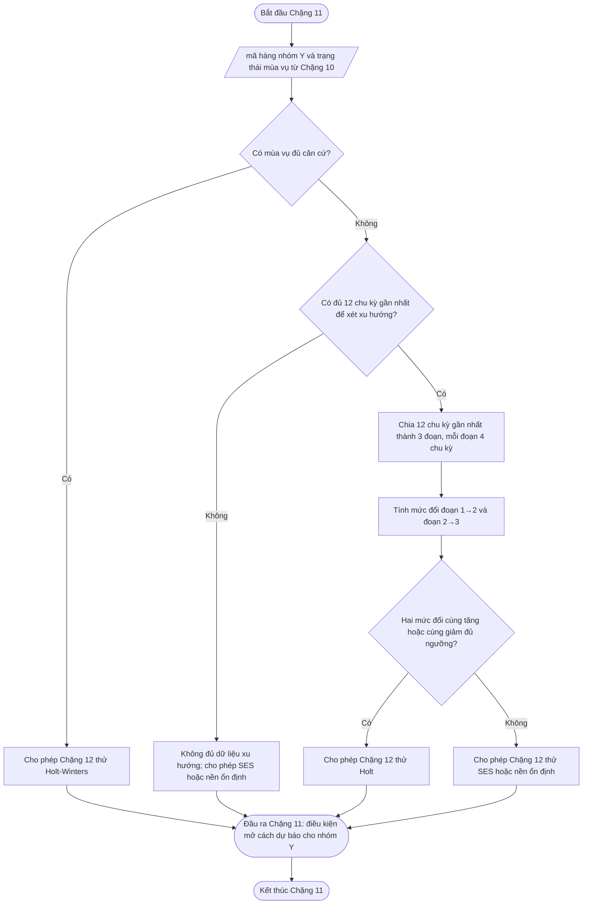

---

## Chặng 12 — Chọn cách dự báo phù hợp cho từng nhóm

> **PHA 3 · Nhận diện cấu trúc nhu cầu, dự báo nền và áp hệ số khuyến mãi**

### 🎯 1. Vấn đề chặng này phải giải quyết

Chặng 12 là nơi tạo **dự báo nền** cho từng mã hàng — nơi bán — chu kỳ.

Đến Chặng 12, dữ liệu đã đi qua:

| Nguồn trước đó                                      | Chặng 12 dùng để làm gì?                                          |
| ---------------------------------------------------------- | ------------------------------------------------------------------------- |
| Sức mua cơ bản theo chu kỳ từ Chặng 6              | Là chuỗi số chính để dự báo.                                    |
| Nhóm ABC từ Chặng 7                                   | Biết mức quan trọng về giá trị.                                   |
| Nhóm X/Y/Z/D từ Chặng 8                               | Chọn hướng dự báo phù hợp với dạng nhu cầu.                   |
| Chính sách vận hành từ Chặng 9                     | Biết mức ưu tiên và mức kiểm soát.                              |
| Riêng nhóm Y: mùa vụ và xu hướng từ Chặng 11–11 | Quyết định dùng Holt-Winters, Holt hay SES.                         |
| Nhóm X/Y: kiểm tra chu kỳ ngắn ngay trong Chặng 12 | Phát hiện mẫu lặp 2–12 chu kỳ mà mùa vụ năm ở Chặng 10 không bao phủ. |
| Hệ số khuyến mãi lịch sử từ Chặng 13                       | Không dùng trong dự báo nền; chỉ dùng sau khi có dự báo nền. |

Chặng 12 không làm sạch dữ liệu lại từ đầu. Chặng này chỉ nhận chuỗi **sức mua cơ bản đã sạch hơn** và chọn cách dự báo phù hợp.

Điểm chốt:

> **Dự báo nền là dự báo sức mua bình thường, chưa cộng tác động khuyến mãi tương lai.**

Nếu có kế hoạch khuyến mãi tương lai đã xác nhận, tác động khuyến mãi sẽ được áp ở Chặng 14, không cộng trực tiếp trong Chặng 12.

### 2. Các cách dự báo chính thức dùng trong Chặng 12

Chặng 12 có nhiều cách dự báo chính thức, nhưng hệ thống quản lý không chạy tất cả cách dự báo cho tất cả mã hàng. Mỗi cách dự báo có **điều kiện mở ứng viên** riêng. Chỉ cách dự báo đạt điều kiện mở ứng viên mới được chạy kiểm tra ngược.

| Mã cách dự báo | Nhóm áp dụng | Cách dự báo | Điều kiện mở ứng viên | Chi phí tính toán tương đối | Cách hiểu đơn giản |
| --- | --- | --- | --- | --- | --- |
| 11-SES | X/Y | SES | Có chuỗi sức mua cơ bản hợp lệ; không cần tín hiệu xu hướng hoặc mùa vụ. | Thấp | Lấy mặt bằng gần nhất làm dự báo. |
| 11-HOLT | X/Y | Holt | Nhóm Y có xu hướng từ Chặng 11, hoặc nhóm X đạt cửa **kiểm tra xu hướng của nhóm X** trong Chặng 12. | Trung bình | Học cả mặt bằng và hướng tăng/giảm. |
| 11-HW | Y | Holt-Winters | Chặng 10 xác nhận mùa vụ năm đủ căn cứ. | Cao | Học mặt bằng, xu hướng và mùa vụ năm. |
| 12XY-SN | X/Y | Seasonal-naïve | Bước kiểm tra chu kỳ ngắn 2–12 trên giai đoạn dùng để học tìm được $p$ hợp lệ. | Thấp | Lấy nhu cầu ở cùng vị trí trong vòng lặp ngắn gần nhất. |
| 11-CROSTON | Z | Croston | Nhu cầu bán thưa, có đủ lần phát sinh để ước lượng bình quân. | Thấp đến trung bình | Tính bình quân cho nhu cầu phát sinh không đều. |
| 11-PULSE | Z | Cách dự báo nhịp phát sinh | Nhóm Z có khoảng cách phát sinh ổn định đủ căn cứ. | Thấp | Dự báo đúng chu kỳ nào sẽ phát sinh nhu cầu. |
| 11-D | D | Kế hoạch Thu mua hoặc mã hàng tương tự | mã hàng mới, thiếu lịch sử hoặc chưa đủ căn cứ tự học. | Thấp | Dùng kế hoạch hoặc mã tương tự đã duyệt thay vì tự học. |

Seasonal-naïve là cách dự báo chính thức ngang hàng với SES, Holt và Holt-Winters trong Chặng 12. Điểm khác biệt là Seasonal-naïve không tối ưu hệ số làm mượt; cách dự báo này chọn chu kỳ lặp $p^*$ trên giai đoạn dùng để học rồi kiểm tra ngược như các cách dự báo khác.

#### 2.1. Tín hiệu cấu trúc được nhìn thấy bằng cách nào

Các cụm “có xu hướng rõ”, “có mùa vụ rõ” và “có nhịp lặp ngắn rõ” không phải do người vận hành nhìn biểu đồ rồi kết luận. Mỗi tín hiệu phải được tạo ra bởi một **cửa kiểm tra có công thức và điều kiện đầu vào rõ ràng**.

| Tín hiệu cần nhận diện | Cửa kiểm tra chịu trách nhiệm | Phạm vi mã hàng | Dữ liệu dùng | Cách nhìn thấy trong hệ thống | Kết quả bàn giao |
| --- | --- | --- | --- | --- | --- |
| Xu hướng dài hạn | Chặng 11 cho nhóm Y; cửa **kiểm tra xu hướng của nhóm X** trong Chặng 12 cho nhóm X. | X/Y | 12 chu kỳ gần nhất đã chốt từ Chặng 6. | Chia 12 chu kỳ thành 3 đoạn, mỗi đoạn 4 chu kỳ; so hai mức đổi liên tiếp. | Có xu hướng tăng, có xu hướng giảm, không có xu hướng đủ căn cứ hoặc không đủ dữ liệu. |
| Mùa vụ năm | Chặng 10. | Y | Các vị trí mùa vụ trong vòng năm, mặc định 24 vị trí/vòng. | So cùng vị trí mùa vụ qua các vòng năm. | Có mùa vụ đủ căn cứ, không có mùa vụ rõ hoặc chưa đủ dữ liệu mùa vụ. |
| Nhịp lặp ngắn | Cửa **kiểm tra nhịp lặp ngắn của nhóm X/Y** trong Chặng 12. | X/Y | Tập học của chuỗi sức mua cơ bản theo chu kỳ. | Thử độ dài vòng lặp 2–12 chu kỳ và đo độ giống nhau giữa chuỗi hiện tại với chuỗi lùi theo từng độ dài. | Có chu kỳ ngắn đủ căn cứ hoặc không có chu kỳ ngắn đủ căn cứ. |
| Bán thưa/nhịp phát sinh | Hướng xử lý nhóm Z trong Chặng 12. | Z | Chu kỳ có nhu cầu lớn hơn 0 và khoảng cách giữa các lần phát sinh. | Đo khoảng cách phát sinh và độ ổn định của khoảng cách. | Croston hoặc cách dự báo nhịp phát sinh. |

Vì vậy, Chặng 11 chỉ trả lời câu hỏi về **xu hướng dài hạn của nhóm Y**. Chặng 11 không nhận diện nhịp lặp ngắn. Nhịp lặp ngắn là tín hiệu riêng của Chặng 12, do cửa **kiểm tra nhịp lặp ngắn của nhóm X/Y** kiểm tra.

Đối với nhóm X, vì Chặng 11 không xử lý nhóm X, Chặng 12 phải có cửa **kiểm tra xu hướng của nhóm X** để kiểm tra xu hướng dài hạn trước khi mở Holt. Cửa này dùng cùng nguyên lý với Chặng 11: 12 chu kỳ gần nhất, chia 3 đoạn, hai mức đổi liên tiếp phải cùng chiều và vượt ngưỡng chính sách.

#### 2.2. Cách hiểu đúng về chữ “kích hoạt cách dự báo”

Trong Chặng 12, “kích hoạt cách dự báo” không có nghĩa là cách dự báo đó được chọn ngay. “Kích hoạt” chỉ có nghĩa là cách dự báo đó **được đưa vào danh sách ứng viên** để kiểm tra ngược.

Chặng 12 quyết định theo hai bước:

| Bước | Việc hệ thống làm | Ý nghĩa |
| ---: | --- | --- |
| 1 | Mở các cách dự báo ứng viên theo điều kiện dữ liệu. | Biết cách dự báo nào đủ tư cách được thử. |
| 2 | Kiểm tra ngược toàn bộ ứng viên trên cùng tập kiểm tra. | Chọn cách dự báo thắng theo sai số, Bias và ngưỡng chính sách. |

Vì vậy, Holt và Seasonal-naïve không loại trừ nhau ngay từ đầu. Một mã hàng nhóm X hoặc Y có thể đồng thời mở Holt và Seasonal-naïve. Khi đó, cách dự báo cuối cùng chỉ được chốt sau khi so sánh ngoài mẫu.

| Cách dự báo | Khi nào được kích hoạt làm ứng viên? | Khi nào được chốt làm cách dự báo cuối? |
| --- | --- | --- |
| SES | Nhóm X/Y có đủ chuỗi sức mua cơ bản hợp lệ. SES là cách dự báo đối chứng mặc định. | Khi không có cách dự báo phức tạp hơn thắng SES và SES đạt ngưỡng sai số. |
| Holt | Chuỗi có xu hướng tăng/giảm đủ căn cứ trên tập học. | Khi Holt thắng SES trên kiểm tra ngược, Bias đạt ngưỡng và xu hướng không vượt giới hạn an toàn. |
| Holt-Winters | Nhóm Y có mùa vụ năm đủ căn cứ theo Chặng 10. | Khi Holt-Winters thắng các cách dự báo đối chứng và đạt ngưỡng sai số. |
| Seasonal-naïve | Nhóm X/Y có ít nhất một chu kỳ ngắn $p \in \{2,3,...,12\}$ đạt điều kiện dữ liệu và $r(p) \ge r_{\min}$. | Khi Seasonal-naïve thắng cách dự báo đối chứng trên kiểm tra ngược và đạt ngưỡng sai số của nhóm ABC/XYZ. |

Điểm quan trọng: **Holt trả lời câu hỏi “nhu cầu có đang tăng/giảm theo một hướng không?”; Seasonal-naïve trả lời câu hỏi “nhu cầu có lặp lại theo vị trí trong một vòng ngắn không?”** Đây là hai cấu trúc khác nhau, nên hệ thống phải kiểm tra bằng hai bước kiểm tra khác nhau.

#### 2.3. Không dùng logic phương án thay thế theo sai số

Chặng 12 không vận hành theo kiểu:

```text
SES sai lớn
→ thử Holt
→ Holt vẫn sai lớn
→ thử Seasonal-naïve
```

Logic trên không đúng, vì nó dùng sai số của cách dự báo trước để mở cách dự báo sau. Thiết kế đúng là:

```text
Đọc cấu trúc nhu cầu trên giai đoạn dùng để học
→ mở các cách dự báo ứng viên phù hợp
→ kiểm tra ngược toàn bộ ứng viên trên giai đoạn dùng để kiểm tra
→ chốt cách dự báo thắng nếu đạt ngưỡng
```

Sai số lớn trên giai đoạn dùng để kiểm tra chỉ có hai vai trò:

| Vai trò | Ý nghĩa |
| --- | --- |
| So sánh cách dự báo ứng viên | Biết ứng viên nào dự báo tốt hơn ngoài mẫu. |
| Chặn chốt tự động | Nếu tất cả cách dự báo đều sai lớn hoặc Bias vượt ngưỡng, mã hàng chuyển `Cần xem lại cách dự báo`. |

Sai số lớn **không phải điều kiện mở Seasonal-naïve**. Seasonal-naïve chỉ được mở khi tập học có tín hiệu chu kỳ ngắn đủ căn cứ.

#### 2.4. Các tình huống quyết định của nhóm X

Nhóm X là nhóm bán tương đối đều. Vì vậy SES luôn là ứng viên nền mặc định. Holt và Seasonal-naïve chỉ được thêm nếu có tín hiệu cấu trúc riêng.

| Tình huống nhóm X | Ứng viên được mở | Cách chọn cuối cùng |
| --- | --- | --- |
| Không có xu hướng, không có chu kỳ ngắn | SES | Chốt SES nếu đạt ngưỡng sai số. |
| Có xu hướng, không có chu kỳ ngắn | SES, Holt | Chốt Holt nếu Holt thắng SES và đạt ngưỡng; nếu không, giữ SES nếu SES đạt ngưỡng. |
| Không có xu hướng, có chu kỳ ngắn | SES, Seasonal-naïve | Chốt Seasonal-naïve nếu thắng SES và đạt ngưỡng; nếu không, giữ SES nếu SES đạt ngưỡng. |
| Có xu hướng và có chu kỳ ngắn | SES, Holt, Seasonal-naïve | Kiểm tra ngược cả ba; chốt cách dự báo thắng và đạt ngưỡng. |

Vì vậy, với nhóm X, không phải “SES sai lớn thì mới chuyển Holt”. Holt được mở do **tín hiệu xu hướng trên giai đoạn dùng để học**. Seasonal-naïve được mở do **tín hiệu chu kỳ ngắn trên giai đoạn dùng để học**.

#### 2.5. Các tình huống quyết định của nhóm Y

Nhóm Y có dao động mạnh hơn nhóm X, nên phải kiểm tra mùa vụ năm ở Chặng 10 và xu hướng ở Chặng 11 trước khi Chặng 12 chốt cách dự báo.

| Tình huống nhóm Y | Ứng viên chính | Nếu có chu kỳ ngắn đủ căn cứ | Cách chọn cuối cùng |
| --- | --- | --- | --- |
| Có mùa vụ năm đủ căn cứ | Holt-Winters | Thêm Seasonal-naïve | So Holt-Winters với Seasonal-naïve và các đối chứng theo chính sách. |
| Không có mùa vụ năm, có xu hướng | Holt, SES | Thêm Seasonal-naïve | So Holt, SES và Seasonal-naïve. |
| Không có mùa vụ năm, không có xu hướng | SES hoặc nền ổn định | Thêm Seasonal-naïve | So SES/nền ổn định với Seasonal-naïve. |
| Không đủ dữ liệu kiểm chứng | Dự báo tạm hoặc `Cần xem lại cách dự báo` | Không chốt tự động | Chờ đủ dữ liệu hoặc duyệt thủ công. |

Seasonal-naïve không thay thế Chặng 10. Mùa vụ năm trả lời câu hỏi theo vòng 24 vị trí trong năm; Seasonal-naïve trả lời câu hỏi theo vòng ngắn 2–12 chu kỳ trong Chặng 12.

#### 2.6. Giới hạn số cách dự báo ứng viên cho từng mã hàng

Để người đọc và bộ phận hỗ trợ hệ thống cùng hiểu rõ phạm vi tính toán, Chặng 12 đặt giới hạn ứng viên theo nhóm nhu cầu. hệ thống quản lý không được chạy toàn bộ cách dự báo cho mọi mã hàng.

| Nhóm mã hàng | Ứng viên luôn có | Ứng viên chỉ mở khi đạt bước kiểm tra điều kiện | Số ứng viên tối đa cần kiểm tra lại bằng dữ liệu quá khứ |
| --- | --- | --- | ---: |
| X | SES | Holt nếu có xu hướng; Seasonal-naïve nếu có chu kỳ ngắn. | 3 |
| Y có mùa vụ năm | Holt-Winters | Seasonal-naïve nếu có chu kỳ ngắn; SES/Holt làm đối chứng theo chính sách. | 4 |
| Y không mùa vụ, có xu hướng | SES, Holt | Seasonal-naïve nếu có chu kỳ ngắn. | 3 |
| Y không mùa vụ, không xu hướng | SES hoặc nền ổn định | Seasonal-naïve nếu có chu kỳ ngắn. | 2 |
| Z | Croston hoặc nhịp phát sinh | Chỉ mở một trong hai hướng chính theo cấu trúc phát sinh. | 1–2 |
| D | Kế hoạch Thu mua hoặc mã hàng tương tự | Không mở cách dự báo tự học. | 1 |

Các bước kiểm tra điều kiện phải chạy trước kiểm tra lại bằng dữ liệu quá khứ:

| Bước kiểm tra điều kiện | Chi phí tính toán | Cách dự báo được mở nếu đạt |
| --- | --- | --- |
| Bước kiểm tra xu hướng | Thấp | Holt |
| Bước kiểm tra mùa vụ năm | Trung bình, chỉ áp dụng cho nhóm Y | Holt-Winters |
| Bước kiểm tra chu kỳ ngắn 2–12 | Thấp | Seasonal-naïve |
| Bước kiểm tra bán thưa/nhịp phát sinh | Thấp | Croston hoặc nhịp phát sinh |

Quy tắc này bảo đảm hệ thống không tạo tổ hợp cách dự báo không cần thiết. Với 8000 mã hàng, số cách dự báo thực sự cần kiểm tra lại bằng dữ liệu quá khứ luôn nhỏ hơn nhiều so với phép nhân “8000 mã hàng × tất cả cách dự báo”.

### 📐 3. Quy tắc chuyển hướng xử lý cách dự báo

| Điều kiện                                                                          | Hướng xử lý xử lý                                                   |
| --------------------------------------------------------------------------------------- | ------------------------------------------------------------------ |
| Nhóm X có chuỗi hợp lệ | Mở phương pháp san bằng đơn (SES) làm ứng viên mặc định. |
| Nhóm X đạt cửa **kiểm tra xu hướng của nhóm X** trên 12 chu kỳ gần nhất | Mở thêm Holt làm ứng viên. |
| Nhóm X có chu kỳ ngắn 2–12 đủ căn cứ trên tập học | Mở thêm Seasonal-naïve làm ứng viên. |
| Nhóm Y, Chặng 10 xác nhận mùa vụ đủ căn cứ | Mở Holt-Winters làm ứng viên chính của nhóm Y mùa vụ. |
| Nhóm Y, không có mùa vụ đủ căn cứ nhưng Chặng 11 xác nhận xu hướng | Mở Holt làm ứng viên. |
| Nhóm Y, không có mùa vụ và không có xu hướng đủ căn cứ | Mở SES hoặc nền ổn định làm ứng viên. |
| Nhóm Y có chu kỳ ngắn 2–12 đủ căn cứ trên tập học | Mở thêm Seasonal-naïve làm ứng viên để so với ứng viên Y hiện có. |
| Nhóm Z có nhu cầu bán thưa nhưng khoảng cách phát sinh không ổn định     | 12Z — Croston bình quân.                                      |
| Nhóm Z có nhu cầu bán thưa và khoảng cách phát sinh ổn định đủ căn cứ | 12Z-P — cách dự báo nhịp phát sinh.                             |
| Nhóm D                                                                               | 12D — kế hoạch Thu mua hoặc mượn mã tương tự bằng công cụ gợi ý tự động. |

Nhóm Y là nhóm duy nhất bắt buộc đi qua Chặng 10 và Chặng 11 trước khi chọn cách dự báo cuối cùng. Kiểm tra chu kỳ ngắn 2–12 chu kỳ là một bước kiểm tra ứng viên riêng trong Chặng 12 cho cả nhóm X và Y; nó không thay thế kiểm tra mùa vụ năm của Chặng 10 và không bác bỏ xu hướng của Chặng 11.

Nếu một mã hàng mở nhiều ứng viên cùng lúc, ví dụ SES, Holt và Seasonal-naïve, Chặng 12 phải kiểm tra ngược toàn bộ ứng viên trên cùng tập kiểm tra. Cách dự báo cuối cùng là cách dự báo đạt chính sách chốt, có sai số tốt nhất theo thứ tự ưu tiên đã ban hành và không vi phạm Bias hoặc giới hạn vận hành.

#### 3.1. Cửa **kiểm tra xu hướng của nhóm X** cho nhóm X

Chặng 11 chỉ xử lý nhóm Y. Vì vậy, khi nhóm X cần xem có được mở Holt hay không, Chặng 12 phải tự chạy cửa **kiểm tra xu hướng của nhóm X**.

Cửa **kiểm tra xu hướng của nhóm X** không phải cách dự báo dự báo. Đây là cửa kiểm tra cấu trúc để trả lời:

> mã hàng nhóm X có đang tăng hoặc giảm theo hướng đủ rõ trong 12 chu kỳ gần nhất không?

Điều kiện đầu vào:

| Điều kiện | Quy định |
| --- | --- |
| Nhóm nhu cầu | mã hàng thuộc nhóm X. |
| Dữ liệu | Sức mua cơ bản theo chu kỳ đã chốt từ Chặng 6. |
| Độ dài tối thiểu | Có ít nhất 12 chu kỳ gần nhất hợp lệ. |
| Trạng thái dữ liệu | Không có lỗi quy định đầu vào làm chuỗi bị đứt đoạn trong vùng kiểm tra. |

Cách đo:

| Bước | Cách làm | Kết quả |
| ---: | --- | --- |
| 1 | Lấy 12 chu kỳ gần nhất đã chốt. | Có vùng kiểm tra xu hướng dài hạn. |
| 2 | Chia thành 3 đoạn, mỗi đoạn 4 chu kỳ. | Đoạn cũ, đoạn giữa, đoạn mới. |
| 3 | Tính trung bình từng đoạn. | Có $\overline{Y}_1$, $\overline{Y}_2$, $\overline{Y}_3$. |
| 4 | Tính mức đổi từ đoạn 1 sang đoạn 2 và từ đoạn 2 sang đoạn 3. | Có hai mức đổi liên tiếp. |
| 5 | Kết luận xu hướng nếu hai mức đổi cùng chiều và vượt ngưỡng. | Biết có mở Holt hay không. |

Công thức:

$$
g_1=\frac{\overline{Y}_2-\overline{Y}_1}{\overline{Y}_1}
$$

$$
g_2=\frac{\overline{Y}_3-\overline{Y}_2}{\overline{Y}_2}
$$

Quy tắc kết luận:

| Điều kiện | Kết quả |
| --- | --- |
| $g_1 \ge 5\%$ và $g_2 \ge 5\%$ | Có xu hướng tăng đủ căn cứ; mở Holt làm ứng viên. |
| $g_1 \le -5\%$ và $g_2 \le -5\%$ | Có xu hướng giảm đủ căn cứ; mở Holt làm ứng viên. |
| Hai mức đổi trái chiều | Không mở Holt theo cửa xu hướng. |
| Một mức đổi đạt ngưỡng, mức còn lại không đạt | Không mở Holt theo cửa xu hướng. |
| Không đủ 12 chu kỳ hợp lệ | Không mở Holt; không xem là lỗi cách dự báo. |

Ngưỡng 5% là giá trị điều chỉnh chính sách. Giới hạn an toàn xu hướng vẫn áp dụng như Chặng 11: xu hướng dùng cho dự báo không được vượt biên vận hành đã phê duyệt.

#### 3.2. Cửa **kiểm tra nhịp lặp ngắn của nhóm X/Y** cho nhịp lặp ngắn

Cửa **kiểm tra nhịp lặp ngắn của nhóm X/Y** không tìm xu hướng dài hạn. Cửa này chỉ trả lời:

> mã hàng nhóm X/Y có lặp lại theo vòng ngắn từ 2 đến 12 chu kỳ không?

Điểm phân biệt:

| Nội dung | Cửa xu hướng **kiểm tra xu hướng của nhóm X** / Chặng 11 | Cửa nhịp lặp ngắn **kiểm tra nhịp lặp ngắn của nhóm X/Y** |
| --- | --- | --- |
| Câu hỏi | Nhu cầu có tăng/giảm theo một hướng không? | Nhu cầu có lặp lại theo vị trí trong một vòng ngắn không? |
| Dữ liệu nhìn chính | 12 chu kỳ gần nhất. | Tập học của Chặng 12. |
| Cách đo | So mặt bằng 3 đoạn liên tiếp. | So chuỗi hiện tại với chuỗi lùi 2–12 chu kỳ. |
| Cách dự báo được mở | Holt. | Seasonal-naïve. |
| Quan hệ với Chặng 11 | Cùng bản chất xu hướng dài hạn. | Không thuộc Chặng 11. |

Vì vậy, một mã hàng có thể:

| Trường hợp | Ý nghĩa |
| --- | --- |
| Có xu hướng nhưng không có nhịp lặp ngắn | Mở Holt, không mở Seasonal-naïve. |
| Không có xu hướng nhưng có nhịp lặp ngắn | Mở Seasonal-naïve, không mở Holt. |
| Có cả xu hướng và nhịp lặp ngắn | Mở cả Holt và Seasonal-naïve rồi kiểm tra ngược. |
| Không có cả hai | Chỉ giữ cách dự báo nền đơn giản phù hợp, thường là SES hoặc nền ổn định. |

### 📐 4. Quy trình chung trước khi chạy cách dự báo

Dù chọn cách dự báo nào, hệ thống quản lý cần thực hiện cùng một bộ bước chuẩn trước khi tính dự báo.

| Bước | Việc cần làm                                                                                        | Kết quả                                                                                                                               |
| -------: | -------------------------------------------------------------------------------------------------------- | ----------------------------------------------------------------------------------------------------------------------------------------- |
|      1 | Lấy chuỗi sức mua cơ bản theo chu kỳ từ Chặng 6.                                               | Chuỗi $Y_t$ theo mã hàng — nơi bán — chu kỳ.                                                                                           |
|      2 | Kiểm tra chuỗi có đủ điều kiện cấu trúc cho cách dự báo ứng viên.                            | Biết cách dự báo nào được phép thử, không xử lý ngược chuỗi đã chốt.                                                      |
|      3 | Ghi nhận các dấu hiệu nghiệp vụ đã được chặng trước bàn giao.                                  | Dùng để giải thích sai số và đối chiếu, không dùng để loại lại dữ liệu.                                                |
|      4 | Xác định nhóm X/Y/Z/D sau Chặng 8.                                                                | Biết hướng cách dự báo.                                                                                                                |
|      5 | Chọn cách dự báo theo bảng chuyển hướng xử lý.                                                             | Có cách dự báo ứng viên.                                                                                                               |
|      6 | Chia dữ liệu theo thời gian thành tập học và tập kiểm tra ngược; không trộn ngẫu nhiên. | Ngăn rò rỉ dữ liệu tương lai vào quá trình học.                                                                              |
|      7 | Ước lượng giá trị điều chỉnh trên tập học bằng cơ chế tối ưu được thiết lập.                     | Có bộ giá trị điều chỉnh ứng viên và trạng thái hội tụ.                                                                                  |
|      8 | Đánh giá ngoài mẫu trên tập kiểm tra ngược.                                                  | Có $\operatorname{RMSE}$, $\operatorname{nRMSE}$, $\operatorname{WAPE}$, $\operatorname{Bias}$ và chỉ tiêu phụ theo nhóm nhu cầu. |
|      9 | Chọn cách dự báo đạt chính sách và tính dự báo nền tương lai.                                | Có dự báo nền trước khuyến mãi.                                                                                                         |
|     10 | Lưu giá trị điều chỉnh, hàm mục tiêu, phiên bản cách tính và trạng thái phát hành.                 | Chốt, cần xem xét hoặc ngoại lệ; có thể tái lập kết quả.                                                                    |

#### 4.0. Quy trình chạy thử tính toán Chặng 12 theo từng bước

Mục này là quy định vận hành cho chạy thử. Bảng dưới đây giúp mọi bộ phận hiểu vì sao một mã hàng được đưa sang cách dự báo này thay vì cách khác.

| Bước | Tên bước | Cách tính hoặc điều kiện xét | Kết quả đạt | Kết quả không đạt |
| ---: | --- | --- | --- | --- |
| 1 | chốt chuỗi đầu vào | Đọc chuỗi sức mua cơ bản $Y_t$ từ Chặng 6 theo mã hàng — nơi bán — chu kỳ. | Cho phép vào Chặng 12. | Chặn cách dự báo và ghi thiếu quy định đầu vào. |
| 2 | Xác định nhóm nhu cầu | Đọc ghi chú X/Y/Z/D từ Chặng 8. | Chọn nhóm cửa cần chạy. | Không tự phân loại lại tại Chặng 12. |
| 3 | Chia tập học và tập kiểm tra | Chia theo thời gian; phần cũ là tập học, phần mới hơn là tập kiểm tra. | Có dữ liệu để học và kiểm tra ngược. | Nếu tập kiểm tra quá ngắn thì gắn dấu hiệu độ tin cậy thấp. |
| 4 | Mở cách dự báo nền mặc định | Nhóm X/Y mở SES làm cách dự báo đối chứng đơn giản. | SES vào danh sách ứng viên. | Không áp dụng cho nhóm D; nhóm Z đi cửa riêng. |
| 5 | Đọc cửa mùa vụ năm của nhóm Y | Dùng kết quả Chặng 10, không tính lại. | Nếu **kiểm tra mùa vụ của nhóm Y** đạt thì mở Holt-Winters. | Nếu không đạt thì xét tiếp xu hướng nhóm Y. |
| 6 | Đọc cửa xu hướng nhóm Y | Dùng kết quả Chặng 11. | Nếu **kiểm tra xu hướng của nhóm Y** đạt thì mở Holt. | Nếu không đạt thì không mở Holt vì lý do xu hướng. |
| 7 | Tính cửa xu hướng nhóm X | Lấy 12 chu kỳ gần nhất, chia 3 đoạn, tính hai mức đổi liên tiếp. | Nếu hai mức đổi cùng chiều và đạt ngưỡng thì mở Holt. | Nếu không đủ 12 chu kỳ hoặc không đạt ngưỡng thì không mở Holt. |
| 8 | Tính cửa nhịp lặp ngắn nhóm X/Y | Thử từng độ dài vòng lặp từ 2 đến 12 trên tập học; tính độ giống nhau bằng tương quan Pearson. | Nếu có vòng đạt ngưỡng thì mở Seasonal-naïve. | Nếu không có vòng đạt ngưỡng thì không mở Seasonal-naïve. |
| 9 | Tính cửa nhóm Z | Đo khoảng cách giữa các chu kỳ có nhu cầu lớn hơn 0. | Nếu nhịp phát sinh ổn định thì mở cách dự báo nhịp phát sinh; nếu không thì xét Croston. | Nếu dữ liệu quá thưa hoặc thiếu căn cứ thì chuyển ngoại lệ. |
| 10 | Tạo danh sách ứng viên cuối cùng | Gom các cách dự báo đã được cửa điều kiện mở. | Có danh sách cách dự báo cần kiểm tra ngược. | Nếu không có cách dự báo hợp lệ thì chuyển trạng thái cần xem xét. |
| 11 | Tính dự báo kiểm tra ngược | Mỗi ứng viên dự báo trên cùng tập kiểm tra. | Có dự báo ngoài mẫu cho từng cách dự báo. | Cách dự báo lỗi chi tiết bị loại và ghi lý do. |
| 12 | Tính sai số | Tính $\operatorname{WAPE}$, $\operatorname{RMSE}$, $\operatorname{nRMSE}$, $\operatorname{Bias}$ và chỉ tiêu phụ nếu có. | Có bảng so sánh công bằng. | Nếu tập kiểm tra không đủ tin cậy thì không chốt tự động. |
| 13 | Chọn cách dự báo dự báo nền | Áp dụng ngưỡng sai số, quy tắc thắng cách dự báo đối chứng và dấu hiệu dữ liệu. | chốt cách dự báo hoặc đưa vào danh sách cần xem xét. | Không tự chuyển sang cách dự báo khác theo kiểu thử sai tuần tự. |
| 14 | Tạo dự báo nền tương lai | Dùng cách dự báo đã chọn để dự báo các chu kỳ tương lai trước khuyến mãi. | Bàn giao Chặng 14 và Chặng 16. | Nếu chưa chốt được thì bàn giao dự báo tạm hoặc ngoại lệ theo chính sách. |

Chi tiết hai cửa dễ gây nhầm lẫn nhất:

| Cửa | Dữ liệu dùng | Cách tính tóm tắt | Điều kiện đạt | Cách dự báo được mở |
| --- | --- | --- | --- | --- |
| **kiểm tra xu hướng của nhóm X** | 12 chu kỳ gần nhất của nhóm X. | Chia 12 chu kỳ thành 3 đoạn, mỗi đoạn 4 chu kỳ; tính trung bình từng đoạn và hai mức đổi liên tiếp. | Cả hai mức đổi cùng tăng hoặc cùng giảm và cùng vượt ngưỡng chính sách. | Holt. |
| **kiểm tra nhịp lặp ngắn của nhóm X/Y** | Tập học của nhóm X/Y. | Với từng vòng lặp $p=2,3,...,12$, ghép chuỗi hiện tại với chuỗi lùi $p$ kỳ và tính tương quan Pearson. | Có ít nhất một $p$ đủ số vòng, đủ biến động và đạt ngưỡng giống nhau. | Seasonal-naïve. |

Quy tắc quan trọng: **kiểm tra xu hướng của nhóm X** và **kiểm tra nhịp lặp ngắn của nhóm X/Y** là hai cửa độc lập. Một mã hàng có thể đạt một cửa, đạt cả hai cửa hoặc không đạt cửa nào. Vì vậy, Holt và Seasonal-naïve không phải quan hệ thay thế tuần tự; chúng là hai ứng viên được mở bởi hai dấu hiệu cấu trúc khác nhau.

#### 4.1. Cách chọn các giá trị điều chỉnh

SES, Holt, Holt-Winters và Croston đều có một hoặc nhiều giá trị điều chỉnh. Các giá trị này quyết định mức độ ưu tiên dữ liệu mới so với dữ liệu cũ.

Quy trình chọn phải tuân theo nguyên tắc:

- chỉ dùng phần lịch sử dành cho việc học để chọn giá trị;
- giữ riêng phần lịch sử mới hơn để kiểm tra;
- không tiếp tục sửa giá trị sau khi đã nhìn kết quả của phần kiểm tra;
- ưu tiên cách dự báo đơn giản hơn khi hai cách có kết quả gần nhau;
- không chốt tự động nếu kết quả thay đổi quá mạnh chỉ vì thay một giá trị nhỏ.

Các giá trị cần chọn:

| Cách dự báo | Giá trị cần chọn |
| --- | --- |
| SES | Mức độ ưu tiên dữ liệu mới $\alpha$ |
| Holt | Mức độ ưu tiên mức bán $\alpha$ và xu hướng $\beta$ |
| Holt-Winters | Mức độ ưu tiên mức bán $\alpha$, xu hướng $\beta$ và mùa vụ $\gamma$ |
| Croston | Mức độ làm mới quy mô bán và khoảng cách giữa các lần bán |
| Seasonal-naïve | Độ dài nhịp lặp từ 2 đến 12 chu kỳ |

#### 4.2. Giới hạn an toàn

Các giá trị điều chỉnh phải nằm trong khoảng từ 0 đến 1. Giá trị gần 1 phản ứng nhanh với dữ liệu mới; giá trị gần 0 giữ nhiều ảnh hưởng của lịch sử cũ.

Quy tắc khởi điểm:

- $0 \le \alpha,\beta,\gamma \le 1$;
- với Holt, nên ưu tiên $\beta \le \alpha$ để xu hướng không thay đổi quá nhanh;
- với Holt-Winters, chỉ dùng khi mùa vụ đã đủ căn cứ;
- với Croston, chỉ dùng khi có đủ số lần phát sinh nhu cầu;
- không chọn một bộ giá trị chỉ vì nó cho sai số rất thấp trên phần dữ liệu dùng để học.

#### 4.3. Trình tự lựa chọn

| Bước | Việc thực hiện |
| ---: | --- |
| 1 | Chia lịch sử thành phần dùng để học và phần dùng để kiểm tra. |
| 2 | Thử các giá trị điều chỉnh theo bước lớn, ví dụ 0,1; 0,2; ...; 0,9. |
| 3 | Chọn một số bộ có kết quả tốt nhất trên phần dùng để học. |
| 4 | Thử kỹ hơn quanh các bộ tốt nhất với bước nhỏ hơn. |
| 5 | Dùng phần dữ liệu kiểm tra để đánh giá một lần công bằng. |
| 6 | So sánh sai số, độ lệch và ảnh hưởng đến thiếu hàng, dư tồn, vốn. |
| 7 | Chốt cách dự báo thắng nếu đạt điều kiện; nếu không thì chuyển sang xem xét. |

Cách thử từ rộng đến hẹp giúp người đọc có thể kiểm tra lại vì sao một bộ giá trị được chọn. Đây là cách khởi điểm; các giá trị cuối cùng phải được xác nhận bằng kết quả thực tế của Hachi.

#### 4.4. Khi một cách dự báo không cho kết quả đáng tin

| Tình huống | Cách xử lý |
| --- | --- |
| Kết quả thay đổi bất thường khi thay nhẹ giá trị điều chỉnh | Không chốt tự động; xem lại dữ liệu và giới hạn lựa chọn. |
| Holt-Winters không ổn định | Xem lại căn cứ mùa vụ; nếu mùa vụ không đủ thì dùng Holt hoặc SES. |
| Holt không tốt hơn SES | Dùng SES vì đơn giản hơn. |
| Croston không đủ số lần phát sinh nhu cầu | Không tự động dùng; xem xét mã hàng mới, mã hàng bán quá thưa hoặc kế hoạch ngành hàng. |
| Không có cách nào đạt ngưỡng | Giữ kết quả ở trạng thái cần xem xét, không tự chọn phương án có sai số thấp nhất. |

Không được thử lần lượt nhiều cách rồi chọn cách cuối cùng chỉ vì các cách trước thất bại. Mọi cách được so sánh phải dùng cùng một phần dữ liệu kiểm tra.

#### 4.5. Thông tin cần ghi lại

Mỗi kết quả dự báo phải ghi rõ:

- cách dự báo đã thử;
- các giá trị điều chỉnh đã dùng;
- khoảng thời gian dùng để học;
- khoảng thời gian dùng để kiểm tra;
- sai số của từng cách;
- cách dự báo được chọn;
- lý do chọn hoặc loại;
- trường hợp cần người xem xét;
- ngày thực hiện và bộ dữ liệu được dùng.

Mục đích là để người phụ trách ngành hàng, tài chính, cung ứng và lãnh đạo đều có thể hiểu vì sao kết quả được chốt.

### 5. Cách dự báo SES — San bằng mũ đơn

#### 5.1. Khi nào dùng SES

SES dùng khi chuỗi nhu cầu không đạt cửa kiểm tra xu hướng và không có mùa vụ đủ căn cứ.

Các trường hợp thường dùng:

| Trường hợp                                                                                 | Vì sao dùng SES                                                |
| ----------------------------------------------------------------------------------------------- | ------------------------------------------------------------------ |
| Nhóm X bán đều, không tăng/giảm rõ                                                    | Cách dự báo đơn giản, dễ kiểm soát.                          |
| Nhóm Y nhưng Chặng 10 không xác nhận mùa vụ và Chặng 11 không xác nhận xu hướng | Không nên mở Holt hoặc Holt-Winters khi chưa đủ căn cứ. |
| Chuỗi có dao động nhẹ quanh một mặt bằng                                              | SES bám theo mặt bằng gần nhất.                             |

#### 5.2. Dữ liệu cần dùng

| Dữ liệu                      | Cách dùng                            |
| -------------------------------- | ---------------------------------------- |
| Sức mua cơ bản theo chu kỳ | Chuỗi $Y_t$ để học.                 |
| Giá trị điều chỉnh $\alpha$               | Mức phản ứng với dữ liệu mới.   |
| Số chu kỳ kiểm tra ngược  | Dùng để tính $\operatorname{RMSE}$. |

#### 5.3. Thiết lập ban đầu

hệ thống quản lý thiết lập:

- $\alpha$ khởi đầu: **0,2**.
- Ràng buộc:

$$
0 \le \alpha \le 1

$$

- Mức nền ban đầu: lấy bằng sức mua cơ bản của chu kỳ đã chốt đầu tiên, hoặc trung bình vài chu kỳ đầu theo chính sách khởi tạo đã duyệt.

**Công thức khởi tạo:**

$$
L_1 = Y_1

$$

Trong đó:

| Ký hiệu | Ý nghĩa                                   |
| ----------- | --------------------------------------------- |
| $Y_t$     | Sức mua cơ bản thực tế ở chu kỳ $t$.  |
| $L_t$     | Mức nền sau khi cập nhật ở chu kỳ $t$. |
| $\alpha$  | Hệ số làm mịn của mức nền.           |

#### 🧮 5.4. Công thức cập nhật theo từng chu kỳ

**Dự báo cho chu kỳ $t$:**

$$
F_t = L_{t-1}

$$

**Cập nhật mức nền:**

$$
L_t = \alpha \times Y_t + (1 - \alpha) \times L_{t-1}

$$

**Dự báo $k$ chu kỳ tương lai:**

$$
F_{t+k} = L_t

$$

Nếu dự báo nhỏ hơn 0 thì hệ thống quản lý ghi nhận dự báo bằng 0.

#### 5.5. Tối ưu giá trị điều chỉnh

hệ thống quản lý ước lượng $\alpha$ **chỉ trên tập học** bằng một trong hai cơ chế tại Mục 4.1: tối thiểu hóa $\operatorname{SSE}$ hoặc cực đại hóa ETS mức phù hợp với dữ liệu. Tập kiểm tra ngược chỉ dùng để đánh giá ngoài mẫu sau khi đã chọn $\alpha$.

$$
\text{Sai số}_t = Y_t - F_t

$$

$$
\operatorname{RMSE} = \sqrt{\frac{1}{n}\sum_{t=1}^{n}(Y_t - F_t)^2}

$$

Ràng buộc:

$$
0,05 \le \alpha \le 0.5

$$

công cụ tìm giá trị phù hợp trong Excel chỉ dùng để đối chứng chi tiết ngoài quy trình vận hành chính thức. hệ thống quản lý phải gọi dịch vụ tối ưu, kiểm tra trạng thái hội tụ và lưu đầy đủ thông tin tại Mục 4.5.

#### 📦 5.6. Đầu ra của SES

| Đầu ra                   | Ý nghĩa                              |
| ---------------------------- | ---------------------------------------- |
| $\alpha$ đã chọn        | Giá trị điều chỉnh làm mịn sau tối ưu.       |
| Mức nền cuối cùng $L_t$ | Mặt bằng nhu cầu mới nhất.        |
| Dự báo nền tương lai  | Dự báo chưa áp khuyến mãi.               |
| $\operatorname{RMSE}$      | Sai số kiểm tra ngược.             |
| Trạng thái cách dự báo     | Chốt, cần xem xét hoặc ngoại lệ. |

### 6. Cách dự báo Holt — Dùng cho chuỗi có xu hướng

#### 6.1. Khi nào dùng Holt

Holt dùng khi chuỗi có xu hướng tăng hoặc giảm **đạt cửa kiểm tra xu hướng**, nhưng không có mùa vụ đủ căn cứ.

Các trường hợp thường dùng:

| Trường hợp                                                   | Vì sao dùng Holt                               |
| ----------------------------------------------------------------- | -------------------------------------------------- |
| Nhóm X đạt cửa **kiểm tra xu hướng của nhóm X**                         | Hàng bán đều nhưng đang tăng hoặc giảm đủ căn cứ trong 12 chu kỳ gần nhất. |
| Nhóm Y không đủ căn cứ mùa vụ nhưng Chặng 11 xác nhận xu hướng | Chặng 11 cho phép mở Holt.                    |
| mã hàng đang tăng dần do mở rộng nhận biết hoặc phân phối | Cần học cả mặt bằng và độ dốc.          |

Holt không nên dùng cho chuỗi có mùa vụ rõ nhưng chưa được tách mùa vụ, vì xu hướng có thể bị hiểu nhầm từ các đỉnh mùa vụ.

#### 6.2. Dữ liệu cần dùng

| Dữ liệu                      | Cách dùng                            |
| -------------------------------- | ---------------------------------------- |
| Sức mua cơ bản theo chu kỳ | Chuỗi $Y_t$ để học.                 |
| $\alpha$                       | Hệ số làm mịn mức nền.           |
| $\beta$                        | Hệ số làm mịn xu hướng.          |
| Số chu kỳ kiểm tra ngược  | Dùng để tính $\operatorname{RMSE}$. |

#### 6.3. Thiết lập ban đầu

hệ thống quản lý thiết lập:

- $\alpha$ khởi đầu: **0,2**.
- $\beta$ khởi đầu: **0,2**.
- Ràng buộc:

$$
0 \le \alpha \le 1

$$

$$
0 \le \beta \le 1

$$

Nếu chuỗi bắt đầu từ chu kỳ 1 và 2:

**Mức nền khởi tạo:**

$$
L_2 = Y_2

$$

**Xu hướng khởi tạo:**

$$
T_2 = Y_2 - Y_1

$$

Trong đó:

| Ký hiệu | Ý nghĩa                                    |
| ----------- | ---------------------------------------------- |
| $Y_t$     | Sức mua cơ bản thực tế ở chu kỳ $t$.   |
| $L_t$     | Mức nền sau khi cập nhật ở chu kỳ $t$.  |
| $T_t$     | Xu hướng sau khi cập nhật ở chu kỳ $t$. |
| $\alpha$  | Hệ số làm mịn mức nền.                 |
| $\beta$   | Hệ số làm mịn xu hướng.                |

#### 🧮 6.4. Công thức cập nhật theo từng chu kỳ

**Dự báo cho chu kỳ $t$:**

$$
F_t = L_{t-1} + T_{t-1}

$$

**Cập nhật mức nền:**

$$
L_t = \alpha \times Y_t + (1 - \alpha) \times (L_{t-1} + T_{t-1})

$$

**Cập nhật xu hướng:**

$$
T_t = \beta \times (L_t - L_{t-1}) + (1 - \beta) \times T_{t-1}

$$

**Dự báo $k$ chu kỳ tương lai:**

$$
F_{t+k} = L_t + k \times T_t

$$

Nếu dự báo nhỏ hơn 0 thì hệ thống quản lý ghi nhận dự báo bằng 0.

#### 6.5. Tối ưu giá trị điều chỉnh

hệ thống quản lý ước lượng $\alpha$ và $\beta$ **chỉ trên tập học** bằng cách tối thiểu hóa $\operatorname{SSE}$ hoặc cực đại hóa ETS mức phù hợp với dữ liệu. Sau khi chốt giá trị điều chỉnh ứng viên, hệ thống quản lý mới tính $\operatorname{RMSE}$, $\operatorname{nRMSE}$, $\operatorname{WAPE}$ và $\operatorname{Bias}$ trên tập kiểm tra ngược.

Ràng buộc:

$$
0 \le \alpha \le 1

$$

$$
0 \le \beta \le 1

$$

hệ thống quản lý thực hiện multi-start và phương án thay thế theo Mục 4.3–4.4. Nếu Holt không tốt hơn SES theo bộ chỉ tiêu kiểm tra ngược ngoài mẫu, hệ thống không chốt Holt.

#### 🚦 6.6. Điều kiện chốt Holt

| Điều kiện                                                          | Cách xử lý                                           |
| ----------------------------------------------------------------------- | --------------------------------------------------------- |
| Bộ chỉ tiêu sai số đạt ngưỡng chính sách theo nhóm ABC/XYZ | Chốt Holt làm cách dự báo dự báo nền.                |
| Holt không tốt hơn SES theo bộ chỉ tiêu kiểm tra ngược       | Không dùng Holt; quay về SES hoặc chuyển xem xét. |
| Xu hướng làm dự báo âm nhiều kỳ                               | Chặn dự báo âm về 0 và đánh dấu cần xem xét. |
| Chuỗi quá ngắn                                                     | Không tự động dùng Holt.                           |

#### 📦 6.7. Đầu ra của Holt

| Đầu ra                    | Ý nghĩa                              |
| ----------------------------- | ---------------------------------------- |
| $\alpha$ đã chọn         | Giá trị điều chỉnh làm mịn mức nền.          |
| $\beta$ đã chọn          | Giá trị điều chỉnh làm mịn xu hướng.         |
| Mức nền cuối cùng $L_t$  | Mặt bằng nhu cầu mới nhất.        |
| Xu hướng cuối cùng $T_t$ | Độ tăng/giảm mỗi chu kỳ.         |
| Dự báo nền tương lai   | Dự báo chưa áp khuyến mãi.               |
| $\operatorname{RMSE}$       | Sai số kiểm tra ngược.             |
| Trạng thái cách dự báo      | Chốt, cần xem xét hoặc ngoại lệ. |

### 7. Cách dự báo Holt-Winters — Dùng cho nhóm Y có mùa vụ

#### 7.1. Khi nào dùng Holt-Winters

Holt-Winters dùng cho nhóm Y khi Chặng 10 xác nhận mùa vụ đủ căn cứ.

Cách dự báo này học ba phần cùng lúc:

| Thành phần | Ý nghĩa                                        |
| -------------- | -------------------------------------------------- |
| Mức nền    | Mặt bằng nhu cầu sau khi loại mùa vụ.      |
| Xu hướng   | Độ tăng/giảm của mặt bằng nhu cầu.       |
| Mùa vụ     | Mức cao/thấp lặp lại theo vị trí mùa vụ. |

Với Hachi, chu kỳ kế hoạch là 15 ngày. Nếu xét mùa vụ theo năm, một vòng mùa vụ thường có khoảng **24 chu kỳ 15 ngày**. Nếu Hachi dùng lịch mùa vụ khác theo ngành hàng, số chu kỳ mùa vụ phải lấy theo thiết lập được Chặng 10 chốt.

#### 7.2. Dữ liệu cần dùng

| Dữ liệu                            | Cách dùng                                                                 |
| -------------------------------------- | ----------------------------------------------------------------------------- |
| Sức mua cơ bản theo chu kỳ       | Chuỗi $Y_t$ để học.                                                      |
| Số chu kỳ trong một mùa          | Ký hiệu là $m$; ví dụ 24 chu kỳ nếu dùng chu kỳ 15 ngày theo năm. |
| $\alpha$                             | Hệ số làm mịn mức nền.                                                |
| $\beta$                              | Hệ số làm mịn xu hướng.                                               |
| $\gamma$                             | Hệ số làm mịn mùa vụ.                                                 |
| Vị trí mùa vụ của từng chu kỳ | Biết chu kỳ hiện tại tương ứng vị trí mùa vụ nào.               |

#### 7.3. Thiết lập ban đầu

hệ thống quản lý thiết lập:

- $\alpha$ khởi đầu: **0,1**.
- $\beta$ khởi đầu: **0,1**.
- $\gamma$ khởi đầu: **0,1**.
- Ràng buộc:

$$
0 \le \alpha, \beta, \gamma \le 1

$$

Chỉ số mùa vụ ban đầu được tính từ mùa đầu tiên.

**Chỉ số mùa vụ ban đầu:**

$$
S_i = \frac{Y_i}{\text{Trung bình sức mua cơ bản của mùa đầu tiên}}

$$

Trong đó $i$ là vị trí mùa vụ trong mùa đầu tiên.

Ví dụ nếu một năm có 24 chu kỳ 15 ngày, thì $i$ chạy từ 1 đến 24.

Sau khi có chỉ số mùa vụ ban đầu, hệ thống quản lý khởi tạo mức nền và xu hướng.

**Mức nền khởi tạo tại chu kỳ đầu tiên sau mùa đầu:**

$$
L_{m+1} = \frac{Y_{m+1}}{S_1}

$$

**Xu hướng khởi tạo:**

$$
T_{m+1} = \frac{Y_{m+1}}{S_1} - \frac{Y_m}{S_m}

$$

Trong đó:

| Ký hiệu | Ý nghĩa                                  |
| ----------- | -------------------------------------------- |
| $Y_t$     | Sức mua cơ bản thực tế ở chu kỳ $t$. |
| $L_t$     | Mức nền đã loại mùa vụ.             |
| $T_t$     | Xu hướng của mức nền.                 |
| $S_t$     | Chỉ số mùa vụ tại chu kỳ $t$.         |
| $m$       | Số chu kỳ trong một vòng mùa vụ.     |
| $\alpha$  | Hệ số làm mịn mức nền.               |
| $\beta$   | Hệ số làm mịn xu hướng.              |
| $\gamma$  | Hệ số làm mịn mùa vụ.                |

#### 🧮 7.4. Công thức cập nhật theo từng chu kỳ

hệ thống quản lý cập nhật theo thứ tự: mức nền, xu hướng, mùa vụ.

**Cập nhật mức nền:**

$$
L_t = \alpha \times \left(\frac{Y_t}{S_{t-m}}\right) + (1 - \alpha) \times (L_{t-1} + T_{t-1})

$$

**Cập nhật xu hướng:**

$$
T_t = \beta \times (L_t - L_{t-1}) + (1 - \beta) \times T_{t-1}

$$

**Cập nhật mùa vụ:**

$$
S_t = \gamma \times \left(\frac{Y_t}{L_t}\right) + (1 - \gamma) \times S_{t-m}

$$

Điểm cần chốt: khi cập nhật mùa vụ, hệ thống quản lý luôn dùng chỉ số mùa vụ của **cùng vị trí mùa vụ ở vòng trước**. Ví dụ chu kỳ nửa đầu tháng 6 năm nay phải so với vị trí nửa đầu tháng 6 ở năm trước, không so với tháng khác.

Khi tạo dự báo, chỉ số mùa vụ được áp dụng cho từng vị trí là **trạng thái mùa vụ gần nhất đã được cập nhật hợp lệ** của chính vị trí đó. hệ thống quản lý không lấy trung bình hoặc trung vị nhiều chỉ số mùa vụ lịch sử để tạo lại một hệ số mùa vụ mới.

#### 🧮 7.5. Công thức dự báo

**Dự báo $k$ chu kỳ tương lai:**

$$
F_{t+k} = (L_t + k \times T_t) \times S_{t-M +k}

$$

Nếu dự báo nhỏ hơn 0 thì hệ thống quản lý ghi nhận dự báo bằng 0.

Nếu vị trí mùa vụ tương lai chưa có chỉ số mùa vụ hợp lệ, hệ thống quản lý không tự tạo chỉ số mùa vụ mới mà phải chuyển trạng thái cần xem xét.

#### 7.6. Tối ưu giá trị điều chỉnh

hệ thống quản lý ước lượng $\alpha$, $\beta$, $\gamma$ và, nếu thiết lập cho phép, các trạng thái ban đầu **chỉ trên tập học**. Hệ thống ưu tiên ETS MLE khi tích hợp bộ công thức chuẩn ETS chuẩn; nếu hệ thống quản lý tự cài đặt công thức truy hồi thì dùng tối thiểu hóa $\operatorname{SSE}$ có ràng buộc.

Ràng buộc:

$$
0 \le \alpha \le 1

$$

$$
0 \le \beta \le 1

$$

$$
0 \le \gamma \le 1

$$

Sau khi chốt bộ giá trị điều chỉnh ứng viên, hệ thống quản lý đánh giá $\operatorname{RMSE}$, $\operatorname{nRMSE}$, $\operatorname{WAPE}$ và $\operatorname{Bias}$ ngoài mẫu. Holt-Winters chỉ được chọn nếu tốt hơn Holt/SES theo bộ chỉ tiêu kiểm tra ngược và không tạo mùa vụ bất thường.

#### 🚦 7.7. Điều kiện chốt Holt-Winters

| Điều kiện                                                                       | Cách xử lý                                               |
| ------------------------------------------------------------------------------------ | ------------------------------------------------------------- |
| Chặng 10 xác nhận mùa vụ đủ căn cứ                                         | Được phép chạy Holt-Winters.                           |
| Có đủ tối thiểu số chu kỳ theo chính sách                                 | Được học cách dự báo.                                     |
| Bộ chỉ tiêu sai số đạt ngưỡng chính sách theo nhóm ABC/XYZ              | Chốt Holt-Winters làm cách dự báo dự báo nền.            |
| Holt-Winters không tốt hơn Holt hoặc SES theo bộ chỉ tiêu kiểm tra ngược | Không tự chốt; chuyển xem xét.                         |
| Mùa vụ làm dự báo nhảy bất thường                                         | Chuyển xem xét hoặc quay về cách dự báo đơn giản hơn. |

#### 📦 7.8. Đầu ra của Holt-Winters

| Đầu ra                    | Ý nghĩa                                      |
| ----------------------------- | ------------------------------------------------ |
| $\alpha$ đã chọn         | Giá trị điều chỉnh làm mịn mức nền.                  |
| $\beta$ đã chọn          | Giá trị điều chỉnh làm mịn xu hướng.                 |
| $\gamma$ đã chọn         | Giá trị điều chỉnh làm mịn mùa vụ.                   |
| Mức nền cuối cùng $L_t$  | Mặt bằng nhu cầu sau khi loại mùa vụ.    |
| Xu hướng cuối cùng $T_t$ | Độ tăng/giảm của nền.                    |
| Bộ chỉ số mùa vụ       | Hệ số mùa vụ gần nhất đã cập nhật hợp lệ theo từng vị trí mùa vụ. |
| Dự báo nền tương lai   | Dự báo chưa áp khuyến mãi.                       |
| $\operatorname{RMSE}$       | Sai số kiểm tra ngược.                     |
| Trạng thái cách dự báo      | Chốt, cần xem xét hoặc ngoại lệ.         |

### 8. Cách dự báo Seasonal-naïve — Hướng xử lý dự báo chu kỳ ngắn trong Chặng 12

#### 8.1. Mục tiêu nghiệp vụ

Seasonal-naïve là hướng xử lý dự báo nền dành cho mã hàng có sức mua lặp lại theo **chu kỳ ngắn**. Chu kỳ ngắn ở đây là vòng lặp từ 2 đến 12 chu kỳ kế hoạch, trong đó mỗi chu kỳ kế hoạch của Hachi mặc định dài 15 ngày.

Cách dự báo này trả lời một câu hỏi vận hành:

> Nếu mã hàng thường lặp lại sau $p$ chu kỳ, thì nhu cầu của chu kỳ sắp tới nên được lấy theo chu kỳ cùng vị trí trong vòng lặp gần nhất.

Ví dụ về ý nghĩa chu kỳ:

| Độ dài chu kỳ $p$ | Cách hiểu nghiệp vụ |
| ---: | --- |
| $p=2$ | Nhu cầu có nhịp lặp sau 2 chu kỳ 15 ngày. |
| $p=4$ | Nhu cầu có nhịp lặp sau 4 chu kỳ 15 ngày. |
| $p=6$ | Nhu cầu có nhịp lặp sau 6 chu kỳ 15 ngày. |
| $p=12$ | Nhu cầu có nhịp lặp sau 12 chu kỳ 15 ngày. |

Seasonal-naïve là một cách dự báo dự báo nền của Chặng 12. Cách dự báo không tính tác động khuyến mãi tương lai, không tính tồn kho an toàn, không làm tròn số lượng mua tối thiểu và không quyết định số lượng đặt hàng. Các phần đó thuộc các chặng sau.

#### 8.2. Quy định đầu vào bắt buộc

Để Seasonal-naïve vận hành đúng nguyên lý, hệ thống yêu cầu các đầu vào sau phải tồn tại và đã được chốt trước khi Chặng 12 chạy cách dự báo.

| Nhóm dữ liệu | Điều kiện bắt buộc | Mục đích |
| --- | --- | --- |
| Chuỗi sức mua cơ bản | Có chuỗi $Y_t$ theo mã hàng — nơi bán — chu kỳ từ Chặng 6. | Là dữ liệu duy nhất dùng để học nhịp lặp. |
| Tính liên tục chu kỳ | Các chu kỳ trong vùng học có mã chu kỳ liên tiếp, không thiếu giữa đoạn. | Bảo đảm $Y_{t-p}$ thật sự là chu kỳ cách $p$ kỳ. |
| Trạng thái dữ liệu | Dữ liệu đầu vào đã đạt trạng thái đủ điều kiện sử dụng theo quy định dữ liệu đầu vào của Chặng 6. | Chặng 12 không xử lý lại thiếu hàng, khuyến mãi hoặc lấp nền. |
| Phân loại nhu cầu | mã hàng thuộc nhóm X hoặc Y theo Chặng 8. | Chỉ nhóm có đủ độ đều mới được kiểm tra chu kỳ ngắn. |
| Kết quả mùa vụ năm | Kết quả Chặng 10 đã được chốt nếu mã hàng thuộc nhóm Y. | Bảo đảm chu kỳ ngắn không thay thế trái vị trí của mùa vụ năm. |
| Kết quả xu hướng | Kết quả Chặng 11 đã được chốt nếu mã hàng thuộc nhóm Y. | Bảo đảm chu kỳ ngắn được đánh giá cùng bối cảnh xu hướng. |
| Vùng học và vùng kiểm tra | Có tập học và tập kiểm tra ngược được chia theo thời gian trước khi chọn cách dự báo. | Ngăn rò rỉ dữ liệu tương lai vào quá trình chọn $p$. |

Nếu một điều kiện đầu vào không đạt, Chặng 12 gán trạng thái `Thiếu dữ liệu đầu vào bắt buộc` cho hướng xử lý Seasonal-naïve của mã hàng đó. Trạng thái này có nghĩa là cách dự báo chưa đủ điều kiện chạy trong phiên hiện tại. Chặng 12 không sửa lại dữ liệu của Chặng 1–6, không thay đổi ghi chú X/Y/Z/D của Chặng 8 và không ghi đè kết quả Chặng 11–11.

#### 8.3. Nguyên tắc không hồi tố

Seasonal-naïve chỉ đọc các đầu ra đã chốt từ chặng trước. Mọi phép tính trong mục này được thực hiện trong phạm vi Chặng 12.

| Nội dung | Nguyên tắc |
| --- | --- |
| Sức mua cơ bản $Y_t$ | Chỉ đọc, không chỉnh sửa. |
| Ghi chú X/Y/Z/D | Chỉ đọc, không phân loại lại. |
| Kết quả mùa vụ năm | Chỉ đọc, không bác bỏ ngược Chặng 10. |
| Kết quả xu hướng | Chỉ đọc, không bác bỏ ngược Chặng 11. |
| Tập kiểm tra ngược | Chỉ dùng để đo sai số sau khi cách dự báo đã được xác định trên tập học. |
| Lỗi quy định đầu vào | Ghi trạng thái chặn hoặc cần xem xét; không tự tái xử lý dữ liệu nguồn. |

Nguyên tắc này giúp hệ thống giữ trật tự hành trình: chặng sau sử dụng đầu ra của chặng trước, nhưng không xử lý ngược lại chặng trước trong cùng phiên lập kế hoạch.

#### 8.4. Nguyên lý dự báo

Nếu chu kỳ lặp đã chọn là $p^*$, dự báo nền của chu kỳ $t$ được tính bằng sức mua cơ bản của chu kỳ cách đó $p^*$ kỳ.

$$
F_t = Y_{t-p^*}
$$

Trong đó:

| Ký hiệu | Ý nghĩa |
| --- | --- |
| $Y_t$ | Sức mua cơ bản thực tế đã chốt của chu kỳ $t$. |
| $F_t$ | Dự báo nền cho chu kỳ $t$. |
| $p^*$ | Chu kỳ lặp ngắn được chọn sau kiểm tra trên tập học. |

Nếu $p^*=4$, công thức đọc như sau:

| Chu kỳ cần dự báo | Chu kỳ nguồn | Công thức |
| ---: | ---: | --- |
| 13 | 9 | $F_{13}=Y_9$ |
| 14 | 10 | $F_{14}=Y_{10}$ |
| 15 | 11 | $F_{15}=Y_{11}$ |
| 16 | 12 | $F_{16}=Y_{12}$ |

#### 8.5. Điều kiện mở hướng xử lý Seasonal-naïve

Mọi mã hàng nhóm X/Y đều phải đi qua **bước kiểm tra kiểm tra chu kỳ ngắn 12XY-SN** trong Chặng 12. Bước kiểm tra này không có nghĩa là mọi mã hàng X/Y đều chạy Seasonal-naïve. Bước kiểm tra này chỉ xác định mã hàng có đủ căn cứ để **mở Seasonal-naïve làm ứng viên** hay không.

hệ thống quản lý chỉ đưa Seasonal-naïve vào danh sách cách dự báo ứng viên khi toàn bộ điều kiện sau đạt.

| Điều kiện | Quy tắc kiểm tra | Kết quả nếu không đạt |
| --- | --- | --- |
| Nhóm nhu cầu phù hợp | Ghi chú Chặng 8 thuộc X hoặc Y. | Không mở hướng xử lý Seasonal-naïve. |
| Chuỗi học đủ dài | Với từng $p$, yêu cầu $T_{\text{học}} \ge 3p$. | Loại riêng giá trị $p$ đó. |
| Chuỗi học liên tục | Không thiếu chu kỳ trong vùng học. | Gán `Thiếu dữ liệu đầu vào bắt buộc`. |
| Có biến động đủ để tính tương quan | Mẫu số của công thức $r(p)$ lớn hơn 0. | Gán $r(p)=\mathrm{chưa có giá trị}$. |
| Tín hiệu lặp đạt ngưỡng | $r(p) \ge r_{\min}$. | Loại riêng giá trị $p$ đó. |
| Vùng kiểm tra đủ tin cậy | Tập kiểm tra có ít nhất 3 chu kỳ. | Chỉ cho trạng thái tham khảo, không chốt tự động. |

Giá trị thiết kế ban đầu của $r_{\min}$ là $0{,}60$. Ngưỡng chính thức phải được Hachi ban hành trong chính sách cách dự báo sau khi kiểm định trên dữ liệu lịch sử đã chốt.

Nói ngắn gọn:

```text
Mọi mã hàng X/Y → kiểm tra bước kiểm tra 12XY-SN
Có p hợp lệ → thêm Seasonal-naïve ứng viên
Không có p hợp lệ → bỏ qua Seasonal-naïve, không xem là lỗi
```

#### 8.6. Cách tính $r(p)$

$r(p)$ là hệ số đo mức độ giống nhau giữa chuỗi hiện tại và chính chuỗi đó khi lùi $p$ chu kỳ. Hệ số này được tính trên tập học, không tính trên tập kiểm tra.

Với tập học gồm $T$ chu kỳ:

$$
Y_1,\ Y_2,\ ...,Y_T
$$

hệ thống quản lý tạo hai dãy so sánh cho từng giá trị $p$:

| Dãy | Công thức tạo dãy | Ý nghĩa |
| --- | --- | --- |
| Dãy hiện tại | $A_i=Y_{p+i}$ với $i=1,2,...,T-p$ | Giá trị ở các chu kỳ sau. |
| Dãy lùi $p$ kỳ | $B_i=Y_i$ với $i=1,2,...,T-p$ | Giá trị ở các chu kỳ cách trước đó $p$ kỳ. |

Sau đó hệ thống quản lý tính tương quan Pearson giữa hai dãy $A$ và $B$:

$$
\overline{A}
=
\frac{1}{T-p}
\sum_{i=1}^{T-p} A_i
$$

$$
\overline{B}
=
\frac{1}{T-p}
\sum_{i=1}^{T-p} B_i
$$

$$
r(p)
=
\frac{
\sum_{i=1}^{T-p}(A_i-\overline{A})(B_i-\overline{B})
}
{
\sqrt{
\sum_{i=1}^{T-p}(A_i-\overline{A})^2
\times
\sum_{i=1}^{T-p}(B_i-\overline{B})^2
}
}
$$

Nếu mẫu số bằng 0, hệ thống không được ép $r(p)$ thành 0 hoặc 1. Trạng thái đúng là $r(p)=\mathrm{chưa có giá trị}$, nghĩa là không đủ biến động để đánh giá tương quan cho độ trễ đó.

| Khoảng giá trị | Cách đọc | Hành động |
| ---: | --- | --- |
| Gần 1 | Hai dãy tăng giảm cùng nhịp rất rõ. | Đưa $p$ vào danh sách ứng viên nếu các điều kiện khác đạt. |
| Từ $r_{\min}$ đến dưới 1 | Có tín hiệu lặp đủ để kiểm tra dự báo. | Chạy Seasonal-naïve ứng viên. |
| Gần 0 | Không có quan hệ lặp rõ. | Loại $p$ đó. |
| Âm | Hai dãy thường đi ngược chiều. | Không dùng cho Seasonal-naïve dạng sao chép cùng vị trí. |
| $\mathrm{chưa có giá trị}$ | Không tính được do thiếu biến động hoặc thiếu dữ liệu hợp lệ. | Loại $p$ đó và lưu lý do. |

#### 8.7. Quy trình chọn chu kỳ $p^*$

hệ thống quản lý chọn $p^*$ theo quy trình cố định sau.

| Bước | Việc hệ thống quản lý thực hiện | Kết quả |
| ---: | --- | --- |
| 1 | Nhận chuỗi $Y_t$ đã chốt từ Chặng 6. | Có dữ liệu đầu vào. |
| 2 | Kiểm tra quy định đầu vào của mục 8.2. | Biết hướng xử lý được chạy hay bị chặn. |
| 3 | Chia dữ liệu theo thời gian thành tập học và tập kiểm tra. | Có mốc chống rò rỉ dữ liệu. |
| 4 | Với từng $p \in \{2,3,...,12\}$, kiểm tra điều kiện $T_{\text{học}} \ge 3p$. | Có danh sách $p$ đủ độ dài học. |
| 5 | Tính $r(p)$ trên tập học. | Có điểm chu kỳ cho từng $p$. |
| 6 | Loại các $p$ có $r(p)=\mathrm{chưa có giá trị}$ hoặc $r(p)<r_{\min}$. | Còn lại các chu kỳ ứng viên. |
| 7 | Chọn nhóm $p$ có $r(p)$ cao nhất sau khi làm tròn theo độ chính xác thiết lập. | Có nhóm chu kỳ lặp mạnh nhất. |
| 8 | Nếu nhiều $p$ cùng đạt mức cao nhất hoặc gần hòa, ưu tiên $p$ nhỏ nhất. | Chọn vòng lặp ngắn nhất giải thích được mẫu. |
| 9 | Lưu toàn bộ danh sách $p$, $r(p)$ và lý do loại/chọn. | Có bằng chứng đối chiếu. |

Seasonal-naïve không được chọn chỉ dựa trên $r(p)$. $r(p)$ chỉ quyết định cách dự báo có được đưa vào danh sách ứng viên hay không.

Quy tắc ưu tiên $p$ nhỏ nhất rất quan trọng. Nếu chuỗi thật sự lặp theo $p=4$, thì các bội số như $p=8$ hoặc $p=12$ cũng có thể cho $r(p)$ rất cao, vì sau 8 hoặc 12 chu kỳ chuỗi vẫn quay lại cùng vị trí của vòng 4. Trong trường hợp này, $p=8$ và $p=12$ không phải là nhịp gốc tốt hơn; chúng thường là bội số của nhịp gốc $p=4$.

Ví dụ đọc kết quả chọn $p$:

| $p$ | $r(p)$ | Trạng thái |
| ---: | ---: | --- |
| 2 | 0,91 | Ứng viên |
| 3 | -0,77 | Loại |
| 4 | 1,00 | Ứng viên mạnh nhất |
| 6 | 0,91 | Ứng viên |
| 8 | 0,99 | Ứng viên nhưng là bội số của 4 |
| 12 | 1,00 | Ứng viên nhưng là bội số của 4 |

Trong ví dụ này, $p=4$ được chọn làm $p^*$ vì:

| Lý do | Giải thích |
| --- | --- |
| Cùng mức tương quan cao nhất | $p=4$ và $p=12$ đều đạt $r(p)=1{,}00$. |
| Ưu tiên vòng lặp ngắn nhất | $p=4$ ngắn hơn $p=12$ và giải thích được cùng mẫu lặp. |
| Bội số không được xem là nhịp gốc | $p=8$ và $p=12$ có thể cao vì chúng là bội số của vòng 4. |
| Dễ kiểm chứng vận hành hơn | $p=4$ cần ít dữ liệu hơn, dễ giải thích hơn và ít làm cách dự báo phụ thuộc vào vòng dài. |

Vì vậy, kết luận đúng là:

```text
$r(p)$ cao → mở Seasonal-naïve làm ứng viên
$p^*$ được chọn → tạo dự báo ứng viên
Ứng viên thắng giai đoạn dùng để kiểm tra và đạt ngưỡng → mới được chốt
```

Không được hiểu thành:

```text
SES sai lớn → chuyển sang Holt → Holt sai lớn → chuyển sang Seasonal-naïve
```

#### 8.8. Cách dự báo trong tập kiểm tra ngược

Khi kiểm tra ngược, hệ thống quản lý không dùng sức mua thực tế của tập kiểm tra để dự báo các chu kỳ kiểm tra phía sau. Điều này bảo đảm cách dự báo không nhìn trước tương lai.

Giả sử tập học kết thúc tại chu kỳ $T_{\text{học}}$ và cần dự báo chu kỳ thứ $h$ trong tập kiểm tra. Công thức kiểm tra ngược là:

$$
\widehat{Y}_{T_{\text{học}}+h}
=
\begin{cases}
Y_{T_{\text{học}}+h-p^*}, & \text{khi } h \le p^* \\
\widehat{Y}_{T_{\text{học}}+h-p^*}, & \text{khi } h > p^*
\end{cases}
$$

Cách hiểu:

| Trường hợp | Cách lấy dự báo |
| --- | --- |
| Chu kỳ kiểm tra còn nhìn được về lịch sử học | Lấy $Y$ thật trong tập học. |
| Chu kỳ kiểm tra vượt quá độ dài mẫu lặp | Lặp lại dự báo đã tạo trước đó trong cùng mẫu $p^*$. |

Cách kiểm tra này bảo toàn nguyên tắc thời gian: tại thời điểm dự báo, hệ thống chỉ dùng thông tin đã biết trước thời điểm đó.

#### 8.9. Cách dự báo tương lai sau khi chốt

Khi cách dự báo được chốt, hệ thống quản lý lấy $p^*$ giá trị cuối cùng của lịch sử đã chốt làm mẫu lặp.

Với chân trời dự báo $h=1,2,...,H$:

$$
F_{T+h}
=
\begin{cases}
Y_{T+h-p^*}, & \text{khi } h \le p^* \\
F_{T+h-p^*}, & \text{khi } h > p^*
\end{cases}
$$

Ví dụ nếu $p^*=4$ và bốn chu kỳ cuối cùng là:

| Chu kỳ | Sức mua cơ bản |
| ---: | ---: |
| 9 | 98 |
| 10 | 21 |
| 11 | 26 |
| 12 | 29 |

Dự báo nền 8 chu kỳ tiếp theo là:

| Chu kỳ tương lai | Công thức | Dự báo nền |
| ---: | --- | ---: |
| 13 | $F_{13}=Y_9$ | 98 |
| 14 | $F_{14}=Y_{10}$ | 21 |
| 15 | $F_{15}=Y_{11}$ | 26 |
| 16 | $F_{16}=Y_{12}$ | 29 |
| 17 | $F_{17}=F_{13}$ | 98 |
| 18 | $F_{18}=F_{14}$ | 21 |
| 19 | $F_{19}=F_{15}$ | 26 |
| 20 | $F_{20}=F_{16}$ | 29 |

#### 8.10. So sánh với cách dự báo đối chứng

Sau khi Seasonal-naïve tạo dự báo kiểm tra ngược, hệ thống quản lý so sánh cách dự báo này với cách dự báo đối chứng cùng bối cảnh.

| Bối cảnh mã hàng | Cách dự báo đối chứng |
| --- | --- |
| Nhóm X không đạt cửa **kiểm tra xu hướng của nhóm X** | SES. |
| Nhóm X đạt cửa **kiểm tra xu hướng của nhóm X** | Holt và SES. |
| Nhóm Y không có mùa vụ năm, không có xu hướng đủ căn cứ | SES. |
| Nhóm Y không có mùa vụ năm nhưng có xu hướng đủ căn cứ | Holt và SES. |
| Nhóm Y có mùa vụ năm đủ căn cứ | Holt-Winters, Holt và SES. |

Các cách dự báo phải dùng cùng tập học, cùng tập kiểm tra và cùng bộ chỉ tiêu sai số. Bộ chỉ tiêu tối thiểu gồm $\operatorname{WAPE}$, $\operatorname{RMSE}$, $\operatorname{nRMSE}$ và $\operatorname{Bias}$.

Quy tắc chọn:

| Điều kiện | Kết quả |
| --- | --- |
| Seasonal-naïve đạt ngưỡng sai số của nhóm ABC/XYZ và tốt hơn cách dự báo đối chứng theo quy tắc chính sách | được chốt làm dự báo nền. |
| Seasonal-naïve có $r(p^*)$ đạt ngưỡng nhưng sai số không đạt ngưỡng kiểm soát | Chuyển `Cần xem lại cách dự báo`. |
| Seasonal-naïve không tốt hơn cách dự báo đối chứng | Chọn cách dự báo đối chứng đạt điều kiện chốt. |
| Tập kiểm tra có dưới 3 chu kỳ | Gán `Kết quả kiểm tra chưa đủ tin cậy`, không chốt tự động. |
| Không có cách dự báo nào đạt ngưỡng chốt | Gán `Cần xem lại cách dự báo` hoặc dự báo tạm theo chính sách Chặng 12. |

#### 8.11. Đầu ra bắt buộc

| Đầu ra | Ý nghĩa | Chặng sau dùng |
| --- | --- | --- |
| Trạng thái hướng xử lý Seasonal-naïve | `Phương pháp không đủ điều kiện để thử`, **được đưa vào so sánh**, `Đã kiểm tra bằng dữ liệu quá khứ`, `Đã chốt cách dự báo`, `Cần xem lại cách dự báo`, `Kết quả kiểm tra chưa đủ tin cậy`, `Quá thời gian tính toán cho phép`, `Cách dự báo gặp lỗi` hoặc `Thiếu dữ liệu đầu vào bắt buộc`. | Chặng 19, Chặng 20 |
| Chu kỳ lặp được chọn $p^*$ | Độ dài vòng lặp ngắn. | Chặng 12, Chặng 20 |
| Bảng $r(p)$ | Toàn bộ giá trị $p$, $r(p)$, trạng thái đạt/loại và lý do. | Đối chiếu, Chặng 20 |
| Tập học | Khoảng chu kỳ dùng để tính $r(p)$ và huấn luyện cách dự báo đối chứng. | Đối chiếu |
| Tập kiểm tra | Khoảng chu kỳ dùng để đo sai số. | Đối chiếu |
| Dự báo nền tương lai | Chuỗi $F_{T+h}$ chưa áp khuyến mãi. | Chặng 14, Chặng 16 |
| Chu kỳ nguồn | Mỗi dự báo lấy từ chu kỳ lịch sử hoặc chu kỳ dự báo nào. | Giải thích cho người duyệt |
| Sai số kiểm tra ngược | $\operatorname{WAPE}$, $\operatorname{RMSE}$, $\operatorname{nRMSE}$ và $\operatorname{Bias}$. | Chặng 12, Chặng 20 |

#### 8.12. Ca kiểm thử tối thiểu trước khi nghiệm thu

| Mã ca | Tình huống kiểm thử | Kết quả bắt buộc |
| --- | --- | --- |
| SN-01 | Chuỗi có vòng lặp $p=2$ rõ và đủ ít nhất 3 vòng trong tập học. | $p=2$ đạt điều kiện ứng viên. |
| SN-02 | Chuỗi có vòng lặp $p=4$ và có nhiễu nhỏ. | $p=4$ được tính $r(p)$ và so sánh với cách dự báo đối chứng. |
| SN-03 | Chuỗi không có nhịp lặp rõ. | Không có $p$ đạt $r_{\min}$. |
| SN-04 | Tập học không đạt $T_{\text{học}} \ge 3p$. | Loại riêng $p$ không đủ độ dài. |
| SN-05 | Tập kiểm tra dưới 3 chu kỳ. | Gán `Kết quả kiểm tra chưa đủ tin cậy`, không chốt tự động. |
| SN-06 | Chuỗi đầu vào thiếu chu kỳ giữa đoạn. | Gán `Thiếu dữ liệu đầu vào bắt buộc`. |
| SN-07 | Dãy A hoặc B không có biến động nên mẫu số bằng 0. | Gán $r(p)=\mathrm{chưa có giá trị}$ cho $p$ đó. |
| SN-08 | Seasonal-naïve đạt $r_{\min}$ nhưng sai số kiểm tra vượt ngưỡng nhóm. | Gán `Cần xem lại cách dự báo`. |
| SN-09 | Seasonal-naïve không tốt hơn cách dự báo đối chứng. | Chọn cách dự báo đối chứng đạt điều kiện chốt. |
| SN-10 | Chân trời dự báo lớn hơn $p^*$. | Dự báo được tạo bằng cách lặp mẫu $p^*$ theo công thức mục 8.9. |

Tài liệu tham khảo: [Dự báoing: Principles and Practice — Autocorrelation](https://otexts.com/fpp3/acf.html) giải thích tự tương quan theo độ trễ; [Seasonal naïve method](https://otexts.com/fpp2/simple-methods.html) nêu nguyên lý lấy giá trị ở cùng vị trí mùa vụ trước đó; [Time series cross-validation](https://otexts.com/fpp3/tscv.html) nêu cách kiểm tra ngược theo thứ tự thời gian; [WAPE: Weighted Absolute Percentage Error](https://robjhyndman.com/hyndsight/wape.html) phân tích giới hạn của WAPE và lý do cần đọc cùng các chỉ tiêu khác.

### 9. Cách dự báo Croston và nhịp phát sinh — Dùng cho nhóm Z bán thưa

#### 🎯 9.1. Vấn đề riêng của nhóm Z

Nhóm Z là nhóm có **nhu cầu bán thưa**. Nghĩa là nhiều chu kỳ có sức mua cơ bản bằng 0, sau đó mới có một chu kỳ phát sinh nhu cầu.

Điểm cần chốt: **không phải mọi mã hàng nhóm Z đều đi thẳng sang Croston để chốt dự báo**.

Nhóm Z có hai dạng khác nhau:

| Dạng nhóm Z                        | Cách hiểu                                                                               | Cách dự báo ưu tiên         |
| -------------------------------------- | ------------------------------------------------------------------------------------------- | ----------------------------- |
| Bán thưa không có nhịp rõ      | Lúc phát sinh nhu cầu không đều; khoảng cách giữa các lần có bán thay đổi. | Croston bình quân.        |
| Bán thưa có nhịp lặp ổn định | Ví dụ:`0, 0, 93, 0, 0, 93`; cứ 3 chu kỳ phát sinh một lần.                         | Cách dự báo nhịp phát sinh. |

Croston phù hợp với câu hỏi:

> **Bình quân mỗi chu kỳ nên tính bao nhiêu nhu cầu?**

Croston không phù hợp nếu hệ thống cần trả lời:

> **Chu kỳ nào sẽ phát sinh nhu cầu và chu kỳ nào sẽ bằng 0?**

Cách hiểu đời thường: một khách hàng cứ 3 tháng mua 3 chai dầu gội một lần. Nếu hệ thống nói mỗi tháng bán bình quân 1 chai thì tổng 3 tháng có thể đúng, nhưng từng tháng sẽ sai: tháng 1 thực tế 0, tháng 2 thực tế 0, tháng 3 thực tế 3.

Theo tài liệu của gói `dự báo` trong R, Croston dùng làm mượt riêng cho **lượng nhu cầu khác 0** và **khoảng thời gian giữa các lần nhu cầu khác 0**. Vì vậy bản chất đầu ra của Croston là **mức bình quân theo kỳ**, không phải lịch phát sinh nhu cầu chính xác theo từng chu kỳ. Tham khảo: [R dự báo — Croston method](https://search.r-project.org/CRAN/refmans/dự báo/html/croston.html).

#### 🔒 9.2. Nguyên tắc rẽ hướng xử lý trong nhóm Z

Trước khi chạy Croston, hệ thống quản lý phải kiểm tra xem chuỗi nhóm Z có **nhịp phát sinh ổn định** hay không.

| Điều kiện                                                                  | Hành động                                                                                                                                |
| ------------------------------------------------------------------------------- | --------------------------------------------------------------------------------------------------------------------------------------------- |
| Có dưới 2 lần phát sinh nhu cầu | Không đủ căn cứ chạy Croston; chuyển `Cần xem lại cách dự báo` hoặc chiến lược dự báo tạm đã duyệt. Chỉ gán D nếu đúng điều kiện mã hàng mới/lịch sử ngắn.                                      |
| Có từ 2 lần phát sinh nhu cầu nhưng khoảng cách chưa đủ ổn định | Được chạy Croston bình quân nếu đạt kiểm tra ngược.                                                                             |
| Có từ 3 lần phát sinh nhu cầu và khoảng cách phát sinh ổn định    | Ưu tiên cách dự báo nhịp phát sinh, sau đó kiểm tra ngược.                                                                           |
| Nhịp phát sinh ổn định nhưng quy mô mỗi lần bán dao động mạnh    | Có thể dùng nhịp để xác định chu kỳ phát sinh, nhưng quy mô phải lấy bằng trung vị hoặc cách dự báo quy mô được duyệt. |
| Cả khoảng cách và quy mô đều không ổn định                         | Quay về Croston bình quân hoặc chuyển cần xem xét.                                                                                   |

Điều kiện chặt nhất để xem là nhịp ổn định: **các khoảng cách giữa những lần phát sinh nhu cầu bằng nhau**.

Nếu Hachi muốn cho phép lệch nhẹ, ví dụ lệch 1 chu kỳ, ngưỡng này phải được kiểm chứng bằng kiểm tra lại bằng dữ liệu quá khứ trên lịch sử đã chốt trước khi áp dụng. Không đặt sẵn ngưỡng rộng cho mọi mã hàng.

#### 9.3. Dữ liệu cần dùng

| Dữ liệu                                           | Cách dùng                                                           |
| ----------------------------------------------------- | ----------------------------------------------------------------------- |
| Sức mua cơ bản theo chu kỳ                      | Chuỗi $Y_t$ để học.                                                |
| Danh sách chu kỳ có $Y_t > 0$                     | Xác định các lần phát sinh nhu cầu.                            |
| Quy mô tại các chu kỳ có $Y_t > 0$              | Tính quy mô phát sinh $Q$.                                          |
| Khoảng cách giữa hai lần phát sinh liên tiếp | Tính nhịp phát sinh $D$ hoặc khoảng cách Croston $P_t$.          |
| $\alpha$                                            | Chỉ dùng cho Croston bình quân.                                   |
| Kết quả kiểm tra ngược                         | Quyết định chốt cách dự báo, chuyển phương án thay thế hoặc chuyển duyệt. |

#### 9.4. Cách hiểu đúng về khoảng cách phát sinh

Giả sử chuỗi sức mua cơ bản theo chu kỳ là:

```text
Chu kỳ 1 = 0
Chu kỳ 2 = 0
Chu kỳ 3 = 93
Chu kỳ 4 = 0
Chu kỳ 5 = 0
Chu kỳ 6 = 93
```

Có hai khái niệm khác nhau:

| Khái niệm                                            | Cách tính | Kết quả | Ý nghĩa                               |
| -------------------------------------------------------- | ------------: | ----------: | ----------------------------------------- |
| Số chu kỳ trống trước lần phát sinh đầu tiên |   Chu kỳ 3 - Chu kỳ 1 |         2 | Có 2 chu kỳ bằng 0 trước khi bán. |
| Khoảng cách giữa hai lần phát sinh                |   Chu kỳ 6 - Chu kỳ 3 |         3 | Cứ 3 chu kỳ phát sinh một lần.     |

Croston dùng **khoảng cách giữa các lần phát sinh nhu cầu**, không dùng số chu kỳ trống trước lần phát sinh đầu tiên làm khoảng cách chính thức.

Vì vậy, trong ví dụ trên:

$$
I_{6}=6-3=3

$$

Trong đó $I_6$ là khoảng cách từ lần phát sinh ở Chu kỳ 3 đến lần phát sinh ở Chu kỳ 6.

Điểm kiểm soát chi tiết: hệ thống quản lý không được hiển thị hoặc sử dụng $P=3$ tại Chu kỳ 1 và Chu kỳ 2 như thể hệ thống đã biết trước Chu kỳ 3 sẽ phát sinh nhu cầu. Tại Chu kỳ 1 và Chu kỳ 2, hệ thống chỉ biết rằng chưa có nhu cầu. Việc xác nhận khoảng cách chỉ xảy ra sau khi có đủ các lần phát sinh nhu cầu trong quá khứ.

#### 9.5. Croston bình quân

Croston bình quân dùng khi nhu cầu bán thưa nhưng thời điểm phát sinh không có nhịp ổn định đủ căn cứ.

Croston học hai phần:

| Thành phần | Ý nghĩa                                                     |
| -------------- | --------------------------------------------------------------- |
| $Z_t$        | Quy mô nhu cầu khi có phát sinh.                          |
| $P_t$        | Khoảng cách bình quân giữa hai lần phát sinh nhu cầu. |
| $F_t$        | Dự báo nhu cầu bình quân mỗi chu kỳ.                   |

##### Khởi tạo Croston

hệ thống quản lý chỉ được khởi tạo Croston khi có đủ dữ liệu quá khứ tại thời điểm học.

| Tình huống                                 | Cách xử lý                                                                     |
| ---------------------------------------------- | ----------------------------------------------------------------------------------- |
| Chưa có lần phát sinh nhu cầu nào      | Không chạy Croston.                                                             |
| Chỉ có 1 lần phát sinh nhu cầu          | Ghi nhận quy mô ban đầu, nhưng chưa đủ căn cứ tự động chốt Croston. |
| Có từ 2 lần phát sinh nhu cầu trở lên | Được tính khoảng cách phát sinh và chạy Croston.                         |

Tại lần phát sinh nhu cầu đầu tiên:

$$
Z_1 = Y_t \text{ tại chu kỳ phát sinh đầu tiên}

$$

Khi có lần phát sinh thứ hai, khoảng cách đầu tiên được tính bằng:

$$
P_1 = t_2 - t_1

$$

Trong đó:

| Ký hiệu | Ý nghĩa                                            |
| ----------- | ------------------------------------------------------ |
| $t_1$     | Chu kỳ phát sinh nhu cầu đầu tiên.             |
| $t_2$     | Chu kỳ phát sinh nhu cầu thứ hai.                |
| $P_1$     | Khoảng cách đầu tiên giữa hai lần phát sinh. |

Không dùng công thức “số chu kỳ từ đầu chuỗi đến lần phát sinh đầu tiên” để tạo dự báo ngược cho các chu kỳ trước khi lần phát sinh đầu tiên xảy ra.

##### Cập nhật Croston

Nếu chu kỳ $t$ không phát sinh nhu cầu:

$$
Y_t = 0

$$

hệ thống quản lý thực hiện:

- Không cập nhật quy mô nhu cầu $Z_t$.
- Không cập nhật khoảng cách chính thức $P_t$.
- Tăng bộ đếm số chu kỳ kể từ lần phát sinh gần nhất.
- Dự báo bình quân giữ nguyên.

Nếu chu kỳ $t$ có phát sinh nhu cầu:

$$
Y_t > 0

$$

hệ thống quản lý cập nhật quy mô:

$$
Z_t = \alpha \times Y_t + (1 - \alpha) \times Z_{t-1}

$$

hệ thống quản lý cập nhật khoảng cách:

$$
P_t = \alpha \times I_t + (1 - \alpha) \times P_{t-1}

$$

Trong đó $I_t$ là số chu kỳ từ lần phát sinh nhu cầu gần nhất đến chu kỳ hiện tại.

Dự báo bình quân sau cập nhật:

$$
F_t = \frac{Z_t}{P_t}

$$

Dự báo tương lai của Croston bình quân:

$$
F_{t+k} = \frac{Z_t}{P_t}

$$

Kết quả này là **mức bình quân mỗi chu kỳ**. hệ thống quản lý không được diễn giải kết quả này thành “chu kỳ nào cũng chắc chắn có bán”.

#### 9.6. Cách dự báo nhịp phát sinh

Cách dự báo nhịp phát sinh dùng khi mã hàng nhóm Z có khoảng cách phát sinh lặp lại ổn định.

hệ thống quản lý lấy danh sách chu kỳ có nhu cầu:

$$
T = \{t_1,t_2,\ldots,t_r\}

$$

Khoảng cách giữa hai lần phát sinh liên tiếp:

$$
d_j = t_j - t_{j-1},\quad j=2,\ldots,r

$$

Nhịp phát sinh chốt:

$$
D = \operatorname{Median}(d_2,d_3,\ldots,d_r)

$$

Quy mô phát sinh chốt:

$$
Q = \operatorname{Median}(Y_{t_1},Y_{t_2},\ldots,Y_{t_r})

$$

Dự báo cho chu kỳ tương lai $h$ sau chu kỳ cuối cùng đã học:

$$
F_{t+h}= 
\begin{cases}
Q, & \text{nếu } (t+h-t_r) \bmod D = 0 \\
0, & \text{nếu không rơi vào nhịp phát sinh}
\end{cases}

$$

Trong đó:

| Ký hiệu | Ý nghĩa                                         |
| ----------- | --------------------------------------------------- |
| $D$       | Cứ bao nhiêu chu kỳ thì phát sinh một lần. |
| $Q$       | Khi phát sinh thì thường bán bao nhiêu.     |
| $t_r$     | Chu kỳ phát sinh gần nhất trong tập học.    |

Ví dụ:

| Chu kỳ | Thực tế lịch sử |
| --------: | --------------------: |
|     Chu kỳ 3 |                  93 |
|     Chu kỳ 6 |                  93 |
|     Chu kỳ 9 |                  93 |
|    Chu kỳ 12 |                  93 |
|    Chu kỳ 15 |                  93 |
|    Chu kỳ 18 |                  93 |

Khoảng cách phát sinh:

```text
3, 3, 3, 3, 3
```

Kết quả:

| Thành phần               | Giá trị |
| ---------------------------- | ----------: |
| Nhịp phát sinh $D$        |         3 |
| Quy mô phát sinh $Q$      |        93 |
| Lần phát sinh gần nhất |      Chu kỳ 18 |

Dự báo tương lai:

| Chu kỳ tương lai | Dự báo theo nhịp |
| --------------------: | --------------------: |
|                Chu kỳ 19 |                   0 |
|                Chu kỳ 20 |                   0 |
|                Chu kỳ 21 |                  93 |
|                Chu kỳ 22 |                   0 |
|                Chu kỳ 23 |                   0 |
|                Chu kỳ 24 |                  93 |

Cách này không trải đều 93 thành 31 mỗi chu kỳ. Nó giữ đúng bản chất vận hành: **không phải chu kỳ nào cũng bán, nhưng khi đến nhịp thì bán mạnh**.

#### 9.7. Chọn giữa Croston bình quân và nhịp phát sinh

hệ thống quản lý phải so sánh hai hướng trên tập kiểm tra ngược nếu dữ liệu cho phép.

| Kết quả kiểm tra                                                                             | Hành động                                                                                          |
| ------------------------------------------------------------------------------------------------- | ------------------------------------------------------------------------------------------------------- |
| Croston có sai số đạt ngưỡng và không có nhịp ổn định                              | Chốt Croston bình quân.                                                                            |
| Có nhịp ổn định và cách dự báo nhịp bắt đúng chu kỳ phát sinh tốt hơn               | chốt cách dự báo nhịp phát sinh.                                                                     |
| Có nhịp ổn định nhưng quy mô phát sinh sai lớn                                         | Dùng nhịp để xác định chu kỳ phát sinh, nhưng chuyển quy mô sang xem xét hoặc phương án thay thế. |
| Croston bình quân có tổng WAPE chấp nhận được nhưng sai nặng thời điểm phát sinh | Không chốt tự động nếu chính sách yêu cầu bắt đúng chu kỳ phát sinh.                   |
| Cả hai hướng đều không đạt                                                              | Chuyển cần xem xét hoặc ngoại lệ.                                                               |

Nguyên tắc này tránh lỗi thường gặp: thấy mã hàng thuộc nhóm Z thì tự động chốt Croston, trong khi thực tế mã hàng có nhịp lặp rõ.

#### 9.8. Chỉ tiêu kiểm tra riêng cho nhóm Z

Với nhóm Z, RMSE, nRMSE, WAPE và Bias vẫn cần tính, nhưng chưa đủ. hệ thống quản lý phải bổ sung chỉ tiêu đọc đúng bản chất bán thưa.

| Chỉ tiêu                             | Công thức/cách tính                                                                             | Dùng để đọc vấn đề gì?                                                       |
| ---------------------------------------- | ----------------------------------------------------------------------------------------------------- | --------------------------------------------------------------------------------------- |
| Số lần bỏ lỡ phát sinh            | Đếm chu kỳ $Y_t>0$ nhưng $F_t=0$ hoặc dự báo không đủ đáp ứng theo ngưỡng vận hành. | Biết cách dự báo có bỏ lỡ lúc khách thật sự mua không.                         |
| Số lần dự báo phát sinh giả      | Đếm chu kỳ $Y_t=0$ nhưng cách dự báo nhịp dự báo $F_t>0$.                                       | Biết cách dự báo có tạo tồn dư do báo có nhu cầu sai thời điểm không.       |
| Tỷ lệ bắt đúng chu kỳ phát sinh | Số lần dự báo đúng chu kỳ phát sinh chia cho số lần phát sinh thật.                     | Biết cách dự báo có bắt đúng nhịp bán không.                                    |
| Sai số quy mô khi có phát sinh     | Tính WAPE riêng trên các chu kỳ $Y_t>0$.                                                        | Biết khi đã bắt đúng chu kỳ bán thì dự báo lượng bán có đúng không. |
| Sai lệch nhịp phát sinh             | So sánh khoảng cách dự báo với khoảng cách thực tế.                                       | Biết nhịp bán có đang đổi không.                                              |

Nếu cách dự báo được chọn là Croston bình quân, hệ thống quản lý phải ghi rõ: **dự báo này dùng để tính nhu cầu bình quân cho tồn kho, không phải dự báo chính xác lịch phát sinh từng chu kỳ**.

Nếu cách dự báo được chọn là nhịp phát sinh, hệ thống quản lý phải kiểm soát cả hai phần: **đúng chu kỳ phát sinh** và **đúng quy mô khi phát sinh**.

#### 9.9. Tối ưu và kiểm soát giá trị điều chỉnh

Croston cơ bản không dùng ETS MLE. hệ thống quản lý tối ưu $\alpha$ trên tập học bằng $\operatorname{SSE}$ hoặc hàm sai số dành cho nhu cầu bán thưa được Hachi phê duyệt.

Ràng buộc:

$$
0 \le \alpha \le 1

$$

Với cách dự báo nhịp phát sinh, hệ thống quản lý không tối ưu $\alpha$ bắt buộc. hệ thống quản lý chốt hai thành phần chính:

| Thành phần          | Cách chốt                                                 |
| ----------------------- | ------------------------------------------------------------- |
| Nhịp phát sinh $D$   | Trung vị khoảng cách giữa các lần phát sinh.         |
| Quy mô phát sinh $Q$ | Trung vị sức mua cơ bản ở các chu kỳ có phát sinh. |

Nếu Hachi muốn dùng trung bình thay trung vị, hoặc cho phép nhịp lệch trong biên, thiết lập này phải được phê duyệt và kiểm chứng bằng kiểm tra lại bằng dữ liệu quá khứ. Trung vị được ưu tiên làm điểm khởi đầu vì giảm ảnh hưởng của một lần phát sinh bất thường.

#### 🚦 9.10. Điều kiện chốt cách dự báo nhóm Z

| Điều kiện                                                                       | Cách xử lý                                                             |
| ------------------------------------------------------------------------------------ | --------------------------------------------------------------------------- |
| Có dưới 2 lần phát sinh nhu cầu                                              | Không chốt Croston tự động.                                          |
| Croston bình quân đạt ngưỡng sai số nhóm Z và không có nhịp ổn định | Chốt Croston bình quân.                                                |
| Có nhịp ổn định, cách dự báo nhịp đạt kiểm tra ngược                      | chốt cách dự báo nhịp phát sinh.                                         |
| Croston đạt WAPE nhưng bỏ lỡ chu kỳ phát sinh quan trọng                   | Không chốt tự động; chuyển xem xét.                                |
| Cách dự báo nhịp bắt đúng chu kỳ nhưng sai quy mô vượt ngưỡng             | Chuyển xem xét quy mô hoặc dùng hệ số thận trọng được duyệt. |
| Nhu cầu nhóm Z thay đổi nhịp sau nhiều kỳ                                   | Chuyển Chặng 20 hậu kiểm và đánh giá lại phân loại.            |

#### 📦 9.11. Đầu ra của hướng xử lý nhóm Z

| Đầu ra                           | Ý nghĩa                                                                                        |
| ------------------------------------ | -------------------------------------------------------------------------------------------------- |
| Loại cách dự báo nhóm Z đã chọn | Croston bình quân hoặc nhịp phát sinh.                                                      |
| $\alpha$ của Croston nếu có     | Giá trị điều chỉnh làm mượt khi dùng Croston.                                                          |
| Quy mô nhu cầu $Z_t$ hoặc $Q$    | Khi có bán thì thường bán bao nhiêu.                                                      |
| Khoảng cách $P_t$ hoặc nhịp $D$ | Bao lâu mới phát sinh nhu cầu một lần.                                                     |
| Dự báo nền tương lai          | Bình quân theo chu kỳ nếu dùng Croston, hoặc theo đúng nhịp nếu dùng cách dự báo nhịp. |
| Chỉ tiêu sai số nhóm Z         | RMSE, nRMSE, WAPE, Bias và chỉ tiêu bắt đúng phát sinh.                                   |
| Trạng thái cách dự báo             | Chốt, cần xem xét hoặc ngoại lệ.                                                           |

### 10. Nhóm D — Sản phẩm mới hoặc lịch sử thật sự ngắn

#### 10.1. Bản chất bài toán nhóm D

Nhóm D là mã hàng mới hoặc có lịch sử hoạt động thật sự ngắn nên chưa đủ thời gian để tự học. mã hàng lâu năm có chu kỳ chưa xử lý xong hoặc chuỗi đứt không thuộc D; trường hợp đó bị chặn ở bước kiểm tra dữ liệu và phải xử lý gốc Chặng 3–6.

Các trường hợp thường gặp:

| Trường hợp                                         | Vấn đề                                                     |
| ------------------------------------------------------- | --------------------------------------------------------------- |
| Sản phẩm mới hoàn toàn                           | Chưa có lịch sử bán.                                     |
| Sản phẩm vừa mở bán                              | Có quá ít chu kỳ thực tế.                               |
| Sản phẩm đổi bao bì, đổi dung tích, đổi mã | Lịch sử cũ không dùng trực tiếp được.               |
| Sản phẩm mới nhập thử                            | Thu mua có kỳ vọng nhưng chưa có chứng cứ bán hàng. |

Chặng 12D không tự học như mã hàng lâu năm. Sau khi xác nhận đúng nhóm D, hệ thống quản lý đi theo một trong hai hướng dự báo tương lai:

1. **Dự báo theo kế hoạch Thu mua.**
2. **Mượn nền từ nhóm sản phẩm tương tự bằng công cụ gợi ý tự động và dữ liệu nội bộ.**

#### 10.2. Hướng 1 — Dự báo theo kế hoạch Thu mua

Cách này dùng khi chưa tìm được sản phẩm tương tự đủ tin cậy.

Bộ phận Thu mua cung cấp một kế hoạch ban đầu hoặc hệ số kỳ vọng để hệ thống quản lý tạo dự báo nền tạm thời.

| Dữ liệu Thu mua cần nhập                               | Cách hệ thống quản lý dùng                                 |
| ------------------------------------------------------------ | ------------------------------------------------- |
| mã hàng mới                                                   | Xác định mã cần dự báo.                  |
| Ngày bắt đầu bán                                      | Biết chu kỳ đầu tiên cần dự báo.        |
| Nơi bán áp dụng                                        | Biết cửa hàng/kênh nào có bán.           |
| Số lượng kỳ vọng theo chu kỳ hoặc hệ số kỳ vọng | Tạo nhu cầu nền ban đầu.                   |
| Vai trò danh mục                                         | Biết mức ưu tiên vận hành.                |
| Ghi chú Thu mua                                           | Căn cứ đối chiếu khi dự báo sai lệch.    |
| Thời hạn hiệu lực của kế hoạch                      | Biết khi nào phải học lại bằng thực tế. |

hệ thống quản lý có thể nhận một trong hai dạng kế hoạch:

| Dạng kế hoạch                                     | Cách tính trong hệ thống quản lý                                                                                |
| ------------------------------------------------------ | ------------------------------------------------------------------------------------------------------ |
| Nhập trực tiếp số lượng kỳ vọng theo chu kỳ | Dự báo nền chu kỳ = số lượng Thu mua nhập.                                                   |
| Nhập hệ số kỳ vọng                              | Dự báo nền chu kỳ = hệ số kỳ vọng × mức nền tham chiếu của danh mục hoặc nhóm hàng. |

**Công thức nếu Thu mua nhập số lượng trực tiếp:**

$$
\text{Dự báo nền chu kỳ} = \text{Số lượng kỳ vọng Thu mua nhập}

$$

**Công thức nếu Thu mua nhập hệ số kỳ vọng:**

$$
\text{Dự báo nền chu kỳ} = \text{Hệ số kỳ vọng} \times \text{Mức nền tham chiếu của danh mục}

$$

Mức nền tham chiếu của danh mục có thể là trung vị sức mua cơ bản của các mã hàng cùng ngành hàng, cùng nơi bán, cùng vai trò danh mục và cùng khoảng giá.

Sau một chu kỳ bán thực tế, hệ thống quản lý phải điều chỉnh lại kỳ vọng.

$$
\text{Hệ số điều chỉnh sau chu kỳ đầu} = \frac{\text{Sức mua cơ bản thực tế chu kỳ đầu}}{\text{Dự báo nền chu kỳ đầu}}

$$

Nếu hệ số điều chỉnh quá cao hoặc quá thấp, hệ thống quản lý không tự thay đổi mạnh toàn bộ kế hoạch mà đánh dấu để Thu mua xem xét.

#### 10.3. Các bước dùng kế hoạch của bộ phận Thu mua

| Bước | Việc hệ thống quản lý thực hiện                                                                   | Kết quả                                                      |
| -------: | ----------------------------------------------------------------------------------------- | ---------------------------------------------------------------- |
|      1 | Nhận mã hàng mới và kế hoạch từ Thu mua.                                              | Có kế hoạch ban đầu.                                      |
|      2 | Kiểm tra mã hàng chưa đủ lịch sử tự học.                                            | Xác nhận thuộc nhóm D.                                     |
|      3 | Tạo dự báo nền tạm theo số lượng hoặc hệ số kỳ vọng.                       | Có dự báo nền chu kỳ.                                     |
|      4 | Gắn trạng thái “dự báo theo kế hoạch Thu mua”.                                 | Người vận hành biết đây chưa phải cách dự báo tự học. |
|      5 | Sau chu kỳ bán đầu tiên, lấy sức mua cơ bản thực tế.                         | Có dữ liệu thật đầu tiên.                               |
|      6 | So sánh thực tế với kế hoạch.                                                     | Có hệ số điều chỉnh.                                     |
|      7 | Cập nhật kế hoạch cho chu kỳ sau hoặc chuyển Thu mua duyệt.                     | Dự báo tạm được làm sát hơn.                          |
|      8 | Khi đủ chu kỳ hợp lệ, đưa mã hàng ra khỏi nhóm D nếu đạt điều kiện Chặng 8. | Bắt đầu dùng hướng xử lý X/Y/Z phù hợp.                       |

#### 10.4. Hướng 2 — Dự báo tạm từ sản phẩm tương tự do công cụ gợi ý tự động đề xuất

Cách này dùng khi hệ thống có thể tìm được sản phẩm tương tự đã có lịch sử bán trong Hachi.

công cụ gợi ý tự động không thay người có thẩm quyền ra quyết định. công cụ gợi ý tự động chỉ đề xuất ứng viên tương tự và giải thích vì sao chúng giống mã hàng mới; chưa duyệt thì không được áp dụng.

hệ thống quản lý vẫn phải lưu bằng chứng, điểm tương đồng và trạng thái duyệt.

#### 10.5. Dữ liệu đưa cho công cụ gợi ý tự động

| Dữ liệu                               | Mục đích                                                      |
| ----------------------------------------- | ------------------------------------------------------------------ |
| Mã vạch                                 | Tra cứu sản phẩm, nhận diện mã hàng ngoài thị trường. |
| Tên sản phẩm                         | So khớp tên và công dụng.                                   |
| Thương hiệu                          | So sản phẩm cùng hãng hoặc hãng tương đương.          |
| Dung tích/khối lượng/quy cách      | Tránh mượn nhầm sản phẩm khác quy cách.                       |
| Đơn vị bán                          | Quy đổi nhu cầu đúng đơn vị.                             |
| Ngành hàng                            | Chỉ tìm trong nhóm phù hợp.                                 |
| Xuất xứ                               | Hữu ích với hàng nhập khẩu.                                |
| Khoảng giá bán                       | Tránh mượn nhu cầu của sản phẩm lệch phân khúc.        |
| Hình ảnh hoặc mô tả ngắn nếu có | Hỗ trợ nhận diện thuộc tính.                               |

#### 10.6. Cách công cụ gợi ý tự động tìm nhóm sản phẩm tương tự

| Bước | Việc thực hiện                                                                                                 | Kết quả                                   |
| -------: | ------------------------------------------------------------------------------------------------------------------- | --------------------------------------------- |
|      1 | công cụ gợi ý tự động đọc mã vạch, tên, đơn vị, thuộc tính sản phẩm mới.                                                  | Có hồ sơ sản phẩm chuẩn hóa.         |
|      2 | công cụ gợi ý tự động tìm thêm thông tin công khai từ sàn thương mại điện tử hoặc nguồn sản phẩm nếu được phép. | Bổ sung mô tả, quy cách, công dụng.   |
|      3 | hệ thống quản lý so khớp với danh mục mã hàng đang có trong Hachi.                                                            | Có danh sách mã hàng ứng viên.              |
|      4 | Loại mã hàng không cùng ngành hàng, khác đơn vị quá xa hoặc không còn bán.                              | Danh sách ứng viên sạch hơn.           |
|      5 | Chấm điểm tương đồng theo tên, công dụng, quy cách, thương hiệu, giá và nhóm hàng.              | Có điểm tương đồng.                  |
|      6 | Chọn 1 mã hàng tương tự nhất hoặc nhóm 3–5 mã hàng tương tự.                                                   | Có nguồn mượn nền.                     |
|      7 | Thu mua hoặc ngành hàng duyệt kết quả gợi ý.                                                              | Có trạng thái được phép mượn nền. |
|      8 | hệ thống quản lý mượn chuỗi sức mua cơ bản của mã hàng tương tự đã duyệt.                                             | Có nền ban đầu cho mã hàng mới.            |

#### 10.7. Cách mượn mức bán nền từ mã hàng tương tự

hệ thống quản lý không lấy nguyên xi số bán của mã hàng tương tự nếu quy cách hoặc mức giá khác nhau. hệ thống quản lý cần có hệ số quy đổi.

| Trường hợp                              | Cách xử lý                                                |
| -------------------------------------------- | -------------------------------------------------------------- |
| Sản phẩm mới gần như giống mã hàng cũ   | Mượn trực tiếp sức mua cơ bản theo chu kỳ.           |
| Sản phẩm mới khác dung tích/quy cách | Áp hệ số quy đổi đơn vị.                             |
| Sản phẩm mới khác giá bán rõ rệt   | Áp hệ số thận trọng hoặc yêu cầu duyệt.             |
| Có nhiều mã hàng tương tự                 | Lấy trung vị sức mua cơ bản của nhóm mã hàng tương tự. |
| Điểm tương đồng thấp                | Không tự mượn nền; quay về kế hoạch Thu mua.         |

**Công thức mượn nền từ một mã hàng tương tự:**

$$
\text{Dự báo nền mã hàng mới} = \text{Sức mua cơ bản mã hàng tương tự} \times \text{Hệ số quy đổi}

$$

**Công thức mượn nền từ nhóm mã hàng tương tự:**

$$
\text{Dự báo nền mã hàng mới} = \text{Trung vị sức mua cơ bản của nhóm mã hàng tương tự} \times \text{Hệ số quy đổi}

$$

Hệ số quy đổi có thể dựa trên quy cách, đơn vị bán, mức giá hoặc hệ số do Thu mua duyệt.

#### 📐 10.8. Quy trình học lại sau khi mã hàng mới bắt đầu bán

Sau khi sản phẩm mới phát sinh bán thật, hệ thống quản lý không giữ mãi dự báo mượn nền.

| Mốc thời gian                           | Cách xử lý                                                                            |
| ------------------------------------------- | ------------------------------------------------------------------------------------------ |
| Sau chu kỳ bán đầu tiên              | So sánh sức mua cơ bản thực tế với dự báo mượn nền hoặc kế hoạch Thu mua. |
| Sau vài chu kỳ hợp lệ                 | Điều chỉnh hệ số kỳ vọng hoặc hệ số quy đổi.                                 |
| Khi đủ dữ liệu để phân loại X/Y/Z | Đưa mã hàng ra khỏi nhóm D.                                                              |
| Khi mã hàng vẫn bán quá thưa              | Có thể chuyển sang nhóm Z và dùng Croston.                                         |
| Khi mã hàng có nhu cầu đều                | Chuyển sang X hoặc Y theo Chặng 8.                                                    |

$$
\text{Hệ số điều chỉnh} = \frac{\text{Sức mua cơ bản thực tế}}{\text{Dự báo nền đã dùng}}

$$

Nếu hệ số điều chỉnh nằm trong biên cho phép, hệ thống quản lý có thể cập nhật cho chu kỳ sau. Nếu vượt biên, hệ thống quản lý chuyển Thu mua hoặc ngành hàng xem xét.

#### 10.9. Thông tin cần lưu cho nhóm D

| Trường cần lưu                         | Ý nghĩa                                                                        |
| -------------------------------------------- | ---------------------------------------------------------------------------------- |
| mã hàng mới                                   | Mã hàng cần dự báo.                                                         |
| Lý do thuộc nhóm D | **mã hàng mới**, **lịch sử thật còn ngắn**, đổi mã/bao bì được xác nhận là vòng đời mới. |
| Hướng dự báo đã chọn                | Kế hoạch Thu mua hoặc mượn mã tương tự.                                 |
| Kế hoạch Thu mua ban đầu               | Số lượng hoặc hệ số kỳ vọng.                                             |
| mã hàng tương tự được chọn nếu có     | Mã hàng dùng để mượn nền.                                                |
| Nhóm mã hàng tương tự nếu có             | Danh sách mã hàng được dùng làm nguồn.                                  |
| Điểm tương đồng công cụ gợi ý tự động                   | Căn cứ đối chiếu.                                                            |
| Bằng chứng tương đồng                | Mã vạch, tên, quy cách, hình ảnh, giá, ngành hàng.                        |
| Hệ số quy đổi                          | Dùng để biến nền mã hàng tương tự thành nền mã hàng mới.                      |
| Người duyệt                             | Thu mua, ngành hàng hoặc người có thẩm quyền.                            |
| Ngày duyệt                               | Mốc đối chiếu.                                                                |
| Dự báo nền tạm                         | Dự báo dùng trong thời gian mã hàng chưa đủ dữ liệu.                        |
| Kết quả bán thực tế sau từng chu kỳ | Căn cứ học lại.                                                              |
| Hệ số điều chỉnh sau thực tế        | Biết kế hoạch ban đầu lệch bao nhiêu.                                     |
| Trạng thái thoát nhóm D                | Cho biết mã hàng đã đủ dữ liệu để phân loại lại hay chưa.               |

### 🔒 11. Kiểm tra ngược và chốt dự báo nền

#### 11.1. Với mã hàng có đủ lịch sử

Các cách dự báo SES, Holt, Holt-Winters, Croston và cách dự báo nhịp phát sinh đều phải kiểm tra ngược trước khi chốt.

| Bước | Việc thực hiện                                                                                    |
| -------: | ------------------------------------------------------------------------------------------------------ |
|      1 | Chọn đoạn lịch sử để học cách dự báo.                                                          |
|      2 | Chọn đoạn cuối để kiểm tra ngược.                                                           |
|      3 | Chạy cách dự báo trên đoạn học.                                                                   |
|      4 | Dự báo các chu kỳ thuộc đoạn kiểm tra.                                                       |
|      5 | So sánh dự báo với sức mua cơ bản thực tế.                                                  |
|      6 | Tính $\operatorname{RMSE}$, $\operatorname{nRMSE}$, $\operatorname{WAPE}$ và $\operatorname{Bias}$. |
|      7 | So sánh sai số với ngưỡng kiểm soát của đúng nhóm ABC/XYZ.                                |
|      8 | Chạy thử tác động vận hành nếu chốt cách dự báo.                                              |
|      9 | Chỉ chốt cách dự báo nếu sai số đạt ngưỡng đã được phê duyệt.                           |

#### 11.2. Với nhóm D

Nhóm D không có đủ lịch sử để kiểm tra ngược như các cách dự báo còn lại. Vì vậy, hệ thống quản lý dùng cơ chế kiểm soát khác:

| Trường hợp                    | Cách kiểm soát                                                          |
| ---------------------------------- | ---------------------------------------------------------------------------- |
| Dự báo theo kế hoạch Thu mua | Bắt buộc có người nhập kế hoạch và thời hạn hiệu lực.         |
| Dự báo bằng mã tương tự   | Bắt buộc lưu mã tương tự, điểm tương đồng và người duyệt. |
| Sau chu kỳ bán đầu tiên     | So sánh thực tế với dự báo nền tạm.                                |
| Lệch trong biên cho phép      | Cập nhật hệ số cho chu kỳ sau.                                        |
| Lệch ngoài biên cho phép     | Chuyển Thu mua/ngành hàng xem xét.                                     |
| Đủ dữ liệu thực tế         | Phân loại lại ở Chặng 8 và thoát nhóm D nếu đủ căn cứ.        |

#### 11.3. Bộ chỉ tiêu sai số bắt buộc

Chặng 12 không dùng một chỉ tiêu duy nhất để quyết định chốt cách dự báo. Một mã hàng có thể có RMSE thấp nhưng vẫn dự báo lệch thấp liên tục. Ngược lại, một mã hàng có vài chu kỳ lệch lớn làm RMSE tăng, nhưng tổng nhu cầu vẫn được dự báo gần đúng.

Vì vậy, hệ thống quản lý phải tính đủ bốn chỉ tiêu sau trên tập kiểm tra ngược:

| Chỉ tiêu             | Công thức                                                           | Dùng để đọc vấn đề gì?                                                                      | Phân loại bằng chứng                                            |
| ------------------------ | ----------------------------------------------------------------------- | ------------------------------------------------------------------------------------------------------ | --------------------------------------------------------------------- |
| $\operatorname{RMSE}$  | $\sqrt{\frac{1}{n}\sum_{t=1}^{n}(Y_t-F_t)^2}$                         | Bắt các lần dự báo lệch lớn.                                                                  | Quy định hoặc lý thuyết từ nguồn tham khảo đáng tin cậy. |
| $\operatorname{nRMSE}$ | $\frac{\operatorname{RMSE}}{\overline{Y}}$ nếu $\overline{Y}>0$      | So sai số giữa mã hàng có quy mô bán khác nhau.                                                    | Đề xuất cần kiểm chứng trên dữ liệu doanh nghiệp.         |
| $\operatorname{WAPE}$  | $\frac{\sum_{t=1}^{n}\lvert Y_t-F_t\rvert}{\sum_{t=1}^{n}Y_t}$ nếu $\sum Y_t>0$ | Xem sai số tuyệt đối so với tổng sức mua thực tế.                                           | Quy định hoặc lý thuyết từ nguồn tham khảo đáng tin cậy. |
| $\operatorname{Bias}$  | $\frac{\sum_{t=1}^{n}(F_t-Y_t)}{\sum_{t=1}^{n}Y_t}$ nếu $\sum Y_t>0$ | Biết cách dự báo đang dự báo cao hay thấp một chiều. Có thể hiểu là độ lệch một chiều. | Đề xuất cần kiểm chứng trên dữ liệu doanh nghiệp.         |

Trong đó:

| Ký hiệu      | Ý nghĩa                                                      |
| ---------------- | ---------------------------------------------------------------- |
| $Y_t$          | Sức mua cơ bản thực tế đã chốt của chu kỳ kiểm tra. |
| $F_t$          | Dự báo nền mà cách dự báo tạo ra cho chu kỳ kiểm tra.     |
| $n$            | Số chu kỳ trong tập kiểm tra ngược.                      |
| $\overline{Y}$ | Sức mua cơ bản trung bình của tập kiểm tra.             |

Nếu $\overline{Y}=0$ hoặc $\sum Y_t=0$, hệ thống quản lý không tính $\operatorname{nRMSE}$, $\operatorname{WAPE}$ và $\operatorname{Bias}$ theo mẫu trên. Trường hợp này phải chuyển sang chỉ tiêu riêng cho nhu cầu bán thưa hoặc nhóm D, không được ép chia cho 0.

Cách hiểu đời thường: RMSE giống việc xem có chuyến giao hàng nào trễ rất nặng không. WAPE giống việc xem tổng số hàng giao lệch bao nhiêu so với tổng đơn. Bias giống việc xem đội giao hàng thường xuyên giao thiếu hay giao dư. Ba góc nhìn này bổ sung cho nhau, không thay thế nhau.

#### 11.4. Chỉ tiêu bổ sung khi kiểm tra nhóm Z

Nhóm Z có nhiều chu kỳ bằng 0. Vì vậy sai số tổng như RMSE hoặc WAPE có thể lớn do cách dự báo dự báo bình quân trong khi thực tế phát sinh theo cụm.

hệ thống quản lý phải phân biệt hai tình huống:

| Tình huống                                                 | Cách hiểu                                       | Hành động                                                       |
| -------------------------------------------------------------- | --------------------------------------------------- | -------------------------------------------------------------------- |
| Croston dự báo bình quân và sai thời điểm phát sinh | Đây là giới hạn tự nhiên của Croston.     | Không kết luận dữ liệu sai; kiểm tra thêm nhịp phát sinh. |
| mã hàng có nhịp lặp rõ nhưng vẫn dùng Croston bình quân | Đây là lỗi chọn cách dự báo.                   | Chạy hướng xử lý nhịp phát sinh và kiểm tra ngược lại.          |
| mã hàng không có nhịp rõ, Croston sai số cao                | Cấu trúc nhu cầu quá thưa hoặc quá nhiễu. | Chuyển cần xem xét, không tự chốt.                           |

Với nhóm Z, ngoài bốn chỉ tiêu bắt buộc, hệ thống quản lý tính thêm:

| Chỉ tiêu                                | Mục đích                                                                       |
| ------------------------------------------- | ----------------------------------------------------------------------------------- |
| Tỷ lệ bắt đúng chu kỳ phát sinh    | Kiểm tra cách dự báo có dự báo đúng thời điểm nhu cầu xuất hiện không. |
| Số lần bỏ lỡ phát sinh               | Kiểm tra nguy cơ thiếu hàng khi khách thật sự mua.                         |
| Số lần dự báo phát sinh giả         | Kiểm tra nguy cơ giữ tồn khi thực tế không bán.                           |
| Sai số quy mô ở chu kỳ có phát sinh | Kiểm tra lượng dự báo khi có bán có đúng không.                        |

Nếu cách dự báo chỉ dùng để tính bình quân tồn kho dài hạn, Croston có thể được xem xét theo WAPE, Bias và tác động tồn kho. Nếu cách dự báo dùng để quyết định đặt hàng theo từng chu kỳ 15 ngày, hướng xử lý nhóm Z phải kiểm tra thêm khả năng bắt đúng chu kỳ phát sinh.

#### 11.5. Cách xác lập ngưỡng sai số cho Hachi

Ngưỡng sai số của Chặng 12 không được đặt theo cảm tính và không dùng một ngưỡng chung cho mọi mã hàng. Hachi phải xác lập ngưỡng bằng kiểm tra ngược trên dữ liệu lịch sử đã chốt.

Quy trình chuẩn:

| Bước | Việc hệ thống quản lý thực hiện                                                                                              | Kết quả cần có                                                                             | Phân loại bằng chứng                                            |
| -------: | -------------------------------------------------------------------------------------------------------------------- | ------------------------------------------------------------------------------------------------ | --------------------------------------------------------------------- |
|      1 | Lấy dữ liệu lịch sử đã đi qua Chặng 1–6.                                                                 | Chuỗi sức mua cơ bản đã chốt theo mã hàng — nơi bán — chu kỳ.                          | Sự thật từ dữ liệu hoặc tài liệu nội bộ.                  |
|      2 | Chạy lại Chặng 8–12 trên quá khứ theo đúng thiết lập phiên kiểm thử.                                  | Có nhóm ABC, nhóm XYZ/D, cách dự báo dự báo và sai số ngoài mẫu.                        | Suy luận được rút ra từ các bằng chứng.                    |
|      3 | Tính $\operatorname{RMSE}$, $\operatorname{nRMSE}$, $\operatorname{WAPE}$ và $\operatorname{Bias}$ cho từng mã hàng. | Có bảng sai số cấp mã hàng.                                                                    | Quy định hoặc lý thuyết từ nguồn tham khảo đáng tin cậy. |
|      4 | Gom mã hàng theo nhóm AX, AY, AZ, BX, BY, BZ, CX, CY, CZ.                                                             | Có phân phối sai số theo từng nhóm vận hành.                                           | Suy luận được rút ra từ các bằng chứng.                    |
|      5 | Xem phân phối sai số thực tế của từng nhóm.                                                                | Biết nhóm nào thường sai thấp, sai cao hoặc lệch một chiều.                          | Sự thật từ dữ liệu hoặc tài liệu nội bộ.                  |
|      6 | Chạy thử tác động vận hành khi chọn từng mức ngưỡng.                                                   | Biết số mã hàng được chốt, số mã hàng cần xem xét, rủi ro thiếu hàng và rủi ro dư tồn. | Đề xuất cần kiểm chứng trên dữ liệu doanh nghiệp.         |
|      7 | Trình ngưỡng đề xuất cho người có thẩm quyền phê duyệt.                                               | Có ngưỡng chính thức theo nhóm ABC/XYZ.                                                  | Sự thật từ tài liệu nội bộ sau khi phê duyệt.              |

Không đưa nhóm D vào bảng ngưỡng AX–CZ vì nhóm D không có đủ lịch sử tự học. Nhóm D dùng cơ chế kiểm soát bằng kế hoạch Thu mua, mã hàng tương tự và kết quả bán thật sau khi phát sinh dữ liệu.

#### 11.6. Cách đọc phân phối sai số

hệ thống quản lý không chọn ngưỡng bằng cách nhìn một mã hàng riêng lẻ. hệ thống quản lý phải nhìn phân phối của cả nhóm.

Ví dụ minh họa cách đọc, không phải ngưỡng vận hành:

| Nhóm | Số mã hàng kiểm thử | Trung vị WAPE | WAPE mức 75% | Bias trung vị | Cách đọc                                                                                                               |
| ------- | -------------------: | ---------------: | --------------: | ---------------: | --------------------------------------------------------------------------------------------------------------------------- |
| AX    |                120 |           0,18 |          0,26 |          -0,03 | Phần lớn mã hàng quan trọng và ổn định có sai số vừa phải; bias âm nhẹ nghĩa là có xu hướng dự báo thấp. |
| BY    |                260 |           0,31 |          0,45 |           0,06 | Nhóm có dao động cao hơn nên ngưỡng cần rộng hơn AX.                                                           |
| CZ    |                480 |           0,58 |          0,82 |           0,12 | Nhóm bán thưa, sai số tỷ lệ cao; cần thêm chỉ tiêu riêng về bỏ lỡ nhu cầu và tồn dư.                    |

Bảng trên chỉ minh họa cơ chế đọc kết quả. Ngưỡng chính thức phải lấy từ phân phối sai số thật của Hachi sau kiểm tra ngược.

#### 🔒 11.7. Nguyên tắc chọn ngưỡng

Ngưỡng được chọn theo mức chấp nhận vận hành, không chỉ theo mức đẹp của cách dự báo.

| Nếu ngưỡng quá thấp                                       | Hệ quả                                                                                         |
| ---------------------------------------------------------------- | -------------------------------------------------------------------------------------------------- |
| Nhiều mã hàng không được chốt dự báo tự động.           | Tăng việc duyệt thủ công, làm chậm phiên lập kế hoạch.                                |
| Cách dự báo tốt vừa đủ cũng bị loại.                      | Hệ thống dễ quay về dự báo tạm hoặc ngoại lệ quá nhiều.                              |
| Nhóm Z và nhóm C bị phạt nặng vì bản chất bán thưa. | Dễ tạo cảm giác cách dự báo sai toàn bộ dù rủi ro vận hành có thể chấp nhận được. |

| Nếu ngưỡng quá cao                        | Hệ quả                                       |
| ----------------------------------------------- | ------------------------------------------------ |
| Dự báo lệch vẫn được chốt tự động. | Tăng nguy cơ thiếu hàng hoặc dư tồn.    |
| Bias âm kéo dài không bị chặn.          | Dễ thiếu hàng trước khi lô nhập về.    |
| Bias dương kéo dài không bị chặn.      | Dễ chốt vốn vào tồn kho chậm quay vòng. |

Vì vậy, mỗi ngưỡng đề xuất phải có ba phần đi kèm:

| Thành phần                           | Nội dung bắt buộc                                                                                         |
| ---------------------------------------- | -------------------------------------------------------------------------------------------------------------- |
| Lý do khởi điểm                    | Ngưỡng nằm ở vùng nào của phân phối sai số lịch sử và vì sao phù hợp nhóm đó.             |
| Rủi ro nếu quá thấp hoặc quá cao | Tác động đến số mã hàng tự động chốt, thiếu hàng, dư tồn và vốn bị chốt.                       |
| Cách kiểm chứng                     | Chạy lại trên lịch sử đã chốt, chạy thử tác động vận hành và chỉ áp dụng sau phê duyệt. |

#### 📐 11.8. Quy tắc hiệu chỉnh định kỳ

Ngưỡng sai số Chặng 12 được hiệu chỉnh định kỳ bằng kiểm tra ngược trên dữ liệu lịch sử đã chốt. hệ thống quản lý tính lại phân phối sai số theo từng nhóm ABC/XYZ, đề xuất ngưỡng kiểm soát, chạy thử tác động vận hành và chỉ áp dụng ngưỡng mới sau khi được phê duyệt.

Ngưỡng mới chỉ áp dụng cho các phiên dự báo sau thời điểm hiệu lực. Ngưỡng mới không hồi tố vào các phiên dự báo đã chốt, không sửa lại cách dự báo đã phát hành và không thay đổi quyết định đặt hàng đã phát sinh.

Tài liệu tham khảo về nguyên lý đánh giá dự báo: [Dự báoing: Principles and Practice — Evaluating point dự báo accuracy](https://otexts.com/fpp3/accuracy.html) giải thích việc dùng tập học/tập kiểm tra và các chỉ tiêu như RMSE. [Dự báoing: Principles and Practice — Time series cross-validation](https://otexts.com/fpp3/tscv.html) giải thích kiểm tra ngược theo thứ tự thời gian. [Amazon Dự báo — Evaluating Predictor Accuracy](https://docs.aws.amazon.com/dự báo/latest/dg/metrics.html) mô tả cách dùng kiểm tra lại bằng dữ liệu quá khứ và các chỉ tiêu như RMSE, WAPE trong đánh giá dự báo. [R dự báo — Croston method](https://search.r-project.org/CRAN/refmans/dự báo/html/croston.html) mô tả Croston là phương pháp làm mượt riêng cho lượng nhu cầu khác 0 và khoảng thời gian giữa các lần nhu cầu khác 0. Nghiên cứu [Reframing demand dự báoing: a two-fold approach for lumpy and intermittent demand](https://arxiv.org/abs/2103.13812) nêu hướng tách bài toán bán thưa thành hai phần: dự báo thời điểm phát sinh và ước lượng quy mô nhu cầu.

### 🔒 12. Bảng quyết định chốt cách dự báo

| Kết quả kiểm tra                                                                 | Cách xử lý                                                                                     |
| ------------------------------------------------------------------------------------- | --------------------------------------------------------------------------------------------------- |
| Cách dự báo đạt ngưỡng sai số đã phê duyệt của đúng nhóm ABC/XYZ         | chốt dự báo nền.                                                                              |
| Cách dự báo đạt RMSE/WAPE nhưng Bias vượt ngưỡng kiểm soát                   | Không chốt tự động; chuyển cần xem xét vì dự báo lệch một chiều.                    |
| Seasonal-naïve có chu kỳ 2–12 ổn định, đủ 3 vòng kiểm tra và đạt ngưỡng | được chốt làm dự báo nền. |
| Seasonal-naïve có tập kiểm tra dưới 3 vòng | Không chốt tự động; gắn dấu hiệu chưa đủ tin cậy. |
| Seasonal-naïve có WAPE vượt ngưỡng duyệt của nhóm | Chuyển duyệt thủ công dù có cải thiện so với SES. |
| Nhóm Z có nhịp phát sinh ổn định và cách dự báo nhịp đạt kiểm tra ngược | chốt cách dự báo nhịp phát sinh.                                                                 |
| Nhóm Z dùng Croston bình quân nhưng bỏ lỡ chu kỳ phát sinh quan trọng     | Không chốt tự động; chuyển xem xét hoặc chạy hướng xử lý nhịp phát sinh nếu đủ căn cứ. |
| Cách dự báo không đạt nhưng vẫn có thể dùng tạm                              | Tạo dự báo nền tạm và đánh dấu cần xem xét.                                            |
| Cách dự báo tạo dự báo âm                                                         | Chặn về 0 và đánh dấu kiểm tra.                                                            |
| Dữ liệu không đủ học | Nếu do mã hàng mới/lịch sử thật ngắn thì D; nếu do chuỗi đứt/nền chưa xử lý xong thì `Chưa đủ dữ liệu để dự báo`, không D.                                                                 |
| Nhóm D có kế hoạch được duyệt                                               | chốt dự báo nền tạm theo kế hoạch.                                                         |
| Nhóm D có mã hàng tương tự được duyệt                                          | chốt dự báo nền tạm theo mã tương tự.                                                    |
| Nhóm D không có kế hoạch và không có mã tương tự đủ tin cậy          | Không tự phát hành dự báo nền; chuyển ngoại lệ.                                         |

### 🔀 13. Sơ đồ quy trình

```mermaid
flowchart TD
    ST(["Bắt đầu Chặng 12"])
    D1[/"Sức mua cơ bản theo chu kỳ từ Chặng 6"/]
    D2[/"Nhóm X/Y/Z/D và chính sách từ Chặng 7-8"/]
    D3[/"Riêng nhóm Y: kết quả mùa vụ và xu hướng từ Chặng 10-10"/]
    Q1{"Nhóm nhu cầu là gì?"}

    XSES["Thêm SES ứng viên"]
    XQ{"12X-TREND: 12 chu kỳ gần nhất có xu hướng?"}
    XHOLT["Thêm Holt ứng viên"]

    YQ1{"Nhóm Y có mùa vụ đủ căn cứ?"}
    YHW["Thêm Holt-Winters ứng viên"]
    YQ2{"Nhóm Y có xu hướng đủ căn cứ?"}
    YHOLT["Thêm Holt ứng viên"]
    YSES["Thêm SES hoặc nền ổn định"]

    SQ{"12XY-SN: p từ 2 đến 12 có nhịp lặp?"}
    SSN["Nếu đủ căn cứ: thêm Seasonal-naïve ứng viên"]

    ZQ{"Nhóm Z có nhịp phát sinh ổn định?"}
    ZP["Chạy cách dự báo nhịp phát sinh"]
    Z1["Chạy Croston bình quân"]

    DQ{"Có mã hàng tương tự đủ tin cậy và được duyệt?"}
    Dcông cụ gợi ý tự động["Mượn nền từ mã hàng tương tự bằng công cụ gợi ý tự động"]
    DP{"Có kế hoạch hoặc hệ số kỳ vọng từ Thu mua?"}
    DPLAN["Dự báo theo kế hoạch Thu mua"]
    DEX["Chuyển ngoại lệ: chưa đủ căn cứ dự báo"]

    CAND["Tập hợp toàn bộ cách dự báo ứng viên"]
    OPT["Tối ưu giá trị điều chỉnh trên tập học nếu cách dự báo cần giá trị điều chỉnh"]
    BT["Kiểm tra ngược cùng tập kiểm tra"]
    Q2{"Đạt ngưỡng chốt cách dự báo?"}
    OK["chốt dự báo nền"]
    HOLD["Dự báo tạm hoặc cần xem xét"]
    OUT(["Đầu ra Chặng 12: dự báo nền chưa áp khuyến mãi"])
    END(["Kết thúc Chặng 12"])

    ST --> D1 --> D2 --> D3 --> Q1
    Q1 -- "X" --> XSES --> XQ
    XQ -- "Có" --> XHOLT --> SQ
    XQ -- "Không" --> SQ

    Q1 -- "Y" --> YQ1
    YQ1 -- "Có" --> YHW --> SQ
    YQ1 -- "Không" --> YQ2
    YQ2 -- "Có" --> YHOLT --> SQ
    YQ2 -- "Không" --> YSES --> SQ

    SQ -- "Có ứng viên" --> SSN --> CAND
    SQ -- "Không có ứng viên" --> CAND

    Q1 -- "Z" --> ZQ
    ZQ -- "Có" --> ZP --> BT
    ZQ -- "Không" --> Z1 --> CAND

    Q1 -- "D" --> DQ
    DQ -- "Có" --> Dcông cụ gợi ý tự động --> OK
    DQ -- "Không" --> DP
    DP -- "Có" --> DPLAN --> OK
    DP -- "Không" --> DEX --> OUT

    CAND --> OPT --> BT --> Q2
    Q2 -- "Đạt" --> OK --> OUT --> END
    Q2 -- "Không đạt" --> HOLD --> OUT
```

### 📦 14. Đầu ra bàn giao

| Đầu ra                                  | Ý nghĩa                                                                                                                             | Chặng sau dùng                |
| ------------------------------------------- | --------------------------------------------------------------------------------------------------------------------------------------- | --------------------------------- |
| Cách dự báo dự báo nền đã chọn        | SES, Holt, Holt-Winters, Seasonal-naïve, Croston, nhịp phát sinh, kế hoạch Thu mua hoặc mã tương tự. | Chặng 14, Chặng 16            |
| Lý do chọn cách dự báo                    | Theo nhóm X/Y/Z/D và kết quả Chặng 11–11 nếu là nhóm Y.                                                                       | Chặng 20                       |
| Nhật ký cửa quyết định                | Kết quả **kiểm tra mùa vụ của nhóm Y**, **kiểm tra xu hướng của nhóm Y**, **kiểm tra xu hướng của nhóm X**, **kiểm tra nhịp lặp ngắn của nhóm X/Y**, **kiểm tra nhịp phát sinh của nhóm Z**; ghi rõ đạt, không đạt, bị chặn đầu vào hoặc độ tin cậy thấp. | Chặng 19, Chặng 20, bộ phận theo dõi vận hành |
| Danh sách cách dự báo ứng viên            | Các cách dự báo thật sự được mở sau cửa điều kiện; không bao gồm cách dự báo bị loại ngay từ đầu.                                      | Chặng 20, bộ phận theo dõi vận hành         |
| Bộ giá trị điều chỉnh hoặc cấu trúc đã chốt  | $\alpha$, $\beta$, $\gamma$, chu kỳ ngắn $p^*$, $\alpha$ của Croston, hoặc nhịp $D$ và quy mô $Q$ của cách dự báo nhịp phát sinh. | Chặng 20                       |
| Trạng thái mùa vụ nếu có            | Cho biết Holt-Winters có được phép dùng hay không.                                                                            | Chặng 20                       |
| Trạng thái xu hướng nếu có          | Cho biết Holt có được phép dùng hay không.                                                                                    | Chặng 20                       |
| Trạng thái nhịp lặp ngắn nếu có       | Cho biết Seasonal-naïve có được phép dùng hay không, gồm danh sách $p$ đã thử, $r(p)$, $p^*$ và lý do chọn hoặc loại.       | Chặng 20, bộ phận theo dõi vận hành         |
| Dự báo nền theo chu kỳ tương lai    | Nhu cầu nền chưa áp khuyến mãi tương lai.                                                                                             | Chặng 14, Chặng 16            |
| Sai số kiểm tra ngược                 | Gồm $\operatorname{RMSE}$, $\operatorname{nRMSE}$, $\operatorname{WAPE}$, $\operatorname{Bias}$ và nhóm ngưỡng đã dùng.        | Chặng 20                       |
| Kết quả chạy thử tác động ngưỡng | Cho biết nếu chốt theo ngưỡng hiện tại thì ảnh hưởng đến thiếu hàng, dư tồn, vốn bị chốt và số mã hàng cần duyệt. | Chặng 19, Chặng 20            |
| Dữ liệu nhóm D nếu có                | Kế hoạch Thu mua, mã tương tự, điểm tương đồng, người duyệt, hệ số quy đổi.                                        | Chặng 19, Chặng 20            |
| Trạng thái chốt dự báo               | đã chốt, dự báo tạm, cần xem xét hoặc ngoại lệ.                                                                            | Chặng 14, Chặng 19, Chặng 20 |
| Trạng thái chi tiết cách dự báo          | Cách dự báo bị lọc, đã kiểm tra lại bằng dữ liệu quá khứ, đã chốt, cần xem xét, quá thời gian cho phép hoặc lỗi chi tiết.                                             | bộ phận theo dõi vận hành, Chặng 20         |

Sau Chặng 12, hệ thống có **dự báo nền**. Đây chưa phải dự báo cuối cùng nếu có khuyến mãi tương lai. Chặng 14 chỉ được áp tác động khuyến mãi khi có kế hoạch khuyến mãi đã xác nhận và có hệ số khuyến mãi đủ căn cứ từ Chặng 13.

---

## Chặng 13 — Xác định mức tác động của khuyến mãi trong quá khứ

> **PHA 3 · Nhận diện cấu trúc nhu cầu, dự báo nền và áp hệ số khuyến mãi**

### 🎯 1. Vai trò của chặng

Chặng 13 chỉ trả lời một câu hỏi:

> **Khi có khuyến mãi, sức mua thực tế cao hơn hoặc thấp hơn mức bán tự nhiên bao nhiêu lần?**

Chặng này không dự báo tương lai và không bê nguyên số bán khuyến mãi lịch sử sang tương lai. Chặng này chỉ học một **hệ số khuyến mãi** để Chặng 14 nhân vào dự báo nền tương lai khi có kế hoạch khuyến mãi đã xác nhận.

Ví dụ đời thường: nếu một quán bán trung bình 100 ly/ngày, ngày giảm giá bán 150 ly, ta không kết luận lần sau chắc chắn bán 150 ly. Ta chỉ ghi nhận chương trình đó làm nhu cầu tăng khoảng **1,5 lần** so với nền. Nếu tương lai nền tăng lên 120 ly/ngày, dự báo khuyến mãi sẽ là 120 × 1,5 = 180 ly.

### 2. Đầu vào bắt buộc

| Nhóm dữ liệu | Trường cần có | Nguồn |
| --- | --- | --- |
| Định danh | mã hàng, nơi bán/kênh, chu kỳ/ngày | hệ thống quản lý/POS |
| khuyến mãi lịch sử | Mã khuyến mãi, loại khuyến mãi, thời gian bắt đầu/kết thúc, phạm vi áp dụng | hệ thống quản lý/Marketing/bộ phận ngành hàng |
| Số bán trong khuyến mãi | Số bán ghi nhận từng ngày hoặc từng chu kỳ | hệ thống bán hàng và quản lý nội bộ |
| Nền tự nhiên | Sức mua cơ bản đã đưa ngày khuyến mãi về mức bán tự nhiên | Chặng 4/5 |
| Dấu hiệu dữ liệu | Thiếu hàng, ngày thiếu căn cứ, ngày khuyến mãi bị chồng lấn, ngày lấp nền | Chặng 2–6 |

Trong hệ thống Hachi, mỗi khuyến mãi là một đối tượng có mã riêng và thiết lập riêng. Tài liệu không dùng khái niệm “phiên bản thiết lập của mã khuyến mãi”. Khi cần so sánh nhiều khuyến mãi, hệ thống so theo **nhóm khuyến mãi tương tự**, không gom theo “phiên bản”.

### 3. Phân nhóm khuyến mãi tương tự

Không phải khuyến mãi nào cũng dùng chung một hệ số. hệ thống quản lý phải nhóm khuyến mãi lịch sử theo các đặc điểm đủ giống nhau.

| Tiêu chí nhóm | Cách dùng |
| --- | --- |
| Cùng mã hàng hoặc cùng nhóm sản phẩm tương đồng | Ưu tiên học theo đúng mã hàng; nếu thiếu dữ liệu mới xét nhóm tương đồng có duyệt. |
| Cùng loại khuyến mãi | Giảm giá, mua kèm, quà tặng, combo, ưu đãi theo hóa đơn không được trộn nếu tác động khác nhau. |
| Cùng kênh/nơi bán | Cửa hàng, online, bán sỉ nếu hành vi mua khác nhau thì tách. |
| Cùng độ mạnh khuyến mãi | Mức giảm hoặc giá trị quà tặng tương đương. |
| Cùng thời lượng | khuyến mãi 1–2 ngày không nên trộn thẳng với khuyến mãi 14 ngày nếu hành vi mua gom khác nhau. |
| Không bị thiếu hàng nặng | Nếu thiếu hàng trong khuyến mãi, số bán bị kéo thấp nên không được học tự động. |

Nếu không đủ mẫu tương tự, hệ thống không tự bịa hệ số. Kết quả chuyển sang **hệ số thủ công cần duyệt** hoặc **giữ dự báo nền** ở Chặng 14.

### 4. Công thức tính hệ số khuyến mãi lịch sử

Với một vùng khuyến mãi lịch sử $\mathcal{P}$:

$$
N_{\mathrm{khuyến mãi}} = \sum_{d \in \mathcal{P}} Y_d^{\mathrm{base}}
$$

$$
Q_{\mathrm{khuyến mãi}} = \sum_{d \in \mathcal{P}} Q_d^{\mathrm{actual}}
$$

$$
K_{\mathrm{khuyến mãi}} = \frac{Q_{\mathrm{khuyến mãi}}}{N_{\mathrm{khuyến mãi}}}
$$

Trong đó:

| Ký hiệu | Ý nghĩa |
| --- | --- |
| $Y_d^{\mathrm{base}}$ | Sức mua cơ bản tự nhiên của ngày $d$. |
| $Q_d^{\mathrm{actual}}$ | Số bán ghi nhận trong ngày khuyến mãi. |
| $N_{\mathrm{khuyến mãi}}$ | Tổng nền tự nhiên trong vùng khuyến mãi. |
| $Q_{\mathrm{khuyến mãi}}$ | Tổng số bán ghi nhận trong vùng khuyến mãi. |
| $K_{\mathrm{khuyến mãi}}$ | Hệ số tác động khuyến mãi lịch sử. |

Nếu $N_{\mathrm{khuyến mãi}} \le 0$, hệ thống quản lý không tính hệ số tự động vì không có nền hợp lệ để so sánh.

### 5. Cách đọc hệ số

| Hệ số | Cách hiểu | Hành động |
| ---: | --- | --- |
| 1,00 | khuyến mãi gần như không làm thay đổi nhu cầu. | Có thể giữ nền nếu không cần điều chỉnh. |
| 1,20 | Bán cao hơn nền 20%. | Có thể dùng nếu dữ liệu đủ tin cậy. |
| 1,80 | Bán cao hơn nền 80%. | Cần kiểm tra thiếu hàng, gom mua, khuyến mãi mạnh. |
| < 1,00 | khuyến mãi thấp hơn nền. | Không tự động dùng nếu không có lý do rõ; chuyển cần xem xét. |

### 6. Chốt hệ số khuyến mãi được áp dụng

Khi có nhiều khuyến mãi lịch sử tương tự, hệ thống quản lý không lấy trung bình và không lấy trung vị các hệ số. hệ thống quản lý chọn **mẫu khuyến mãi tương tự gần nhất đủ căn cứ** để làm hệ số áp dụng.

Các khuyến mãi cũ hơn vẫn được lưu để kiểm tra độ ổn định, phát hiện mẫu bất thường và giải thích mức tin cậy. Nhưng chúng không được gộp lại để tạo hệ số áp dụng.

Quy trình chốt hệ số:

| Bước | Cách xử lý | Kết quả |
| ---: | --- | --- |
| 1 | Lọc các khuyến mãi lịch sử cùng nhóm tương tự và không bị chặn dữ liệu. | Có danh sách mẫu hợp lệ. |
| 2 | Sắp xếp mẫu hợp lệ theo ngày kết thúc khuyến mãi giảm dần. | Mẫu gần nhất đứng đầu. |
| 3 | Chọn mẫu gần nhất đủ căn cứ. | Có hệ số khuyến mãi áp dụng. |
| 4 | Ghi các mẫu cũ hơn làm bối cảnh kiểm tra. | Có căn cứ hậu kiểm và đánh giá độ ổn định. |

Ký hiệu:

| Ký hiệu | Ý nghĩa |
| --- | --- |
| $j$ | Thứ tự mẫu khuyến mãi lịch sử sau khi sắp xếp theo thời gian. |
| $K_j$ | Hệ số của mẫu khuyến mãi lịch sử thứ $j$. |
| $j^*$ | Mẫu khuyến mãi tương tự gần nhất đủ căn cứ. |
| $K_{\mathrm{approved}}$ | Hệ số khuyến mãi được áp dụng cho kế hoạch tương lai. |

Công thức:

$$
j^*
=
\arg\max_j(\text{ngày kết thúc khuyến mãi}_j)
$$

$$
K_{\mathrm{approved}} = K_{j^*}
$$

Nếu không có mẫu tương tự đủ căn cứ, Chặng 14 giữ dự báo nền hoặc dùng hệ số thủ công được duyệt. Không được tự suy ra hệ số bằng trung vị của các mẫu không đủ điều kiện.

### 7. Trạng thái tin cậy của hệ số

| Trạng thái | Điều kiện | Cách dùng ở Chặng 14 |
| --- | --- | --- |
| `Được dùng tự động` | Có mẫu khuyến mãi tương tự gần nhất đủ căn cứ, không thiếu hàng nặng, hệ số nằm trong biên chính sách | Được áp tự động. |
| **cần người duyệt** | Mẫu gần nhất đủ căn cứ nhưng hệ số quá cao/thấp, hoặc chênh mạnh so với các mẫu cũ hơn | Chỉ áp nếu người duyệt xác nhận. |
| `Chỉ dùng sau khi có người xem xét` | Không đủ dữ liệu lịch sử | Chỉ dùng hệ số thủ công có người duyệt. |
| **Chưa thể tiếp tục** | Nền bằng 0, khuyến mãi thiếu thông tin, thiếu hàng nặng | Không áp hệ số. |

### 8. Kết quả đã chốt

| Đầu ra | Dùng để làm gì | Chặng sau dùng |
| --- | --- | --- |
| Nhóm khuyến mãi tương tự | Biết hệ số được học từ nhóm nào. | Chặng 15, 20 |
| Hệ số khuyến mãi áp dụng | Hệ số của mẫu khuyến mãi tương tự gần nhất đủ căn cứ, dùng để nhân vào dự báo nền tương lai. | Chặng 14 |
| Mẫu khuyến mãi gần nhất được chọn | Cho biết hệ số đến từ khuyến mãi lịch sử nào. | Chặng 15, 20 |
| Số mẫu dùng để kiểm tra bối cảnh | Đánh giá độ ổn định và hỗ trợ hậu kiểm, không dùng để lấy trung vị. | Chặng 15, 20 |
| Trạng thái hệ số | Tự động, cần duyệt, thủ công hoặc bị chặn. | Chặng 15, 19 |
| Lý do loại mẫu | Đối chiếu vì sao khuyến mãi lịch sử không được dùng. | Chặng 20 |

---


## Chặng 14 — Áp kế hoạch khuyến mãi tương lai vào dự báo

> **QUY TẮC BỔ SUNG BẢN 26**
>
> Trong phiên `Kiểm tra bằng dữ liệu lịch sử` hiện tại không có kế hoạch khuyến mãi tương lai. Hệ thống bắt buộc trả `FinalDự báo = Mức bán nềnDự báo`, trạng thái `Giữ nguyên vì chưa có kế hoạch khuyến mãi tương lai`; hướng xử lý áp hệ số khuyến mãi tương lai là `Chưa đánh giá`, không tự suy ra từ khuyến mãi lịch sử.


> **PHA 3 · Nhận diện cấu trúc nhu cầu, dự báo nền và áp hệ số khuyến mãi**

### 🎯 1. Vai trò của chặng

Chặng 14 biến **dự báo nền** từ Chặng 12 thành **dự báo cuối** để dùng cho tính tồn an toàn và đặt hàng.

Dự báo nền trả lời:

> Nếu không có khuyến mãi, khách sẽ mua bao nhiêu?

Dự báo cuối trả lời:

> Nếu tương lai có khuyến mãi đã xác nhận, khách có thể mua bao nhiêu sau khi áp hệ số khuyến mãi?

### 2. Đầu vào bắt buộc

| Dữ liệu | Nguồn |
| --- | --- |
| Dự báo nền theo mã hàng — nơi bán/kênh — chu kỳ | Chặng 12 |
| Kế hoạch khuyến mãi tương lai đã xác nhận | Marketing/bộ phận ngành hàng/hệ thống quản lý |
| Hệ số khuyến mãi và trạng thái tin cậy | Chặng 13 |
| Lịch chu kỳ 15 ngày | Chặng 1 |
| Số ngày khuyến mãi nằm trong từng chu kỳ | Chặng 14 tính |

Chặng 14 không tự đoán khuyến mãi. Nếu không có kế hoạch khuyến mãi tương lai đã xác nhận, dự báo cuối bằng dự báo nền.

### 3. Công thức áp khuyến mãi

Nếu khuyến mãi chạy toàn bộ chu kỳ:

$$
F_c^{\text{cuối}} = F_c^{\text{nền}} \times K_{\mathrm{khuyến mãi}}
$$

Nếu khuyến mãi chỉ chạy một phần chu kỳ:

$$
F_{c,\text{khuyến mãi}}^{\text{nền}} = F_c^{\text{nền}} \times \frac{n_{\mathrm{khuyến mãi},c}}{15}
$$

$$
F_{c,\text{không khuyến mãi}}^{\text{nền}} = F_c^{\text{nền}} - F_{c,\text{khuyến mãi}}^{\text{nền}}
$$

$$
F_c^{\text{cuối}} = F_{c,\text{không khuyến mãi}}^{\text{nền}} + F_{c,\text{khuyến mãi}}^{\text{nền}} \times K_{\mathrm{khuyến mãi}}
$$

Trong đó:

| Ký hiệu | Ý nghĩa |
| --- | --- |
| $F_c^{\text{nền}}$ | Dự báo nền chu kỳ $c$. |
| $F_c^{\text{cuối}}$ | Dự báo cuối sau khuyến mãi. |
| $n_{\mathrm{khuyến mãi},c}$ | Số ngày khuyến mãi trong chu kỳ $c$. |
| $K_{\mathrm{khuyến mãi}}$ | Hệ số khuyến mãi được Chặng 13 bàn giao hoặc hệ số thủ công được duyệt. |

### 4. Quy tắc rẽ hướng xử lý

| Tình huống | Hành động |
| --- | --- |
| Không có khuyến mãi tương lai | Dự báo cuối = dự báo nền. |
| Có khuyến mãi và hệ số `Được dùng tự động` | Áp hệ số tự động. |
| Có khuyến mãi nhưng hệ số **cần người duyệt** | Tạo dự báo tham khảo và chuyển Chặng 19 duyệt nếu ảnh hưởng lớn. |
| Có khuyến mãi nhưng hệ số `Chỉ dùng sau khi có người xem xét` | Chỉ áp hệ số thủ công nếu có người duyệt. |
| Có khuyến mãi nhưng hệ số **Chưa thể tiếp tục** | Giữ dự báo nền và gắn cảnh báo. |
| Nhiều khuyến mãi chồng nhau | Không tự nhân nhiều hệ số nếu chưa có chính sách; chuyển cần duyệt. |

### 5. Ví dụ

| Thành phần | Giá trị |
| --- | ---: |
| Dự báo nền chu kỳ | 150 |
| khuyến mãi chạy | 5 ngày trong chu kỳ 15 ngày |
| Hệ số khuyến mãi | 1,50 |

Phần nền có khuyến mãi:

$$
150 \times \frac{5}{15}=50
$$

Phần nền không khuyến mãi:

$$
150-50=100
$$

Dự báo cuối:

$$
100+50\times1{,}50=175
$$

### 6. Kết quả đã chốt

| Đầu ra | Dùng để làm gì | Chặng sau dùng |
| --- | --- | --- |
| Dự báo cuối theo chu kỳ | Tính tồn an toàn và số cần đặt. | Chặng 17, 17 |
| Phần tăng/giảm do khuyến mãi | Giải thích tác động khuyến mãi. | Chặng 20, 20 |
| Hệ số khuyến mãi đã dùng | Đối chiếu và hậu kiểm. | Chặng 20 |
| Trạng thái áp hệ số | Biết tự động hay cần duyệt. | Chặng 19 |

---

## Chặng 15 — Xác định lượng hàng thật sự có thể sử dụng

> **PHA 4 · NGUỒN HÀNG**

### 🎯 1. Vấn đề chặng này phải giải quyết

Sau Chặng 14, hệ thống đã có **dự báo cuối cùng theo thời gian**, bao gồm sức mua nền và ảnh hưởng của các khuyến mãi tương lai đã xác nhận. Tuy nhiên, dự báo mới chỉ trả lời được câu hỏi khách có thể cần bao nhiêu hàng. Hệ thống vẫn chưa biết Hachi hiện có bao nhiêu hàng thật sự dùng được và bao nhiêu hàng chắc chắn sẽ về đúng lúc.

Con số tồn kho trên hệ thống không luôn bằng số hàng có thể dùng để đáp ứng nhu cầu mới. Một phần hàng có thể đã được giữ cho đơn khách, đang chờ điều chuyển, bị chốt kiểm kê, hư hỏng, hết hạn hoặc chưa được phép bán. Tương tự, một đơn mua đang mở cũng chưa chắc là nguồn hàng có thể tin cậy nếu chưa được xác nhận, chưa có lịch giao hoặc dự kiến về sau thời điểm cần hàng.

Chặng 15 trả lời hai câu hỏi:

> **Hachi đang có bao nhiêu hàng có thể sử dụng ngay?**
>
> **Trong tương lai, lô hàng nào đủ tin cậy và sẽ có thể sử dụng từ ngày nào?**

Chặng 15 chưa trừ dự báo tương lai, chưa tính tồn kho an toàn và chưa quyết định cần đặt thêm bao nhiêu.

---

### 🎯 2. Mục tiêu

Chặng 15 phải tạo ra một bức tranh nguồn hàng rõ ràng theo thời gian, trong đó tách riêng:

| Nhóm nguồn hàng | Cách hiểu |
|---|---|
| Hàng có thể sử dụng ngay | Hàng đang có và chưa bị giữ, chốt hoặc loại khỏi khả năng bán. |
| Hàng đang về đủ tin cậy | Hàng đã có căn cứ giao và có ngày dự kiến có thể sử dụng. |
| Hàng đang về chưa đủ tin cậy | Hàng mới là kế hoạch, chưa được xác nhận hoặc chưa có ngày sử dụng đáng tin. |
| Hàng không được tính | Hàng đã hủy, giao thiếu chưa xử lý, về quá muộn hoặc có nguy cơ bị tính trùng. |

---

### 🚦 3. Điều kiện để bắt đầu

| Điều kiện | Nguồn | Cách dùng |
|---|---|---|
| Có ngày chạy kế hoạch | Phiên lập kế hoạch | Là mốc tính nguồn hàng hiện tại. |
| Có đơn vị lập kế hoạch | Chính sách vận hành | Xác định nơi chịu trách nhiệm giữ hàng và đặt hàng. |
| Có tồn thực tế | hệ thống quản lý/WMS | Là điểm bắt đầu để tính hàng có thể sử dụng ngay. |
| Có số lượng đã giữ hoặc bị chốt | hệ thống quản lý/WMS | Loại phần hàng chưa thể dùng cho nhu cầu mới. |
| Có đơn mua đang mở | Hệ thống mua hàng | Xác định các lô hàng có thể về trong tương lai. |
| Có ngày dự kiến giao hoặc ngày hàng có thể sử dụng | Nhà cung cấp/Logistics | Đưa lô hàng lên đúng thời điểm. |
| Có số đã nhận và số đã hủy | Hệ thống mua hàng | Tính phần còn lại thực sự chưa nhận. |

Nếu thiếu dữ liệu nguồn hàng trọng yếu, hệ thống vẫn được phép ghi nhận dòng mã hàng nhưng không được tự xem giá trị thiếu là 0.

---

### 📐 4. Xác định cấp tính toán

Nguồn hàng được tính theo:

> **mã hàng — đơn vị lập kế hoạch — ngày chạy kế hoạch**

“Đơn vị lập kế hoạch” là nơi chịu trách nhiệm giữ hàng và ra quyết định mua.

Ví dụ:

- nếu KGV là kho tổng chịu trách nhiệm nhập khẩu và cấp hàng cho các cửa hàng, nguồn hàng mua ngoài được tính tại KGV;
- hàng điều chuyển từ KGV đến cửa hàng không được xem là nguồn hàng mới của toàn hệ thống;
- nếu một cửa hàng được phép mua riêng, cửa hàng đó là một đơn vị lập kế hoạch độc lập.

#### 🔒 4.1. Quy tắc chống tính trùng

| Trường hợp | Cách xử lý |
|---|---|
| Hàng còn nằm tại KGV | Tính tại KGV. |
| Hàng đã xuất khỏi KGV nhưng chưa nhập cửa hàng | Tính là hàng đang điều chuyển, không tính đồng thời ở cả hai nơi. |
| Hàng đã nhập cửa hàng | Không còn tính tại KGV. |
| Đơn mua ngoài đang về KGV | Chỉ tính là nguồn hàng tương lai của KGV. |
| Điều chuyển nội bộ | Không được xem là nguồn cung mới của toàn hệ thống. |
| Một lô hàng xuất hiện trong nhiều nguồn dữ liệu | Chỉ giữ một bản ghi theo mã lô hoặc mã dòng đơn mua. |

Nếu hệ thống phát hiện nguy cơ tính trùng nhưng chưa xác định được bản ghi đúng, dòng mã hàng phải được đánh dấu **chờ kiểm tra nguồn hàng** và không được phát hành tự động ở Chặng 19.

---

### 🧮 5. Tính tồn có thể sử dụng ngay

#### 5.1. Công thức

$$
\text{Tồn có thể sử dụng ngay}
=
\text{Tồn thực tế}
-
\text{Tồn đã giữ}
-
\text{Tồn hư hỏng}
-
\text{Tồn bị chốt}
-
\text{Tồn hết hạn hoặc không được phép bán}
$$

Sau đó:

$$
\text{Tồn có thể sử dụng ngay}
=
\max(0,\ \text{Kết quả tính ban đầu})
$$

#### 5.2. Ý nghĩa từng thành phần

| Thành phần | Ý nghĩa |
|---|---|
| Tồn thực tế | Hàng đang được ghi nhận tại kho hoặc cửa hàng. |
| Tồn đã giữ | Hàng đã dành cho đơn khách, đóng gói hoặc yêu cầu điều chuyển. |
| Tồn hư hỏng | Hàng không còn khả năng bán. |
| Tồn bị chốt | Hàng bị chốt do kiểm kê, chất lượng, pháp lý hoặc xử lý nội bộ. |
| Tồn hết hạn hoặc không được phép bán | Hàng hết hạn, cận hạn không đạt chuẩn hoặc chưa được phép xuất bán. |

Nếu kết quả ban đầu nhỏ hơn 0, hệ thống phải giữ giá trị sử dụng bằng 0 nhưng đồng thời ghi cảnh báo **dữ liệu tồn không khớp**. Không được âm thầm bỏ qua sai lệch.

---

### 🧮 6. Tính số lượng còn lại của từng lô đang về

Với mỗi dòng đơn mua đang mở:

$$
\text{Số lượng còn lại}
=
\text{Số đã đặt}
-
\text{Số đã nhận}
-
\text{Số đã hủy}
$$

Chỉ giữ phần lớn hơn 0.

Một lô hàng chỉ được đưa vào nguồn hàng tương lai khi đồng thời đạt các điều kiện:

| Điều kiện | Ý nghĩa |
|---|---|
| Đơn hàng chưa bị hủy | Lô hàng còn hiệu lực. |
| Số lượng còn lại lớn hơn 0 | Vẫn còn hàng chưa nhận. |
| Đúng mã hàng và đúng nơi nhận | Không lấy nhầm nguồn hàng của nơi khác. |
| Không bị tính trùng | Mỗi lượng hàng chỉ xuất hiện một lần. |
| Có ngày hàng có thể sử dụng | Biết hàng hỗ trợ được nhu cầu từ thời điểm nào. |
| Trạng thái giao hàng đủ tin cậy | Không lấy kế hoạch chưa được xác nhận làm nguồn chắc chắn. |

---

### 📐 7. Phân biệt ngày hàng đến và ngày hàng có thể sử dụng

Với hàng nhập khẩu, ngày tàu đến cảng chưa chắc là ngày Hachi có thể bán hoặc cấp hàng cho cửa hàng.

Ngày dùng để tính nguồn hàng phải là:

$$
\text{Ngày hàng có thể sử dụng}
=
\text{Ngày dự kiến đến}
+
\text{Thời gian thông quan}
+
\text{Thời gian kiểm nhận}
+
\text{Thời gian đưa hàng vào vị trí sử dụng}
$$

Ví dụ:

| Nội dung | Giá trị |
|---|---:|
| Ngày tàu dự kiến đến | 01/10/2026 |
| Thời gian thông quan | 5 ngày |
| Thời gian kiểm nhận và nhập kho | 2 ngày |
| Ngày hàng có thể sử dụng | 08/10/2026 |

Hệ thống dùng ngày **08/10/2026**, không dùng ngày **01/10/2026**.

Nếu doanh nghiệp đã có sẵn trường “ngày hàng có thể sử dụng”, hệ thống dùng trực tiếp trường đó và không cộng lại các khoảng thời gian lần nữa.

---

### 📊 8. Phân loại mức tin cậy của lô hàng đang về

| Mức tin cậy | Tình trạng thực tế | Có tự động tính vào nguồn hàng không? |
|---|---|---|
| Chắc chắn | Đã xuất hàng, có lịch vận chuyển và ngày sử dụng hợp lệ | Có. |
| Có căn cứ | Nhà cung cấp đã xác nhận số lượng và ngày giao nhưng chưa xuất hàng | Có thể tính, nhưng phải mang cảnh báo. |
| Chưa chắc chắn | Mới là kế hoạch mua hoặc đơn chưa được nhà cung cấp xác nhận | Không tự động tính. |
| Đã trễ | Ngày dự kiến cũ đã qua nhưng chưa nhận hàng | Không dùng ngày cũ; phải cập nhật lại. |
| Bị hủy | Đơn hoặc dòng hàng đã hủy | Không tính. |

Chặng 15 phải lưu riêng các lô bị loại cùng lý do bị loại. Không được âm thầm bỏ qua.

---

### 📐 9. Lập lịch nguồn hàng theo thời gian

Nguồn hàng không được lưu thành một tổng số duy nhất. Hệ thống phải biết lô hàng có thể sử dụng từ chu kỳ nào.

Nguồn hàng tính đến một ngày bất kỳ:

$$
\text{Nguồn hàng đến ngày }d
=
\text{Tồn có thể sử dụng ngay}
+
\sum \text{Số lượng lô có ngày sử dụng}\le d
$$

Ví dụ:

| Chu kỳ | Tồn có thể sử dụng đầu kỳ | Hàng về được phép tính | Tổng nguồn hàng trước khi trừ nhu cầu |
|---:|---:|---:|---:|
| Chu kỳ 1 | 250 | 0 | 250 |
| Chu kỳ 2 | 250 | 120 | 370 |
| Chu kỳ 3 | 370 | 0 | 370 |

Chặng 15 chỉ lập lịch nguồn hàng. Việc trừ dự báo theo từng chu kỳ được thực hiện tại Chặng 17.

---

### 🚦 10. Điều kiện rẽ hướng xử lý

| Điều kiện | Hành động |
|---|---|
| Tồn đầy đủ và hợp lệ | Tính tồn có thể sử dụng ngay. |
| Tồn đã giữ hoặc tồn chốt lớn hơn tồn thực tế | Giữ tồn sử dụng bằng 0 và đánh dấu dữ liệu không khớp. |
| Lô hàng có ngày sử dụng hợp lệ và đủ tin cậy | Đưa vào lịch nguồn hàng. |
| Lô hàng chưa được xác nhận | Giữ để tham khảo, không dùng giảm số cần đặt tự động. |
| Lô hàng không có ngày sử dụng | Không tính; yêu cầu bổ sung. |
| Ngày dự kiến đã qua nhưng chưa nhận | Đánh dấu lô hàng trễ và yêu cầu cập nhật. |
| Lô hàng về sau vùng cần bao phủ | Giữ trong lịch tương lai nhưng không dùng giảm số cần đặt kỳ này. |
| Có nguy cơ tính trùng giữa kho, điều chuyển và đơn mua | Chặn phát hành tự động cho dòng liên quan. |

---

### 🔀 11. Sơ đồ các bước

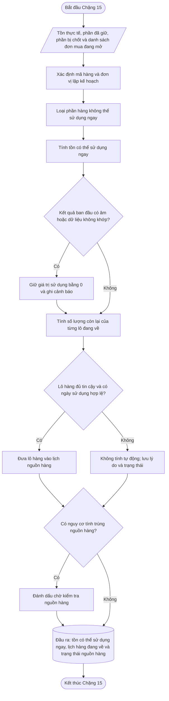

---

### 📦 12. Đầu ra bàn giao

| Đầu ra | Chặng sau dùng |
|---|---|
| Tồn có thể sử dụng ngay | Chặng 18, 18, 20 |
| Lịch hàng đang về theo ngày có thể sử dụng | Chặng 18, 20 |
| Số lượng đang về đủ tin cậy | Chặng 17 |
| Danh sách lô hàng chưa đủ tin cậy | Chặng 20, 20 |
| Ngày hàng có thể sử dụng của từng lô | Chặng 18, 20 |
| Lead time kế hoạch | Chặng 17, 17 |
| Trạng thái dữ liệu nguồn hàng | Chặng 19 |
| Lý do loại hoặc không tính lô hàng | Chặng 20, 20 |

Chặng 15 không tính nhu cầu, không tính tồn kho an toàn và không tính số cần đặt.

---

## Chặng 16 — Tính lượng dự trữ an toàn

> **PHA 5 · DỰ TRỮ VÀ SỐ CẦN MUA**

### 🎯 1. Vấn đề chặng này phải giải quyết

Dự báo không thể chính xác tuyệt đối và hàng nhập khẩu có thể về chậm hơn kế hoạch. Nếu Hachi chỉ chuẩn bị đúng bằng dự báo trung bình, chỉ cần nhu cầu cao hơn dự báo hoặc hàng về trễ là mã hàng có thể hết trước khi lô tiếp theo sử dụng được.

Chặng 16 trả lời:

> **Ngoài lượng hàng dự báo sẽ bán, Hachi cần giữ thêm bao nhiêu để bảo vệ vận hành trước sai số nhu cầu và giao hàng trễ?**

Phần hàng giữ thêm này gọi là **tồn kho an toàn**. Khi kết hợp với yêu cầu trưng bày tối thiểu, hệ thống tạo ra **mức cần bảo vệ**.

---

### 🎯 2. Mục tiêu

Chặng 16 phải tách rõ ba thành phần:

| Thành phần | Vai trò |
|---|---|
| Dự báo cuối từ Chặng 14 | Số hàng dự kiến khách sẽ cần. |
| Tồn kho an toàn | Phần dự phòng khi thực tế xấu hơn dự kiến. |
| Tồn trưng bày tối thiểu | Số hàng tối thiểu cần có để quầy hoặc cửa hàng không bị trống. |

Tồn kho an toàn không được cộng ngược vào dự báo rồi lưu như nhu cầu mới. Hai phần phải được lưu riêng để có thể kiểm tra về sau.

---

### 🚦 3. Điều kiện để bắt đầu

| Điều kiện | Nguồn | Cách dùng |
|---|---|---|
| Có dự báo cuối theo thời gian | Chặng 14 | Xác định nhu cầu dự kiến. |
| Có nhóm ABC/XYZ và chính sách | Chặng 9 | Xác định mức ưu tiên và mức phục vụ tối thiểu. |
| Có sai số dự báo lịch sử | Chặng 12/19 | Đo rủi ro nhu cầu thực tế cao hơn dự báo. |
| Có lead time kế hoạch hoặc lịch sử giao hàng | Chặng 15/19 | Xác định khoảng thời gian cần được bảo vệ. |
| Có trần thiếu hàng, tồn dư và vốn bị giữ | Chính sách vận hành | Dùng để chọn mức phục vụ phù hợp. |
| Có tồn trưng bày tối thiểu nếu áp dụng | Chính sách cửa hàng | Bảo đảm quầy không bị trống. |

---

### 📐 4. Nguyên tắc chọn mức phục vụ

Mức phục vụ thể hiện mức độ Hachi muốn hạn chế thiếu hàng. Mức phục vụ càng cao thì tồn kho an toàn thường càng lớn.

Các mức thử khởi điểm:

| Mức phục vụ thử | Cách hiểu |
|---:|---|
| 90% | Chấp nhận rủi ro thiếu hàng cao hơn để giảm tồn. |
| 95% | Mức cân bằng thông thường. |
| 97,5% | Ưu tiên giảm thiếu hàng. |
| 99% | Bảo vệ mạnh, vốn tồn kho cao hơn. |

Chặng 9 cung cấp mức phục vụ tối thiểu theo chính sách sản phẩm. Chặng 16 không được chọn mức thấp hơn mức tối thiểu đó.

Với từng mức phục vụ, hệ thống chạy thử lại trên dữ liệu lịch sử và kiểm tra bốn điều kiện:

| Điều kiện | Cách hiểu |
|---|---|
| Tổng lượng thiếu hàng không vượt trần | Không để thiếu quá nhiều đơn vị hàng. |
| Không hết hàng trước khi lô tiếp theo về | Tồn dự kiến không âm trước ngày nhận hàng. |
| Tồn dư không vượt trần | Không bảo vệ quá mức làm hàng nằm lâu. |
| Vốn bị giữ không vượt trần | Giá trị hàng dự phòng nằm trong mức được chấp nhận. |

Hệ thống chọn:

> **Mức phục vụ thấp nhất nhưng vẫn đồng thời đạt cả bốn điều kiện.**

Nếu không có mức phục vụ nào đạt đủ bốn điều kiện, hệ thống không tự chọn mức cao nhất. Dòng mã hàng phải được đánh dấu **chính sách chưa khả thi** để Chặng 19 xem xét.

---

### 🧮 5. Cách tính ưu tiên — dùng sai lệch đã xảy ra trong quá khứ

Thay vì chỉ nhìn mức dao động chung, hệ thống ưu tiên nhìn trực tiếp:

> Trong những lần trước, tổng nhu cầu thực tế trong thời gian chờ hàng đã cao hơn dự báo bao nhiêu?

Với mỗi khoảng kiểm tra lịch sử:

$$
\text{Sai lệch trong thời gian chờ hàng}
=
\text{Nhu cầu thực tế}
-
\text{Nhu cầu đã dự báo}
$$

Nếu kết quả dương, nhu cầu thực tế cao hơn dự báo. Nếu kết quả âm, dự báo cao hơn thực tế.

Tồn kho an toàn theo mức phục vụ đã chọn:

$$
\text{Tồn kho an toàn theo sai số}
=
\max\left(0,\ \text{Phân vị sai lệch tương ứng mức phục vụ}\right)
$$

Ví dụ, các sai lệch lịch sử là:

> 20, 35, -10, 50, 15, 40

Sau khi sắp xếp:

> -10, 15, 20, 35, 40, 50

Nếu phân vị tương ứng mức phục vụ được chọn cho kết quả 40 đơn vị thì tồn kho an toàn theo sai số là 40 đơn vị.

---

### 📐 6. Cách thay thế khi mã hàng chưa đủ lịch sử

Nếu mã hàng chưa có đủ lần dự báo và nhận hàng để tính trực tiếp, hệ thống dùng thứ tự sau:

1. Dùng dữ liệu của chính mã hàng nếu đủ căn cứ.
2. Nếu chưa đủ, dùng dữ liệu của nhóm ABC/XYZ tương ứng.
3. Nếu vẫn chưa đủ, dùng mã hàng tương tự đã được phê duyệt.
4. Với sản phẩm mới, dùng kế hoạch của bộ phận ngành hàng hoặc Thu mua.
5. Mọi kết quả thay thế phải mang trạng thái **tạm dùng**.

Công thức thay thế khởi điểm:

$$
\text{Tồn kho an toàn tạm}
=
Z
\times
RMSE
\times
\sqrt{\text{Số chu kỳ lead time}}
+
\text{Đệm giao hàng trễ}
$$

Trong đó:

| Thành phần | Ý nghĩa |
|---|---|
| $Z$ | Hệ số tương ứng mức phục vụ. |
| $RMSE$ | Sai số dự báo từ Chặng 12 hoặc từ nhóm tương ứng. |
| Số chu kỳ lead time | Thời gian chờ hàng quy đổi thành chu kỳ 15 ngày. |
| Đệm giao hàng trễ | Nhu cầu cần thêm để bảo vệ phần thời gian nhà cung cấp thường giao chậm. |

Công thức thay thế chỉ dùng khi chưa đủ dữ liệu để tính trực tiếp từ phân phối sai lệch. Khi dữ liệu của mã hàng đã đủ, hệ thống phải chuyển sang cách tính ưu tiên.

---

### 🧮 7. Kết hợp với tồn trưng bày tối thiểu

Tồn kho an toàn và tồn trưng bày không được cộng chồng một cách máy móc.

$$
\text{Mức cần bảo vệ}
=
\max\left(
\text{Tồn kho an toàn theo rủi ro},
\text{Tồn trưng bày tối thiểu}
\right)
$$

Ví dụ:

| Thành phần | Giá trị |
|---|---:|
| Tồn kho an toàn theo rủi ro | 80 |
| Tồn trưng bày tối thiểu | 20 |
| Mức cần bảo vệ | 80 |

Không tính thành 100 vì 80 đơn vị tồn kho an toàn đã lớn hơn yêu cầu trưng bày 20 đơn vị.

---

### 📐 8. Kiểm tra hạn dùng, sức chứa và khả năng giữ hàng

Chặng 16 không tự ý hạ mức cần bảo vệ khi kho không đủ chỗ hoặc hạn dùng quá ngắn.

Hệ thống phải ghi đồng thời:

- mức bảo vệ cần có;
- mức tối đa kho có khả năng chứa;
- mức tối đa có khả năng bán trước hạn;
- phần bảo vệ không thể đáp ứng.

$$
\text{Phần bảo vệ không thể đáp ứng}
=
\max\left(
0,
\text{Mức cần bảo vệ}
-
\text{Mức tối đa có thể giữ an toàn}
\right)
$$

Ví dụ:

| Nội dung | Giá trị |
|---|---:|
| Mức cần bảo vệ | 100 |
| Mức tối đa do sức chứa hoặc hạn dùng | 80 |
| Phần bảo vệ không thể đáp ứng | 20 |

Dòng này mang trạng thái:

> **Không thể đáp ứng đầy đủ mức bảo vệ — cần duyệt phương án.**

Không được âm thầm đổi mức cần bảo vệ từ 100 thành 80 mà không lưu phần thiếu 20.

---

### 🚦 9. Điều kiện rẽ hướng xử lý

| Điều kiện | Hành động |
|---|---|
| Có đủ lịch sử sai lệch của mã hàng | Tính tồn kho an toàn theo phân phối sai lệch thực tế. |
| Chưa đủ lịch sử mã hàng | Dùng dữ liệu nhóm hoặc mã hàng tương tự. |
| Là sản phẩm mới | Dùng kế hoạch bộ phận ngành hàng/Thu mua và đánh dấu tạm. |
| Có mức phục vụ đạt bốn điều kiện | Chọn mức thấp nhất đạt đủ. |
| Không có mức nào đạt | Chuyển Chặng 19 duyệt chính sách. |
| Mức bảo vệ vượt khả năng chứa hoặc bán trước hạn | Không tự giảm; ghi phần không thể đáp ứng. |
| Không có dữ liệu sai số và cũng không có phương án thay thế | Không tự tính; đánh dấu thiếu căn cứ. |

---

### 🔀 10. Sơ đồ các bước

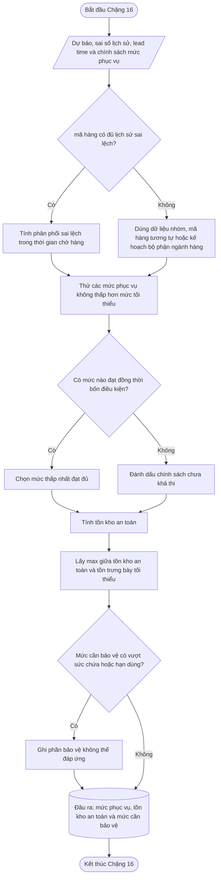

---

### 📦 11. Đầu ra bàn giao

| Đầu ra | Chặng sau dùng |
|---|---|
| Mức phục vụ đã chọn | Chặng 18, 19, 20 |
| Tồn kho an toàn theo sai số | Chặng 18, 20 |
| Tồn trưng bày tối thiểu | Chặng 17 |
| Mức cần bảo vệ cuối cùng | Chặng 17 |
| Phương pháp tính | Chặng 20, 20 |
| Trạng thái chính thức hoặc tạm dùng | Chặng 19 |
| Phần bảo vệ không thể đáp ứng | Chặng 20, 20 |
| Kết quả kiểm tra bốn điều kiện | Chặng 20, 20 |

Chặng 16 không trừ tồn kho, không xử lý số lượng mua tối thiểu và không xét ngân sách.

---

## Chặng 17 — Tính số cần mua trước khi xét ngân sách

> **PHA 5 · DỰ TRỮ VÀ SỐ CẦN MUA**

### 🎯 1. Vấn đề chặng này phải giải quyết

Chặng 17 trả lời:

> **Tính từ ngày chạy kế hoạch đến khi lần đặt hàng tiếp theo có thể về, Hachi cần mua thêm bao nhiêu nếu chưa xét giới hạn ngân sách?**

Chặng này phải tính đủ:

- nhu cầu trong thời gian chờ lô mới;
- nhu cầu đến lần lập kế hoạch tiếp theo;
- mức cần bảo vệ;
- tồn có thể sử dụng ngay;
- các lô đang về đủ tin cậy;
- số lượng mua tối thiểu và quy cách mua.

Chặng 17 chưa quyết định dòng nào được cấp tiền. Việc đó thuộc Chặng 18.

---

### 🚦 2. Điều kiện để bắt đầu

| Điều kiện | Nguồn | Cách dùng |
|---|---|---|
| Có dự báo cuối theo thời gian | Chặng 14 | Tính nhu cầu trong vùng cần bao phủ. |
| Có lịch nguồn hàng | Chặng 15 | Trừ đúng lượng hàng có thể sử dụng theo từng thời điểm. |
| Có mức cần bảo vệ | Chặng 16 | Bảo vệ trước sai số và giao hàng trễ. |
| Có lead time kế hoạch | Chặng 15/chính sách mua | Xác định khi nào đơn mới có thể sử dụng. |
| Có lịch chạy kế hoạch | Chặng 1/chính sách | Xác định khoảng cách đến lần đặt tiếp theo. |
| Có số lượng mua tối thiểu và quy cách mua | Danh mục mua hàng | Làm tròn thành số lượng thực tế có thể đặt. |
| Có trạng thái mã hàng được phép mua | Danh mục sản phẩm | Không đề xuất mua mã đã ngưng hoặc bị chốt. |

---

### 📐 3. Xác định vùng thời gian cần bao phủ

Hệ thống xác định ba mốc:

| Mốc | Cách xác định |
|---|---|
| Ngày đặt hàng dự kiến | Ngày chạy kế hoạch hoặc ngày phát hành dự kiến. |
| Ngày lô mới có thể sử dụng | Ngày đặt cộng lead time và thời gian nhận hàng. |
| Ngày kết thúc vùng cần bao phủ | Ngày lô mới sử dụng cộng khoảng cách đến lần lập kế hoạch tiếp theo. |

Công thức tổng quát:

$$
\text{Vùng cần bao phủ}
=
\text{Lead time}
+
\text{Khoảng cách giữa hai lần lập kế hoạch}
$$

Ví dụ:

- lead time: 90 ngày;
- hệ thống lập kế hoạch mỗi 15 ngày.

$$
\text{Vùng cần bao phủ}=90+15=105\text{ ngày}
$$

Lý do phải cộng thêm khoảng cách đến lần lập kế hoạch tiếp theo: nếu chỉ mua đủ đến đúng ngày hàng mới về, Hachi có thể lại thiếu hàng ngay trước khi đơn của kỳ kế tiếp về.

---

### 🧮 4. Tính nhu cầu trong vùng cần bao phủ

$$
\text{Nhu cầu cần bao phủ}
=
\sum
\text{Dự báo cuối từ ngày chạy đến ngày kết thúc vùng bao phủ}
$$

Dự báo cuối lấy từ Chặng 14 và đã bao gồm ảnh hưởng của khuyến mãi tương lai đã xác nhận.

Nếu dự báo được lưu theo chu kỳ 15 ngày, hệ thống cộng các chu kỳ nằm trong vùng bao phủ. Nếu vùng bao phủ cắt qua một phần chu kỳ, phải phân bổ theo số ngày hoặc quy tắc đã thống nhất; không được tự lấy toàn bộ chu kỳ nếu làm tăng sai lệch đáng kể.

---

### 📐 5. Xác định nguồn hàng được phép trừ

Nguồn hàng được phép dùng để giảm số cần đặt gồm:

1. tồn có thể sử dụng ngay;
2. lô đang về đủ tin cậy;
3. lô hàng có ngày sử dụng không muộn hơn ngày kết thúc vùng bao phủ.

Không được trừ:

- lô hàng chưa được xác nhận;
- lô hàng không có ngày sử dụng;
- lô hàng dự kiến về sau vùng bao phủ;
- lô hàng thuộc đơn vị lập kế hoạch khác;
- lượng hàng đã bị tính ở nơi khác.

$$
\text{Nguồn hàng hợp lệ}
=
\text{Tồn có thể sử dụng ngay}
+
\text{Hàng đang về đủ điều kiện}
$$

---

### 🧮 6. Tính số cần đặt thô

$$
\text{Số cần đặt thô}
=
\max\left(
0,
\text{Nhu cầu cần bao phủ}
+
\text{Mức cần bảo vệ}
-
\text{Nguồn hàng hợp lệ}
\right)
$$

Nếu kết quả bằng 0, mã hàng không cần đặt thêm trong kỳ này. Hệ thống vẫn phải lưu kết quả bằng 0 và lý do, thay vì bỏ mất dòng.

---

### 📐 7. Kiểm tra nguy cơ hết hàng trước khi đơn mới về

Công thức tổng ở trên chưa đủ để phát hiện một vấn đề quan trọng: tổng nguồn hàng có thể đủ, nhưng hàng về quá muộn khiến mã hàng vẫn hết trong một số chu kỳ trước đó.

Hệ thống phải chạy thử theo từng chu kỳ:

$$
\text{Tồn dự kiến cuối chu kỳ}
=
\text{Tồn đầu chu kỳ}
+
\text{Hàng về trong chu kỳ}
-
\text{Dự báo chu kỳ}
$$

Nếu tồn dự kiến bị âm trước ngày đơn mới có thể sử dụng:

$$
\text{Thiếu trước khi hàng mới về}
=
\left|
\min(\text{Tồn dự kiến trước ngày hàng mới về})
\right|
$$

Số đặt mới không thể giải quyết phần thiếu đã xảy ra trước khi đơn đó về. Vì vậy hệ thống phải tạo hành động riêng:

- xin nhà cung cấp giao sớm;
- điều chuyển từ nơi khác;
- mua khẩn cấp trong nước;
- giảm hoặc hoãn khuyến mãi;
- dùng sản phẩm thay thế;
- hoặc chấp nhận rủi ro sau khi được duyệt.

Không được cộng phần thiếu này vào số đặt rồi coi như đã giải quyết.

---

### 📐 8. Làm tròn theo đơn vị mua

Hệ thống phải phân biệt:

| Khái niệm | Ví dụ |
|---|---:|
| Đơn vị bán | 1 chai |
| Số đơn vị trong một thùng | 12 chai |
| số lượng mua tối thiểu tối thiểu | 20 thùng |
| Bước đặt hàng | Mỗi lần tăng 5 thùng |

#### 8.1. Đổi số cần đặt sang số thùng

$$
\text{Số thùng cần}
=
\left\lceil
\frac{\text{Số cần đặt thô}}
{\text{Số đơn vị trong một thùng}}
\right\rceil
$$

#### 8.2. Áp số lượng mua tối thiểu theo mã hàng

$$
\text{Số thùng tạm}
=
\begin{cases}
0, & \text{nếu số cần đặt thô}=0 \\
số lượng mua tối thiểu, & \text{nếu }0<\text{Số thùng cần}<số lượng mua tối thiểu \\
\text{Số thùng cần}, & \text{nếu số thùng cần}\ge số lượng mua tối thiểu
\end{cases}
$$

#### 8.3. Làm tròn theo bước đặt hàng

$$
\text{Số thùng đặt}
=
\left\lceil
\frac{\text{Số thùng tạm}}
{\text{Bước đặt hàng}}
\right\rceil
\times
\text{Bước đặt hàng}
$$

#### 8.4. Đổi về đơn vị bán

$$
\text{Số lượng sau số lượng mua tối thiểu và quy cách}
=
\text{Số thùng đặt}
\times
\text{Số đơn vị trong một thùng}
$$

#### 8.5. Phần dư do quy cách

$$
\text{Dư do số lượng mua tối thiểu và quy cách}
=
\text{Số lượng sau số lượng mua tối thiểu và quy cách}
-
\text{Số cần đặt thô}
$$

Phần dư này phải được lưu riêng để Chặng 19 đánh giá và Chặng 20 xác định nguyên nhân dư tồn.

---

### 📐 9. Phân biệt số lượng mua tối thiểu theo mã hàng và điều kiện tối thiểu của nhà cung cấp

Có ba loại điều kiện mua khác nhau:

| Loại điều kiện | Ví dụ |
|---|---|
| số lượng mua tối thiểu theo mã hàng | mã hàng A phải mua ít nhất 20 thùng. |
| Giá trị đơn tối thiểu | Tổng đơn của nhà cung cấp phải từ 100 triệu đồng. |
| Mức tối thiểu theo chuyến hoặc container | Tổng nhiều mã hàng phải đủ một mức vận chuyển. |

Chặng 17 xử lý số lượng mua tối thiểu của từng mã hàng trước.

Sau đó, các dòng được gom theo:

- nhà cung cấp;
- nơi nhận;
- loại tiền;
- phương thức vận chuyển;
- ngày đặt dự kiến.

Nếu tổng đơn chưa đạt điều kiện của nhà cung cấp, hệ thống không được tự tăng một mã hàng bất kỳ chỉ để đủ điều kiện. Hệ thống phải trình bày các lựa chọn:

- bổ sung mã hàng khác đang có nhu cầu;
- gộp với kỳ mua tiếp theo;
- đổi phương thức vận chuyển;
- xin nhà cung cấp cho phép đơn nhỏ;
- hoặc chờ duyệt ngoại lệ.

---

### 📐 10. Kiểm tra hạn dùng và sức chứa

#### 10.1. Hạn dùng

Số lượng đặt không nên lớn hơn lượng dự kiến có thể bán trước ngày hàng không còn an toàn để bán.

$$
\text{Ngày bán an toàn cuối}
=
\text{Ngày hàng có thể sử dụng}
+
\text{Thời gian còn được phép bán}
$$

Nếu số lượng sau số lượng mua tối thiểu lớn hơn khả năng bán trước hạn:

- không tự cắt sai quy cách;
- đánh dấu nguy cơ hết hạn;
- chuyển Chặng 19 duyệt phương án.

#### 10.2. Sức chứa

Nếu có dữ liệu sức chứa:

$$
\text{Số lượng tối đa có thể nhận}
=
\frac{\text{Sức chứa còn trống}}
{\text{Không gian cần cho một đơn vị}}
$$

Nếu số sau số lượng mua tối thiểu vượt khả năng chứa, hệ thống phải cảnh báo và không được xem toàn bộ số lượng đó là sẵn sàng phát hành.

---

### 💡 11. Ví dụ vận hành

Giả sử mã hàng A có dữ liệu:

| Nội dung | Giá trị |
|---|---:|
| Nhu cầu trong vùng bao phủ | 900 |
| Mức cần bảo vệ | 120 |
| Tồn có thể sử dụng ngay | 250 |
| Hàng đang về đủ điều kiện | 120 |
| Một thùng | 12 sản phẩm |
| số lượng mua tối thiểu | 20 thùng |
| Bước đặt | 5 thùng |

Nguồn hàng hợp lệ:

$$
250+120=370
$$

Số cần đặt thô:

$$
900+120-370=650
$$

Đổi sang thùng:

$$
\left\lceil\frac{650}{12}\right\rceil=55\text{ thùng}
$$

55 thùng lớn hơn số lượng mua tối thiểu 20 thùng và đã là bội số của bước 5 thùng.

Số lượng sau quy cách:

$$
55\times12=660
$$

Dư do quy cách:

$$
660-650=10
$$

Kết quả Chặng 17 là đề xuất mua **660 sản phẩm**, trong đó có **10 sản phẩm dư do quy cách**.

---

### 🚦 12. Điều kiện rẽ hướng xử lý

| Điều kiện | Hành động |
|---|---|
| Số cần đặt thô bằng 0 | Không đề xuất mua. |
| Có nguy cơ hết hàng trước ngày lô mới về | Tạo cảnh báo xử lý ngắn hạn. |
| Đủ dữ liệu mua hàng | Làm tròn theo số lượng mua tối thiểu và quy cách. |
| Thiếu nhà cung cấp, giá, số lượng mua tối thiểu hoặc quy cách | Không cho phát hành tự động. |
| Dư do số lượng mua tối thiểu nằm trong ngưỡng | Cho phép sang Chặng 18. |
| Dư do số lượng mua tối thiểu vượt ngưỡng | Yêu cầu Chặng 19 duyệt. |
| Vượt hạn dùng hoặc sức chứa | Yêu cầu Chặng 19 duyệt. |
| mã hàng ngưng mua hoặc bị chốt | Không đề xuất mua tự động. |
| Điều kiện tối thiểu của nhà cung cấp chưa đạt | Đánh dấu chờ gom đơn hoặc chờ duyệt. |

---

### 🔀 13. Sơ đồ các bước

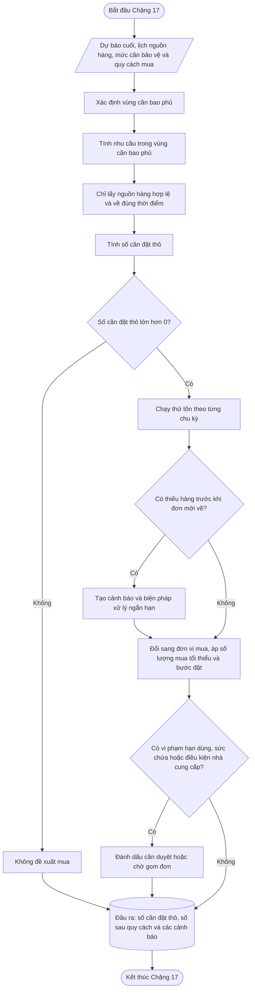

---

### 📦 14. Đầu ra bàn giao

| Đầu ra | Chặng sau dùng |
|---|---|
| Nhu cầu trong vùng bao phủ | Chặng 19, 19, 20 |
| Nguồn hàng được dùng để trừ | Chặng 19, 19, 20 |
| Số cần đặt thô | Chặng 19, 20 |
| Số lượng sau số lượng mua tối thiểu và quy cách | Chặng 19, 19 |
| Số thùng hoặc đơn vị mua | Chặng 19, 19 |
| Dư do số lượng mua tối thiểu và quy cách | Chặng 19, 19, 20 |
| Nguy cơ thiếu trước khi hàng mới về | Chặng 19, 19, 20 |
| Nguy cơ hạn dùng hoặc sức chứa | Chặng 19 |
| Trạng thái đủ hoặc thiếu thông tin mua | Chặng 19 |
| Trạng thái điều kiện tối thiểu của nhà cung cấp | Chặng 19 |

Chặng 17 tạo số cần mua trước ngân sách. Chặng này không tự cắt số lượng theo số tiền còn lại.

---

## Chặng 18 — Phân bổ ngân sách khi tiền mua hàng không đủ

> **PHA 6 · NGÂN SÁCH, PHÁT HÀNH VÀ HỌC LẠI**

### 🎯 1. Vấn đề chặng này phải giải quyết

Nếu tổng tiền cần mua nhỏ hơn hoặc bằng ngân sách, tất cả dòng đủ điều kiện được cấp tiền.

Nếu ngân sách không đủ, hệ thống không được:

- cắt đều mỗi mã hàng một tỷ lệ;
- ưu tiên chỉ vì mã hàng có giá trị đơn cao;
- cắt số lượng làm sai số lượng mua tối thiểu hoặc quy cách;
- sửa giảm dự báo;
- sửa giảm tồn kho an toàn để làm báo cáo vừa ngân sách.

Chặng 18 trả lời:

> **Với số tiền hiện có, phần hàng nào phải được cấp tiền trước và phần nào có thể hoãn?**

---

### 🚦 2. Điều kiện để bắt đầu

| Điều kiện | Nguồn | Cách dùng |
|---|---|---|
| Có số lượng sau số lượng mua tối thiểu và quy cách | Chặng 17 | Là mức mua đầy đủ trước ngân sách. |
| Có giá vốn kế hoạch hoặc giá mua | Mua hàng/Tài chính | Tính giá trị cần cấp. |
| Có phạm vi ngân sách | Tài chính/Thu mua | Xác định dòng nào cùng dùng một nguồn tiền. |
| Có nhóm ưu tiên và vai trò danh mục | Chặng 9 | Xếp thứ tự khi ngân sách thiếu. |
| Có ngày dự kiến hết hàng | Chặng 17 | Ưu tiên dòng thiếu sớm hơn. |
| Có cảnh báo số lượng mua tối thiểu, hạn dùng và sức chứa | Chặng 17 | Tránh cấp tiền cho phương án không khả thi. |

---

### 📐 3. Xác định phạm vi ngân sách

Mỗi ngân sách phải có phạm vi rõ ràng:

| Nội dung | Ví dụ |
|---|---|
| Kỳ ngân sách | Tháng 07/2026 |
| Đơn vị sử dụng | Kho KGV |
| Nhóm hàng | Hàng nhập Nhật |
| Nhà cung cấp | Có thể giới hạn hoặc không |
| Loại tiền | VND, JPY hoặc USD |
| Số tiền được phép dùng | 5 tỷ đồng |
| Phần đã sử dụng | 3 tỷ đồng |
| Phần còn lại | 2 tỷ đồng |

Không được trộn hai ngân sách khác mục đích thành một nguồn tiền chung nếu chưa được phép.

$$
\text{Ngân sách còn lại}
=
\text{Ngân sách được duyệt}
-
\text{Ngân sách đã sử dụng hoặc đã giữ chỗ}
$$

---

### 📐 4. Giá dùng để tính ngân sách

Với hàng nhập khẩu, ưu tiên dùng:

> **Giá vốn kế hoạch tại thời điểm hàng sẵn sàng sử dụng.**

Giá này có thể gồm:

- giá mua;
- vận chuyển;
- thuế;
- phí nhập khẩu;
- chi phí phân bổ đã được xác định.

Nếu chưa có giá vốn kế hoạch, có thể tạm dùng giá mua nhưng phải ghi rõ:

> **Giá trị ngân sách chưa bao gồm đầy đủ chi phí nhập khẩu.**

Không được dùng giá bán lẻ hoặc giá khuyến mãi để phân bổ ngân sách mua hàng.

---

### 🧮 5. Tách số đề xuất thành phần bắt buộc và phần bảo vệ

#### 5.1. Phần tối thiểu để tránh thiếu hàng

$$
\text{Số tối thiểu cần mua}
=
\max\left(
0,
\text{Nhu cầu cần bao phủ}
-
\text{Nguồn hàng hợp lệ}
\right)
$$

Phần này chưa bao gồm tồn kho an toàn.

#### 5.2. Phần mua thêm để đạt mức bảo vệ

$$
\text{Số mua thêm để bảo vệ}
=
\max\left(
0,
\text{Số cần đặt thô}
-
\text{Số tối thiểu cần mua}
\right)
$$

Cả hai phần phải được đổi thành mức mua hợp lệ theo thùng, số lượng mua tối thiểu và bước đặt hàng. Mục tiêu là biết rõ:

- phần nào dùng để tránh thiếu hàng;
- phần nào dùng để đạt mức bảo vệ;
- phần nào chỉ phát sinh do số lượng mua tối thiểu hoặc quy cách.

---

### 📊 6. Ba rổ phân bổ ngân sách

| Rổ | Nội dung | Thứ tự |
|---|---|---:|
| Rổ 1 | Số cần mua để tránh thiếu hàng hoặc tránh tồn âm | 1 |
| Rổ 2 | Số mua thêm để đạt mức bảo vệ | 2 |
| Rổ 3 | Phần rủi ro cao do số lượng mua tối thiểu, hạn dùng, độ tin cậy thấp hoặc có thể hoãn | 3 |

Một mã hàng có thể có phần nằm ở Rổ 1 và phần còn lại nằm ở Rổ 2. Không bắt buộc toàn bộ một mã hàng chỉ thuộc một rổ.

---

### 📐 7. Thứ tự trong từng rổ

Trong cùng một rổ, sắp xếp theo thứ tự:

1. mã hàng dự kiến hết hàng sớm hơn.
2. mã hàng có lượng thiếu dự kiến lớn hơn.
3. mã hàng có mức ưu tiên cao hơn từ Chặng 9.
4. Hàng lõi, hàng chiến lược hoặc hàng kéo khách.
5. mã hàng có lead time dài hơn hoặc nhà cung cấp thường giao trễ.
6. mã hàng có rủi ro tồn dư và hết hạn thấp hơn.
7. Nếu vẫn bằng nhau, dùng mã mã hàng để thứ tự luôn ổn định giữa các lần chạy.

Thứ tự cuối cùng phải có lý do rõ ràng. Cùng một dữ liệu đầu vào phải cho cùng một thứ tự, không được thay đổi ngẫu nhiên giữa các lần chạy.

---

### 🧮 8. Quy tắc cấp tiền

#### 8.1. Trường hợp đủ ngân sách

$$
\text{Số được cấp tiền}
=
\text{Số lượng sau số lượng mua tối thiểu và quy cách}
$$

#### 8.2. Trường hợp không đủ ngân sách

Hệ thống cấp theo từng mức mua hợp lệ.

Số được cấp tiền phải đồng thời:

- không âm;
- không vượt số đề xuất sau số lượng mua tối thiểu;
- là bội số của bước đặt hàng;
- không thấp hơn số lượng mua tối thiểu nếu đã quyết định mua;
- đáp ứng điều kiện tối thiểu của nhà cung cấp hoặc được đánh dấu chờ gom đơn.

Ví dụ:

- một thùng có 12 sản phẩm;
- bước đặt là 5 thùng;
- ngân sách còn lại chỉ đủ mua thêm 3 thùng.

Hệ thống không được cấp tiền cho 3 thùng vì sai bước đặt. Dòng phải được:

- cấp cho một bước hợp lệ nếu còn đủ tiền;
- hoặc chuyển sang chờ;
- hoặc yêu cầu duyệt vượt ngân sách.

Phần tiền còn lại không được dùng để tạo một dòng mua không hợp lệ.

---

### 📊 9. Trạng thái kết quả ngân sách

| Trạng thái | Ý nghĩa |
|---|---|
| Được cấp đủ | Đủ tiền cho toàn bộ số lượng đề xuất. |
| Được cấp một phần hợp lệ | Chỉ mua được một phần nhưng vẫn đúng quy cách. |
| Chỉ đủ phần tránh thiếu | Đủ cho nhu cầu chính nhưng chưa đạt mức bảo vệ. |
| Bị hoãn do thiếu ngân sách | Không đủ tiền cho mức mua hợp lệ. |
| Cần duyệt vượt ngân sách | Dòng quan trọng nhưng ngân sách không đủ. |
| Không thuộc phạm vi ngân sách | Dòng phải dùng nguồn tiền khác. |
| Chờ gom điều kiện nhà cung cấp | Dòng có tiền nhưng đơn chưa đạt điều kiện tối thiểu. |

---

### 📐 10. Điều kiện đề xuất vượt ngân sách

Một dòng có thể được đề xuất duyệt vượt khi:

- là hàng lõi hoặc hàng chiến lược;
- dự kiến hết trước khi lô tiếp theo về;
- không có nguồn điều chuyển thay thế;
- không có sản phẩm thay thế phù hợp;
- phần thiếu có ảnh hưởng vận hành rõ ràng;
- số xin vượt là mức mua hợp lệ nhỏ nhất.

Đề xuất phải thể hiện:

- số tiền còn thiếu;
- số lượng cần mua;
- ngày dự kiến hết hàng;
- tác động nếu không mua;
- tác động tồn kho nếu được mua.

---

### 💡 11. Ví dụ vận hành

Tiếp tục ví dụ Chặng 17:

| Nội dung | Giá trị |
|---|---:|
| Số đề xuất sau quy cách | 660 sản phẩm |
| Giá vốn kế hoạch | 100.000 đồng/sản phẩm |
| Giá trị đầy đủ | 66.000.000 đồng |
| Ngân sách còn lại | 55.000.000 đồng |

Ngân sách không đủ mua 660 sản phẩm.

Mức mua hợp lệ gần nhất thấp hơn là 45 thùng:

$$
45\times12=540\text{ sản phẩm}
$$

Giá trị:

$$
540\times100.000=54.000.000\text{ đồng}
$$

Kết quả:

| Nội dung | Giá trị |
|---|---:|
| Số đề xuất đầy đủ | 660 |
| Số được cấp tiền | 540 |
| Số chưa được cấp | 120 |
| Ngân sách sử dụng | 54.000.000 đồng |
| Ngân sách còn lại | 1.000.000 đồng |

Nếu 540 sản phẩm chỉ đủ đáp ứng nhu cầu chính nhưng chưa đạt mức bảo vệ, trạng thái là:

> **Chỉ đủ phần tránh thiếu — chưa đạt mức bảo vệ.**

---

### 🚦 12. Điều kiện rẽ hướng xử lý

| Điều kiện | Hành động |
|---|---|
| Tổng giá trị cần mua không vượt ngân sách | Cấp đủ cho mọi dòng hợp lệ. |
| Ngân sách không đủ | Chia rổ và cấp theo thứ tự ưu tiên. |
| Ngân sách còn đủ cho một mức mua hợp lệ | Cấp mức đó. |
| Ngân sách chỉ đủ cho số lượng sai quy cách | Không cấp số lượng sai; chuyển dòng tiếp theo hoặc chờ duyệt. |
| Dòng quan trọng nhưng thiếu tiền | Tạo đề xuất vượt ngân sách. |
| Dòng có rủi ro hạn dùng hoặc sức chứa | Không ưu tiên tự động chỉ vì thiếu hàng. |
| Dòng không thuộc phạm vi ngân sách | Chuyển sang nguồn ngân sách phù hợp. |
| Đã có tiền nhưng chưa đạt điều kiện tối thiểu của nhà cung cấp | Chờ gom đơn hoặc chờ duyệt. |

---

### 🔀 13. Sơ đồ các bước

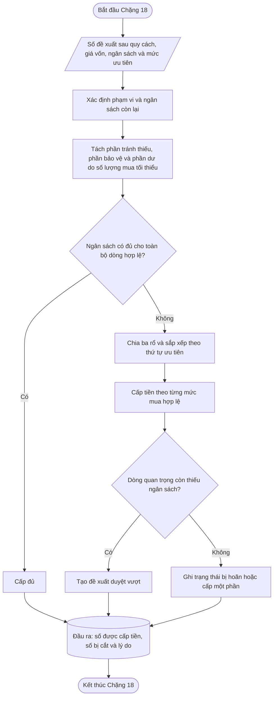

---

### 📦 14. Đầu ra bàn giao

| Đầu ra | Chặng sau dùng |
|---|---|
| Số được cấp tiền | Chặng 19 |
| Giá trị được cấp tiền | Chặng 20, 20 |
| Số chưa được cấp tiền | Chặng 20, 20 |
| Phần thiếu so với mức bảo vệ | Chặng 20, 20 |
| Trạng thái ngân sách | Chặng 19 |
| Rổ và thứ tự ưu tiên | Chặng 20, 20 |
| Lý do bị hoãn | Chặng 20, 20 |
| Đề xuất vượt ngân sách | Chặng 19 |
| Ngân sách còn lại | Chặng 20, 20 |

Chặng 18 không tạo đơn mua hàng và không sửa lại dự báo hoặc mức cần bảo vệ.

---

## Chặng 19 — Chốt số lượng mua và phát hành

> **PHA 6 · NGÂN SÁCH, PHÁT HÀNH VÀ HỌC LẠI**

### 🎯 1. Vấn đề chặng này phải giải quyết

Chặng 19 là bước kiểm tra cuối cùng trước khi tạo đơn mua hàng.

Chặng này không tính lại dự báo, không tự đổi tồn kho an toàn và không tự phân bổ lại ngân sách.

Chặng 19 trả lời:

> **Dòng nào đủ điều kiện phát hành, dòng nào cần người có quyền duyệt và dòng nào phải dừng?**

---

### 🚦 2. Điều kiện để bắt đầu

| Điều kiện | Nguồn | Cách dùng |
|---|---|---|
| Có số được cấp tiền | Chặng 18 | Là điểm bắt đầu của số đặt cuối cùng. |
| Có đầy đủ thông tin mua hàng | Danh mục mua | Kiểm tra dòng có thể tạo đơn hay chưa. |
| Có trạng thái ngoại lệ | Chặng 16–18 | Xác định dòng cần duyệt. |
| Có quyền duyệt | Phân quyền hệ thống | Xác định ai được thay đổi hoặc chấp nhận rủi ro. |
| Có quy tắc gom đơn | Chính sách mua | Gom đúng nhà cung cấp, nơi nhận và loại tiền. |

---

### 🧮 3. Tính số lượng đặt cuối cùng

Số lượng đặt cuối cùng bắt đầu từ số được cấp tiền tại Chặng 18.

Nếu có quyết định duyệt bổ sung hoặc điều chỉnh:

$$
\text{Số lượng đặt cuối cùng}
=
\text{Số được cấp tiền}
+
\text{Số được duyệt bổ sung}
-
\text{Số bị giảm sau duyệt}
$$

Kết quả phải:

- không âm;
- đúng số lượng mua tối thiểu;
- đúng quy cách thùng;
- đúng bước đặt hàng;
- không vượt số lượng được duyệt;
- không vi phạm trạng thái mua hàng.

---

### 📐 4. Kiểm tra thông tin mua hàng bắt buộc

Một dòng chỉ được phát hành khi có đủ:

| Thông tin | Lý do |
|---|---|
| Nhà cung cấp | Biết mua từ ai. |
| Nơi nhận | Biết hàng giao về đâu. |
| Giá mua hoặc giá kế hoạch | Xác định giá trị đơn. |
| Đơn vị mua | Chai, thùng, kiện hoặc đơn vị khác. |
| Số đơn vị trong quy cách | Đổi đúng giữa đơn vị bán và đơn vị mua. |
| số lượng mua tối thiểu và bước đặt | Bảo đảm đơn hợp lệ. |
| Loại tiền | Tránh sai giá trị đơn. |
| Ngày đặt dự kiến | Tính thời gian giao. |
| Ngày hàng dự kiến có thể sử dụng | Đánh giá khả năng đáp ứng nhu cầu. |
| Trạng thái mã hàng được phép mua | Không mua mã đã ngưng hoặc bị chốt. |

Thiếu một thông tin bắt buộc thì trạng thái là:

> **Chờ bổ sung thông tin.**

---

### 📐 5. Các trường hợp bắt buộc chờ duyệt

| Trường hợp | Lý do |
|---|---|
| Vượt ngân sách | Cần thêm nguồn tiền. |
| Không đạt điều kiện tối thiểu của nhà cung cấp | Đơn chưa đủ điều kiện mua. |
| số lượng mua tối thiểu tạo tồn dư lớn | Có nguy cơ chốt vốn. |
| Nguy cơ hết hạn | Có thể không bán hết trước hạn. |
| Vượt sức chứa | Không đủ vị trí nhận hàng. |
| Mức bảo vệ không khả thi | Kho hoặc hạn dùng không cho phép giữ đủ. |
| Dự báo khuyến mãi có độ tin cậy thấp | Số mua phụ thuộc giả định chưa chắc chắn. |
| Sản phẩm mới dùng kế hoạch thủ công | Chưa có đủ dữ liệu thực tế. |
| Số lượng tăng bất thường | Cao hơn rõ rệt so với lịch sử mua. |
| Người dùng thay đổi số hệ thống đề xuất | Cần lưu và kiểm tra lý do. |
| Có nguy cơ thiếu hàng trước khi đơn mới về | Phải chọn biện pháp xử lý ngắn hạn. |
| Nguồn hàng có nguy cơ tính trùng hoặc chưa rõ | Không được phát hành tự động. |

---

### 📊 6. Bốn kết quả của một dòng

| Kết quả | Điều kiện |
|---|---|
| Sẵn sàng phát hành | Đủ dữ liệu, đủ ngân sách và không có ngoại lệ cần duyệt. |
| Chờ duyệt | Có ngoại lệ nhưng được phép trình duyệt. |
| Chờ bổ sung | Thiếu dữ liệu mua hàng hoặc nguồn hàng. |
| Không phát hành | mã hàng ngưng mua, đơn bị từ chối hoặc vi phạm điều kiện không thể xử lý. |

---

### 📐 7. Quy tắc khi người duyệt thay đổi số lượng

Nếu người duyệt thay đổi số lượng, hệ thống phải kiểm tra lại:

- số lượng mua tối thiểu;
- bước đặt hàng;
- giá trị ngân sách;
- tồn dự kiến;
- phần thiếu hàng;
- phần tồn dư;
- hạn dùng;
- sức chứa.

Màn hình quyết định phải thể hiện đồng thời:

| Nội dung | Ý nghĩa |
|---|---|
| Số hệ thống đề xuất | Kết quả trước khi duyệt. |
| Số người duyệt chọn | Kết quả sau điều chỉnh. |
| Chênh lệch | Tăng hoặc giảm bao nhiêu. |
| Tác động thiếu hàng | Dự kiến còn thiếu bao nhiêu. |
| Tác động tồn dư | Dự kiến dư bao nhiêu. |
| Tác động ngân sách | Tăng hoặc giảm bao nhiêu tiền. |
| Lý do thay đổi | Bắt buộc nhập. |

Không cho phép lưu số lượng sai quy cách. Nếu số người duyệt nhập không hợp lệ, hệ thống phải yêu cầu chọn lại một mức mua hợp lệ.

---

### 📐 8. Gom dòng thành đơn mua hàng

Các dòng chỉ được gom chung khi phù hợp về:

- nhà cung cấp;
- loại tiền;
- nơi giao;
- phương thức vận chuyển;
- ngày đặt;
- điều kiện giao hàng;
- nguồn ngân sách.

Không được gom các dòng khác nhà cung cấp hoặc khác nơi nhận vào cùng một đơn chỉ vì cùng mã hàng.

Sau khi gom, hệ thống phải kiểm tra lại điều kiện tối thiểu của nhà cung cấp ở cấp toàn đơn.

---

### 🔒 9. Chống phát hành trùng

Mỗi kết quả phát hành phải gắn với một phiên lập kế hoạch.

Trước khi tạo đơn, hệ thống kiểm tra:

- dòng này đã được phát hành trong phiên chưa;
- đã có số đơn mua chưa;
- phiên có đang được chạy lại không;
- đơn cũ có bị hủy hoặc điều chỉnh không.

Cùng một kết quả không được tạo hai đơn mua khác nhau.

Nếu cần phát hành lại, phải tạo:

- phiên điều chỉnh;
- hoặc phiên bản mới có liên kết với đơn cũ.

---

### 🔒 10. Chốt kết quả sau phát hành

Sau khi phát hành, phải giữ nguyên:

- dự báo đã sử dụng;
- nguồn hàng đã sử dụng;
- tồn kho an toàn;
- số cần đặt thô;
- số sau số lượng mua tối thiểu;
- số được cấp tiền;
- số đặt cuối cùng;
- người duyệt;
- lý do duyệt;
- thời điểm phát hành;
- số đơn mua hàng.

Các phiên sau có thể dùng dữ liệu mới nhưng không được sửa các giá trị đã dùng để ra quyết định cũ.

---

### 🔀 11. Sơ đồ các bước

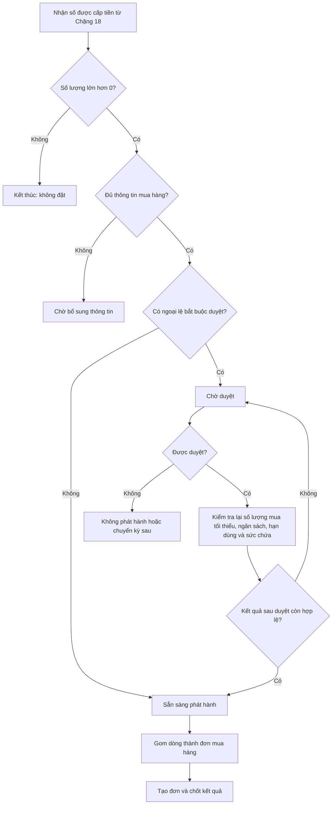

---

### 📦 12. Đầu ra bàn giao

| Đầu ra | Chặng sau dùng |
|---|---|
| Số lượng đặt cuối cùng | Chặng 20 |
| Giá trị đơn cuối cùng | Chặng 20 |
| Trạng thái phát hành | Chặng 20 |
| Số đơn mua hàng | Chặng 20 |
| Ngày phát hành | Chặng 20 |
| Ngày dự kiến có thể sử dụng | Chặng 20 |
| Số trước và sau duyệt | Chặng 20 |
| Người duyệt và lý do | Chặng 20 |
| Danh sách ngoại lệ | Chặng 20 |
| Phiên bản kết quả đã chốt | Chặng 20 |

Chặng 19 là chặng duy nhất được phát hành hoặc dừng đơn mua hàng. Chặng này không học lại cách dự báo và không sửa kết quả của các chặng trước.

---

## Chặng 20 — Đánh giá kết quả và đề xuất cho kỳ sau

> **PHA 6 · NGÂN SÁCH, PHÁT HÀNH VÀ HỌC LẠI**

### 🎯 1. Vấn đề chặng này phải giải quyết

Một đơn hàng có thể tạo kết quả không tốt vì nhiều nguyên nhân khác nhau:

- dự báo thấp;
- dự báo cao;
- khuyến mãi thực tế khác kế hoạch;
- hàng giao trễ;
- nhà cung cấp giao thiếu;
- số lượng mua tối thiểu làm phải mua dư;
- ngân sách bị cắt;
- người duyệt giảm số lượng;
- dữ liệu tồn không đúng;
- hàng về nhưng chưa thể sử dụng ngay.

Nếu chỉ nhìn kết quả “thiếu hàng” hoặc “dư hàng”, hệ thống có thể sửa sai nguyên nhân.

Ví dụ:

- thiếu hàng do tàu trễ nhưng lại tăng dự báo;
- thiếu hàng do ngân sách bị cắt nhưng lại tăng tồn kho an toàn;
- dư hàng do số lượng mua tối thiểu nhưng lại đổi cách dự báo dự báo.

Chặng 20 trả lời:

> **Kết quả sai ở đâu, nguyên nhân thuộc chặng nào và kỳ sau cần đề xuất thay đổi điều gì?**

---

### 🎯 2. Mục tiêu

Chặng 20 không chỉ tạo báo cáo. Chặng này phải:

1. so sánh kế hoạch đã chốt với kết quả thực tế;
2. phân biệt sai số dự báo, sai số khuyến mãi, giao hàng trễ, thiếu ngân sách và quyết định thủ công;
3. xác định nguyên nhân chính và nguyên nhân góp phần;
4. tạo đề xuất cho kỳ sau;
5. không tự sửa ngược kết quả đã phát hành.

---

### 📐 3. Ba thời điểm hậu kiểm

#### 3.1. Khi nhà cung cấp xác nhận hoặc xuất hàng

Kiểm tra:

- số lượng được xác nhận;
- ngày giao được xác nhận;
- chênh lệch so với kế hoạch;
- phần bị thiếu hoặc hoãn;
- thay đổi giá mua.

#### 3.2. Khi hàng thực sự có thể sử dụng

Kiểm tra:

- số lượng thực nhận;
- số lượng đạt chất lượng;
- ngày thực tế có thể sử dụng;
- lead time thực tế;
- số ngày giao trễ;
- có hết hàng trước khi hàng về hay không.

#### 3.3. Khi kết thúc vùng nhu cầu đã bao phủ

Kiểm tra:

- nhu cầu thực tế;
- dự báo nền;
- dự báo cuối sau khuyến mãi;
- tồn còn lại;
- số ngày hết hàng;
- tồn dư;
- hàng cận hạn hoặc hết hạn;
- ảnh hưởng của ngân sách và quyết định duyệt.

Không được đánh giá đơn hàng quá sớm khi khoảng bán hàng chưa kết thúc.

---

### 🧮 4. Đo sai số dự báo nền và dự báo cuối

#### 4.1. Dự báo nền

So sánh:

$$
\text{Sức mua cơ bản thực tế}
\quad\text{với}\quad
\text{Dự báo nền}
$$

Mục tiêu là biết cách dự báo tại Chặng 12 có dự báo đúng sức mua tự nhiên hay không.

#### 4.2. Dự báo cuối

So sánh:

$$
\text{Nhu cầu thực tế trong thời gian có khuyến mãi}
\quad\text{với}\quad
\text{Dự báo cuối sau khuyến mãi}
$$

Mục tiêu là biết hệ số khuyến mãi tại Chặng 14–14 có phù hợp hay không.

Các chỉ số tiếp tục dùng thống nhất:

- RMSE;
- nRMSE;
- WAPE;
- Bias.

Không dùng chung một sai số để kết luận cả cách dự báo nền và hệ số khuyến mãi.

---

### 🧮 5. Đo lead time và độ trễ thực tế

$$
\text{Lead time thực tế}
=
\text{Ngày hàng thực tế có thể sử dụng}
-
\text{Ngày đơn được phát hành}
$$

Không dùng ngày tàu đến, ngày hàng đến cảng hoặc ngày bắt đầu thông quan nếu tại những ngày đó hàng chưa thể bán hoặc cấp cho cửa hàng.

$$
\text{Số ngày giao trễ}
=
\text{Ngày thực tế có thể sử dụng}
-
\text{Ngày kế hoạch có thể sử dụng}
$$

Nếu kết quả nhỏ hơn 0, lô hàng về sớm hơn kế hoạch.

---

### 🧮 6. Đo tác động của ngân sách

Chặng 20 phải giữ ba số riêng:

| Nội dung | Ý nghĩa |
|---|---|
| Số hệ thống cần mua | Nhu cầu mua trước ngân sách. |
| Số được cấp tiền | Kết quả Chặng 18. |
| Số thực sự phát hành | Kết quả Chặng 19. |

Phần bị cắt do ngân sách:

$$
\text{Số bị cắt do ngân sách}
=
\max\left(
0,
\text{Số sau số lượng mua tối thiểu}
-
\text{Số được cấp tiền}
\right)
$$

Nếu mã hàng hết hàng sau khi bị cắt ngân sách, hệ thống phải ghi ngân sách là một nguyên nhân có khả năng gây thiếu. Không được tự kết luận toàn bộ thiếu hàng là lỗi dự báo.

---

### 🧮 7. Đo tác động của số lượng mua tối thiểu và quy cách

$$
\text{Dư do số lượng mua tối thiểu tại thời điểm đặt}
=
\text{Số sau số lượng mua tối thiểu}
-
\text{Số cần đặt thô}
$$

Khi kết thúc vùng bao phủ, hệ thống kiểm tra phần dư này còn lại bao nhiêu.

Nếu lượng tồn cuối chủ yếu đến từ phần làm tròn số lượng mua tối thiểu, nguyên nhân cần ghi là:

> **Dư tồn do điều kiện mua hàng.**

Không nên tự giảm dự báo của mã hàng chỉ vì số lượng mua tối thiểu quá lớn.

---

### 📊 8. Phân loại nguyên nhân

| Hiện tượng | Điều kiện chính | Nguyên nhân ưu tiên |
|---|---|---|
| Nhu cầu thực tế cao hơn dự báo nền | Không có khuyến mãi hoặc khuyến mãi đã được loại khỏi nền | Cách dự báo dự báo nền. |
| Dự báo nền đúng nhưng khuyến mãi bán cao hơn dự báo cuối | Hệ số khuyến mãi thấp | Học hệ số khuyến mãi. |
| Hàng hết trước khi hàng về và hàng về trễ | Lead time thực tế dài hơn kế hoạch | Nguồn hàng hoặc nhà cung cấp. |
| Hệ thống đề xuất đủ nhưng ngân sách cấp thiếu | Số cấp tiền thấp hơn số cần | Ngân sách. |
| Hệ thống đề xuất đủ nhưng người duyệt giảm | Số sau duyệt thấp hơn đề xuất | Quyết định thủ công. |
| Tồn cuối cao tương ứng phần số lượng mua tối thiểu | Dư do quy cách lớn | số lượng mua tối thiểu hoặc điều kiện nhà cung cấp. |
| Tồn trên hệ thống có nhưng không bán được | Hàng chốt, hư, hết hạn hoặc sai tồn | Dữ liệu hoặc vận hành kho. |
| Hàng về đúng ngày nhưng chưa sử dụng được | Thông quan hoặc kiểm nhận kéo dài | Thời gian sau vận chuyển. |
| khuyến mãi không diễn ra như kế hoạch | Thời gian, phạm vi hoặc mức giảm thay đổi | Kế hoạch khuyến mãi. |
| Đơn phát hành trễ hơn lịch | Quy trình duyệt hoặc chuẩn bị đơn kéo dài | Quy trình phát hành. |

Một kết quả có thể có nhiều nguyên nhân, nhưng phải xác định:

- nguyên nhân chính;
- nguyên nhân góp phần;
- bằng chứng dùng để kết luận.

---

### 📐 9. Quy tắc tạo đề xuất cho kỳ sau

#### 9.1. Đối với cách dự báo dự báo

Tạo đề xuất xem lại cách dự báo khi:

- WAPE hoặc nRMSE vượt ngưỡng;
- Bias lệch cùng chiều nhiều kỳ;
- cách dự báo hiện tại thua cách dự báo đối chứng;
- cấu trúc nhu cầu đã thay đổi.

Việc đổi cách dự báo quay lại Chặng 12 trong phiên sau.

#### 9.2. Đối với khuyến mãi

Tạo đề xuất cập nhật hệ số khi:

- khuyến mãi đã kết thúc;
- có đủ dữ liệu bán và sức mua nền;
- phạm vi khuyến mãi thực tế khớp kế hoạch;
- không bị thiếu hàng làm méo kết quả.

Việc học lại quay lại Chặng 13 trong phiên sau.

#### 9.3. Đối với lead time

Tạo đề xuất cập nhật khi:

- đã có các lần nhận hàng hoàn tất;
- ngày thực tế có thể sử dụng đã được xác nhận;
- độ trễ xuất hiện lặp lại.

Giá trị khởi điểm:

| Số lô hoàn tất | Cách dùng |
|---:|---|
| Dưới 3 lô | Ghi nhận tín hiệu, chưa đổi tự động. |
| Từ 3 đến dưới 6 lô | Có thể đề xuất cập nhật tạm. |
| Từ 6 lô trở lên | Đủ căn cứ ổn định hơn để thẩm định chính sách. |

#### 9.4. Đối với tồn kho an toàn

Chạy lại Chặng 16 khi:

- sai số dự báo thay đổi;
- lead time thay đổi;
- mức phục vụ thực tế không đạt;
- vốn tồn kho hoặc tồn dư vượt trần.

#### 9.5. Đối với ngân sách

Tạo đề xuất khi:

- nhóm hàng thường xuyên bị cắt;
- phần bị cắt thường dẫn đến thiếu hàng;
- ngân sách còn thừa nhưng hàng quan trọng vẫn bị hoãn;
- phạm vi ngân sách đang phân chia không phù hợp.

#### 9.6. Đối với số lượng mua tối thiểu và nhà cung cấp

Tạo đề xuất khi:

- phần dư do số lượng mua tối thiểu lặp lại nhiều kỳ;
- số lượng mua tối thiểu làm phát sinh hết hạn hoặc tồn lâu;
- điều kiện tối thiểu thường xuyên làm đơn bị hoãn;
- có cơ sở đề nghị đổi quy cách hoặc đàm phán lại với nhà cung cấp.

---

### 🔒 10. Không tự động đổi chính sách chỉ vì một lần bất thường

Một lần hàng trễ do sự cố đặc biệt hoặc một khuyến mãi triển khai sai không đủ để kết luận chính sách chung sai.

| Loại tình huống | Hành động |
|---|---|
| Sự cố đơn lẻ có nguyên nhân rõ | Ghi nhận ngoại lệ, chưa đổi chính sách. |
| Sai lệch lặp lại nhiều lần | Tạo đề xuất thay đổi. |
| Sai lệch lớn ảnh hưởng hàng chiến lược | Cho phép đề xuất kiểm tra sớm. |
| Thiếu dữ liệu xác nhận | Không tự học. |

Chặng 20 chỉ tạo đề xuất. Việc thay đổi chính sách phải qua phê duyệt.

---

### 🔒 11. Nguyên tắc không hồi tố

Chặng 20 không được sửa âm thầm:

- dự báo đã dùng;
- hệ số khuyến mãi đã dùng;
- tồn kho an toàn đã chốt;
- số lượng đã phát hành;
- ngân sách đã cấp;
- quyết định duyệt đã lưu;
- ngày dự kiến đã dùng tại thời điểm đặt.

Nếu chính sách cần thay đổi:

1. tạo đề xuất;
2. ghi rõ dữ liệu chứng minh;
3. có người phê duyệt;
4. tạo phiên bản chính sách mới;
5. chỉ áp dụng từ phiên kế hoạch sau.

---

### 🔀 12. Sơ đồ các bước

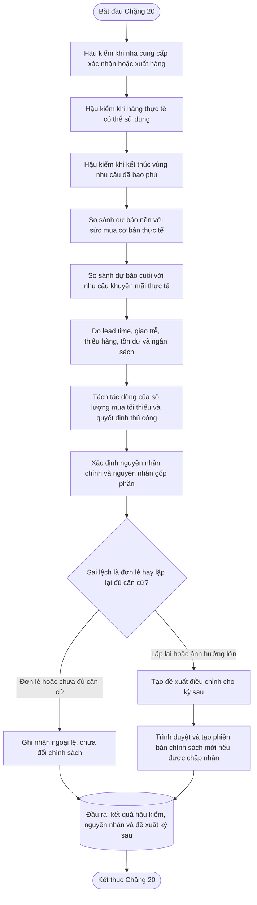

---

### 📦 13. Đầu ra bàn giao

| Đầu ra | Mục đích |
|---|---|
| Sai số dự báo nền | Kiểm tra Chặng 12. |
| Sai số dự báo cuối | Kiểm tra Chặng 14–14. |
| Lead time và độ trễ thực tế | Kiểm tra Chặng 16–16. |
| Số ngày và số lượng thiếu hàng | Đo mức phục vụ. |
| Tồn dư và vốn bị giữ | Đo hiệu quả tồn kho. |
| Tác động số lượng mua tối thiểu | Làm việc lại với nhà cung cấp. |
| Tác động ngân sách | Điều chỉnh ngân sách kỳ sau. |
| Tác động quyết định thủ công | Đánh giá chất lượng duyệt. |
| Nguyên nhân chính và nguyên nhân góp phần | Tránh sửa sai chặng. |
| Đề xuất thay đổi | Dùng cho phiên sau. |
| Phiên bản chính sách được đề xuất | Bảo đảm truy vết. |

---

### 📘 14. Hướng dẫn sử dụng kết quả Chặng 20

Người đọc không nên chỉ nhìn vào kết luận “thiếu hàng” hoặc “dư hàng”. Trước khi quyết định thay đổi, cần đọc theo thứ tự:

1. Nhu cầu thực tế có khác dự báo không?
2. khuyến mãi thực tế có đúng kế hoạch không?
3. Hàng có về đúng ngày có thể sử dụng không?
4. Ngân sách có cấp đủ số hệ thống đề xuất không?
5. Người duyệt có thay đổi số lượng không?
6. số lượng mua tối thiểu và quy cách có tạo phần dư đáng kể không?
7. Sai lệch là một lần bất thường hay lặp lại nhiều kỳ?

Chỉ sau khi trả lời đủ các câu hỏi trên mới xác định chặng nào cần được xem xét lại.

### 🔒 15. Kết quả đã chốt của Chặng 20

Khi Chặng 20 hoàn tất, hệ thống chốt:

- dữ liệu thực tế dùng để hậu kiểm;
- kết quả so sánh với kế hoạch;
- nguyên nhân chính và nguyên nhân góp phần;
- bằng chứng dùng để kết luận;
- đề xuất thay đổi;
- trạng thái duyệt của đề xuất;
- phiên bản chính sách mới nếu có.

Kết quả hậu kiểm của một phiên không được sửa ngược chỉ vì chính sách ở kỳ sau đã thay đổi.

---


# 3A. Bước kiểm tra chất lượng và phê duyệt dùng chung

## 3A.1. Chất lượng chu kỳ

Các trạng thái được chuẩn hóa:

- `Đã chốt từ dữ liệu quan sát`;
- `Đã chốt sau điều chỉnh`;
- `Đã chốt bằng phương án thay thế`;
- `Mức bán nền mới xác định được một phần`;
- `Không có bản ghi nguồn`;
- `Chưa xác định được mức bán nền`;
- `Ngoài thời gian kinh doanh`;
- `Dữ liệu có sai lệch`.

Các chặng sau phải nêu rõ trạng thái nào được phép sử dụng. Không dùng một dấu hiệu một dấu hiệu chung cho mọi trường hợp cho mọi trường hợp.

## 3A.2. Hàng đợi ngoại lệ

Mọi mã hàng thiếu nền, thiếu phân loại, thiếu chính sách hoặc cần nguồn tương tự phải tạo task có bằng chứng, hành động và người phụ trách. Việc tập dữ liệu thử không chứa ứng viên không được hiểu là không có ứng viên trong toàn hệ thống.

## 3A.3. Phê duyệt

Chính sách ABC/XYZ, khuyến mãi thường trực, cửa hàng/mã hàng tương tự và nền bộ phận ngành hàng phải có version, trạng thái, người duyệt, ngày hiệu lực và không hồi tố.

---

# 4. Kết quả bàn giao giữa các chặng

| Chặng | Kết quả chính | Chặng sau sử dụng |
| ---: | --- | --- |
| 1 | Khoảng lịch sử, lịch ngày và lịch chu kỳ 15 ngày | 2–20 |
| 2 | Danh sách ngày thiếu hàng và lý do | 3, 4, 5, 20 |
| 3 | Mức bán nền của ngày thiếu hàng không có khuyến mãi | 5, 6, 20 |
| 4 | Mức bán tự nhiên của ngày khuyến mãi | 5, 6, 13, 20 |
| 5 | Dữ liệu ngày đã xử lý, ngày được bổ sung và ngày chưa đủ căn cứ | 6, 20 |
| 6 | Sức mua cơ bản theo chu kỳ 15 ngày và mức tin cậy | 7–13, 16, 20 |
| 7 | Nhóm A/B/C theo giá trị tiêu thụ | 9, 12, 16, 18, 20 |
| 8 | Nhóm bán đều, dao động, bán thưa hoặc chưa đủ dữ liệu | 9, 12, 16, 18, 20 |
| 9 | Chính sách phục vụ, ưu tiên vốn và cách xử lý ngoại lệ | 12, 16, 18, 19, 20 |
| 10 | Kết luận về mùa vụ của nhóm Y | 11, 12, 20 |
| 11 | Kết luận về xu hướng của nhóm Y | 12, 20 |
| 12 | Cách dự báo được chọn, dự báo nền và sai số khi kiểm tra bằng dữ liệu quá khứ | 14, 16, 20 |
| 13 | Mức tác động của từng loại khuyến mãi trong quá khứ | 14, 19, 20 |
| 14 | Dự báo cuối sau khi áp kế hoạch khuyến mãi tương lai | 16, 17, 20 |
| 15 | Lượng hàng có thể sử dụng và lịch hàng về | 16, 17, 19, 20 |
| 16 | Lượng dự trữ an toàn và mức cần bảo vệ | 17, 19, 20 |
| 17 | Số cần mua trước ngân sách và phần phát sinh do quy cách mua | 18, 19, 20 |
| 18 | Số lượng được cấp ngân sách và số lượng bị hoãn | 19, 20 |
| 19 | Số lượng mua cuối cùng và tình trạng phê duyệt | 20 |
| 20 | Kết quả thực tế, nguyên nhân sai lệch và đề xuất cho kỳ sau | Kỳ lập kế hoạch tiếp theo |

---

# 5. Các rủi ro còn lại sau khi hoàn thành hành trình

| Rủi ro                                                  | Vì sao vẫn còn                                                                      | Cơ chế kiểm soát                                                                                                |
| ---------------------------------------------------------- | ---------------------------------------------------------------------------------------- | --------------------------------------------------------------------------------------------------------------------- |
| Thiếu hàng được nâng nền còn thấp               | Không có ngày tham chiếu gần ngày thiếu hàng                                   | Lưu số ngày tham chiếu và trạng thái thiếu hàng chưa đủ căn cứ nâng nền; hậu kiểm Chặng 20.      |
| Chu kỳ bị thấp giả do thiếu ngày                   | Dữ liệu thực tế của mã hàng còn ngắn không đủ khối 15 ngày tự nhiên    | Chặng 6 lấp nền chu kỳ bằng mức nền xung quanh và ghi số ngày lấp nền.                                  |
| Ngày lấp nền bị hiểu nhầm là thiếu hàng         | Người vận hành thấy có giá trị bù nhưng không phân biệt ghi chú nghiệp vụ | Tách rõ nâng nền do thiếu hàng và lấp nền chu kỳ trong Chặng 6; Chặng 2 chỉ xét ngày thật có tồn. |
| Số bán khuyến mãi quan sát bị hiểu nhầm là nền | Người đọc dùng tổng bán lẻ quan sát thay vì sức mua cơ bản                | Tách cột và đặt tên nhất quán từ quy định dữ liệu đầu vào đầu vào và Chặng 3.                            |
| Xu hướng bị nhận nhầm                               | 12 chu kỳ vẫn có thể chứa mùa vụ hoặc biến động thị trường               | Kiểm tra ngược trên lịch sử Chặng 12 trước khi dùng.                                                      |
| Mùa vụ sai vị trí                                    | Lịch mùa vụ thay đổi theo năm                                                    | Gắn vị trí mùa vụ và kiểm tra ngược.                                                                       |
| Thời gian cung ứng thay đổi theo nhà cung cấp      | Nhà cung cấp có hàng sẵn, sản xuất, gom hàng, thông quan và kiểm nhận khác nhau | Đo ngày hàng thực tế có thể sử dụng tại Chặng 20 và đề xuất cập nhật chính sách thời gian cung ứng. |
| số lượng mua tối thiểu/quy cách mua làm dư tồn                | Quy cách mua không khớp nhu cầu thật                                              | Ghi dư do số lượng mua tối thiểu/quy cách tại Chặng 17 và đo tại Chặng 20.                                       |
| Ngân sách cắt mã hàng quan trọng                   | Chính sách ưu tiên chưa phản ánh đúng chiến lược                           | Hậu kiểm mức phục vụ theo ABC/XYZ và vai trò danh mục.                                                      |

---

# 6. Cơ chế giám sát và kiểm chứng kết quả

| Nội dung giám sát        | Chỉ tiêu                                                                                                                                          | Tần suất               | Hành động khi lệch                                                                                  |
| ----------------------------- | ----------------------------------------------------------------------------------------------------------------------------------------------------- | -------------------------- | --------------------------------------------------------------------------------------------------------- |
| Làm sạch dữ liệu        | Số ngày thiếu hàng, số ngày thiếu hàng chưa đủ căn cứ nâng nền, trạng thái nâng nền do thiếu hàng, số ngày lấp nền chu kỳ | Mỗi phiên              | Kiểm tra phiếu nhập hàng điều chuyển nội bộ, ngày tham chiếu và vùng 14 ngày trước/sau. |
| Dự báo                    | sai số dự báo, độ lệch dự báo lên hoặc xuống, tỷ lệ phương pháp mới tốt hơn cách cũ                                            | Mỗi chu kỳ             | Đề xuất đổi phương pháp dự báo/ngưỡng ở Chặng 20.                                         |
| Nguồn hàng                | Ngày hàng thực tế có thể sử dụng so với ngày kế hoạch, số lượng giao thiếu, lô bị trễ và nguy cơ tính trùng | Mỗi lô | Xác định nguyên nhân và đề xuất cập nhật thời gian cung ứng hoặc cách lấy dữ liệu nguồn hàng. |
| Tồn kho an toàn           | Mức phục vụ, thiếu hàng, dư tồn                                                                                                              | Mỗi chu kỳ             | Điều chỉnh mức phục vụ/trần tồn.                                                                |
| Ngân sách                 | Tỷ lệ cấp vốn, thiếu hàng do bị cắt vốn                                                                                                    | Mỗi kỳ đơn mua hàng | Điều chỉnh quy tắc ưu tiên vốn.                                                                  |
| số lượng mua tối thiểu/quy cách mua | Dư do số lượng mua tối thiểu/quy cách, tồn chậm                                                                                                      | Mỗi kỳ đơn mua hàng | Cảnh báo nhà cung cấp/mã hàng cần duyệt.                                                        |

---

# 7. Phụ lục — Danh sách thông tin bắt buộc lưu lâu dài

| Nhóm                           | Thông tin cần lưu lâu dài                                                                                                                                                                                                                                  |
| --------------------------------- | ----------------------------------------------------------------------------------------------------------------------------------------------------------------------------------------------------------------------------------------------------------------- |
| Dữ liệu ngày đã làm sạch | Mã hàng, nơi bán, ngày, số bán ghi nhận trong ngày, số bán khuyến mãi quan sát, tổng bán lẻ quan sát, tồn đầu, tồn cuối, trạng thái thiếu hàng, sức mua cơ bản sau xử lý.                                                       |
| Chu kỳ                         | Mã hàng, nơi bán, chu kỳ, sức mua cơ bản chu kỳ, tổng số bán khuyến mãi quan sát chu kỳ, tổng bán lẻ quan sát chu kỳ, số ngày thật, số ngày lấp nền, số ngày thiếu hàng, số ngày thiếu hàng chưa đủ căn cứ nâng nền. |
| Phân loại và chính sách    | Ghi chú ABC, ghi chú X/Y/Z/D, vai trò danh mục, chính sách vận hành, phiên bản chính sách đã dùng.                                                                                                                                                     |
| Dự báo                        | Trạng thái xu hướng, mức mùa vụ, phương pháp dự báo đã chọn, dự báo nền, dự báo cuối, sai số kiểm tra trên lịch sử.                                                                                                                   |
| Nguồn hàng                    | Tồn thực tế, tồn đã giữ/chốt/loại, tồn có thể sử dụng ngay, từng lô đang về, số còn lại, mức tin cậy, ngày kế hoạch và ngày thực tế có thể sử dụng, lý do lô bị loại. |
| Đặt hàng                     | Mức phục vụ, tồn kho an toàn, mức cần bảo vệ, nhu cầu vùng bao phủ, số cần đặt thô, số sau số lượng mua tối thiểu/quy cách, phần dư do quy cách, số được cấp tiền, số đặt cuối cùng, trạng thái duyệt và số đơn mua. |
| Hậu kiểm                      | Thực tế bán, thực tế tồn, ngày hàng thực tế có thể sử dụng, sai số dự báo nền và dự báo cuối, mức phục vụ, tác động ngân sách/số lượng mua tối thiểu/quyết định duyệt, nguyên nhân chính, nguyên nhân góp phần và đề xuất kỳ sau. |
